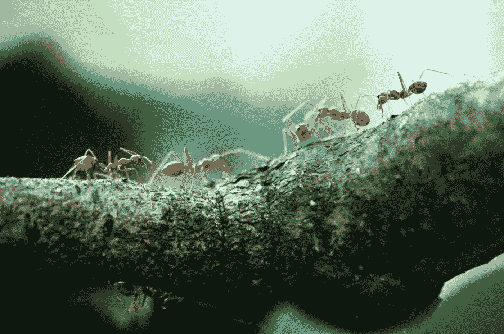

# 开发者——让卑微的蚂蚁成为你的向导

> 原文：<https://medium.com/codex/developers-let-the-humble-ant-be-your-guide-ab32fb5441ef?source=collection_archive---------4----------------------->

## 重要的不是规模，而是合作和生存

[照片由 Pexels 的 Poranimm Athithawatthee 拍摄](https://www.pexels.com/photo/macro-photo-of-five-orange-ants-842401/)

> ***如果自然界中有你不理解的东西，很可能在你理解不了的更深层次上有意义。所以自然事物的逻辑是多了*** …