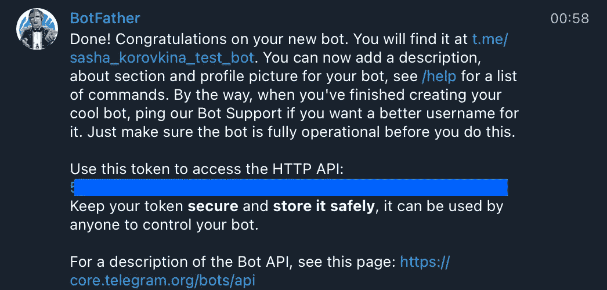
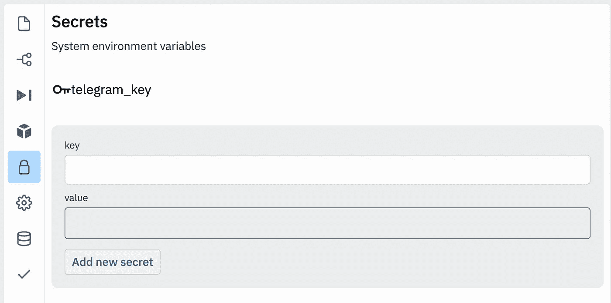
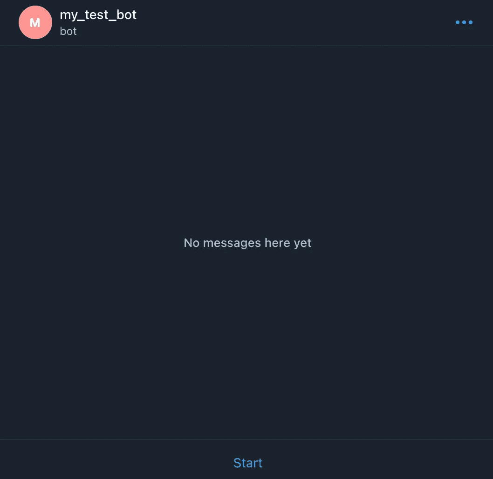
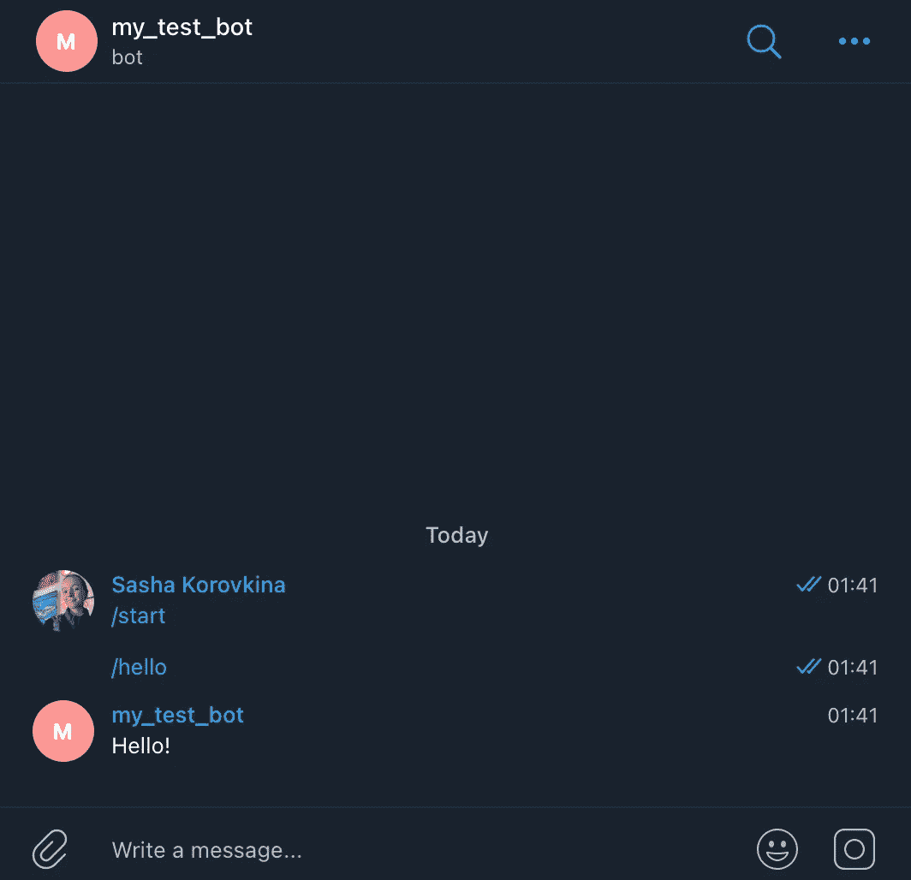

# 在 Python 上开发赚钱的电报机器人。第一部分

> 原文：<https://medium.com/codex/developing-a-money-making-telegram-bot-on-python-pt-1-a19fae54d3f?source=collection_archive---------0----------------------->

## 开始:制作问候机器人

对于一个没有机器人开发经验的人来说，创建一个能够创造利润的电报机器人有多容易？在这些系列中，我将写下我开发、启动和运行电报机器人的经历。从一页空白到第一次盈利。

马頔·索罗明在 [Unsplash](https://unsplash.com?utm_source=medium&utm_medium=referral) 上拍摄的照片

## 第一阶段—战略

由于 Python 编程的这一领域对我来说是全新的，我决定通过以下步骤来应对这一挑战:

1.  建造一个简单的电报机器人。我这样做是为了了解问题的复杂性和时间尺度。以及从一开始就了解基本概念。
2.  研究和想法产生。据我所知，现在有很多机器人，所以需要一些研究和了解才能确定要构建什么样的机器人。
3.  发展
4.  启动机器人并进行营销。开发机器人是一项工作，但市场营销也需要注意，因为没有它，很可能没有人会真正注册。
5.  等待第一笔利润

## 第二阶段——了解电报机器人的工作原理

简而言之，您为机器人创建了一个特定的命令。然后，机器人根据请求执行命令要求的任何事情。这在实践中会看得更清楚，所以让我们开始吧！

*   获取 API 令牌，您可以通过找到 bot father bot——官方 bot telegram 用来创建其 bot——来实现这一点。

> 【https://telegram.me/BotFather】拿过来:**。**

*接下来，输入 **/newbot** 并给出你的机器人的名字和用户名。太好了！现在你会得到一个类似下面的消息，在这里你可以找到 API 密匙。复制它，我们以后会用到它。*

**

*创建新机器人时来自机器人父亲的消息*

*   *我们将使用 Replit 进行编码，但是您可以使用任何您想要的环境。首先，我们将导入必要的包，即 **pyTelegramBotAPI***
*   *接下来，我们需要找到一个安全的地方来存储我们的 API 令牌。幸运的是，Replit 对此有一个解决方案，您可以将它存储在 **secrets** 部分。这里的**键**是我们所称的令牌，而**值**是令牌的实际值(在我们的例子中是从 Telegram 复制的值。*

**

*   *现在这些都设置好了，是时候写代码了。我们的机器人将成为机器人中的变形虫——回复‘你好！’当用户输入 **/hello** 提示时。*

*这里的代码不言自明。现在是测试机器人的时候了！激动人心！首先，我们找到我们的机器人并添加它。*

**

*找到并添加了我的机器人:sasha_korovkina_test_bot*

*现在我们将我们的命令 **/hello** 传递给它，机器人会回复我们！*

**

*我们得到了机器人的回复*

*太棒了。现在我们已经了解了一个非常简单的机器人是如何工作的，是时候让它变得更有趣了。请继续关注第 2 部分，我们将增强这个机器人，让它做一些很酷的事情(还没有剧透，:D)。*

> *如果你有任何关于机器人的想法想让我提出来，请在下面的评论中提出来！我很乐意收到你的来信。**敬请期待即将到来的第二部分。***