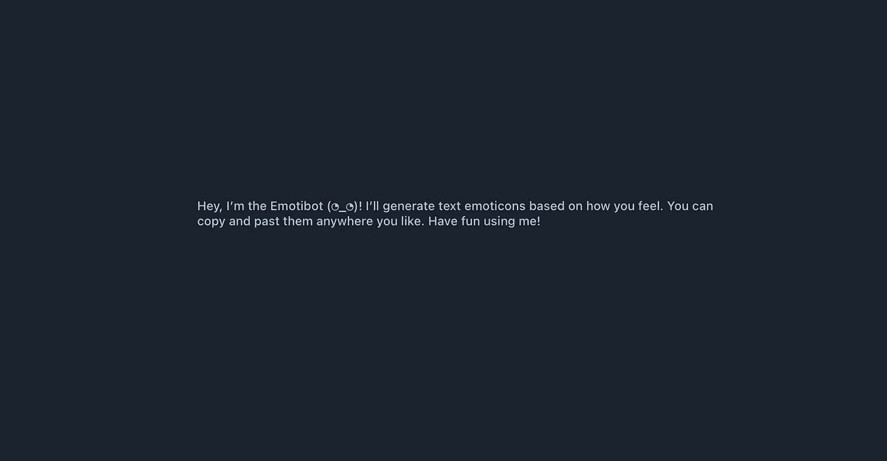
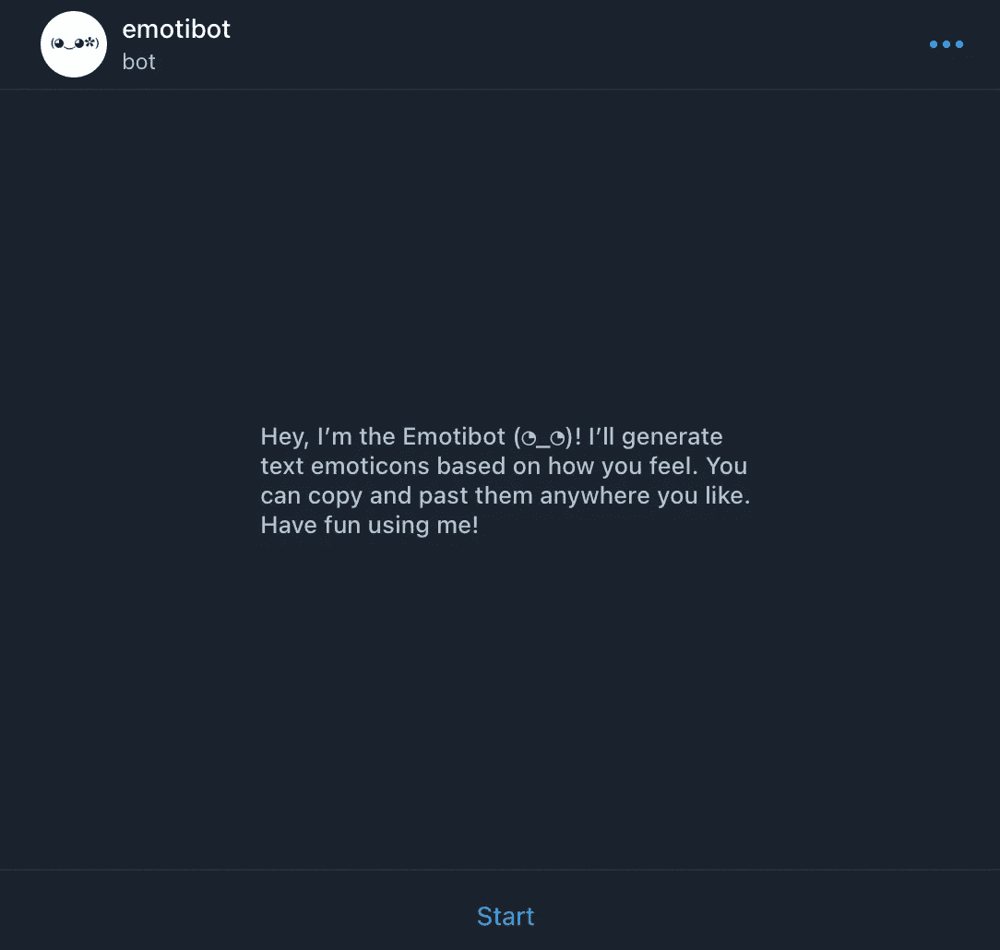

# 在 Python 上开发赚钱的电报机器人— Pt 3。

> 原文：<https://medium.com/codex/developing-a-money-making-telegram-bot-on-python-pt-3-66d3cb9aa75a?source=collection_archive---------1----------------------->

## 创建表情机器人的最后步骤——一个生成文本表情的机器人

埃里克·克鲁尔在 [Unsplash](https://unsplash.com?utm_source=medium&utm_medium=referral) 上的照片

从第 1 部分和第 2 部分，我们有了机器人的技术基础，以及我们自己的表情数据集。太棒了。现在是最后的润色，让我们的表情机器人准备好行动:

1.  发出命令来找回每一种情绪
2.  制作问候信息
3.  设计机器人头像和封面
4.  将机器人发布到电报

## 步骤 1 —制定命令

下面是生成一条命令的代码:

这个片段从“happy”数组中获得一个随机的表情符号，并将其输出到聊天中，作为对命令的回复。

然后，我们可以将其扩展到数据集中的所有其他情绪，得到以下结果:

现在让我们将它与我们的库结合起来，让机器人进行轮询，这里我们得到了**主程序代码:**

## 步骤 2 —问候信息

对于新用户来说，理解机器人是什么很重要，这就是为什么我们需要一个问候信息。请执行以下操作:

1.  打开机器人父亲([https://telegram.me/BotFather](https://telegram.me/BotFather))
2.  键入 **/setdescription**
3.  然后输入你的机器人的名字和描述

结果如下:

为新用户显示的机器人描述

## 步骤 3-机器人头像和封面

现在是最后的润色——上传一个机器人头像。这也是用 BotFather 完成的，头像命令是 **/set userpic。**

这是成品:

完成的机器人界面

万岁！我们已经完成了第一个电报机器人！上传时间到了！

> 敬请期待下一篇文章，我将揭示一个将电报机器人上传到 Telegram 的简单方法！分享你的评论和批评，我很想听听:)