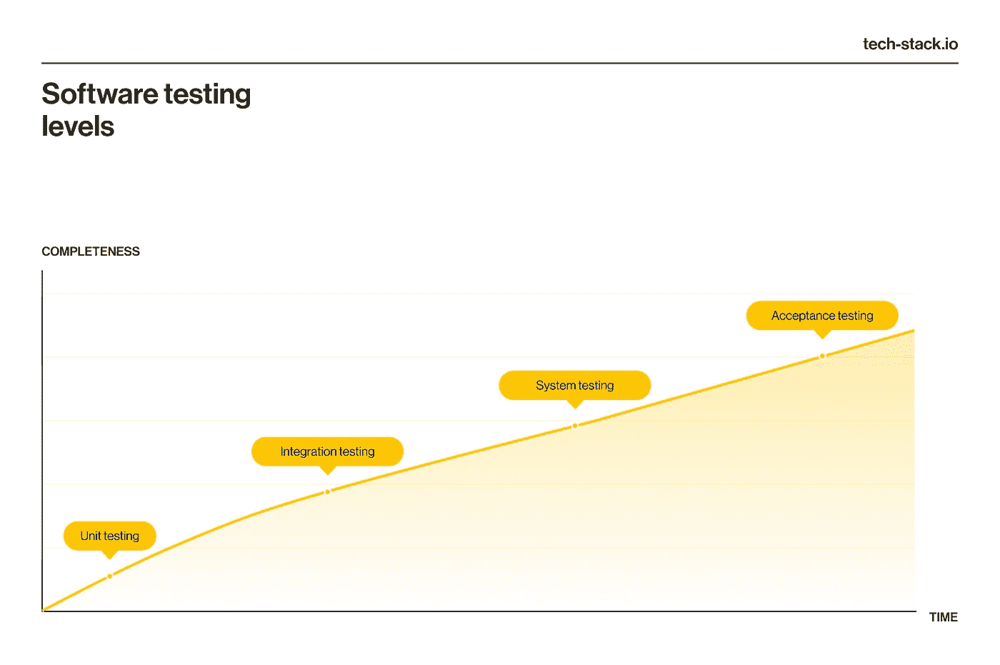
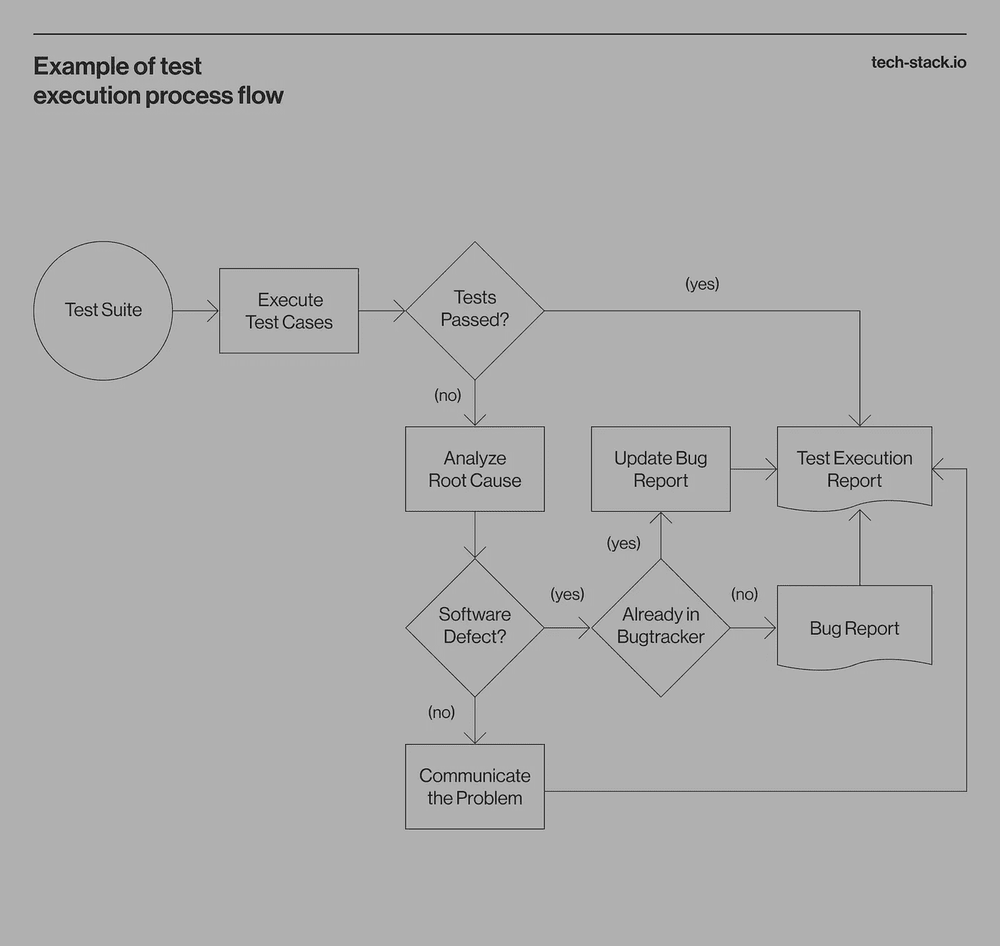

# 开发测试计划:完整指南

> 原文：<https://medium.com/codex/developing-a-test-plan-a-complete-guide-be3ee94b37df?source=collection_archive---------3----------------------->

有一个计划通常会让你远离麻烦。

想想看:我们写营销计划，业务增长计划，甚至是体育的防御计划！我们这样做是为了了解工作的范围，设定目标和期望的结果，分配所需的资源，并确定实现目标所需采取的步骤。软件测试也不例外，测试计划帮助我们简化过程。

可悲的是，并不是每个人都认为在审计或产品认证之前制定计划是个好主意。事实上，在流程开始时创建一个计划会带来很多好处，包括更好的 QA 入职，以及确保您的整个 QA 团队理解所需的交付成果。

在本文中，我们将探讨什么是测试计划，为什么它很重要，如何开发一个可靠的产品测试计划，以及我们在 Techstack 中使用的示例。

让我们从基础开始。

# 什么是测试计划？

测试计划是一个技术文档，它包含了对您的测试策略、目标、程序、资源、时间表和交付内容的详细描述。它由 QA 团队设计，跨团队使用，以维护所有测试活动的透明度、控制和顺序。

测试计划有多种用途:

*   它形成了一个框架，用于检查所开发的系统是否按照其设计和目标工作
*   它可以帮助您在产品发布之前找到并修复错误
*   它记录了产品的局限性
*   它存储和共享 QA 知识，有助于新团队成员加入
*   它是产品信息的中心参考

为了确保这些好处，一个有效和成功的测试计划有几个关键的品质:

*   它在整个开发和测试周期中保持相关和更新，这意味着生产中的每一个变化都应该引起测试计划的变化，特别是在 [CI/CD 系统](https://tech-stack.io/blog/qaops-quality-assurance-in-continuous-delivery-systems/)中。
*   它应该对 QA 和外部团队(业务分析师、开发人员、项目经理等)都可用。)
*   创建测试计划应该花费测试周期时间的⅓。
*   它通常由 QA 团队领导或 QA 经理创建，包括所有 QA 专家的意见。
*   它提供了详细的描述，以保证测试活动更加透明。
*   测试计划的每个方面都应该符合预期的业务需求。例如，如果一个软件产品将帮助人们安全地处理敏感信息，你的测试计划应该包括测试这个特定方面的框架。

既然我们已经描述了什么是测试计划，让我们看看它为什么重要以及谁将从中受益。

# 为什么测试计划很重要？

测试计划有利于成熟的供应商，因为它构建并简化了测试过程。然而，这对创业公司同样有用，因为缺陷和不稳定性很容易阻碍你产品的发展。更具体地说，开发测试计划:

*   为测试团队提供其任务、职责、所需资源、可交付成果和目标的清晰视图
*   为外部团队创造单一的事实来源
*   允许团队成员在无人监督的情况下工作
*   帮助新团队成员更快加入
*   同步团队
*   允许项目经理更准确地计划截止日期
*   为产品所有者提供他们可能需要的审计和认证的高级文档
*   向开发人员展示测试迭代何时以及如何发生

简而言之，开发和维护一个测试计划有益于每一个利益相关者，从测试人员到产品所有者和开发人员。那么你应该什么时候写一个呢？

# 何时编写测试计划

产品测试计划通常在开发阶段编写，并由所有相关团队(设计人员、测试人员、产品负责人、开发人员)达成一致。)这节省了测试执行的时间，并让您能够处理开发过程中发生的变更。

开发一个测试计划也是在你写了一个测试策略之后:一个包含测试过程的一般原则和测试将如何运行的文档。

一旦你有了一个测试计划，就会有[的情况需要你修改或者重写](https://tech-stack.io/blog/red-flags-that-show-your-project-needs-a-test-plan-and-a-test-strategy/)，比如如果你有很高的重开率或者如果检测和修复 bug 需要很长时间。

您现在对何时创建或者更新测试计划有了一个清晰的了解。

现在，让我们回顾一下软件测试中最流行的测试计划。

# 软件测试中测试计划的类型

有三种基本的软件测试计划:主测试计划、级别测试计划和特定测试计划。

# 主测试计划

该高级计划概述了测试过程，分为阶段和级别。它描述了测试策略和策略，不同级别和测试任务之间的联系，工作范围，以及在测试过程中做出的选择。

# 水平测试计划

这些计划涵盖了测试过程的每个层面，从单元测试到验收。

*   一个**单元(组件)测试计划**包含测试单个产品组件(程序、功能、过程等)的信息。)
*   一个**集成测试计划**描述了集成组件及其交互(组件集成、系统集成等)的测试过程。)
*   **系统测试计划**有助于检查完整和集成软件作为一个系统的性能。
*   一个**验收测试计划**帮助检查交付的可接受性和产品对业务需求的符合性。

水平测试计划包含测试时间表、基准、活动和模板——主测试计划可能没有规定的所有细节。

# 特定测试计划

还有主测试计划可能没有提到的测试和验证活动的测试计划。通常，它们被创建来检查产品在特定条件下的表现，并且这种测试的结果被用于创建风险管理策略。

*   **性能测试计划**，记录系统在一定负载下的表现，以评估其响应性和稳定性。
*   **安全测试计划，**记录旨在发现漏洞和潜在漏洞的活动。

最常见的具体测试计划有:

测试计划的内容取决于需要测试的内容。然而，有一些通用的标准和组件可以作为指南。

# 测试计划文档标准

由于需求因行业、目的和产品而异，所以在开发测试计划时没有放之四海而皆准的解决方案。然而，IT 行业确实有创建测试文档的标准。两种常见的是 [IEEE 829](https://ieeexplore.ieee.org/document/4578383) 和 [IEEE 29119。](https://www.iso.org/standard/79429.html)

如果您的测试过程需要质量认证，这些标准可能会有用。在其他情况下，您可以根据它需要包含的主要组件来起草您自己的测试计划。

# 测试计划部分

*   应该测试什么
*   应该如何测试以及何时测试
*   谁来做这件事
*   测试需要什么资源
*   什么是可交付成果和成功指标

测试计划应该涵盖测试过程的所有细节，例如

为了涵盖这些内容，大多数测试计划包含七个核心元素。

# 工作范围

*   **要测试的组件和功能:**QA 团队负责的范围
*   **不需要测试的部件和功能:**超出质量保证责任的范围
*   **第三方组件:**团队无法影响或修复但可能影响产品性能的集成组件的描述

这一部分详细描述了特定测试项目的目标、用户场景和限制。它通常包含三个部分:

一个清晰和可接受的范围部分将为您节省不必要的工作，并在出现问题时明确您的责任。

# 质量和验收标准

在这一部分中，您应该定义应该满足哪些条件和要求才能认为测试成功。这些对于每个开发过程都是不同的。例如，如果你在 Scrum 中工作，你将拥有发布质量验收标准和冲刺质量验收标准。这些标准也会因产品而异，所以尽可能清楚地描述它们。

# 资源

*   测试团队的角色和职责
*   测试工具
*   环境

资源既包括人力资源——您需要谁来执行测试阶段——也包括技术资源，例如材料、环境、软件、工具和硬件。该部分可分为以下几组:

这一部分对于每个测试阶段都很重要，因为不同的测试阶段需要不同的资源。在开始测试之前了解它们将有助于您赶上最后期限并防止中断。

# 测试文档和交付物

计划的这一部分描述了每个 QA 专家应提供的工作成果文件，例如:

这些文档应该详细描述分配的任务是如何执行的，用什么来完成它，以及测试人员实现了什么。

# 缺陷跟踪

您的测试计划应该包括分配给测试期间发现的 bug 或错误的优先级等级。这些优先级显示了 bug 对产品性能的影响有多大。

*   **Critical** :被测模块不可用或不工作，妨碍了进一步的测试
*   **重大**:产品未按预期发挥功能，或结果不符合验收标准
*   **中**:问题与业务逻辑冲突，被测零件工作不正常，或者附加功能不按设计工作
*   **低**:bug 与产品的逻辑不矛盾，很容易修复

下面是一个秤的示例:

# 风险评估

这是任何测试计划中最重要的部分，尤其是如果被测试的产品是为高度管制的行业设计的。在这里，您应该记录所有已知的风险及其可能性、对测试过程的影响、优先级，以及在测试过程中将采取什么措施来防止这些风险发生。

这一部分是产品开发人员和工程师创建风险管理框架的基础。这也有助于在问题发生时尽快减轻后果。

# 生产过程说明

这部分是可选的，但是对测试团队非常有用。它对方案和算法中的流程和工作流进行了可视化概述。在这里，您可以描述项目中任何测试活动的逐步执行和决策逻辑。

这样的描述有助于整个团队理解即将到来的过程，并给出测试活动的全局视图。这里有一个例子:

您的测试计划可能包括这些常见部分之外的其他部分，这很好。目的是使计划尽可能详细，并在整个开发和测试周期中保持其相关性。这是你可以做到的。

# 8 步测试计划编写工作流程

有效的[产品测试计划](https://tech-stack.io/blog/test-plan-and-test-strategy-best-practices/)是:

1.  **分析产品:**定义其用户、业务目标和技术需求，并审查产品文档。
2.  **设计测试策略:**定义测试目标，如何实现目标，以及实现目标所需的成本/资源。
3.  **突出测试目标:**确定应该测试的特性或级别，并定义每个特性或级别的测试目标。
4.  **定义测试标准:**状态暂停(测试结果不成功)规则和退出(测试结果成功)规则。
5.  **规划您的资源:**定义您需要的人力、技术和材料资源(例如，谁做某些任务以及他们需要使用什么)。
6.  **精确定位测试环境:**确定应该执行测试的条件(最大负载、在用户端运行测试的技术要求等)。).
7.  **安排活动并设置里程碑:**估计完成测试任务所需的工作时间，安排测试用例序列，并设置里程碑。
8.  **确定测试可交付成果:**定义测试团队在测试前(测试计划、测试用例、测试设计规范)、测试期间(错误报告、错误日志、测试脚本、模拟器、测试数据等)应该提供的可交付成果。)，以及测试后(测试结果、缺陷报告、安装指南、发行说明)。

使用这 8 步工作流程作为写作计划的灵感。

在您完成这些任务之后，您将为您的测试计划打下坚实的基础。为了充实你的章节，你可以遵循 IEEE 829 标准或 IEEE 29119 T21 标准，或者使用我们的测试计划模板作为参考。

# 结论

测试计划对于创建一个有组织的、可预测的、易于管理的测试过程是必不可少的。有了计划，您就可以向所有涉众和外部团队提供测试过程和范围的共同愿景。这可以最大限度地减少误解，确保你的团队为你的产品提供价值。

另外，开发一个测试计划给你的整个过程带来了结构，因为它记录并简化了 QA 团队成员的工作。最重要的是，它降低了忽略影响产品成功的问题和缺陷的风险。

你可以在我们的网站上阅读更多关于[我们的质量保证服务](https://tech-stack.io/services/qa-as-a-service)和[改进你的质量保证工作流程](https://tech-stack.io/blog/tag/quality-engineering/)的信息。或者，如果您准备好理顺您的质量保证流程并为您的产品增加价值，[请联系我们的团队](https://tech-stack.io/contact-us)，让我们一起讨论我们的专业知识和质量保证专家如何提供帮助！

*原载于 2022 年 12 月 5 日*[*https://tech-stack . io*](https://tech-stack.io/blog/test-plan/)*。*