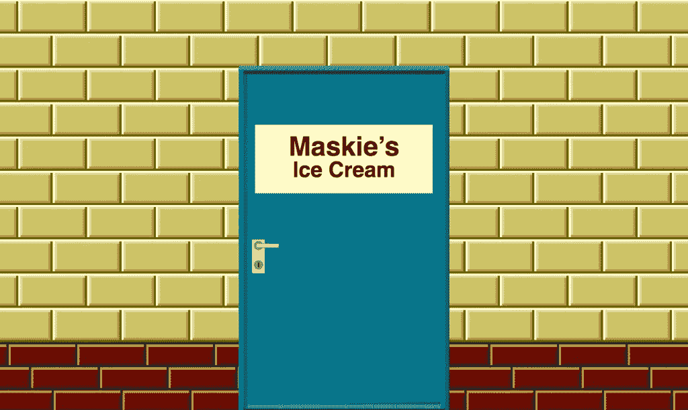

# 用 Haskell 开发视频游戏

> 原文：<https://medium.com/codex/developing-a-video-game-in-haskell-e8259050e4dc?source=collection_archive---------10----------------------->

如果我能在某个地方的网络服务器上运行它就好了…

对我的孩子来说，我创造的游戏没有广告，没有游戏中的购买，也没有情感操纵的上瘾。我创造了棋盘游戏、纸牌游戏和视频游戏。所以，当我的小儿子要求我根据他们的想法制作一个电子游戏时，我怎么能拒绝呢？

已有 35 年历史的 haskell 编程语言是函数式编程的一种有趣的形式，主要用于学术界，尽管最初的项目也希望应用于商业产品。它是一种通用编程语言，这意味着我们可以用它来制作视频游戏。

完美？

也许不是。

Haskell 没有事实上的图像和 GUI 库。它允许我们使用其他人编写的现有库，比如用于 Unix 和 Linux 终端的 [curses](https://en.wikipedia.org/wiki/Curses_%28programming_library%29) ，以及用于窗口操作系统的 [Qt](https://www.qt.io/) 。它可以驱动[网站和 web 服务器](https://www.stackage.org/package/warp)，这意味着我们可以在 HTML、CSS、Javascript、SVG 和 Canvas 中构建前端。

直到今天，我的目标是在某个网站或 web 应用程序中实现视频游戏，运行在某个 web 服务器上。事情是这样的:我寻找一个可以让我们运行 haskell web 应用程序的商业 web 主机，结果一无所获。所以我不得不在某个地方租一些原材料，并在上面部署游戏和网络服务器。意味着我要负责维护服务器。

不了，谢谢你。

haskell 编程语言足够简单，可以快速学习基础知识。实现一个[游戏循环](https://en.wikipedia.org/wiki/Video_game_programming#Game_structure)也不是太难:

```
{- | This is the game loop. It keeps looping stages until the 
 - player quits. It assumes that the stage will give the player 
 - options for keys to press to have actions performed. It then 
 - asks the player for their input, uses that to figure out 
 - which stage to show next, and recurses in on itself. 
 -}
loop :: Stages.Stage -> Stages.UserName -> IO ()
loop Stages.Quit player = TW.wrap $ Stages.show Stages.Quit player
loop stage player = do 
 let t = Stages.show stage player
 TW.wrap t
 getChar >>= \k -> loop (Stages.next stage (Keys.read k)) player
```

参考:[https://git . Sr . ht/~ AEV/maskies/tree/main/item/src/main/haskell/main . hs](https://git.sr.ht/~aev/maskies/tree/main/item/src/main/haskell/Main.hs)

这就产生了游戏循环，一个我命名为“循环”的功能。它有两个参数:一个阶段和一个用户名，并返回一个 I/O 操作。

舞台是玩家将看到的下一个场景。特殊阶段是开始和退出。总得从某个地方开始！

用户名在程序开始时就被要求输入，并在游戏循环中从一个阶段进入下一个阶段。这些阶段是动态构建的，包含了用户的名字。

该函数有两个实现。第一种是特例:退出。如果玩家表示想要退出游戏，它需要显示再见，并停止循环。第二种是正常情况:显示舞台，然后接收玩家的输入，然后找出下一个要显示哪个舞台，调用游戏循环来显示。

游戏循环调用自己。[递归](http://learnyouahaskell.com/recursion)是 haskell 中一个直接的构造。我认为这是 haskell 最强大的特性。 [Glasgow haskell 编译器(ghc)](https://www.haskell.org/ghc/) 非常擅长优化递归函数。

您可能已经注意到 Stages.show 函数的结果是在一个名为 t 的变量中捕获的，该变量随后被传递给函数 TW.wrap，然后游戏等待玩家按键。这里没有任何关于 GUI 的提示。这是一个基于文本的游戏，可以在控制台或终端上玩。这个选择是经过深思熟虑的:我想在创建任何图形之前，充实游戏的故事，并测试游戏的玩法。

说到图形:



冰激凌店的后门。宝藏工作室原创艺术

图片参考及鸣谢:【https://www.patreon.com/posts/66989254 

事实上，我们已经决定了美术和声音设计，并且已经开始实现本文前面提到的 web 服务器，来托管游戏的图形版本。

但是我们不要想太多。回到文字版。

我们发现函数 Stages.show 返回一个传递给 TW.wrap 函数的值。该值是一个文本。Stages.show 获取一个阶段的名称，并返回其文本，如果需要的话，还会添加玩家的名称。wrap 将该文本输出到屏幕，在终端宽度内换行。您会看到:haskell 没有一种本机内置的方法来换行。这取决于解释器或 UI 客户机来完成。

这就是我们在 haskell 的墙壁上看到的第一个裂缝:为了包装文本行，包装函数必须能够访问所有可能的文本。这意味着游戏中的每一条文本路径都必须提前渲染。这意味着我们失去了 haskell 编程语言的一个强大特性:懒惰。

懒惰意味着程序会尽可能长时间地避免执行动作，只在绝对必要时才执行。这是一个很好的优化策略，可以实现闪电般的快速实时执行。但这也意味着文本不能换行。

为了包装文本，进行包装的库需要非惰性文本。但是 haskell 中的普通文本是懒惰的。因此，我们显式地将惰性文本转换为非惰性或严格的文本。

对于每个阶段。

在飞行中。

拜拜，优化。

如果我们不对文本进行换行，终端将会在任何需要的地方，在最奇怪的地方，对单词进行拆分，而不管语法和语义。因此，对于基于文本的游戏，换行是必要的。

对于阶段本身，我们利用 haskell 的数据类型系统。这样，如果我们忘记编写一个程序，编译器就会抱怨。当前的实现有 265 个阶段:接近完成。我们预计需要大约 300 个阶段。

为了让玩家从一个阶段进入下一个阶段，我们可以选择几种架构。我们选择了一个无国籍的。我们只需要知道玩家最后处于哪个阶段，按了哪个键，就可以确定下一个阶段。根据玩家的选择，游戏将在各个阶段呈现不同的路线。有点像你自己选择的冒险，混合了一个不错的旧地下城游戏。

```
{- | This function wires Key events to stages, 
 -   to determine which stage to show next. 
 -   If the event is Wait, the same stage gets 
 -   returned as put in. If the event is Q, 
 -   the function returns the Quit event. If 
 -   the player enters a key that is not wired
 -   up to a stage here, the function throws 
 -   an error. 
 -}
next :: Stage -> K.Key -> Stage
next theStage K.Wait = theStage
next _ K.Q = Quit
next Init _ = A1DarkHallway
next A1DarkHallway K.H = A1Help
next A1Help K.J2 = B1DarkHallway
next A1Help K.J3 = C1aw
next A1Help K.J4 = D1Intro
next A1Help _ = A1LightAppears
...
```

这里我们看到了函数“next”的前几行。它根据当前阶段和玩家按下的键来确定下一阶段。每一行都是一个特例，一个函数的特殊实现。这是 haskell 声明结果变化的方式，不需要求助于 if-then-else 结构，或者 case 和 switch 结构。当前版本知道 532 个实现。我们希望它完成后能知道大约 700 个。

有了这么多的变化，自动游戏路线测试变得很有必要。为了这个目的，我们让游戏可以接受玩家的按键作为标准输入。我们在称为连线的文件中收集已知路线，将它们运行到游戏中，捕获其输出，并将其转发到测试程序中。

```
cat "$wirefile" | ./Maskies | tail -7 | ./WireTest "$wire"
```

参考:[https://git . Sr . ht/~ AEV/maskies/tree/main/item/src/test/bash/test . sh](https://git.sr.ht/~aev/maskies/tree/main/item/src/test/bash/test.sh)

我们在每次编译后都运行测试，以确保所有的路由都能继续产生预期的结果。

当然，这给了人们作弊的机会……[作弊代码](https://en.wikipedia.org/wiki/Konami_Code)是一回事。

将游戏编译成可在其他人的电脑上使用的可执行文件被证明有点麻烦。我们在让 ghc[在我们自己的各种设备上安装](https://www.haskell.org/ghcup/)时遇到了足够多的困难，以避免将这种折磨强加给玩家。因此，我们必须提供一个大部分(如果不是全部的话)预编译的可执行文件。(顺便说一句，这是将整个事情作为 web 应用程序运行的一个令人信服的理由。)

将程序编译成可执行文件似乎足够简单。在终端中，我们命令:

```
ghc -v --make -O2 -o ../bin/Maskies ./Main.hs
```

但是这失败了，因为 ghc 不够聪明，无法解析我们程序所依赖的库包。我们必须明确:

```
ghc -v --make -package random -package word-wrap -package terminal-size -O2 -o ../bin/Maskies ./Main.hs
```

但是这也可能失败，因为它不允许指定包的版本，并且程序需要的版本可能不是操作系统上可用的版本…

这就是 [cabal](https://www.haskell.org/cabal/) 和 [stack](https://docs.haskellstack.org/) 介入的地方:haskell 的竞争性依赖和构建管理器。

亲爱的 haskell 创建者们，为什么向一个程序添加库会如此困难，以至于需要创建两个相互竞争的依赖管理器？

墙上有更多的裂缝。

但是等等，还有呢！

还记得我说过，这个游戏最好是一个运行在网络服务器上的网络应用吗？事实证明 haskell 也非常适合运行 web 服务器:

 [## 一个用 haskell 编写的 web 应用程序的示例实现，基于 WARP…

### 基于 WARP 和 WAI，用 haskell 编写的 web 应用程序的示例实现。

sr.ht](https://sr.ht/~aev/example-haskell-web-app/) 

还记得我说过不可能找到运行 haskell 应用程序的 web 主机吗？

这就是 [Heroku](https://www.heroku.com/) 的用武之地。Heroku 提供托管服务器(借用自 [AWS](https://aws.amazon.com/) ，让我们使用 [CI/CD](https://en.wikipedia.org/wiki/CI/CD) 将任何程序编译到它的服务器上。太好了！所以让我们的 haskell web 服务器在上面运行。

呃。Heroku 需要建造背包。它没有为 haskell 提供构建包。有几个定制的 haskell 构建包，但是没有一个能构建我的程序…我现在可以学习如何创建 Heroku 构建包吗？一种选择是将 cabal 和 ghc 的全部放入 AWS S3 桶中，这需要公开以便 Heroku 找到并执行它……这看起来很奇怪。为什么我不能把我们开发服务器上的所有东西都编译成可执行文件，在 Heroku 上运行呢？

墙上的裂缝？更像是整栋大楼倒塌了。

我看不到前进的方向。我不会托管自己的服务器，然后负责维护它。这就是网络主机存在的原因。

我将完成这个游戏，在它的文本版本中。然后我会将它转换成 python 或 php，这两种语言都可以在各种商业 web 主机上很好地运行。

很有趣，哈斯克尔。再见。谢谢你的鱼。但我需要用一种能让我接触到客户的语言来工作。