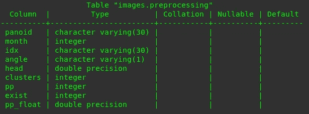
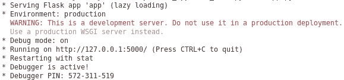
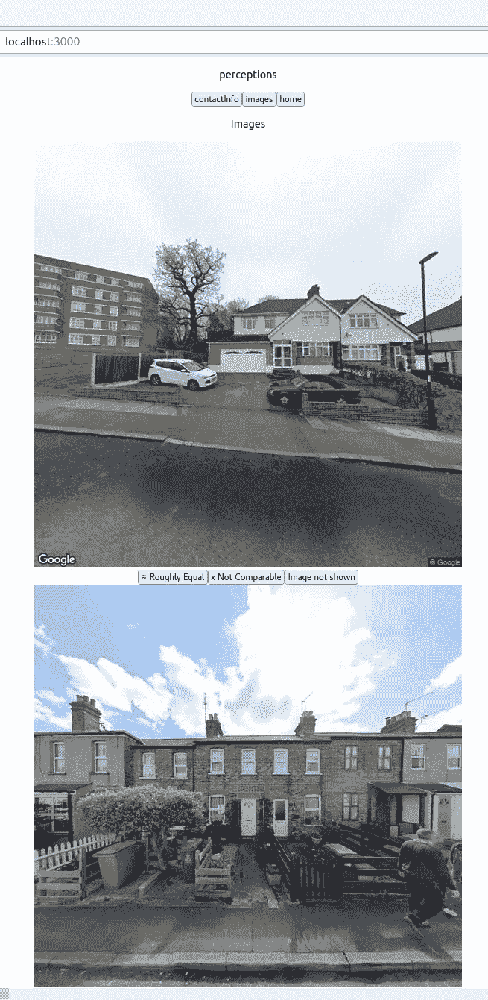

# 使用 Flask + React 开发带有 Postgres 数据库的 Web 应用程序。

> 原文：<https://medium.com/codex/developing-a-web-app-with-postgres-database-using-flask-react-9c297606aed9?source=collection_archive---------2----------------------->

这篇文章旨在提供如何建立一个本地托管的网站，可以连接到 postgres 数据库的指导。请注意，这不是最佳实践教程(我不是 web 开发人员)。要快速设置，请访问 [github](https://github.com/emilymuller1991/web-app) 。在下一篇文章中，我将介绍如何使用 Kubernetes 托管这个站点。

我们将使用以下文件( [github](https://github.com/emilymuller1991/web-app) ):

```
web-app
  - back_end
  - front_end
  - sql
```

每个文件夹都是不言自明的。我们使用 React (JS，HTML)开发前端，使用 Flask (Python)开发后端。让我们首先建立数据库。

# Postgres 数据库

我们将使用 Flask API 连接到 postgres 数据库，所以如果您没有安装[postgres](https://www.postgresql.org/download/)，那么现在就安装。在安装过程中，可能会要求您为用户 postgres 创建一个默认密码，请记住这一点，并保留默认端口 5432。为了使用名为 *psql 的 PostgreSQL 交互式终端程序，*您可能还需要更新您的路径。

在本例中，我们将创建一个 web 应用程序，它并排显示两幅图像，并要求用户选择一幅。为了显示图像，我们需要从数据库中获取元数据。一旦做出选择，我想把用户的选择发送到数据库。显示图像将利用谷歌街景 API，您需要从[谷歌云平台](https://console.cloud.google.com/home/dashboard?project=perceptions-22)服务创建一个街景 API 键来显示图像。

## 示例数据库

首先，使用默认用户登录 postgres，并使用模式映像和用户创建示例数据库:

```
postgres=# CREATE DATABASE example;
postgres=# \c example;
example=# CREATE SCHEMA images;
example=# CREATE SCHEMA users;
```

从[复制示例数据库到这里](https://github.com/emilymuller1991/web-app/tree/master/sql):

```
web-app/sql$ psql -U postgres example < ratings
web-app/sql$ psql -U postgres example < images
```

这会创建以下两个表:images.preprocessing 和 users.perceptions。

```
example=# \d images.preprocessing;
```

返回以下内容:



# 后端:烧瓶

[Flask](https://flask.palletsprojects.com/en/2.0.x/) 是一个用 Python 写的微型 web 框架。遵循网站的安装说明，然后创建以下文件(venv 文件夹是虚拟环境，应在安装过程中创建):

```
web-app
  - back_end
    - app.py
    - requirements.txt
    - venv/
  - sql
    - ratings
    - images
```

我们的整个后端都将写在 app.py 文件中。requirements.txt 文件充当软件包安装的指令。在您的 shell 中运行:pip install -r requirements.txt。

我们将如下初始化 app.py

```
import flask
import json
from flask import jsonifyapp = flask.Flask(__name__)
app.config["DEBUG"] = True@app.route('/post_data', methods=['POST'])
def post_data():
    insert_rating(json.loads(request.data))
    return print("Inserted row into DB")@app.route('/get_data', methods=['GET'])
def get_data():
    response = jsonify(get_image())
    return response...if __name__ == '__main__':
    app.run(host=os.getenv("app_host"), port="5000")
```

我们现在需要定义两个函数:insert_rating()、get_image()。这些将使用包 [psycopg2](https://pypi.org/project/psycopg2/) 连接到 postgres 数据库。安装软件包并将其添加到 requirements.txt 文件中。将它和 os 一起导入到 app.py 文件中，我们将使用它来检索环境变量。

```
import flask
import json
from flask import jsonify
import psycopg2
import os...dbconn = {'database': os.getenv("db"),
          'user': os.getenv("db_user"),
          'host': os.getenv("db_host"),
          'port': os.getenv("port")}pg_conn = psycopg2.connect(**dbconn)
pg_cur = pg_conn.cursor()if __name__ == '__main__':
    app.run(host=os.getenv("app_host"), port="5000")
```

这将建立到本地数据库的连接。在您的终端中定义环境变量(默认如上所述):

```
export app_host='localhost'
export db='example'
export db_user='postgres'
export db_host='localhost'
export db_port=5432
```

您可能还需要将 postgres 用户密码添加到环境变量和 app.py 文件中。

注释掉@ app.route 函数，并检查数据库连接是否正常工作:python app.py。您应该得到以下输出:



Flask API 服务器运行在 IP 127.0.0.1 上，IP 127 . 0 . 0 . 1 是本地主机，端口 5000，如上所述。

我们将定义 insert_rating()函数:

```
def insert_rating(data):
    sql = """insert into users.perceptions
            select img_1, img_2, perception, choice, user_id, time
            from json_to_recordset(%s) x (img_1 varchar(60),
                                          img_2 varchar(60), 
                                          perception varchar(60),
                                          choice varchar(60), 
                                          user_id varchar(100),
                                          time varchar(100)
            )
        """
    pg_cur.execute(sql, (json.dumps([data]),))
    pg_conn.commit()
```

这里我们使用变量*data = JSON . loads(request . data)*并使用 sql 查询和 *pg_cur.commit* )将其插入数据库。

以及 *get_image()* 函数:

```
def get_image():
    sql = """select * from images.preprocessing where exist=1 ORDER
                        BY random() LIMIT 20
           """
    pg_cur.execute(sql)
    data = pg_cur.fetchall()
    return data
```

这里，我们使用 select 查询和 *pg_cur.fetchall()* 从数据库中获取数据。

再次运行:python app.py。

就这样，后端完成了。现在我们来看一下前端。

# 前端:反应

npm 是 JavaScript 运行时环境 [Node.js](https://en.wikipedia.org/wiki/Node.js) 的默认包管理器。它由一个命令行客户端(也称为 npm)和一个公共和付费私有软件包的在线数据库(称为 npm 注册表)组成。遵循网站上的[安装说明](https://docs.npmjs.com/downloading-and-installing-node-js-and-npm)。创建新的 react 应用程序:

```
web_app$ npm init react-app ./front_end
```

这将在 front_end/中创建以下文件

```
web_app
  - back_end
  - sql
  - front_end 
    - node_modules/
    - public/
    - src/
    - package.json
    - package-lock.json
    - README.md
```

设置好 React 应用程序后，在终端运行 *npm start。*这将打开 [http://localhost:3000](http://localhost:3000) 在浏览器中查看 src/App.js 内容。我们将在。js 和。src/文件夹中的 css 文件。的。css 文件纯粹是为了格式化 html。

对于我们的网站，我们将简单地有 3 页。主页、显示图像的另一个页面和联系页面。每个页面都需要自己的。js 和。css 文件。这些文件可以在 github [这里](https://github.com/emilymuller1991/web-app)找到。

```
web_app
  - front_end 
    - node_modules/
    - public/
    - package.json
    - package-lock.json
    - README.md
    - .env
    - src/
      - App.js
      - App.css
      - Contact.js
      - Contact.css
      - Images.js
      - Images.css
      - Home.js
      - Home.css
```

我们需要安装 react-youtube 和 react-bootstrap 来嵌入 youtube 视频(在主页上)并使用 React bootstrap:

```
web-app/front_end$ npm install react-youtube
web-app/front_end$ npm install react-bootstrap
```

我们只看一下 App.js 页面中的一个示例:

```
import {useState} from "react";
import Contact from "./Contact"
import Images from "./Images"
import Home from "./Home"
import "./App.css";
**require('dotenv').config({path: '../.env'});**function App() {const [view, setView] = useState(2);
  const [meta, setMeta] = useState({ meta: 'aaa' });const host = process.env.REACT_APP_BACK_END_HOST;
  const port = process.env.REACT_APP_BACK_END_PORT;const fetchImage = () => {
    const requestOptions = {
      method: 'GET',
      header: { 'Content-Type': 'application/json'}
    };
    fetch('[http://'](http://') + host + ':' + port + '/get_data', requestOptions)
      .then(response => response.json())
      .then(result => {
        setMeta({
          meta: result.map(item => ({
            panoid: item[0],
            month: item[1],
            idx: item[2],
            angle: item[3],
            head: item[4],
            cluster: item[5],
            pp: item[6],
            pp_float: item[8]
          }))
        });
      });
  };return (
    <div className="App">
      <p>perceptions</p>
      <button onClick={() => setView(0)}>contactInfo</button>
      <button onClick={() => { setView(1); fetchImage() }}>images</button>
      <button onClick={() => setView(2)}>home</button>
      { view === 0 ? <Contact/> : null}
      { view === 1 ? <Images setView={setView} fetchImage={fetchImage} meta={meta} /> : null}
      { view === 2 ? <Home setView={setView}/> : null}
    </div>
  );
}
export default App;
```

该文件分为 3 个部分，导入、javascript 主体和返回 html 呈现。我们导入其他每个页面，以及。css 格式。在这篇博客中，我们不会看到格式化。我们从 require('dotenv ')导入全局变量。配置({路径: '../.env'})。因此，我们需要在一个单独的文件. env 中指定我们的全局变量。

```
REACT_APP_BACK_END_HOST ='localhost'
REACT_APP_BACK_END_PORT = '5000'
REACT_APP_API_KEY = 'API_KEY_from_GOOGLE_STREET_VIEW_API'
```

view 常量控制我们查看哪个页面，每个页面都在 html 返回中被枚举。meta 常量将在发出获取请求后保存图像预处理表信息。主机和端口调用我们的 Flask API。使用函数 fetchImage()，我们 ping 后端，并根据 app.py 脚本中的函数 get_data()请求元数据。该页面有 3 个按钮，每个按钮都指向不同的页面。单击“images”按钮时，调用 fetchImage()函数，加载元数据。视图也被设置为 1，因此我们被定向到 Images.js 页面。这一行:

```
{ view === 1 ? <Images setView={setView} fetchImage={fetchImage} meta={meta} /> : null}
```

将常量和函数传递给 Images.js，例如使用 props.setView 调用它们。

一旦您配置了您的页面和 gloval 变量，使用 *npm start* 再次运行页面。在这种情况下，您应该会看到以下页面:



瞧，你已经使用 Flask + React 成功开发了一个带有 Postgres 数据库的 Web 应用程序。