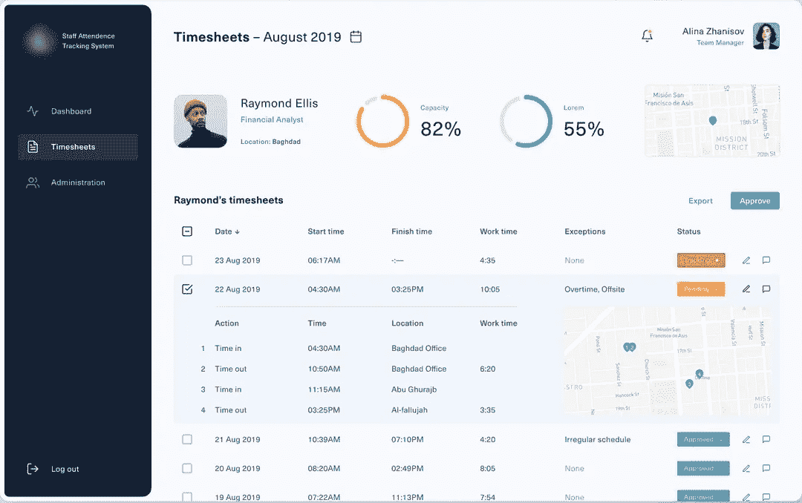

# 开发员工考勤管理系统:成本、特点和商业模式

> 原文：<https://medium.com/codex/developing-an-attendance-management-system-for-employees-its-cost-features-and-business-model-a8896009ac5c?source=collection_archive---------3----------------------->

[图像来源](https://dribbble.com/shots/16048699-Staff-Attendance-Tracking-System?utm_source=Clipboard_Shot&utm_campaign=potyralaartur&utm_content=Staff%20Attendance%20Tracking%20System&utm_medium=Social_Share&utm_source=Clipboard_Shot&utm_campaign=potyralaartur&utm_content=Staff%20Attendance%20Tracking%20System&utm_medium=Social_Share)

随着技术的巨大影响，工作文化已经不再一成不变。传统的朝九晚五的工作已经被灵活的工作时间所取代。此外，在 covid 之后，灵活的工作文化已经转变为远程工作和混合办公模式。

在这种繁忙的工作场景中，用手动方式跟踪、存储和管理员工数据对组织来说是一项单调乏味的任务。随着工作文化的变化，越来越多的企业倾向于技术激活的工作环境，这种环境可以更好地控制员工纪律，并使您能够跟踪他们的表现。

此外，实施数字考勤系统的唯一目的是深入了解员工的流动情况，同时帮助您轻松执行。不同的国家和部门对工作时间、工资和假期有自己的一套管理要求。这就是精心设计的考勤管理系统发挥作用的地方，它可以帮助你跟踪上面的信息。

想知道考勤管理系统与传统的员工管理系统有何不同？如果是，那么在雇用移动应用程序开发公司定制 AMS 解决方案之前，您需要了解这个概念，并先睹为快，看看它在现代是如何成为更好的商业解决方案的。

## **了解自动考勤系统的概念以及它们与人工解决方案的不同**

自动考勤系统是一个保存和跟踪每个员工状态的系统。它集成了各种现代特性和功能，为组织提供了一个简单的数字平台，可以更轻松地管理员工的出勤情况，尤其是在大型企业中。除了提高员工记录的透明度，它还可以防止员工不必要的移动和未经授权的进入。

每个部门都有自己的登录帐户，大多数系统都是基于面部检测和其他识别算法来工作的，当员工使用网络摄像头或设备摄像头时，这些算法会自动检测员工。通过使用这样的自动化考勤管理系统，您可以轻松地生成每周、每月或每年的员工报告。通过引入该系统，您将获得人工考勤管理系统所缺乏的显著优势，如下所述。

> 自动化考勤管理系统如何革新传统的考勤系统？

毫无疑问，技术驱动的考勤管理系统可以自动化整个员工记录，并创建一个访问数据的中心。以下是他们的不同表现…

*   **提高员工生产力并节省资金**

通过实施自动化考勤系统，您可以轻松减少员工不必要的流动，最终提高员工绩效。有了一些监控系统，员工被迫在给定的期限内完成任务。这反过来也会对你公司的形象产生积极的影响。此外，随着时间的推移，公司将见证更少的员工缺勤和更好的薪资流程。

*   **提供准确的考勤记录**

对于手动出勤跟踪，提供虚假数据是一种常见的做法，会导致数据不准确。他们可能会在考勤表上增加额外的工作时间，这可能会收取加班费。通过雇佣一个应用程序开发公司来定制你的考勤系统，你可以给员工的考勤数据带来透明度。此外，你再也不用担心这种代价高昂的计算失误或错误。

*   **自动记录所有员工数据**

有了自动化考勤管理系统的集成，你就不用过多考虑考勤任务了。从上班打卡到下班打卡，从员工表现到旷工，它记录了一切。通过自动考勤系统，收集和存储员工数据可以变成一个自动化的过程。有了这个系统，你可以很容易地分析存储的数据，并确定他们工作了多少小时。

*   **易于集成**

根据您的组织的考勤政策的需要，定制一个具有各种集成的考勤系统真的很容易。你所需要的只是雇佣一家软件开发公司，该公司拥有创建考勤系统的技能和经验，该系统提供生物识别和刷卡系统等功能。

*   **减轻管理负担**

有了集体自动化的员工数据，就不需要花费数小时人工计算员工的工作时间。在工作场所放置自动考勤系统将消除人工考勤的需要，并帮助您利用时间管理其他操作。

如果你真的对实现自动化考勤系统的这些优势印象深刻，并好奇地寻找一家应用程序开发公司，可以帮助你建立一个简化考勤管理流程并确保高质量解决方案的解决方案。那么在这里，我们分享一些重要的提示，帮助你开发一个成功的员工时间跟踪和考勤管理应用程序。

## **如何创建一个成功的员工时间跟踪和考勤管理 App？**

毫无疑问，市场上有许多员工时间跟踪和绩效分析软件。但在转向这些应用程序或 ERP 系统之前，重要的是要记住，并不是所有的时间和考勤管理解决方案都完全符合您的业务需求。

无论您是希望实现一个非常基础的版本，还是希望实现自动化一切的软件，以及集成自动化一切的系统，您都需要雇用一家应用程序开发公司，该公司可以定制适合您业务需求的应用程序。此外，为了确保您的应用程序能够完美地工作并处理工作的复杂性，您需要根据您的业务需求考虑以下特性，然后构建一个提供这些特性的软件

> 在考勤管理系统中需要考虑的最基本的特性和功能

*   **员工注册:**允许用户使用组织生成的凭证注册应用程序。通过注册一个具有唯一员工 ID 的应用程序，组织可以准确无误地跟踪和管理每个员工的数据。
*   **生物识别:**为了让您的考勤系统完美运行，加入生物识别功能来监控员工的真实打卡和下班活动是非常重要的。随着该功能的实施，组织将更好地控制好友打卡，并最大限度地降低时间盗窃的风险。
*   面部识别:记住新冠肺炎的场景，在你的员工考勤系统中集成面部识别功能已经成为一个重要的考虑因素。今天，面部识别解决方案已经成为比使用指纹生物识别更有利的功能。
*   **薪资集成支持:**通过将您的考勤系统与薪资功能相集成，这可能是提高效率的最佳方式之一。这可以通过使用与您现有的云工资软件配合使用的考勤系统来实现。
*   **基于云的支持:**借助基于云的解决方案，雇主和员工可以随时随地访问他们的系统。向您的员工时间和考勤系统添加基于云的支持，当团队成员增加时，无需不断更新。
*   **劳动力管理:**管理员工最有潜力的方法是拥有一个系统，它可以帮助你跟踪雇主，并使你能够在一个地方收集所有这些信息。
*   **电子时间表:**自动化考勤管理系统已经成功取代了传统的纸质电子表格，让您能够保持准确的员工记录。要集成这一功能，你可以雇佣一个能让你的应用流畅运行的移动应用开发者。无论是跟踪假期，加班，和其他复杂的时间表的情况。电子时间表是可访问的，使员工出勤报告简单得多。
*   **管理排班:**通过在员工时间和考勤管理系统中实现这一功能，为您的工作增加排班灵活性变得更加容易。使用该功能，组织可以更好地控制员工管理，并允许雇主随时提供意见和进行更改。
*   **追踪加班:**在你的考勤系统中加入加班追踪功能，将会让你更容易遵守关于你需要向员工支付多少工资的最新规定。您可以通过每周自动生成的报告轻松评估每个员工的额外工作时间。
*   **简单易用的界面:**确保你的员工时间跟踪和考勤管理系统有一个简单的界面，有吸引力的界面，容易上手。确保您不必花很长时间来培训员工学习本模块。
*   **报告功能:**这是一个良好的考勤系统最重要的功能之一，允许您根据首选日期自动生成报告。员工时间跟踪系统的这一功能将帮助您跟踪员工的时间表，并简化雇主的工资计算。
*   **推送通知:**让你的应用程序在员工没有打卡休息或错过打卡下班匆忙离开办公室时向他们发送提醒。此外，经理/员工将通过自动生成的警告得到有关这些异常的通知，并允许组织采取有效的行动。

了解了开发员工时间和出勤管理应用程序的所有这些基本而先进的功能，你们中的许多人都很想知道创建一个应用程序要花多少钱。

虽然确定应用程序开发成本是组织最关心的问题之一，但在深入了解应用程序开发成本之前，了解可用于开发的技术非常重要。

## **创建员工时间跟踪应用程序需要哪些技术支持和应用程序开发团队？**

员工时间跟踪应用不仅仅是跟踪员工的工作时间。事实上，他们处理的任务要复杂得多。虽然实施这些系统的唯一原因是自动化员工考勤、跟踪他们的绩效、在云上存储数据、管理工资单、提供入职工具、绩效管理、继任计划等等。尽管这些系统正在处理复杂的任务，但为了让它完美地工作，你需要确保你在应用程序开发中使用了正确的技术。

随着技术的巨大创新和进步，现在组织有多种技术可以集成到应用程序开发流程中。但是，采用先进的技术会迅速提高预算，但你永远不会希望牺牲性能。通过雇佣软件开发公司，你可以创建一个完美的移动应用程序。专家可以帮助您实施独特的方法和技术，帮助创建强大的后端，并使您的应用程序像一台润滑良好的机器一样工作。

*   ***编程语言:*** *Java/Kotlin (Android)，Objective C/ Swift(iOS)*
*   ***Cron:*** *处理基于时间的作业调度*
*   ***AWS RDS:*** *管理数据库*
*   ***AWS S3:*** *用于对象存储*
*   ***AWS SQS:*** *处理测序服务*
*   ***AWS Lambda:****用于无服务器运行代码*
*   ***AWS 步骤功能:*** *使用可视化工作流构建分布式 app。*
*   ***亚马逊 EC2:*** *一个完美的网络服务，在云中为你提供安全的、可调整大小的计算能力。它旨在使开发人员更容易进行网络规模的云计算。*
*   ***弹性搜索:*** *它是一个开源的分布式 RESTful 搜索和分析引擎，能够解决不断增长的用例数量。*
*   ***亚马逊 Elasticsearch 服务:*** *一个全面管理、可扩展、安全的 Elasticsearch 服务。*
*   ***document db:****提供与 MongoDB 兼容的 Amazon DocumentDB。*
*   ***基巴纳:*** *你的界面进入弹性堆栈*
*   ***REST API:****确保无缝状态转移*
*   ***PHP 框架:****PHP 编程语言上的软件和库。*
*   ***IaC:*** *基础设施为代码*
*   ***terra form:****开源基础设施作为代码软件工具*

现在的问题是如何开始开发过程？无论您是希望从头构建一个应用程序，还是希望将它从一个平台迁移到另一个平台，您都需要一个优秀的开发团队，包括业务分析师、项目经理、应用程序开发人员、应用程序测试人员和 UI/UX 设计人员，他们可以处理项目的复杂性，并确保您的解决方案质量。

现在剩下的主要问题是，为你的企业开发一个员工时间和出勤管理应用程序需要多少成本。

**为您的企业开发一款员工时间跟踪应用程序需要多少成本？**

即使对于经验丰富的应用程序开发人员来说，估算开发员工时间跟踪和管理应用程序的成本也是一项具有挑战性的任务，尤其是当他们不了解您的业务需求时。如果你关注的是构建一个时间跟踪应用程序的平均成本，那么你需要记住的一件事是该应用程序的复杂性以及你需要在 ETM 系统(员工时间管理)中进行多大程度的整合。

如果你好奇地寻找应用程序开发成本，那么你需要记住这些重要的成本影响因素，它们会影响预算和时间表。

这些因素主要包括:

*   *app 结构的复杂性；*
*   *选择操作系统启动 app*
*   *应用程序中包含的特性和功能；*
*   *UI/UX 设计及其结构；*
*   *质量保证和应用程序测试；*
*   *技术要求和进步*
*   *App 开发团队及其小时成本。*

这些是开发应用程序时需要考虑的几个主要成本影响因素。如果得出结论，那么可以公平地说，每个平台开发一个员工时间跟踪系统的平均成本大约在 20，000 到 25，000 美元以上。但是在您做出任何决定之前，请记住，这些成本估计可能会根据项目需求的复杂性而上下浮动。因此，我们始终建议预约免费咨询，以做出明智的决定并获得真实的估计。

## **结尾注释**

随着工作文化中灵活性的增加，考虑实施自动化的员工时间和出勤管理系统变得非常重要。实施这些解决方案的简单目的是自动化时间管理系统，并为企业提供一个定义良好的平台，使其能够跟踪员工的绩效。

因此，如果您希望确保您的组织拥有类似的解决方案，那么您可以雇佣一家移动应用程序开发公司来帮助您实施最佳系统，提供增强的员工体验并提高企业生产力。由于员工是您的宝贵资产，因此拥有这种技术驱动的系统非常重要，它可以帮助您监控员工的时间和出勤情况，并使您能够管理工资单。

因此，如果你是一个独立的公司，寻找软件开发公司，帮助你从设计到开发到部署，然后你可以联系我们或下降以下查询。