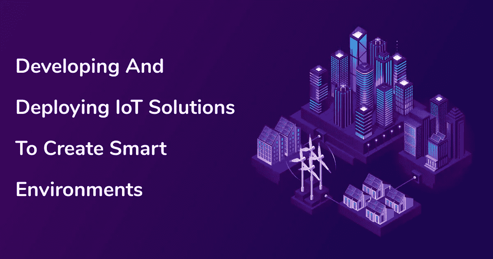
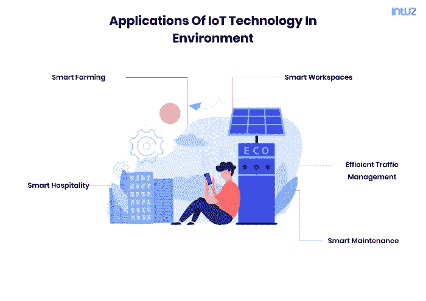
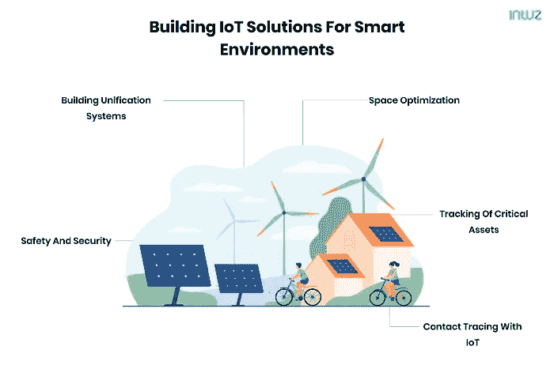

# 开发和部署物联网解决方案以创建智能环境

> 原文：<https://medium.com/codex/developing-and-deploying-iot-solutions-to-create-smart-environments-be4bf4b9a8da?source=collection_archive---------4----------------------->

自从几年前物联网开始成为主流以来，世界各国的专家、技术专家甚至政府都热衷于将这项技术用于社会和环境福利。

发展智能城市、智能电网、智能农业用地等物联网的大规模雄心一直在酝酿之中。然而，最近物联网硬件和软件领域的中断以及全球疫情的突然出现，加快了物联网解决方案的发展，以创建基于物联网的智能环境。

在本帖中，我们将探讨物联网如何在智能环境的发展中发挥关键作用，它为人们带来的好处，以及我们需要共同克服的挑战，以便为无缝解决方案铺平道路。

# 什么是智能环境？

这里有一个快速理解的例子。

如果您的家由家庭自动化解决方案或任何形式的智能家居技术(如智能照明或智能监控系统)供电，这就是智能环境。

尽管它的规模或雄心可能不像智能城市那样巨大，但它拥有连接到互联网的系统、小工具和设备，为你提供关于如何执行任务、节省能源和最终费用的见解，这一事实使它成为一个智能环境。

现在，在更大的范围内，跨地理位置和目的想象这个概念，你得到的是一个智能环境。

简而言之，智能环境是由物联网解决方案(如传感器、应用程序、信标等)驱动的任何前提，以允许利益相关方就其运营或生活的环境做出数据驱动的决策。

智能环境可以是办公室、大型仓库、学院或大学校园、公寓楼、购物中心或任何东西。据统计，[所有公开宣布的物联网项目](https://iot-analytics.com/global-overview-1600-enterprise-iot-projects/)中，有三分之一是智慧城市概念。

# 公司在建立智能环境中的作用

当智能环境的想法在市场上传播时，许多公司加入了这股热潮，只是为了探索这种热潮是怎么回事，并使自己与竞争对手区分开来。只有当实际体验到好处时，几家公司才采取进一步措施和积极主动的举措，将基于物联网的智能环境纳入其经营场所。

如今，公司和企业热衷于做出由数字支持的决策。他们不想再相信自己的直觉或假设来做出关键决定。相反，他们希望分析图表，并从跨接触点生成的数据中获得可视化见解。因此，他们继续前进，用他们的智能对应物取代传统的电器和设备，在那里可靠的数据永远可用。

如果你注意到今天，你会发现越来越多的公司参与设置智能灯、自动化系统、水龙头和洗手间的物联网传感器技术以节约用水、分析数据的应用程序、仓库的自动化库存管理设备、物联网驱动的车队管理系统等。

# 物联网技术在环境中的应用

如果智能环境的整个概念对你来说听起来是未来的和新的，要知道已经有大量的应用程序在开发中。或者更好的是，有数百种设备和智能解决方案部署在公司和组织中。为了让您快速了解它们是什么，这里有一些智能环境的真实示例。

1.  物联网技术作为智能农业项目的一部分用于农业。在这种情况下，农民通过[物联网传感器和系统](https://www.intuz.com/guide-on-top-iot-sensor-types)获得关于其土壤及其营养价值的充足信息。在 AI(人工智能)和预测分析的帮助下，他们可以获得关于温度变化、降雨量等的想法，以选择最理想的作物品种。
2.  在酒店行业，智能环境是不可避免的。由于大量的财产和设施，部署体力劳动来照顾节能是不可能的。这就是物联网系统发挥作用的地方，它有助于节约用水和能源，并有助于保持理想的室温、照明水平，甚至房屋和房间的安全性。
3.  物联网还部署在工作区中，以自动化环境中的许多任务。例如，出勤可以很容易地管理，每月可以从他们的工资和工资单上做出决定的洞察力。当没有人在会议室时，灯和空调可以自动关闭。
4.  物联网技术还可以实现高效的交通管理，通过根据通勤者的日常活动预测和指定替代路线，可以防止高峰时段的拥堵情况。
5.  智能维护是物联网在创建智能环境方面的最大应用之一。在这种情况下，工厂和行业可以配备物联网解决方案，以自动化设备和机器的服务请求。此外，物联网传感器还可以提前预测机器中可能出现的故障，并及时安排维护请求。

# 为智能环境构建物联网解决方案

# 构建统一系统

在智能环境概念的帮助下，像建筑物这样简单的结构可以变成资产。以购物中心为例。这是一个巨大的结构，有几个商店，商店，售货亭和设施。一开始，它们可能看起来都是独立的模块，但只有当你从技术上接近它们时，你才会明白它们都可以通过物联网技术集成在一起。

这个愿景是在华盛顿州 DC 的地区中心真正实现的。传统设备被专门的数字设施所取代，如带传感器的灯具、用于检测结构容量的红外设备、帮助游客在建筑中导航的蓝牙信标、基于应用程序的会议室预订设施、智能室温维护等。通过仔细的规划和明确的目标，拥有商店或房间的独立建筑可以变成统一的智能建筑。

# 安全和保障

在开发智能环境中实施物联网技术的最大优势之一在于使空间安全可靠。有了物联网，安全和安保问题可以立即得到解决，响应措施可以快速启动，以遏制由于违规或威胁造成的后果或损害。

这个想法的一个现实世界的例子是 ShotSpotter，物联网技术和枪击检测技术结合在一起，通过精确定位枪击位置来立即派遣警察和安全人员。ShotSpotter 背后的技术和概念已经帮助辛辛那提的一个社区降低了 50%的犯罪率。

通过进一步完善，这项技术可以部署在电影院、购物中心、学校、医院等场所，以限制损害和威胁。

除了在犯罪发生后解决问题，物联网还有助于预测犯罪并在犯罪发生前预防犯罪。

# 节省空间或优化

工作场所经常堆满了太多的桌子、椅子和永远忙碌的同事。

最近，公司已经放弃了小隔间，并为热办公桌预留了空间，热办公桌无缝地促进了同事之间的协调，并消除了所有形式的等级制度。

随着物联网的引入，现代工作场所可以变得更加高效。在像共同工作空间这样的场所，热桌子或开放式桌子是概念，人们可以自由地坐在他们喜欢的位置或桌子上，除非它以前没有被占用。物联网的引入将让游客和用户在他们的应用程序上了解可用的桌子，并在离开前预订他们喜欢的空间，以获得最佳的便利。

# 关键资产的跟踪

不管是商店还是工作场所，每个经营场所都有大量的关键资产需要管理。这就是物联网驱动的室内跟踪模块的用武之地。闪存驱动器和硬盘驱动器等资产很容易被遗忘，不知道归谁所有。当同事从一个团队转移到另一个团队进行互动时，即使是笔记本电脑和平板电脑也需要在组织内部移动。

在这种情况下，资产跟踪系统精确地跟踪并通知环境中物体的位置。因此，如果有人对放错地方的物品提出投诉或问题，他们可以立即得到跟踪。这在器具陈列室中非常有益，在那里偷窃和放错地方的机会更高。

# 使用物联网追踪联系人

作为人类，我们目睹了我们这个时代最可怕的病毒爆发之一。当我们继续努力应对第一波的后果时，我们正处于第三波病毒持续变异的边缘。

在这一点上，我们也超越了再次实施严格封锁的阶段，考虑到与关闭业务相关的经济和人民的生计。因此，解决这种情况的最佳方法是在组织中实施安全和密封的接触追踪设施。

借助物联网，这可以通过可穿戴标签、智能手机应用和蓝牙技术来实现。作为一个企业或组织，您可以轻松地维护您的员工以及他们与他人的互动的日志。通过这种方式，当一个人被感染时，他的所有互动都会收到一条关于可能传染的消息，并让他们及时接受测试。

# 物联网在环境方面的优势

虽然到目前为止，在环境中实施[物联网的好处是显而易见的，但让我们快速总结一下，好吗？](https://www.intuz.com/blog/enough-about-smart-apps-lets-talk-smart-cities)

*   它使环境中的用户、游客或居民能够获得所需的洞察力，以控制能源和水的消耗。这是通过可视化、图表甚至游戏化来实现的。
*   自动化物联网系统可以帮助节约用水和能源，并为优化照明、室温甚至空气质量铺平道路。
*   企业可以通过实施智能环境来大幅节省成本。
*   通过使用物联网技术，可以优化室内安全性。

# 包扎

我们正处于一个新时代的黎明，系统和设备让我们通过帮助我们改变生活方式来应对更大的敌人，如气候变化和气温上升。

有了正确的见解和数据，我们可以发现我们运作和生活方式中的漏洞，揭穿假设和神话，让我们的环境更加丰富、安全和丰富。随着物联网在智能环境开发中的使用案例数量增加，无论我们走到哪里，我们都将为更有价值的生活方式让路。