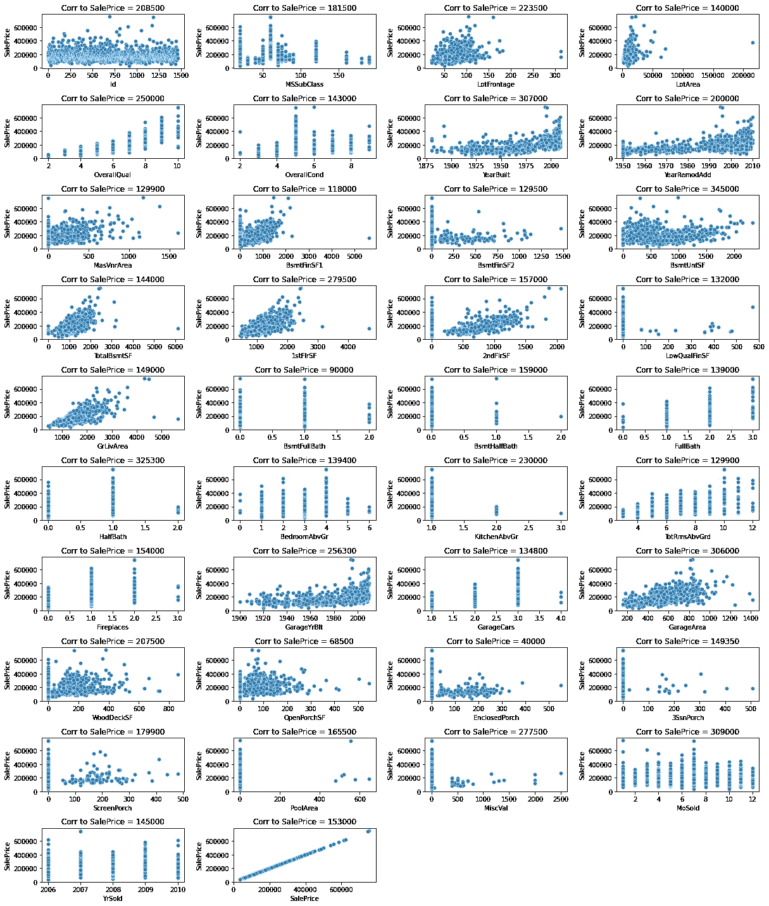
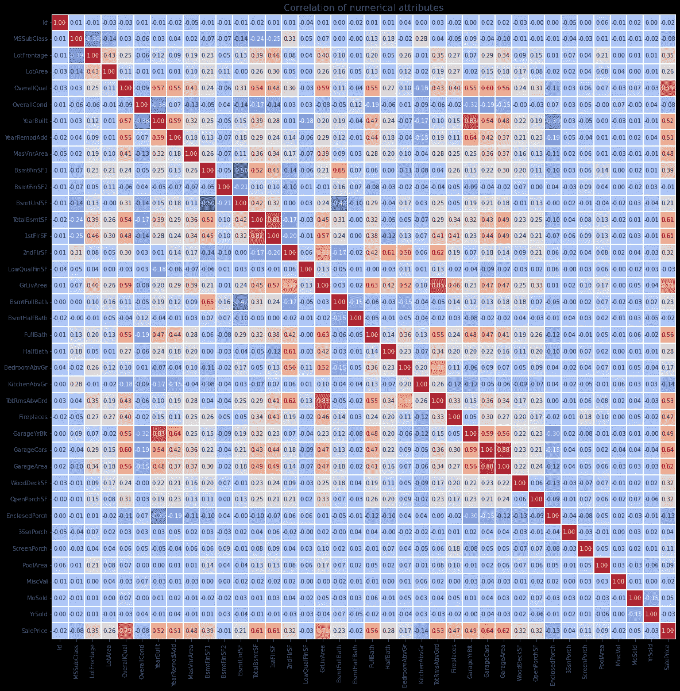
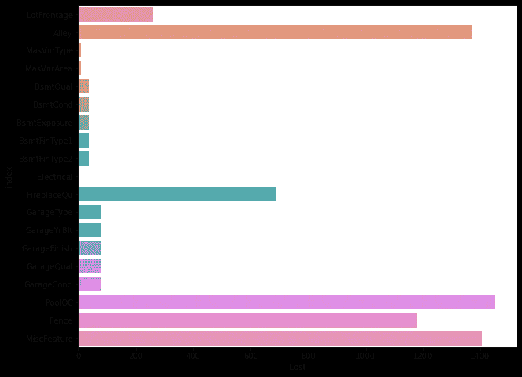
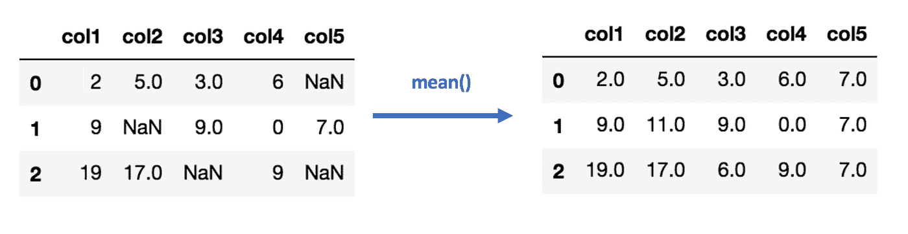
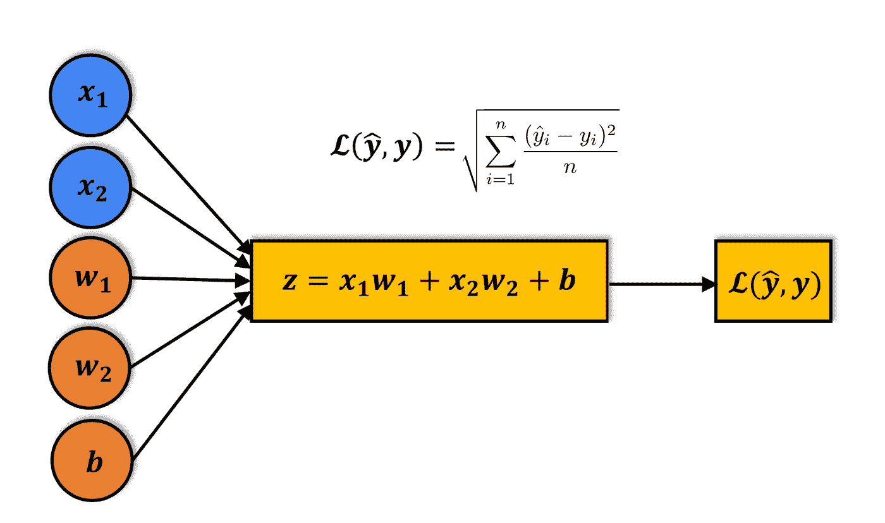

# 开发我的第一个机器学习模型

> 原文：<https://medium.com/codex/developing-my-first-machine-learning-model-ad42306d06f9?source=collection_archive---------12----------------------->


我想从一个非常简单的模型开始，使用 Kaggle 的房价预测数据集。我使用谷歌的 Colab 来处理细节，如果我需要分享一些代码帮助，它是一个很好的工具。我按照 Jovian.ai 创建的阶段进行，这是我在研究如何建立这个网站时发现的一个训练 ML 网站。确定的主要阶段是:

## 基于线性回归的房价预测

1.下载并浏览数据

2.为训练准备数据集

3.训练线性回归模型

4.进行预测并评估模型

## 步骤 1 探索数据(**数字变量和销售价格之间的相关性**

在运行模型的过程中，我觉得有必要更好地理解数据的相关性，所以我最终制作了两个图表，以便更好地直观理解。作为探索性数据分析(EDA)的新手，很容易看出什么是相关的，但我有一种感觉，一旦我开始更多地了解这个主题，特征工程将发挥更大的作用。

```
num_col **=** prices_df**.**select_dtypes(exclude**=**['object'])
correlation **=** num_col**.**corr()
corr_price **=** prices_df[['SalePrice']]plt**.**figure(figsize**=**(17,20))
**for** i **in** range(len(num_col**.**columns)):
    plt**.**subplot(10,4,i**+**1)
    sns**.**scatterplot(x**=**num_col**.**iloc[:, i], y**=**'SalePrice', data**=**num_col**.**dropna())
    plt**.**title('Corr to SalePrice = {}'**.**format(np**.**around(corr_price**.**iloc[i, 0], decimals**=**3)))
plt**.**tight_layout()
plt**.**show()
```



```
plt**.**figure(figsize**=**(20,20))
correlation **=** num_col**.**corr()
sns**.**heatmap(correlation, linewidth**=**1, cmap**=**'coolwarm', annot**=True**, fmt**=**'.2f', cbar**=False**, square**=True**)
plt**.**title("Correlation of numerical attributes", size**=**16)
plt**.**show()
```



## 步骤 2-为训练准备数据集

为了准备数据集，我遵循以下步骤。我曾在代码中的各个阶段经历过这一过程，但过了一段时间后，我意识到将它推进管道真的有助于我理解流程。

## 在训练模型之前，我们需要准备数据集。以下是我们将遵循的步骤

*   确定用于定型模型的输入列和目标列。
*   识别数字和分类输入列。
*   [估算](https://scikit-learn.org/stable/modules/impute.html)(填充)数字列中缺失的值
*   [将数字列中的](https://scikit-learn.org/stable/modules/preprocessing.html#scaling-features-to-a-range)值缩放到(0，1)范围。
*   [将](https://scikit-learn.org/stable/modules/preprocessing.html#encoding-categorical-features)分类数据编码成独热向量。
*   将数据集拆分为定型集和验证集。

## 评估数据集中缺少太多值的列

```
lost **=** inputs_df**.**count()**.**copy(deep**=True**)
lost **=** 1460**-**lost[lost**<**1460]
lost_pd **=** lost**.**reset_index(name**=**'count')plt**.**figure(figsize**=**(10, 8))
ax **=** sns**.**barplot(x**=**'count', y**=**'index', data**=**lost_pd)
ax**.**set(xlabel**=**'Lost')
```



```
px**.**bar(lost_pd, x**=**'count',y**=**'index')
```

删除缺少太多值的数据

```
*# Drop columns in training and test data*
cols_to_drop **=** ['LotFrontage', 'Alley', 'FireplaceQu', 'PoolQC', 'Fence', 'MiscFeature']
inputs_df **=** inputs_df**.**drop(cols_to_drop, axis**=**1)
```

## 识别数字和分类数据

数据准备的下一步是识别数字列和分类列。我们可以通过查看每一列的数据类型来做到这一点。

> *创建两个列表* `*numeric_cols*` *和* `*categorical_cols*` *，分别包含数据帧内数值和分类输入列的名称。数字列具有数据类型* `*int64*` *和* `*float64*` *，而分类列具有数据类型* `*object*` *。*

```
**import** numpy **as** npnumeric_cols **=** inputs_df**.**select_dtypes(include**=**['int64', 'float64'])**.**columns**.**tolist()categorical_cols **=** inputs_df**.**select_dtypes(include**=**['object'])**.**columns**.**tolist()print(list(numeric_cols))['MSSubClass', 'LotArea', 'OverallQual', 'OverallCond', 'YearBuilt', 'YearRemodAdd', 'MasVnrArea', 'BsmtFinSF1', 'BsmtFinSF2', 'BsmtUnfSF', 'TotalBsmtSF', '1stFlrSF', '2ndFlrSF', 'LowQualFinSF', 'GrLivArea', 'BsmtFullBath', 'BsmtHalfBath', 'FullBath', 'HalfBath', 'BedroomAbvGr', 'KitchenAbvGr', 'TotRmsAbvGrd', 'Fireplaces', 'GarageYrBlt', 'GarageCars', 'GarageArea', 'WoodDeckSF', 'OpenPorchSF', 'EnclosedPorch', '3SsnPorch', 'ScreenPorch', 'PoolArea', 'MiscVal', 'MoSold', 'YrSold']print(list(categorical_cols))['MSZoning', 'Street', 'LotShape', 'LandContour', 'Utilities', 'LotConfig', 'LandSlope', 'Neighborhood', 'Condition1', 'Condition2', 'BldgType', 'HouseStyle', 'RoofStyle', 'RoofMatl', 'Exterior1st', 'Exterior2nd', 'MasVnrType', 'ExterQual', 'ExterCond', 'Foundation', 'BsmtQual', 'BsmtCond', 'BsmtExposure', 'BsmtFinType1', 'BsmtFinType2', 'Heating', 'HeatingQC', 'CentralAir', 'Electrical', 'KitchenQual', 'Functional', 'GarageType', 'GarageFinish', 'GarageQual', 'GarageCond', 'PavedDrive', 'SaleType', 'SaleCondition']
```

## 步骤 2.1 数据转换的管道

## 估算数字数据

## 我们数据集中的一些数字列包含缺失值(`nan`)。

```
missing_counts **=** inputs_df[numeric_cols]**.**isna()**.**sum()**.**sort_values(ascending**=False**)
missing_counts[missing_counts **>** 0]GarageYrBlt    81
MasVnrArea      8
dtype: int64
```

机器学习模型无法处理缺失数据。填充缺失值的过程称为[插补](https://scikit-learn.org/stable/modules/impute.html)。



有几种插补技术，但我们将使用最基本的一种:使用来自`sklearn.impute`的`SimpleImputer`类用列中的平均值替换缺失值。

```
**from** sklearn.compose **import** ColumnTransformer
**from** sklearn.pipeline **import** Pipeline
**from** sklearn.impute **import** SimpleImputer
**from** sklearn.preprocessing **import** MinMaxScaler
**from** sklearn.preprocessing **import** OneHotEncoder*# Preprocessing for numerical data*
numerical_transformer **=** Pipeline(steps**=**[
    ('imputer', SimpleImputer(strategy**=**'constant')),
    ('scaler', MinMaxScaler())                                       
]) *# Preprocessing for categorical data*
categorical_transformer **=** Pipeline(steps**=**[
    ('imputer', SimpleImputer(strategy**=**'most_frequent')),
    ('onehot', OneHotEncoder(sparse**=False**, handle_unknown**=**'ignore'))
])*# Bundle preprocessing for numerical and categorical data*
preprocessor **=** ColumnTransformer(
    transformers**=**[
        ('num', numerical_transformer, numeric_cols),
        ('cat', categorical_transformer, categorical_cols)
    ])
```

## 训练和验证集

最后，让我们将数据集分成训练集和验证集。我们将使用随机选择的 25%的数据子集进行验证。此外，我们将只使用数字和编码列，因为模型的输入必须是数字。

```
**from** sklearn.model_selection **import** train_test_splittrain_inputs, val_inputs, train_targets, val_targets **=** train_test_split(inputs_df, 
                                                                        targets, 
                                                                        test_size**=**0.25, 
                                                                        random_state**=**42)train_inputs
```

1095 行× 73 列

```
train_targets1023    191000
810     181000
1384    105000
626     139900
813     157900
         ...  
1095    176432
1130    135000
1294    115000
860     189950
1126    174000
Name: SalePrice, Length: 1095, dtype: int64val_inputs
```

365 行× 73 列

```
val_targets892     154500
1105    325000
413     115000
522     159000
1036    315500
         ...  
988     195000
243     120000
1342    228500
1057    248000
1418    124000
Name: SalePrice, Length: 365, dtype: int64
```

## 步骤 3-训练线性回归模型

现在我正处于训练模型的阶段，一切都是为了什么。线性回归是解决回归问题的常用技术。在线性回归模型中，目标被建模为输入要素的线性组合(或加权和)。使用均方根误差(RMSE)等损失函数对模型预测进行评估。

## 以下是线性回归模型构造方式的直观总结:



但是，当我们有大量共线的输入列时，即当一列的值与另一列的值高度相关时，线性回归不能很好地推广。这是因为它试图完美地拟合训练数据。

## 相反，我们将使用岭回归，这是线性回归的一种变体，它使用一种称为 L2 正则化的技术来引入另一个损失项，从而迫使模型更好地进行概化。在这里了解更多关于岭回归的信息:[https://www.youtube.com/watch?v=Q81RR3yKn30](https://www.youtube.com/watch?v=Q81RR3yKn30)

> *使用* `*sklearn.linear_model*` *中的* `*Ridge*` *类创建并训练一个线性回归模型。*

```
**from** sklearn.linear_model **import** Ridge
**from** sklearn.metrics **import** mean_absolute_error
**from** sklearn.metrics **import** mean_squared_error*# Create the model*
model **=** Ridge()*# Bundle preprocessing and modeling code in a pipeline*
my_pipeline **=** Pipeline(steps**=**[('preprocessor', preprocessor),
                              ('model', model)
                             ])*# Preprocessing of training data, fit model* 
my_pipeline**.**fit(train_inputs, train_targets)*# Preprocessing of validation data, get predictions*
val_preds **=** my_pipeline**.**predict(val_inputs)
```

> *生成预测并计算训练集和验证集的 RMSE 损失。*
> 
> 提示*:使用* `*mean_squared_error*` *和参数* `*squared=False*` *计算 RMSE 损失。*

```
*# Evaluate the model*
val_mae **=** mean_absolute_error(val_targets, val_preds)
print('MAE:', val_mae)val_rmse **=** mean_squared_error(val_preds, val_targets, squared**=False**)
print('RSME:', val_rmse)MAE: 18708.04506910382
RSME: 28406.187359634816
```

## 做预测

## 该模型可用于使用以下辅助函数对新输入进行预测:

```
**def** predict_input(single_input):
    input_df **=** pd**.**DataFrame([single_input])
    cols_to_drop **=** ['LotFrontage', 'Alley', 'FireplaceQu', 'PoolQC', 'Fence', 'MiscFeature']
    input_df **=** input_df**.**drop(cols_to_drop, axis**=**1)
    **return** my_pipeline**.**predict(input_df)sample_input **=** { 'MSSubClass': 20, 'MSZoning': 'RL', 'LotFrontage': 77.0, 'LotArea': 9320,
 'Street': 'Pave', 'Alley': **None**, 'LotShape': 'IR1', 'LandContour': 'Lvl', 'Utilities': 'AllPub',
 'LotConfig': 'Inside', 'LandSlope': 'Gtl', 'Neighborhood': 'NAmes', 'Condition1': 'Norm', 'Condition2': 'Norm',
 'BldgType': '1Fam', 'HouseStyle': '1Story', 'OverallQual': 4, 'OverallCond': 5, 'YearBuilt': 1959,
 'YearRemodAdd': 1959, 'RoofStyle': 'Gable', 'RoofMatl': 'CompShg', 'Exterior1st': 'Plywood',
 'Exterior2nd': 'Plywood', 'MasVnrType': 'None','MasVnrArea': 0.0,'ExterQual': 'TA','ExterCond': 'TA',
 'Foundation': 'CBlock','BsmtQual': 'TA','BsmtCond': 'TA','BsmtExposure': 'No','BsmtFinType1': 'ALQ',
 'BsmtFinSF1': 569,'BsmtFinType2': 'Unf','BsmtFinSF2': 0,'BsmtUnfSF': 381,
 'TotalBsmtSF': 950,'Heating': 'GasA','HeatingQC': 'Fa','CentralAir': 'Y','Electrical': 'SBrkr', '1stFlrSF': 1225,
 '2ndFlrSF': 0, 'LowQualFinSF': 0, 'GrLivArea': 1225, 'BsmtFullBath': 1, 'BsmtHalfBath': 0, 'FullBath': 1,
 'HalfBath': 1, 'BedroomAbvGr': 3, 'KitchenAbvGr': 1,'KitchenQual': 'TA','TotRmsAbvGrd': 6,'Functional': 'Typ',
 'Fireplaces': 0,'FireplaceQu': np**.**nan,'GarageType': np**.**nan,'GarageYrBlt': np**.**nan,'GarageFinish': np**.**nan,'GarageCars': 0,
 'GarageArea': 0,'GarageQual': np**.**nan,'GarageCond': np**.**nan,'PavedDrive': 'Y', 'WoodDeckSF': 352, 'OpenPorchSF': 0,
 'EnclosedPorch': 0,'3SsnPorch': 0, 'ScreenPorch': 0, 'PoolArea': 0, 'PoolQC': np**.**nan, 'Fence': np**.**nan, 'MiscFeature': 'Shed',
 'MiscVal': 400, 'MoSold': 1, 'YrSold': 2010, 'SaleType': 'WD', 'SaleCondition': 'Normal'}predicted_price **=** predict_input(sample_input)print('The predicted sale price of the house is ${}'**.**format(predicted_price))The predicted sale price of the house is $[121479.08244573]
```

改变上面的`sample_input`值，观察对预测价格的影响。

## 保存模型

让我们将模型(以及其他有用的对象，如管道)保存到磁盘上，这样我们就可以用它来进行预测，而无需重新训练。

```
**import** joblibjoblib**.**dump(my_pipeline, 'house_price_predictor.joblib')new_pipeline **=** joblib**.**load('house_price_predictor.joblib')**def** new_predict_input(single_input):
    input_df **=** pd**.**DataFrame([single_input])
    cols_to_drop **=** ['LotFrontage', 'Alley', 'FireplaceQu', 'PoolQC', 'Fence', 'MiscFeature']
    input_df **=** input_df**.**drop(cols_to_drop, axis**=**1)
    **return** new_pipeline**.**predict(input_df)new_predict_input(sample_input)array([121479.08244573])
```

# 结论

总的来说，我认为开发我的第一个 ML 模型并不太复杂，但我也觉得要解决的问题并不是一个很大的挑战。当然，要真正将这个模型投入生产，我会非常担心用当前数据更新模型，并且每个月左右对它进行重新训练。

从我到目前为止读到的关于 ML 建模和运行我的第一个模型的所有内容来看，这个行业似乎会继续民主化建模开发。市场似乎想让模型创建对每个人都是可评估的，或者至少对那些有适度编码背景的人是可评估的！