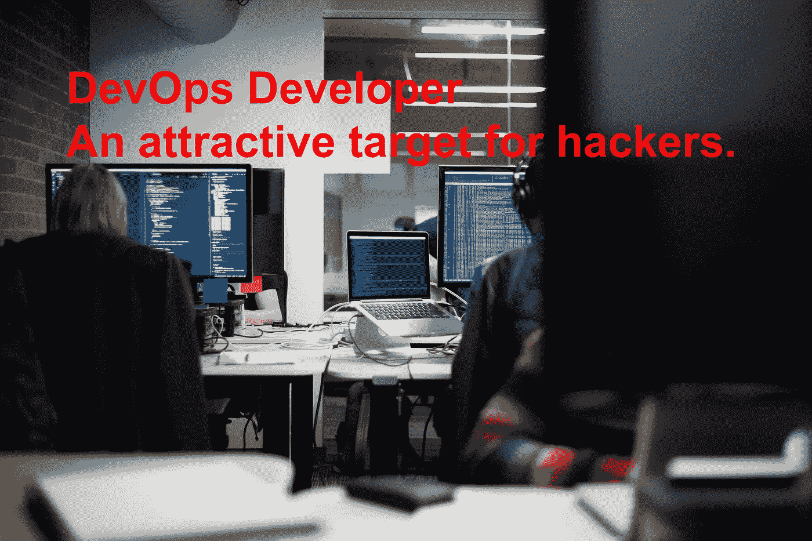
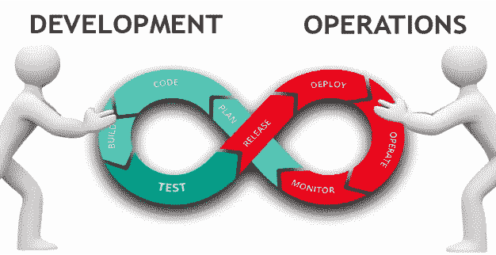
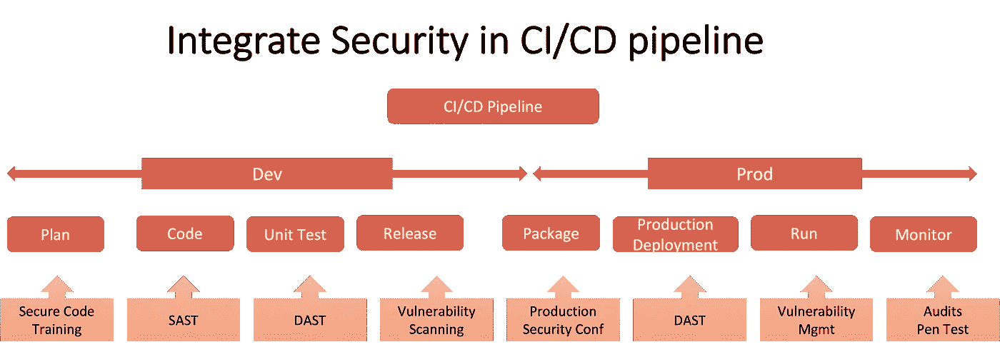
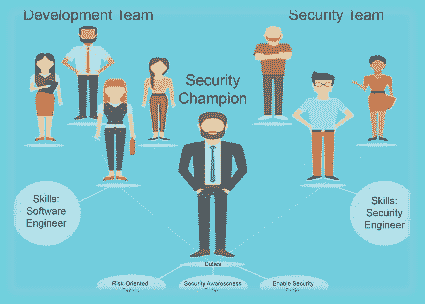

# DevOps 开发者:吸引黑客的目标。

> 原文：<https://medium.com/codex/devops-developer-an-attractive-target-for-hackers-99f80baf0e82?source=collection_archive---------8----------------------->

*原载于 2022 年 1 月 23 日*[*【https://cyberbakery.net】*](https://cyberbakery.net/untitled/)*。*

敏捷软件开发方法在过去十年左右变得流行起来。其中一种方法，DevOps，已经成为全球各行各业最常用的方法之一。然而，对于安全团队来说，DevOps 的流行增加了攻击面，这是不断变化的，需要保护。这篇文章将关注我们是如何走到这一步的，以及为什么 DevOps 开发者成为坏人最喜欢的目标。

在过去的二十年里，公司采用新的经营方式发生了巨大的变化。数字化转型帮助企业创新，为客户带来新产品和服务。然而，由于每个企业都在做同样的事情，上市时间缩短了，企业需要保持创新的速度和规模。DevOps 帮助应用交付满足业务需求。

DevOps 团队通常是业务的一部分，并且总是寻找让他们易受攻击的快速创新。企业喜欢这种灵活性，并且不属于传统技术或 IT 团队。由于 DevOps 团队通常是业务的一部分，他们会满足业务需求，尤其是在像今天这样 COVID19 带来了前所未有的业务挑战的时候。这意味着严格性和传统的开发过程要么没有被正确地遵循，要么在需求和速度的名义下被故意忽略。

公司对速度和创新的需求经常导致团队使用工具和技术来创建新的 DevOps 管道，在这样做的过程中，引入了许多新的威胁媒介，给了黑客他们的目标。黑客非常了解开发人员的心理，他们使用第三方工具和库来缩短开发生命周期。如今，一切都是代码，DevOps 团队被威胁者追逐，他们瞄准存储在 GitHub 等存储库中的云凭证。

同样，源代码，通常是商业 IP(知识产权)，目标是直接访问 IT 基础设施和数据。黑客经常在构建管道中利用过时的第三方库，在代码被更广泛地部署为主要或次要攻击之前注入恶意代码。供应链攻击是这种违规行为的典型例子。最近的太阳风和 Kaseya 攻击是通过在他们的产品中插入恶意代码来执行的。

DevOps 流程的每个阶段都容易受到恶意活动的威胁，导致业务数据丢失，这也可能影响公司的下游客户。

如上所述，由于 DevOps 团队的结构，职责分离经常被忽略，使他们成为业务中有权访问生产和非生产环境的最有特权的用户。因此，如果开发人员的凭据被精心制作的网络钓鱼攻击或其他方式(如机器入侵)破坏，那么不仅源代码面临风险，客户数据也有丢失的风险。

我们经常看到企业要求他们的 DevOps 开发人员有过多的访问权限。他们经常以速度和预期开发人员将来可能需要做他们的工作的名义过度提供系统访问。当然，这提高了开发人员的效率，但是多年来学习和开发的所有关于访问控制的安全原则都付诸东流了。正如帖子中提到的，如果黑客染指这种过度配置的开发人员凭据，就会通过在应用程序中插入恶意代码、泄露源代码、改变安全控制来制造混乱，最普遍的是窃取生产客户数据。

正是由于这个原因，开发人员凭证已经成为黑客的一个有吸引力的目标。因此，组织必须采取足够的措施来保护开发者证书，将其视为“皇冠上的宝石”。

除非业务和安全组织创建一个集成的 DevOps，其中安全性与开发过程固有地集成在一起，否则很难做到这一点。

以下是开始这一旅程的一些建议。

* **最小权限策略:**实施最小权限策略是唯一真正的解决方案，否则您被攻破只是时间问题。传统上，只对最终用户的用户访问进行审查，而不对开发人员的访问进行审查。业务部门必须对开发人员的访问实施用户访问审查，以便访问权限始终与其执行工作的角色相一致。这将有助于减少凭据泄露的风险。

* **增加难度:**为特权用户实施强身份验证。实施多因素身份验证、单点登录和 IP 安全列表实践，以帮助降低开发人员凭据落入黑客手中的风险。

* **代码中没有凭据的位置:**无论是生产环境还是非生产环境，在代码中存储机密都是一个“坏主意”。必须检查代码中存储的秘密，尤其是在生产环境中。AWS Secrets Manager 或 CredStash 等自动化工具可用于管理开发人员凭证管理。

* **自动化开发人员访问管理:**开发人员帐户通常位于使用单点登录或与人力资源系统关联的自动化用户访问配置和取消配置之外。这导致开发人员访问管理不善，无法在角色改变时撤销他们的访问权限或离开公司。

* **左移(自动化、自动化、自动化……):**在 DevOps 管道中嵌入安全流程，以确保安全控制嵌入到开发流程中。寻找机会使这些过程自动化，以尽可能减少人为干预。例如，如果没有经过审查过程，没有任何代码会被合并到主分支中，审查过程会检查一系列安全性测试，包括秘密检测和同行审查。强制执行自动化策略来阻止代码在没有这些测试的情况下被推送。存储库的变化受到严格监控，因此恶意行为者无法绕过安全测试。

* **审核、审核和审核:**确保系统未配备默认凭证。定期审计生产系统中的默认或嵌入凭证，这样凭证就不会留在代码中，帮助黑客大展身手。

* **培训业务和 DevOps 开发人员:**人非圣贤，孰能无过。培训是不可替代的，组织必须花费精力平等地培训他们的开发人员和业务。安全团队必须培养安全冠军和开发团队，以推广和实施良好的安全实践。

重点关注更好地保护 DevOps 环境非常重要。威胁行为者，包括民族国家，将继续寻找新的方法来突破你的防御。如果企业未能保护 DevOps 团队，他们将继续以开发人员为目标，作为获得“皇冠上的宝石”的一种方式。

请启用 JavaScript 来查看

*原载于 2022 年 1 月 23 日 https://cyberbakery.net**的* [*。*](https://cyberbakery.net/untitled/)