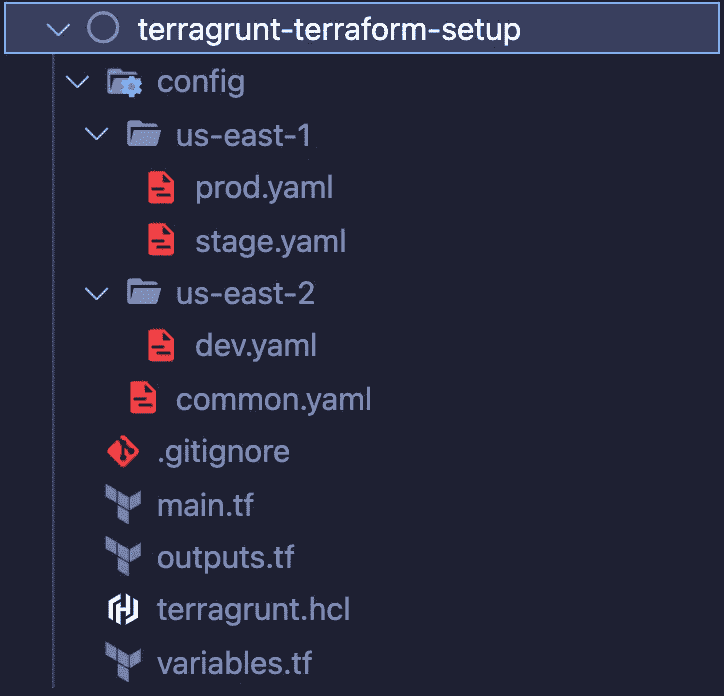

# 使用 Terragrunt 和 Terraform 的 IaC 设置

> 原文：<https://medium.com/codex/devops-iac-setup-using-terragrunt-and-terraform-5d8a54c97724?source=collection_archive---------2----------------------->

T erragrunt 可以让你的 [Terraform 代码保持干燥](https://terragrunt.gruntwork.io/docs/features/keep-your-terraform-code-dry/)。当我尝试它时，我想知道如何以类似的方式利用它，我们可以为每个环境保持*单独的配置文件*，并在构建/规划和部署/应用期间，将变量/参数传递给 Terragrunt CLI。

在本帖中，我将描述我们用来将基础设施变更推向开发、阶段和生产环境的设置。通过这种设置，我们构建了 CI/CD 管道来自动将更改部署到较低的环境中，并手动干预生产推送。我们有许多较小的存储库，按其用途划分，例如 AWS 组织、帐户引导、每个帐户/环境的 IAM 角色定制、安全设置、VPC/网络设置、应用程序特定资源、域/微服务资源等。

# **环境**

*   操作系统:macOS Monterey
*   [Terraenv](https://github.com/aaratn/terraenv) (管理多个版本的 Terragrunt 和 Terraform 的实用程序)
*   [Terragrunt](https://terragrunt.gruntwork.io/docs/getting-started/install/#install-terragrunt) : v0.36.1
*   [地形](https://learn.hashicorp.com/tutorials/terraform/install-cli) : v1.1.5

## 安装步骤

**安装*terra env***

```
brew tap aaratn/terraenv
brew install terraenv
```

**安装 Terraform 和 Terragrunt**

```
#Install
terraenv terraform  install 1.1.5
terraenv terragrunt install 0.36.1#Use installed version
terraenv terraform  use 1.1.5
terraenv terragrunt use 0.36.1
```

**地形设置**

*   AWS 帐户。理想情况下，使用您的主要身份提供者(例如 Azure Active Directory)设置 AWS SSO。
*   设置 AWS 凭证- AWS STS 令牌或 IAM 用户访问/密钥(`~/.aws/credentials`或作为环境变量)
*   地形状态的 S3 桶和 DynamoDB 锁表(对于多区域设置，您可能希望每个区域有单独的桶和 DynamoDB 表)

**验证 AWS 凭证设置**

```
aws sts get-caller-identity{     
   "UserId": "...",
   "Account": "...",
   "Arn": "arn:aws:sts::...:assumed-role/..."
}OR{
    "UserId": "...",
    "Account": "...",
    "Arn": "arn:aws:iam::...:user/username"
}
```

# 目录结构



目录结构

# Terragrunt 配置(terragrunt.hcl)

`terragrunt.hcl`取决于两个环境变量。

`config`:要使用的配置文件名
`region`:要部署的 AWS 区域(配置文件在此目录下查找)

Terragrunt 设置，它根据环境变量集查找配置文件，并传递给 Terraform。此外，通过使用配置中的 app、env 和 region 值来设置 terraform 远程状态路径。

**Terragrunt 生成文件** 排除`.gitignore`中的 Terragrunt 生成文件(`*-generated.tf`)

`_remote-backend-generated.tf`:包含地形状态配置
`_provider-generated.tf`:包含地形提供商配置
`_default-data-generated.tf`:样本数据块，用于查找账户 id、短地区代码(*例如* us-east-1 = > use1)

**注意**我们使用`region`、`app`、`env`为远程状态形成唯一的路径。`{app}/{region}/{env}/terraform.tfstate`

# 地形文件

[常规地形文件](https://www.terraform-best-practices.com/naming)、`main.tf`、`outputs.tf`和`variables.tf`无变化

**variables.tf**

```
#Sample variables.tfvariable "region" { type = string }
variable "app"    { type = string }
variable "env"    { type = string }
variable "tags"   { type = map }# Other variables
variable "num_servers" { type = number }
variable "bucket_prefix" { type = string }
```

**输出. tf**

```
#Sample outputs.tf - shows variables from set config file in outputoutput "example" {
    value = {
        "tags"         : var.tags
        "region"       : local.region
        "num_servers"  : var.num_servers
        "bucket_name"  : "${var.app}-${var.bucket_prefix}-${var.env}-${local.region_short}"
    }
}
```

`main.tf`在我们的例子中是空的，因为我们只是展示了不同配置/环境文件中的变量如何通过 terraform 的设置变得可用。

# 配置文件

`config/common.yaml`包含跨环境通用的配置，如应用程序名称、标签、地形状态桶、锁表和资源的任何其他配置。

```
#config/common.yaml#used in terragrunt.hcl
tf_state_bucket: example-state-bucket
tf_state_bucket_region: us-east-1#app specific common config (app is also used in terragrunt.hcl)
app: exampletags:
    Organization: Example-Org
```

`config/us-east-1/dev.yaml`环境特定文件，用于特定区域(在本例中，用于 us-east-1)。在一个或多个环境中，此配置文件中的值会有所不同。

```
#config/us-east-1/dev.yaml. env is used in terragrunt.hcl as well
env: dev
num_servers: 1
bucket_prefix: mybucket
```

`config/us-east-2/stage.yaml`登台环境的配置文件，适用于美国东部-2 地区。

```
#config/us-east-2/stage.yaml
env: stage
num_servers: 3
bucket_prefix: mybucket
```

`config/us-east-2/prod.yaml`登台环境的配置文件，适用于美国东部-2 地区。

```
#config/us-east-2/prod.yaml
env: prod
num_servers: 6
bucket_prefix: mybucket
```

**注意** `bucket_prefix`在所有配置文件中具有相同的值，因此可以将其移动到`config/common.yaml`中，其他变量值`app`、`region_short`和`env`被组合起来为每个环境创建一个唯一的桶名。

# 构建和部署

现在我们有了 terragrunt 设置，它使用环境变量`config`来选择相应的配置文件，并可选地使用`region`环境变量，默认为`us-east-1`。

**为开发环境构建(地形图)**

```
export config=dev
terragrunt init && terragrunt plan
```

**搭建舞台环境**

```
export config=stage
export region=us-east-2 #stage config is in us-east-2 sub-dir
terragrunt init && terragrunt plan
```

**为开发环境部署(地形应用)**

```
export config=dev
terragrunt init && terragrunt apply
```

**为舞台环境部署(地形应用)**

```
export config=stage
export region=us-east-2 #stage config is in us-east-2 sub-dir
terragrunt init && terragrunt apply
```

作为 CI/CD 管道的一部分，您可以轻松地提出管道步骤，这些步骤需要调整`config`和`region`环境变量，以将您的基础架构作为代码部署到选定的环境和区域。另一种方法可以是 terraform workspace，我们最初从 terragrunt 开始，到目前为止对我们的设置很满意。

如果你喜欢这个故事，请随意关注，这样你就可以在我以后的文章中得到通知。请留下注释/详细信息，说明您如何使用 CI/CD Pipeline 使您的基础架构代码易于管理，以便将相同的代码部署到多个环境和多个区域。

我的其他一些故事你可能会喜欢:

[](/geekculture/how-many-aws-accounts-do-i-need-d54261a0ab04) [## 我需要多少个 AWS 账户？

### 具有多帐户设置的 AWS 基础设施被认为是最佳实践。您在决定 AWS 时应该考虑的方面…

medium.com](/geekculture/how-many-aws-accounts-do-i-need-d54261a0ab04) [](/geekculture/how-many-aws-accounts-do-i-need-part-2-a45de4d89efc) [## 我需要多少个 AWS 账户？—第二部分

### AWS 组织的演变，随着您的业务和需求从概念验证发展到…

medium.com](/geekculture/how-many-aws-accounts-do-i-need-part-2-a45de4d89efc) [](/codex/stop-exposing-bastion-host-over-the-internet-c1d535192562) [## 停止在互联网上暴露堡垒主机

### 云(甚至数据中心)网络架构的最佳实践是隔离您的基础架构资源…

medium.com](/codex/stop-exposing-bastion-host-over-the-internet-c1d535192562)