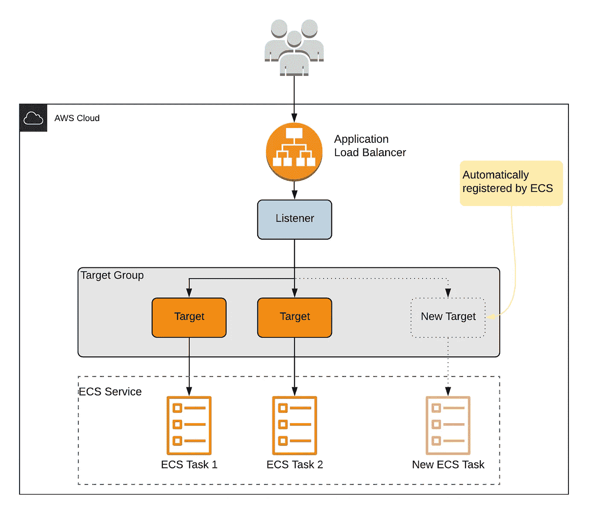

# AWS 中的 DevOps:利用基础设施作为代码，通过 Terraform 和 CodeBuild 将 Golang 应用程序部署到 ECS

> 原文：<https://medium.com/codex/devops-in-aws-utilize-infrastructure-as-code-to-deploy-a-golang-application-to-ecs-with-terraform-85a312bc1a50?source=collection_archive---------12----------------------->

## 特色 AWS 服务:VPC、代码构建、ECR、ECS、IAM、CloudWatch



# 概观

现代软件工程是复杂的。云服务提供易于使用的仪表板和界面来减轻一些痛苦。这种易用性的一个缺点是无法快速复制您创建的资源。例如，如果您想要创建一个完整的环境用于试运行和生产，您实际上需要在浏览器中点击两次相同的屏幕，并对某些参数进行小的更改。

有了 Terraform，我们可以根据需要，用几个命令创建整个应用堆栈。在本文中，我将展示在 AWS 中使用 CI/CD 管道部署 ECS 应用程序是多么容易。在本文的最后，您将拥有一个可以通过 web 访问的 Golang 应用程序，以及作为基础设施的 42 个 AWS 资源。

# 我们将建造什么

首先，这篇文章的源代码可以在[这里](https://github.com/brianfromlife/new-proto)找到。这个库有一个简单的 Golang REST API，支持 Docker 和所有部署我们的基础设施的文件。上图显示了将从该存储库中创建的托管资源。

一个应用程序负载平衡器将在端口 80 上监听 HTTP 请求，然后将该请求转发到一个目标组，该组包含我们每个服务任务的 IP 地址。当我们向服务部署新任务时，它们会自动向目标组注册，以开始接受请求。

我们还将创建一个简单的 CodeBuild 项目，该项目将监听对我们的存储库的主要分支的推送。我们构建步骤的细节可以在***pipeline/deploy . yml***文件中找到。当我们对我们的主分支进行变更时，这个构建项目将会触发:

*   安装 Golang 模块依赖项。
*   登录 AWS ECR，我们稍后可以推送新图像
*   运行所有的单元测试，如果它们失败了，构建项目会提前退出，这样就不会部署不完整的代码
*   根据构建/生产中的 docker 文件构建 docker 映像
*   标记并把我们图像的最新版本推送到 AWS ECR
*   更新 ECS 服务以获取最新的 ECR 映像

# 先决条件

在部署基础设施和应用程序之前，需要注意一些事情，以便一切正常运行。

## 克隆存储库

首先将存储库克隆到您的 Github 帐户，这样当您推送更改时，您的 AWS 资源可以做出相应的响应。一旦完成，在***infra structure/terraform . TF vars***文件中，相应地更新 ***github_owner*** 和 ***github_repo*** 变量。比如 min 分别是***brianfromlife***和 ***new-proto*** 。

## Github 访问令牌

当我们将更改推送到我们的主 GitHub 分支时，它将自动触发 CodeBuild 项目来安装我们的依赖项，运行测试，并部署新代码。为了正常工作，您首先需要生成一个具有正确权限的个人访问令牌。在 Github 中导航到设置，然后开发者设置并生成一个具有 ***repo*** 和 ***admin:repo*** 权限的新令牌。

在***infra structure/terra form . TF vars***文件中，用刚刚生成的变量更新 ***github_token*** 变量。

## AWS CLI 和凭据

首先，确保您安装了 AWS CLI。terraform 项目依赖于在您的机器上本地配置的 AWS CLI 配置文件。如果您不熟悉，请在您的终端中运行以下命令:

```
aws configure --profile XXXXXX
```

例如，如果我想创建一个名为 testing 的概要文件，它将如下所示:


在 AWS 控制台中，创建一个具有管理访问权限的新 IAM 用户，并在配置新配置文件时输入访问密钥 ID 和秘密访问密钥。

然后在***infra structure/terraform . TF vars***文件中，用你选择的名字更新 ***aws-profile*** 变量。

## 将（行星）地球化（以适合人类居住）

最后，确保您的机器上本地安装了 Terraform。

# 配置如何工作

您可以轻松定制一些变量来控制服务及其 AWS 基础设施的功能。在基础设施文件夹中，有一个***terra form . TF vars***文件，包含以下内容:

*   ***name*** —您所称的服务或应用程序，该值用于整个 terraform 文件的命名约定。
*   ***aws-region*** —您要部署基础架构的 aws 区域。
*   ***AWS-profile***—包含创建所有基础架构的凭据的 AWS CLI 配置文件名称。
*   ***环境*** —您的环境的名称，例如“生产”、“暂存”、“测试”等。该值用于整个 terraform 文件的命名约定。
*   ***可用性区域*** —在所选 AWS 区域中使用的可用性区域列表。
*   ***private _ subnets***—面向互联网的子网的 CIDR 块列表。
*   ***public _ subnets***—私有子网的 CIDR 块列表。
*   ***container _ memory***—您希望应用程序的每个实例拥有多少内存。
*   ***container _ port***—应用程序监听的端口。这个 API 监听端口 8888，你可以在 docker 文件和 *api/api.go* 中看到。
*   ***container _ cpu***—您希望应用程序的每个实例拥有多少 CPU。
*   ***health _ check _ path***—您的应用程序上的路由，将用于查看您的服务是否工作，并决定启动新的实例。
*   ***github _ branch***—github 仓库的分支。
*   ***github _ owner***—github 仓库的所有者。
*   ***github _ repo***—仓库名称。
*   ***github _ Token***—用于 Github 和 AWS CodeBuild 之间通信的个人访问令牌。

# 部署应用程序

您的环境现在已经为部署做好了准备。在您的终端中，导航到基础设施文件夹并初始化 terraform 项目。

```
terraform init
```

您应该在终端中看到类似的内容。


您应该会看到一个. terraform 文件夹出现。接下来运行 plan 命令，看看会创建什么。

```
terraform plan -out=tfplan
```

您应该会看到一长串类似 JSON 的对象，描述了所有新的基础设施。

最后，应用地形图创建基础设施。这可能需要 5 分钟。

```
terraform apply tfplan
```

之后，终端应该显示部署确认。


如果您导航到 ECS 控制面板的负载平衡器部分，您应该会看到新的 DNS，我们可以使用它来访问我们的应用程序。负载平衡器命名约定使用名称和环境 terraform 变量。


但是，应用程序还不能工作。如果我们访问那个 URL，我们得到一个 503 错误。


我们需要首先对我们的代码库进行更改，以便我们的 CodeBuild 项目触发并部署新代码到 ECS 服务。

在 ***api/api.go*** 文件中，将/ route 改为返回再见而不是你好。


一旦您将变更推进到您的主分支，您应该会看到 CodeBuild 项目正在进行中。


几分钟后，您应该能够从负载平衡器 DNS 访问您的应用程序了！


# AWS 资源

我将简要描述从这个 Terraform 堆栈中创建的关键组件，这些组件在查看代码时并不明显。

## Nat 网关和弹性 IP

由于我们的后端“服务器”或任务驻留在私有子网中，这意味着它们不能通过互联网公开访问，我们需要从这些子网进行出站互联网访问，以便我们可以访问 AWS 资源并在需要时获得软件更新。

## IAM 角色和策略

IAM 是在 AWS 中操作的基础，它向资源授予执行某些任务的权限。这个项目需要注意以下几点:

*   *CodeBuild* —有两个关键策略附加到 CodeBuild 资源上，***assume _ by _ CodeBuild***with gives***STS:AssumeRole***动作，让 code build 与其他 AWS 服务对话。然后是***AWS _ iam _ policy _ document . codebuild***策略，允许 code build 上传到我们的 ECR 存储库并更新 ECS 服务。
*   *ECS —* 与 CodeBuild 策略类似，我们的 ECS 资源需要***STS:AssumeRole***用于我们的任务定义，以允许 ECS 进行某些内部 AWS 调用，如获取新的 ECR 图像或访问 CloudWatch 日志。

## 代码构建

对于这个特定的代码库，我想指出的一点是，用于运行 buildspec 文件的构建映像被设置为***aws/code build/standard:5.0***，这是 AWS 对 Ubuntu 的说法。测试时，我注意到一些构建映像不支持 Go 模块，而这个支持。

另一件事是环境变量。在***AWS _ code build _ project . main***中，我们设置了***pipeline/deploy . yml***文件中用到的各种环境变量。
还有最后一件事，用于 CodeBuild 的 Github 连接。在 CodeBuild Terraform 文件的末尾，我们将源设置为 Github 存储库，设置凭证以使用我们的个人访问令牌，然后使用 CodeBuild web 钩子来监听主分支上的推送事件。

## 安全组

这个项目有两个主要的安全组:一个用于负载平衡器，另一个用于 ECS 服务。负载平衡器安全组仅允许端口 80 上的流量(HTTP 请求)，而我们的 ECS 服务安全组仅允许来自负载平衡器安全组的流量(所有流量)，实际上就是说您只能通过负载平衡器 DNS 访问这些服务。

# 结论

这个项目是一个反复试验的项目:阅读 Terraform 文档，寻找其他具有类似目标的公共存储库，无数次地建立和破坏基础设施。我故意没有涉及 Terraform 的细节，因为我觉得有大量的教程可以解决这个问题，我还想提供开箱即用的源代码(我发现大多数存储库在当前版本的 Terraform 中都没有),并提供一个机会来搜索 terraform 文件，看看它们是如何连接的。

# 附录:代码库详细信息

本文的目的是用 Terraform 和 AWS 演示 DevOps，但是如果您对某些实践不熟悉，我想简要介绍一些关于代码库的主题。

## 代码组织

像大多数用于 api 开发的后端语言一样，我实现了一个简单的分层过程，以 1)保持处理程序精简，2)使测试更容易。为了满足这两点，我倾向于如下组织逻辑的分离:

*   *处理程序* —处理传入的请求并验证 HTTP 输入，如请求体和查询参数。
*   *服务* —执行大部分业务逻辑。
*   *存储库* —与您选择的数据存储交互的基本逻辑。在这种情况下，它是一个内存数组，但是如果您切换到 MongoDB 或 Postgres，您只需要对存储库文件进行更改，其他功能都是一样的。

## 测试和嘲笑

应用程序中的每一层都需要某种形式的依赖关系。处理程序需要服务，服务需要存储库。每一层依赖关系都耦合到一个接口，因此我们可以模拟依赖关系的底层执行，而不是在单元测试期间实际连接到数据库。

为了模仿，我使用了本地安装在我机器上的[模仿](https://github.com/vektra/mockery)包。在 *makefile* 中，您可以看到 *mockgen* 命令，它为每个依赖项创建模拟包，特别是任务服务和存储库。运行时，*模拟*文件夹将出现在*服务*和*存储库*文件夹中。

# 配置

大多数现代 web 应用程序使用某种形式的外部配置来存储敏感信息，如外部 API 凭证，或者可能是控制某些逻辑功能的标志。在 api/config 包中，我使用了一个基本的系统，它首先检查 JSON 文件的值，如果它们不存在，检查表单，然后作为环境变量。

## 发出命令

项目的根目录是一个名为 *makefile，*的文件，它包含了一个命令列表，这些命令总是让人厌烦。如果您的机器上安装了 Make，您可以运行 *make coverage* 来生成 HTML golang 覆盖率报告，或者如果您对接口进行了更改，可以运行 *make mockgen* 来重新生成您的模拟文件。