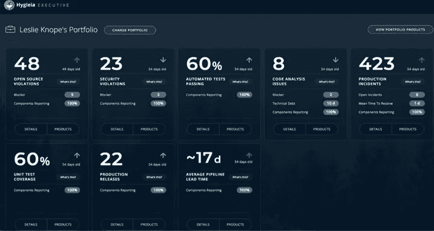

# 使用卫生框架的 DevOps 度量仪表板

> 原文：<https://medium.com/codex/devops-metrics-dashboard-using-hygieia-framework-26b9f4fc97fc?source=collection_archive---------0----------------------->

图像来源—devops.com

如今，大多数企业都在努力应对其应用程序环境的迅猛增长，他们越来越难以在团队、产品和执行层面跟踪和追溯应用程序/产品运营指标。

传统的 DevOps 工具无法在团队/产品/管理层提供 CI/CD(持续集成/持续部署)管道的整合视图。因此，我们需要一个框架，能够在不同的级别提供一个统一的视图。

这就是 Hygieia dashboard 可以提供帮助的地方。

在本文中，我们将尝试介绍 Hygieia DevOps Dashboard，我们为什么需要它们，有哪些潜在的用例，以及它如何帮助我们踏上应用程序现代化之旅。

# 什么是卫生学框架？

Hygieia 是一个可配置的 DevOps 仪表板，它提供了整个应用交付管道的近实时整合视图，并使 DevOps 工程师和高管能够监控代码提交的健康状况，以部署到最终产品中。

Hygieia 出现在三个独立的仪表板中，一个用于工程师，一个用于经理，另一个用于高管，直观地描述了 CI/CD 管道。从本质上讲，Hygieia 本身是一个聚合器，它从团队在其 CI/CD 管道中使用的各种 DevOps 工具中提取数据，使其在仪表板视图中易于消化。

卫生学为以下领域提供了复杂的见解:

*   *DevOps 成熟度:提供全自动 CI/CD 跟踪质量和流水线速度*
*   *风险管理和投资:它将运营指标与发展指标联系起来，提供了对投资领域的全面理解，以改进流程，减少未来不必要的风险*
*   *敏捷环境的持续增强:它量化开发运维指标，以跟踪和提高开发运维成熟度*

# 什么使卫生变得重要？

Hygieia 仪表板使 DevOps 工程师和管理人员能够监控提交到最终产品中部署的代码的健康状况。在这两点之间——从开始(提交)到完成(生产)——仪表板还提供了关于软件操作的整体活力和性能度量的重要信息。

# 卫生执行仪表板

Hygieia 执行仪表板旨在向组织中的高层领导展示产品组合-产品-组件的关系。仪表板上的每个视图都建立了在组合级别显示的指标的细分。Hygieia Executive Dashboard 旨在显示产品组合、产品和组件的信息，定义如下:

*   组合——仪表板上的组合是高级管理人员、他们管理的产品以及每个产品下的组件之间的关系。
*   *产品——投资组合下所有产品或应用程序的列表(由主管管理)。*
*   *组件——与产品相关的所有组件。每个组件都是软件单元，是更大的产品或应用程序的一部分。*

## 执行仪表板—投资组合视图

Hygieia 高管仪表板显示您组织中领导级别的员工姓名，您可以查看自己的投资组合或组织中其他高管的投资组合。投资组合通过考虑投资组合-产品-组件的组合详细描述了所有产品的状态。例如，作为一个投资组合的所有者，您将能够看到您的投资组合的测试覆盖率的数量，或者您所有产品存在的生产事件。

图片鸣谢— hygieia.github.io

图片鸣谢— hygieia.github.io

## 执行仪表板—产品视图—指标详细信息

此屏幕提供了聚合指标值的直观表示，如图表或百分比轮。此外，您可以查看投资组合中所有产品的列表。主管管理的所有应用程序都显示为产品组合下的产品列表。在“产品”屏幕上，您可以查看属于高管投资组合的所有产品。要查看此屏幕，请在“投资组合详细信息”屏幕中单击小组件上的产品。

图片鸣谢— hygieia.github.io

图片鸣谢— hygieia.github.io

# 卫生用品仪表板

产品仪表板—显示产品开发阶段中每个组件的生命周期进度。它在一个插图中显示多个应用程序。在这里，您可以看到对于多个团队来说，一个应用程序从开始(提交)到最终发布(生产)的过程。如下面的屏幕截图所示，您可以查看多个应用程序的代码进度:

图片鸣谢— hygieia.github.io

图片鸣谢— hygieia.github.io

# 卫生小组仪表盘

团队仪表板——提供组件级的度量标准来说明团队可以快速交付软件以达到 DevOps 成熟度。它提供了 DevOps 管道的单一简化视图。它以视觉形式清晰地讲述了构成 CI/CD 管道的所有复杂部分。管道视图展示了软件交付过程中每个组件的生命周期中的代码进展，从最初的开发到最终的产品部署。

图片鸣谢— hygieia.github.io

图片鸣谢— hygieia.github.io

# 卫生仪表板—建筑[T3](http://localhost:3002/pages/csharm33/payer-tech-leadership-academy/blog/hygieia2#hygieia-dashboard---architecture)

下图提供了 Hygieia Dashboard 的高级架构视图:

图片鸣谢— hygieia.github.io

# 结论

在本文中，我们介绍了 Hygieia Dashboard 如何在不同级别简化 DevOps dashboard 的整合。还有几个选项值得探索，比如 Graphite、Keen IO、Librato。

执行仪表板有助于高层领导获得产品组合级别的洞察力，而产品和团队仪表板提供产品和应用程序级别的洞察力。该框架为许多已知的 DevOps 工具提供了许多内置收集器，并且可以根据需要添加自定义收集器。

总的来说，Hygieia 仪表盘简化了近乎实时地查看 CI/CD(持续集成和持续部署)管道的能力，并使 DevOps 工程师和高管能够监控提交给最终产品部署的代码的健康状况。

[卫生|首都一号科技](https://www.capitalone.com/tech/solutions/hygieia/)

**感谢您的阅读！你觉得 Hygieia 仪表盘怎么样？**