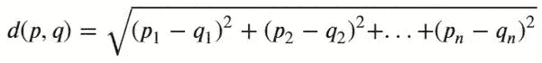
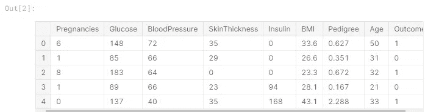
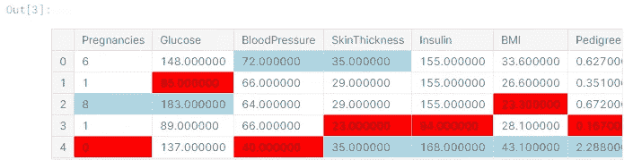
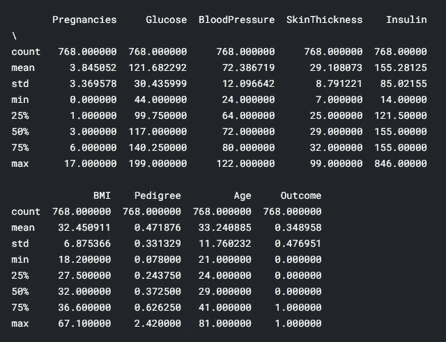
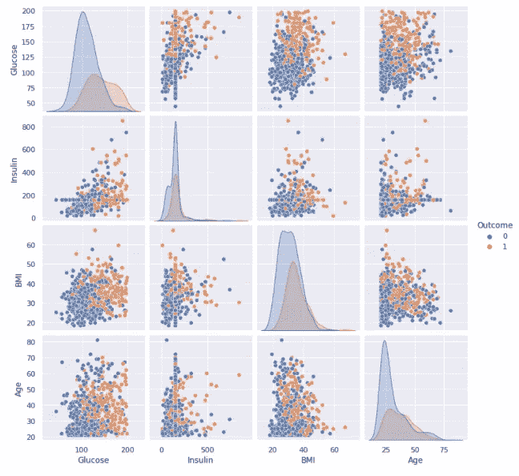
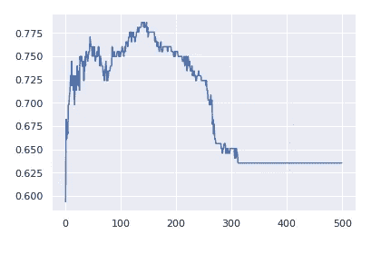

# 基于 KNN 算法的糖尿病预测系统

> 原文：<https://medium.com/codex/diabetes-predication-system-with-knn-algorithm-e040999229f7?source=collection_archive---------1----------------------->


首先，我想处理这个迷你项目，就好像我有一个问题要解决一样，该项目将通过采用 K-最近邻(KNN)预测模型来解决，因此显然这是一个分类模型挑战。在这种情况下，我选择了一个与医疗保健相关的数据集，该数据集与国家糖尿病和消化研究所的糖尿病数据库相关联，我将尝试测试该数据，看一个人是否患有糖尿病。该数据集是从 Kaggle 获得的，ka ggle 是一个基于真实数据和事件提供各种不同数据集的网站。因此，事不宜迟，让我们开始解读数据集，并使用 KNN 和交叉验证模型创建一个预测模型。

**数据集描述:**

我已经从 Kaggle 获得了受试数据集，然而该数据集最初是由国家糖尿病、消化和肾脏疾病研究所提供的。数据集由预测变量和结果组成，其中描述了一个人是否是糖尿病患者。数据集代表来自不同患者的研究列表，其导致糖尿病或非糖尿病的分类。对于本课程，我将使用这些数据，并采用 Knn 算法来测试一些给定的患者数据，看看他们是否属于糖尿病或非糖尿病类别。该数据集中与糖尿病和非糖尿病患者相关的研究列表总数为 768，我们将处理、废弃和清理这些数据，以在我们的 KNN 预测模型中使用它们。
在我们开始使用 Knn 算法研究我们的预测模型之前，我们需要了解一下什么是 KNN 算法。

**KNN 算法**是一种处理相似性的监督机器学习算法。KNN 代表 K-最近邻。这基本上是一种分类算法，它将根据定义的最近邻数量来预测目标变量的类别。它将计算要分类的实例与训练数据集的每个实例之间的距离，然后根据 k 个最近实例的大多数类对实例进行分类。

**Knn 算法中数据点之间的距离**

对于这个项目，默认情况下，库将考虑欧几里德距离来测量数据集中两个数据点或向量之间的距离。

在[1]中:

```
import os
from IPython.display import Image
print("**Euclidean Distance Formula**")
Image(filename="../input/euclidean-distance/euclidean distance.JPG", width= 500, height=200)**Euclidean Distance Formula**
```

Out[1]:



**阅读和探索数据集**

下面，我们首先使用 pandas 语法 **csv_read()** 打开主题数据集，该语法读取数据集并将其转换为结构化的表格数据供我们读取。

在[2]中:

```
*# First let's start with calling all the dependencies for this project* 
import numpy as np 
import pandas as pd
import math
import matplotlib.pyplot as plt
import seaborn as sns 
from sklearn.neighbors import KNeighborsClassifier
from sklearn import metrics
from sklearn.model_selection import cross_val_score
from sklearn.model_selection import KFold
%matplotlib inline location = '../input/diabetes/diabetes.csv'
f = pd.read_csv(location)
data = pd.DataFrame(f)
data.head()
```



**操作和清理我们的数据集**

在本节中，我们将尝试清除数据集的所有零和缺失值(如 NaN ),并用指定列的平均值替换它们。我已决定使用特定数量的色谱柱进行清洗，这些色谱柱如下文所述**[‘葡萄糖’，‘血压’，‘皮肤厚度’，‘胰岛素’，‘身体质量指数’，‘谱系’]**，因为它们是最重要的数据，具有明显的影响，可确定患者是否患有糖尿病。

在[3]中:

```
*#cleaning the dataset  from missing values or zeros*
*#zeros or missing values will be replaced by the mean of that particular column*
*# this practice is the best practie to have a readable and consistent data values*
cols_clean = ['Glucose','BloodPressure','SkinThickness','Insulin','BMI','Pedigree']*# with this function , i dealt with missing values and NaN values* 
for i **in** cols_clean:
    data[i] = data[i].replace(0,np.NaN)
    cols_mean = int(data[i].mean(skipna=True))
    data[i] = data[i].replace(np.NaN, cols_mean)
data1 = data
data1.head().style.highlight_max(color="lightblue").highlight_min(color="red")
```



```
In [4]: *# Let's take a quick statistcal view of the data provided*
print(data1.describe())
```



```
**Plotting the dataset**The diabetes updated dataset is ready for a basic plotting, in order to see how would our data looks like, also plotting at this stage will help me decide which column I will choose to run a K-nearest neighbour (KNN) experiment. For plotting I’ve used **pairplot()** function with the help of Seaborn library , that will give me a range of graph plotting for each group of data presented in the dataset .In [5]:graph = ['Glucose','Insulin','BMI','Age','Outcome']
sns.set()
print(sns.pairplot(data1[graph],hue='Outcome', diag_kind='kde'))<seaborn.axisgrid.PairGrid object at 0x7ff431934610>
```



很明显，我们正在处理一个丰富的多维数据集，其中许多数据点属于所呈现的变量。为了使我们的生活更容易和简单，我们将只选择几个变量来测试我们的模型。

在[6]中:

```
*# for the purpose of simplicity and analysing the most relevent  data , we will select three features of the dataset*
*# Glucose , Insulin and BMI*
q_cols = ['Glucose','Insulin','BMI','Outcome']*# defining variables and features for the dataset for splitting* 
df = data1[q_cols]
print(df.head(2))Glucose  Insulin   BMI  Outcome
0    148.0    155.0  33.6        1
1     85.0    155.0  26.6        0
```

**将数据集分割成训练和测试数据集**

机器学习建模或为机器学习算法准备数据的一个特别重要的部分是将我们的数据集分成训练和测试数据集。

主要是，数据集经历了一个分裂过程，以测试模型，测试过程将确定您的机器学习算法在预测每个测试集和训练集时的准确性，以及在现实世界中的形成方式。然后，我们获取提供的数据，并计算机器学习算法的准确率。理想情况下，你的机器学习算法的准确率越高，你的模型在预测呈现的样本数据时就越好。

在[7]中:

```
*# let's split the data into training and testing datasets*
split = 0.75 *# 75% train and 25% test dataset*
total_len = len(df)
split_df = int(total_len*split)
train, test = df.iloc[:split_df,0:4],df.iloc[split_df:,0:4] 
train_x = train[['Glucose','Insulin','BMI']]
train_y = train['Outcome']
test_x = test[['Glucose','Insulin','BMI']]
test_y = test['Outcome']
```

我们需要运行一个快速语法来查看这些数据是否被正确分割

在[8]中:

```
a = len(train_x) 
b = len(test_x)
print(' Training data =',a,'**\n**','Testing data =',b,'**\n**','Total data length = ',a+b)Training data = 576 
 Testing data = 192 
 Total data length =  768
```

处理样本测试数据和训练数据相似性的 Knn 算法。这种相似性由 K 值确定，这些值由最接近样本数据点的数据定义。在这种情况下，我们将使用两个距离度量来获得测试数据和训练数据集之间的最近距离。本练习中选择的距离度量是欧几里德距离，但是，我使用了一个内置的库来对模型运行这些操作，我使用的库是 scikit-learn 库。

**KNN 功能**

我编写了一个函数来填充对拆分数据采用 KNN 算法的结果。该函数将运行 KNN 算法 K 次，并以线图的形式填充结果。

在[9]中:

```
*# let's test it using KNN  classifier with a loop to cover as much n-neightbors as possible* 
def knn(x_train, y_train, x_test, y_test,n):
    n_range = range(1, n)
    results = []
    for n **in** n_range:
        knn = KNeighborsClassifier(n_neighbors=n)
        knn.fit(x_train, y_train)
        *#Predict the response for test dataset*
        predict_y = knn.predict(x_test)
        accuracy = metrics.accuracy_score(y_test, predict_y)
        *#matrix = confusion_matrix(y_test,predict_y)*
        *#seaborn_matrix = sns.heatmap(matrix, annot = True, cmap="Blues",cbar=True)*
        results.append(accuracy)
    return results
```

在这个练习中，我将测试并绘制 K 值从 1 到 500 的模型，看看我们在哪里有最好的整体 K 值

在[10]中:

```
n= 500
output = knn(train_x,train_y,test_x,test_y,n)
n_range = range(1, n)
plt.plot(n_range, output)
```

Out[10]:

```
[<matplotlib.lines.Line2D at 0x7ff42c0bf450>]
```



有机会试验从 **n=1 到 n=500** 的不同 K，从图中我可以得出结论，可以优化该模型的最佳 K 在 **100 到 200** 之间，提供 77%的准确性。

这个数据集的理想 k 值应该是 **120** 左右。