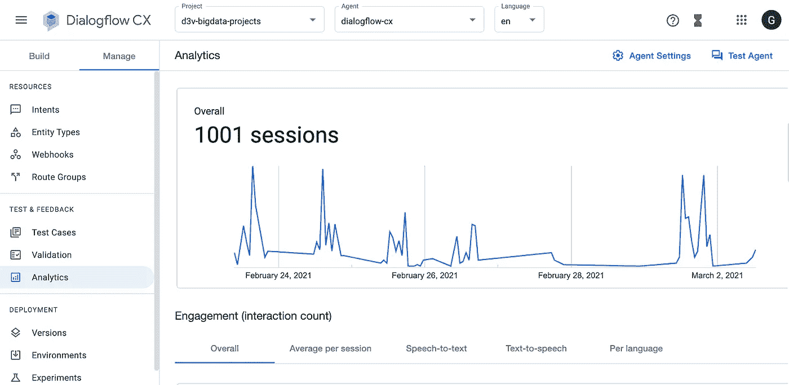

# CX 的对话流成本优化

> 原文：<https://medium.com/codex/dialogflow-cost-optimization-for-cx-db5a68fbf496?source=collection_archive---------4----------------------->

## 如何降低谷歌对话流 CX 对话代理成本的指南

作者图片

聊天机器人帮助企业改善他们的客户体验，而不必雇用额外的支持人员来分散可以通过全天候聊天机器人轻松获得的信息，而是专注于有效地利用他们的支持人员来处理需要人工关注的重要客户问题或不满。

更重要的是，在行业领先的人工智能和 NLP 驱动的解决方案 [DialogFlow 的帮助下，能够提供自然生活般对话体验的聊天机器人今天变得更加容易获得。](https://www.d3vtech.com/services/bigdata/dialogflow)dialog flow 的初始版本 Dialogflow Essentials 自 2017 年发布以来一直是游戏的名称。有了代理、意图、上下文、事件、参数等基础构件和一系列强大的功能，人们可以设计一个智能聊天机器人来满足他们自己的领域和业务需求。2020 年 9 月，DialogFlow 的强大版本 Dialogflow CX 发布，提供了一种设计和开发对话聊天机器人的新方法。

在本文中，我们将讨论您在通过 Dialogflow CX 部署聊天机器人时可能会遇到的常见开发人员陷阱，以及您可以采用来显著降低成本的解决方案。

# 什么是对话流 CX？和 Diagflow ES 有什么不同？

[DialogFlow CX](https://www.d3vtech.com/insights/ultimate-guide-to-google-dialogflow-2021) 为设计对话聊天机器人带来了一股新鲜空气。新的 UI 仪表板和用于设计聊天机器人代理的特性(如流程和页面)不仅使开发功能丰富和复杂的聊天机器人变得更加容易，而且使聊天机器人代理可视化为一个由点连接而成的图形。Dialogflow CX 还提供现成的预建代理，以迎合流行的行业领域和用例。这些可以按原样使用，也可以根据自己独特的业务需求进行修改。Dialogflow CX 是设计复杂聊天解决方案的理想选择，而 DialogFlow ES 更适合简单的聊天机器人用例。

与 Dialogflow ES 相比，DialogFlow CX 要贵一些——这是意料之中的，因为你还可以获得更强大的功能。然而，开发人员，尤其是从 CX 迁移过来的开发人员，往往从一开始就低估了成本优化的重要性，只是在云支出显著增加之后才注意到这一点。这意味着，当从 ES 迁移到 Dialogflow CX 时，特别注意资源使用和快速反应是非常重要的。否则，不仅在聊天机器人解决方案投入生产时，而且在开发和测试聊天机器人时，您都可能不得不支付昂贵的费用。

# 我们在使用 CX 设计聊天机器人时遇到的开发陷阱

在 D3V，我们一直在为自己的公司构建和部署聊天机器人解决方案。最近，在对我们的网站进行更改时，做出了一个决定——我们将把我们的聊天机器人解决方案从 Dialogflow ES 迁移到 Dialogflow CX(可以在我们位于 www.d3vtech.com[的网站上找到，网站右下角有橙色的 Dialogflow 聊天机器人图标)。](http://www.d3vtech.com)

当我们用 Dialogflow CX 集成来构建和测试我们的聊天机器人时，我们注意到我们的[谷歌云平台](https://www.d3vtech.com/google-cloud) (GCP)成本飙升。我们在开发的早期就意识到了这一变化，这要归功于我们的 DevOps 工程团队通过集成将警报直接发送到我们的 Slack 通道，实现了程序化预算通知的自动化。

从 Dialogflow ES 迁移到 CX 时，最常见的陷阱之一是没有花时间去了解这两种服务中不同的定价和计费结构。因为 Dialogflow ES 比 Dialogflow CX 便宜，并且不会占用我们在 GCP 的大部分开支，所以我们没有立即注意到账单的变化。由于这个原因，我们平均每天创建 100 个 DialogFlow CX 会话，总计每天至少 20 美元。这可能看起来是一个相对“小”的成本增加，但随着时间的推移，它会很快复合，并成为您总云支出的一大块。

例如，下面是两个不太理想的设计选择的例子，当开发者没有完全理解 Dialogflow CX 的定价结构时，他们往往会做出这些选择:

*   通过为从聊天机器人应用程序向 Dialogflow CX 发出的每个请求发送新的会话 id，异常地创建新的会话
*   即使用户选择不使用网站上的聊天机器人，只要网站页面被加载，就用 Dialogflow CX 创建新的会话。例如，平均来说，我们的网站每天有大约 100 个不同的用户流量，这意味着每天创建大约 100 个会话，这将为 Dialogflow CX 每天至少花费 20 美元。

# 了解文本聊天会话的 Dialogflow CX 定价。

我们已经提到 Dialogflow ES 和 CX 之间的价格差异经常让开发者感到惊讶。然而，这并不是说谷歌不清楚这种差异，它是清楚的。但是有一些与价格相关的细微差别，大多数开发人员只有在他们已经迁移到 CX 并且他们的云支出开始上升时才意识到。让我们快速浏览一下这些内容。

**首先，**每个对 Dialogflow CX 的请求都应该有一个会话 ID，因为对话的上下文是围绕这个会话 ID 的。在对话流 CX 中，发送新会话 ID 的任何请求都被视为新会话。根据 Dialogflow CX 网站上文本对话的定价指南，100 次对话的费用为 20 美元。

**其次，**一个会话最多可以有 40 个对 Dialogflow CX 的请求。这意味着第 41 个请求，即使是相同的会话 ID(为前 40 个请求发送的)，也将被计为 Dialogflow 的另一个会话。

**第三，**从最后一次请求开始，会话保持活动状态长达 30 分钟。例如，对于给定的会话 ID，如果最初仅向 Dialogflow 发出了 3 个请求，并且在最初 3 个请求 45 分钟后发出了第 4 个请求，则第 4 个请求将计入新会话。

***注:*** *请查看* [*定价指南*](https://cloud.google.com/dialogflow/pricing#cx-agent) *了解有关限额、文本和语音聊天会话的最新信息 CX 定价*

# 优化对话流 CX 的最佳实践

当从 Dialogflow ES 迁移到 CX 时，开发人员可能会发现很难根据 CX 的价格结构调整他们的工作流程。也就是说，这是可以做到的。我们收集了一些最有效的最佳实践，开发人员可以采用这些实践在 Dialogflow 中构建强大的聊天机器人代理，而不会倾家荡产:

1.  只有当用户打算通过点击聊天机器人图标来使用聊天机器人时，才允许聊天机器人创建与 Dialogflow CX 的会话。
2.  将用户与会话 ID 相关联。根据您的偏好，您可以选择将会话 ID 保存在浏览器的本地存储或会话存储中。并对该用户向 Dialogflow CX 发出的每个请求使用相同的会话 ID。将会话 ID 与用户相关联还将为您提供从用户聊天数据中获取分析信息的弹药，例如，您可以确定用户中最流行的对话话题是什么。
3.  关联每个聊天机器人用户的会话 ID 还允许我们收集关于聊天机器人的指标。例如，在 D3V，我们开发了一个管道，将信息传输到 BigQuery，并在 Data Studio 上创建了一个分析仪表板，以获得关于我们聊天机器人使用情况的宝贵见解。
4.  向聊天机器人添加新功能，例如与谷歌日历或 Slack 通知等的集成，总是需要频繁的测试，从测试更新和重新测试这些更新。在这种情况下，最好用环境变量来控制开发或测试环境的 sessionID。这样可以确保为开发环境维护单个会话 ID，并最大限度地利用对话流 CX 的会话约束来获得最大值。
5.  最后，设置有关正在使用的 GCP 服务的成本的警报将有助于您尽早发现支出中的异常和峰值，您可以做出决策来减少过度供应的资源，并在支出失控之前采取措施来优化 GCP 服务的利用率。

一般来说，通知提醒有助于密切关注 GCP 服务的使用成本，尤其是当您使用新服务并担心成本过高时。它已经成为我们组织中的一个重要工具，在这里我们每天都可以加快和减慢各种 GCP 服务。

为了正确看待这些最佳实践的重要性，在 D3V，我们设法将 Dialogflow CX 的开支减少了大约 90%。

# 正在总结…

对话流 CX 提供了强大的功能和控制聊天代理在一个可接受的价格增加。但与此同时，在开发早期缺乏对定价结构和成本的关注会导致很难发现开发陷阱。虽然开发人员可以对 ES 更加宽容，不会看到他们的云支出有任何重大变化，但他们不能对 CX 做同样的事情，因为它可能不那么宽容。

幸运的是，在开发 Dialogflow 聊天机器人的过程中，这些缺陷可以在早期得到解决。在本文中，我们探讨了 Dialogflow CX 文本会话的定价和最佳实践，可以采用这些最佳实践来尽早发现这些缺陷，并确保在不牺牲任何功能的情况下为您的 Dialogflow CX 提供成本更优化的生产设置。

所有这些都可以通过聘请内部专家、承包商、顾问或通过不同方法培训你的团队来实现，比如这类技术文章或[免费 GCP 研讨会。](https://www.d3vtech.com/workshops/smb-on-gcp)

*最初发表于*[T5【https://www.d3vtech.com】](https://www.d3vtech.com/insights/dialogflow-cost-optimization-for-cx)*。*