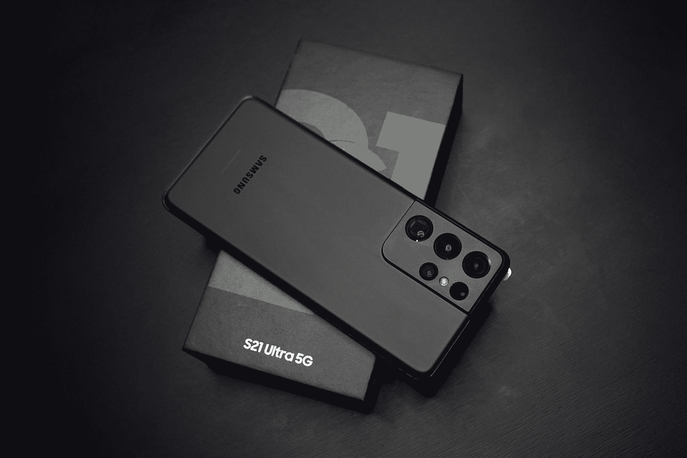
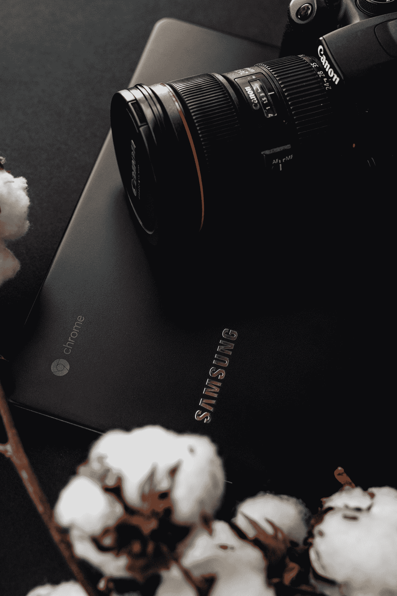
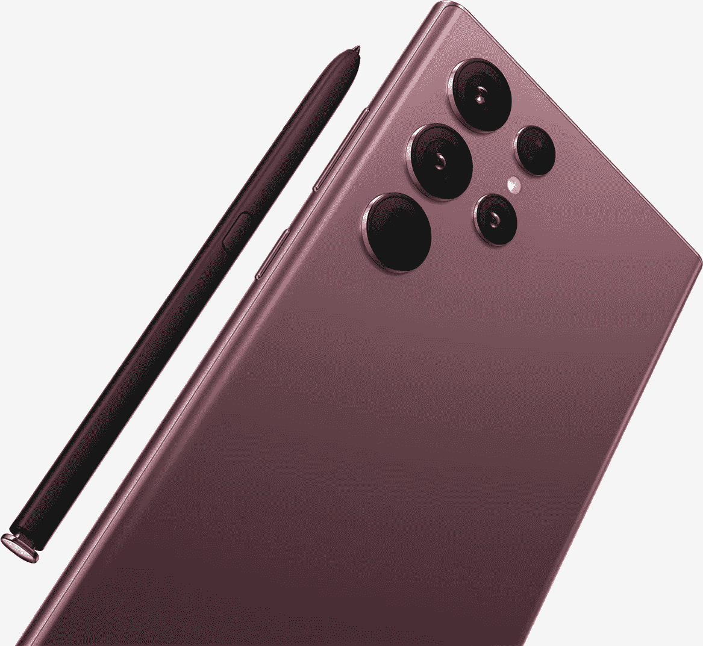
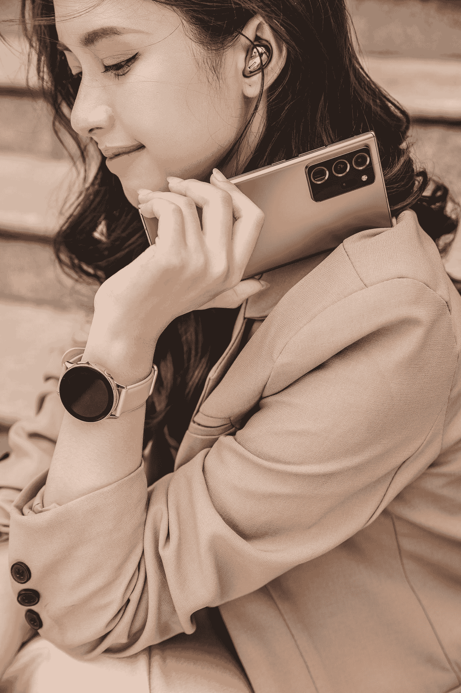

# 三星刚刚打败苹果了吗

> 原文：<https://medium.com/codex/did-samsung-just-beat-apple-90e94299692f?source=collection_archive---------1----------------------->

# 两全其美！

今年**三星**融合了**三星 Note 系列**和他们的 **Note 系列**创造了 **S22 Ultra、**而跨界的第一个好处就是 **S-pen！**

note 系列是**三星**试图制造一款**生产力**手机，它本质上是一款**超手机**但是用笔，当然，它有它的优点和缺点，但是对于**三星**来说继续拆分这两个实体是没有意义的。

S-pen**已经经历了相当大的规格升级，旧笔的延迟为 9 毫秒，新笔的延迟为 2.2 毫秒，接近现实生活中的钢笔/铅笔。**

照片由 [Anh Nhat](https://unsplash.com/@anhnhat1205?utm_source=medium&utm_medium=referral) 在 [Unsplash](https://unsplash.com?utm_source=medium&utm_medium=referral) 上拍摄

这要归功于自虐者不仅知道笔在哪里，还能预测它会在哪里！

# 照相机

现在，我知道这可能看起来不那么漂亮，但这是你自己的主观选择，正如你所看到的，没有摄像头碰撞。

不管是他们忘记添加(只是开玩笑)还是他们用完了相机的设计，我不认为这和真正的相机有什么不同

当谈到相机时，有很多功能，自动 FPS(手机根据光线条件决定最佳帧速率)或**自动取景(手机根据帧中的人数缩小)，但这种模式使用数字变焦**，这将根据它需要变焦的距离来破坏你的质量。

最终，从整体来看，这些都是一次性的生物，第二天你就会忘记。

照片由[内森·杜姆劳](https://unsplash.com/@nate_dumlao?utm_source=medium&utm_medium=referral)在 [Unsplash](https://unsplash.com?utm_source=medium&utm_medium=referral) 上拍摄

虽然功能可能会在一定程度上失败，但实际的相机是值得一看的。主摄像头有一个**“58%宽的光学图像滞留功能”**，因此，即使你在拍摄孩子时感到紧张，它也会尽可能保持平滑。

虽然百万像素数量仍然相同，但每个像素都扩大了 1.23 倍，相当于为最终用户提供了更高质量的体验。

哦，在我忘记之前，为了配合令人敬畏的新传感器，有一个全新的面向专业用户的**相机应用**，它以 0.00 美元的低价提供了惊人的多功能性！

这些 **Pro 的功能**，比如我们都喜欢的夜间模式，正在被应用到第三方应用上，比如 **Instagram。**

新的**芯片组(Exynos 2200)** 允许手机在你按下按钮时拍摄两张照片，然后组合图像以提高质量。

# 电池

虽然电池的大小与去年相同，采用了 **5000 毫安的电池，**这款手机可以使用更长时间，这要归功于一些小的效率升级，例如:

*   能够在不需要的时候让 wifi 进入睡眠状态
*   最大充电功率从 **25W** 增加到 **45W**

# 表演

**三星 Exynos 2200** 与 **AMD** 合作制造，拥有与**PS5**相同的图形架构，但具有讽刺意味的是，三星为这款手机打出的口号是**“游戏时间结束了”**🤨

但这些重大承诺将在今年晚些时候推出更大的更新，增强手机的性能，但这一功能还不是应该回头的东西。

照片由 [Taan Huyn](https://unsplash.com/@taanhuyn?utm_source=medium&utm_medium=referral) 在 [Unsplash](https://unsplash.com?utm_source=medium&utm_medium=referral) 上拍摄

# 记忆

基本款手机的内存为 8GB，比去年少了 12GB，他们说新的虚拟内存功能可以在需要时将一些物理存储重新分配到临时内存中。

但去年的手机比今年的基础型号有更多的内存，也将得到这个更新，所以你今年得到的更多更少！