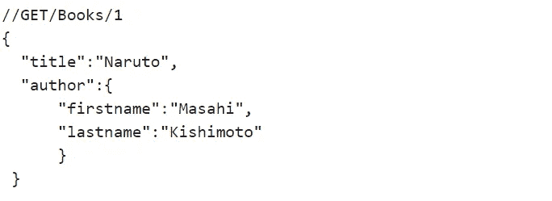
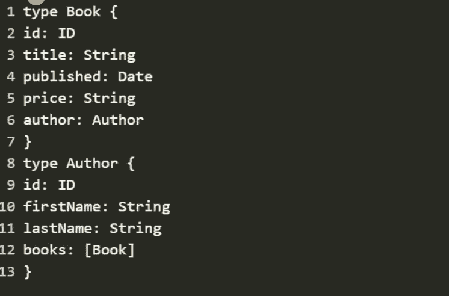
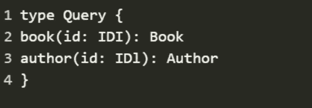
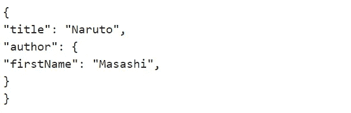

# GraphQL 和 REST 的区别

> 原文：<https://medium.com/codex/difference-between-graphql-and-rest-e3b0ded30382?source=collection_archive---------11----------------------->

## [法典](http://medium.com/codex)

您是否曾经开发过 REST APIs 和端点，它们提供了超出要求的东西，最终降低了您的应用程序的速度。2012 年，脸书的开发人员提出了一个解决方案，他们开发了一个开源应用程序 GraphQL。它作为一种为 API 设计的查询语言。所以让我们直接开始吧。我们将确定 API 的一些属性，然后讨论 GraphQL 和 REST 如何处理它们。

# REST API

在 REST API 中，您的代码被定向到特定的端点或 URL。收到请求后，URL 或端点控制向您发布的数据。您可以通过在 URL 中添加某些选项或参数来简化和组织返回给您的数据。

在标准 API 请求中，数据以 JSON 或 JavaScript 对象的形式返回，其中包含大量数据。所以它看起来像这样:

然而，当前的 REST API 有两个主要挑战，描述如下:

1.  关于 REST 的第一个问题。这指的是提供超出要求的东西。本质上，并非所有交付的数据都对您的请求有用。
2.  第二个挑战是抓取。这是指不适合您的目的的绘图数据。这迫使您再次运行查询。

# GraphQL

GraphQL 的核心是一种从客户端应用程序查询数据库的语言。在后端，GraphQL 向 API 指定如何将数据呈现给客户端。

GraphQL 服务器为客户机提供了预定义的模式——可以从服务器请求的数据模型。换句话说，模式在定义如何访问数据时，充当了客户机和服务器之间的中间地带。看起来像这样:

请注意，我们已经描述了可用数据的种类，但是这个描述并没有告诉您如何从客户端获取这些对象。这是 REST 和 GraphQL 的一个核心区别——特定资源的描述与检索它的方式无关。

为了能够实际访问某本书或某个作者，我们需要在模式中创建一个查询类型:

现在，我们可以发送一个类似于上面 REST 请求的请求，但是这次使用 GraphQL:

我们可以立即看到 GraphQL 与 REST 的一些不同之处，尽管两者都可以通过 URL 请求，并且都可以返回相同形状的 JSON 响应。

首先，我们可以看到带有 GraphQL 查询的 URL 指定了我们请求的资源以及我们关心的字段。此外，不是服务器作者为我们决定需要包含相关的作者资源，而是 API 的消费者决定。

但最重要的是，资源的身份，书籍和作者的概念，并不与获取它们的方式相联系。我们可以通过许多不同类型的查询，用不同的字段集检索同一本书。

# 结论

GraphQL APIs 可能是令人兴奋的新技术，但是在做出这样的架构决策之前理解权衡是很重要的。一些 API，比如那些只有很少实体和跨实体关系的 API，比如分析 API，可能不适合 GraphQL。而具有许多不同域对象的应用程序，如电子商务，其中有商品、用户、订单、支付等等，可能能够更多地利用 GraphQL。