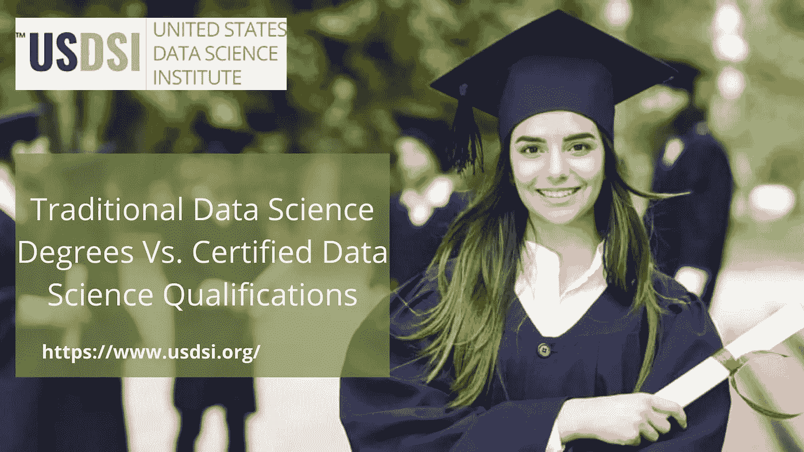
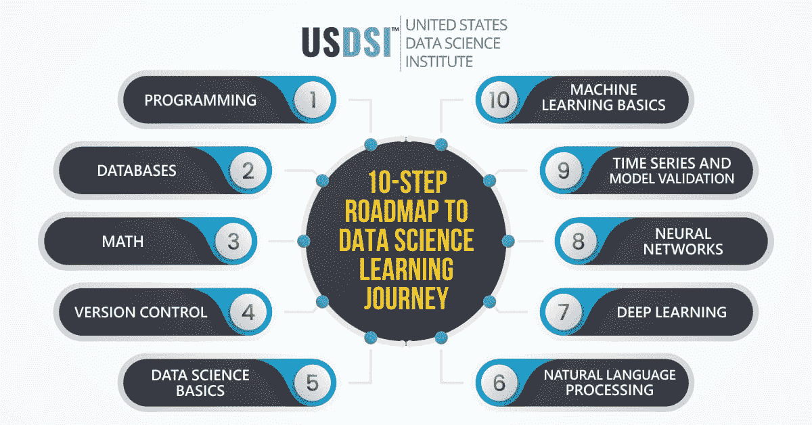
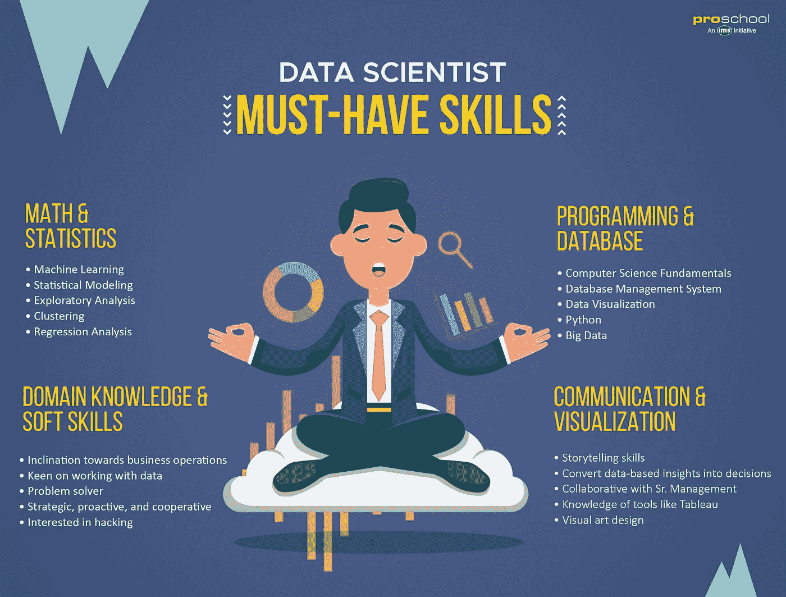

# 传统数据科学学位与认证数据科学资格之间的差异

> 原文：<https://medium.com/codex/difference-between-traditional-data-science-degrees-vs-certified-data-science-qualifications-f8354a477761?source=collection_archive---------6----------------------->

在当今的大多数趋势行业中，最常见的应用领域之一是学习和分析与数据科学相关的产品和业务。然而，当谈到传统的数据科学学位和新设计的认证数据科学证书时，有相当大的差异。而传统的学位主要集中在教授学生如何提取数据，以便根据组织的需要创建简单的可视化、预测或操纵数据。

后者确保将研究艺术添加到传统的数据科学领域。与传统的数据科学学位相比，它在数据科学领域提供了更广泛的范围，包括提出新的功能或方法来更快地检索和分析数据。与传统的数据科学家相比，他们对数据科学以及不同方法的实际工作方式有着更深更广的了解。

# 1.关注的领域是什么-

传统的数据科学学位侧重于教授学生数据挖掘。它是一种数据科学的方法，用于提取原始数据，并在此基础上建立关系，以便根据组织的需要。

[**认证数据科学认证**](https://www.usdsi.org/data-science-certifications) 例如**USDSI**提供的认证不仅专注于教授学生之前提到的主题，还传授研究新算法的知识。与软件开发领域非常相似，学习一些有助于数据排序的算法非常重要。但是，您选择什么算法不仅取决于数据的排列方式，还需要考虑时间复杂性，这也发生在数据科学领域。因此，熟悉所有不同的算法总是很重要的。

传统的数据科学课程只专注于教授候选人数据的一个方面，只有在您创建完全基于优惠券、需求和业务分析的可视化时，这些方面才会派上用场。

经过认证的**数据科学认证**，如 IBM 数据科学认证所提供的认证，确保候选人能够进行研究，并提出新的应用程序。之所以这样做，是因为在数据科学领域仍有大量应用未被发现。当成功开发并受到好评时，这些应用将在数据科学领域变得越来越有用。

传统的**数据科学课程**向考生传授时间序列预测技术。时间序列预测基本上是一种利用历史数据预测数据的方法。它用于找出不同类型数据之间的数学关系。

认证数据科学认证，如 **Coursera certifications** 提供的认证，教导他们的候选人如何通过优化基于数学的函数来使传统算法更快。事实上，在学习和利用数据科学时，任何人都不能低估数学和统计学的重要性。因此，为了处理快速实现方法，非常需要掌握数学函数，而不是使用传统应用的数学函数。

传统的数据科学课程教授学生有关 [**数据科学技能**](https://www.usdsi.org/content/resources/factsheets/data-science-factsheet.pdf) 如清理和数据转换。当涉及到数据库的管理时，存储大量的数据对于读取和分析来说都是非常繁忙的。因此，数据清理是一种专注于从数据库中去除噪声的技术。通过这样做，很容易分析数据，从而给出相应的数据转换范围。

认证数据科学认证教他们的学生如何提出做出准确预测的新方法。即使在使用了多种算法之后，发现所做的预测仍然不准确也不是非常罕见的情况。这是因为 need 数据结果通常缺乏季节性和趋势性。因此，认证数据科学认证的重点是教他们的学生如何创造新的方法来进行预测！

# 2.为什么您必须选择认证数据科学认证课程-

可悲的现实是，尽管数据科学领域是行业中最有前途的领域之一，但全球大多数年轻人的思想尚未更新到足以适应计算机科学领域快速转变的变化。例如，在最近的 Covid 19 疫情情景中，大量在非技术领域工作的人失去了工作，因为大多数企业在那段时间都很不景气。然而，没有一个 [**数据科学专业人士**](https://www.usdsi.org/) 不得不面对这种情况，并且能够在家工作来维持自己。据预测，在不久的将来，数据科学和应用数据科学领域的工作岗位将会出现巨大的增长。

你会发现网上提供了大量的数据科学认证。然而，为了很好地掌握这门学科并进入最大的跨国公司之一，你需要确保你只参加最好的数据科学认证课程。这一类别包括 [**USDSI 认证**](https://www.usdsi.org/data-science-certifications) 、IBM 数据科学认证、Coursera 认证等等。考虑到您的需求、行业相关性以及国际有效性，您将能够选择这些组织提供的最适合的自定进度数据科学认证课程。

# 一锤定音

人们可以通过参加认证数据科学认证课程来获得数据科学领域的工作，该课程为候选人准备了他们需要了解的关于该领域的一切！

# 感谢阅读！

我希望这些资源和文章对您的数据科学之旅有所帮助。:)