# 不同的皇家早餐(见 Git #7)

> 原文：<https://medium.com/codex/different-royal-breakfasts-meet-git-7-1ecc9fb77ff?source=collection_archive---------8----------------------->

## 如何检查已提交的内容以及提交的时间

罗斯·芬登在 [Unsplash](https://unsplash.com?utm_source=medium&utm_medium=referral) 上的照片

# 介绍

变化是推动一切进步的东西。如果没有变化，我们会坚持吃普通的三明治，但现在我们有一份相当不错的早餐。

因为变化是如此重要，今天我们来看看皇家早餐是如何随着时间演变的。为此，我们将使用`git log`、`git diff`和`git show`。

# 显示已提交的内容和时间

## 检查特定提交的详细信息

回想一下，我们的历史中有三次提交，我们想用**检查第一次提交的细节(** `**1033ca3**` **)** 。

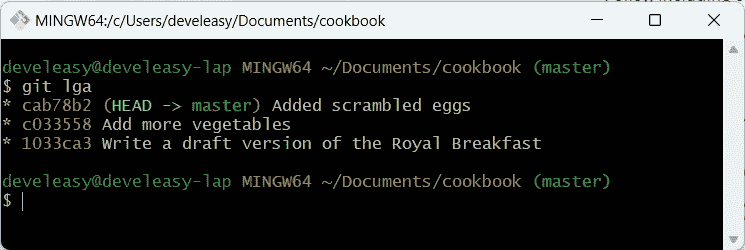

我们的方法是一系列的三次提交

要获得关于该提交的更多信息，请键入`git log 1033ca3`，或者更短的`git log 1033`，前提是您可以唯一地标识该提交。如果您想显示所有提交，只需使用`git log`，无需指定提交的校验和。

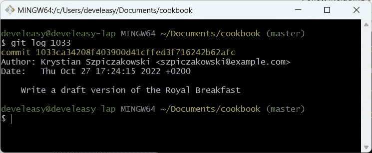

使用 git log 在 git 历史中显示单个条目

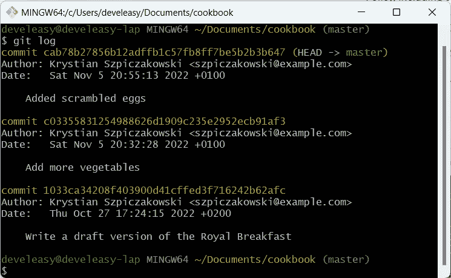

使用 git 日志显示历史记录中的所有提交

如您所见，这并没有给出食谱中的确切变化。要了解提交`1033ca3`引入了哪些变化，请使用`git show 1033ca3`。

除了元数据，比如作者和提交日期，您还可以看到在`royal_breakfast.txt`配方中所做的所有修改。

一般来说，`git show <commit_sha>`给出了在一个特定提交中，**相对于其父提交**发生了什么变化的细节。但是，Git 存储库中的第一次提交有点特殊，因为它没有父提交！

如何知道哪个提交是另一个提交的父提交？为了更好地查看存储库中的历史，并查看提交之间的关系，我建议您在 Git 中创建`git lga`别名。我在这里描述了所需的步骤。

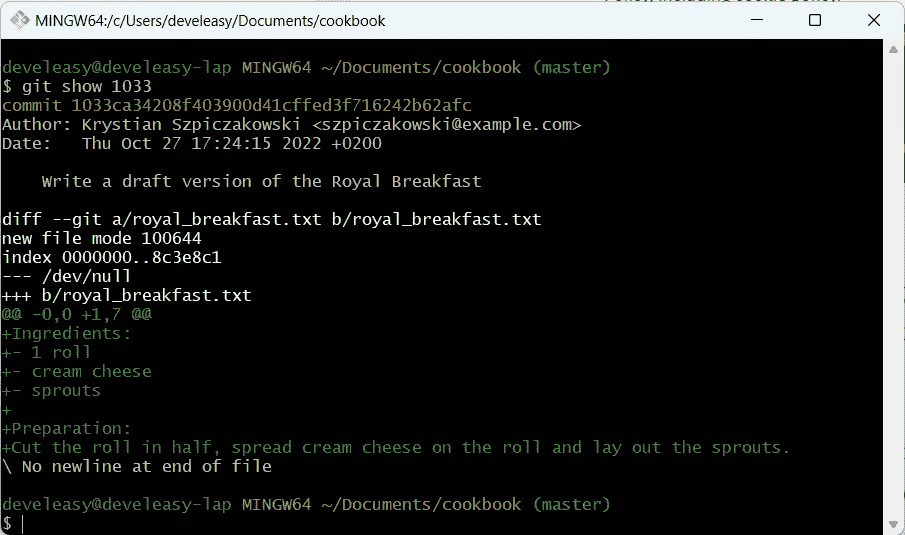

使用 git show 显示文件中的确切变化

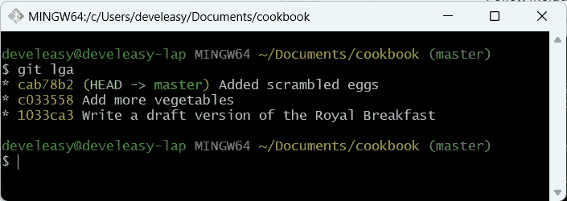

使用 git lga，您可以很容易地弄清楚历史是什么样子的

## 检查两种早餐的区别

如果您想知道一组更广泛的提交之间有什么不同，可以使用`git diff from_revision..to_revision`，例如`git diff 1033..cab78`。在这个特殊的例子中，Git 将显示由`c033`和`cab78`引入的变化。

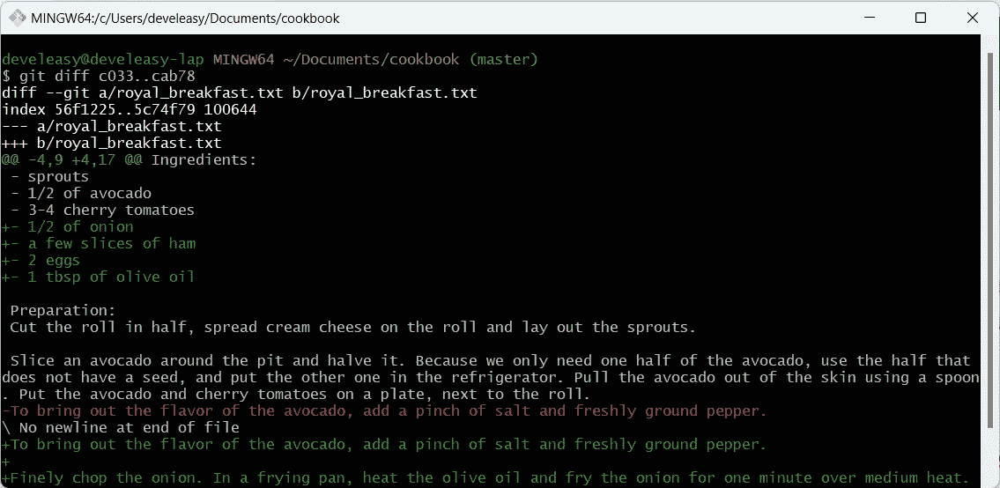

git diff 允许您一次检查更大范围的提交

# 在提交下一个更改之前显示差异

众所周知的`git diff`命令不仅可以让您查看已经提交的快照的历史，还可以帮助您找到

*   自上次提交以来发生了什么变化(例如，您是否用自己喜欢的文本编辑器修改了配方)
*   什么*是要提交的*(当您修改配方时，您已经进行了更改，但尚未提交)

## 自上次提交以来发生了什么变化？

要解决这个问题，您可以使用两个命令:

*   `git status`告诉你哪些文件被修改了
*   `git diff`提供更详细的信息，并显示被跟踪文件中究竟发生了什么变化

关于使用`git diff`，有一点很重要。如果你有一个很长的文本行，并且你只改变了其中的几个单词，git diff 可能会产生非常混乱的输出，就像下面的截图一样。

乍一看，好像我在`royal_breakfast.txt`内变化很大。事实上，我只改变了一个词。输出看起来就像它看起来的那样，因为默认情况下`git diff`检测被修改的整行。为了更好地了解我真正修改了什么，我使用了`git diff --word-diff`，它只突出显示被修改的单词。该命令的输出显示在下一个屏幕截图中。

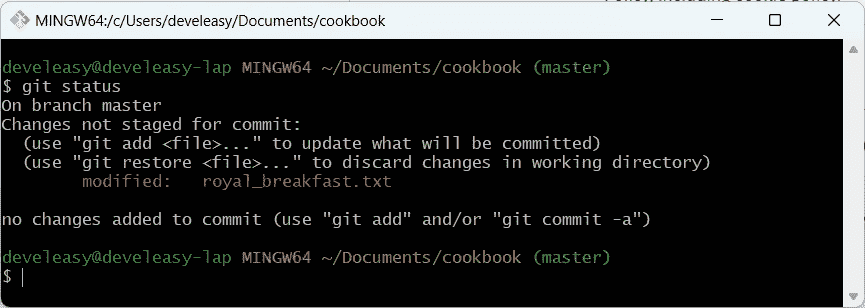

git 状态显示修改文件的名称

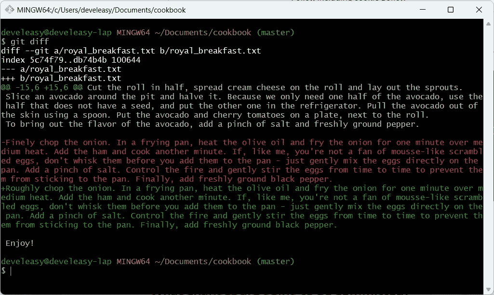

git diff 只是显示已经更改的整行

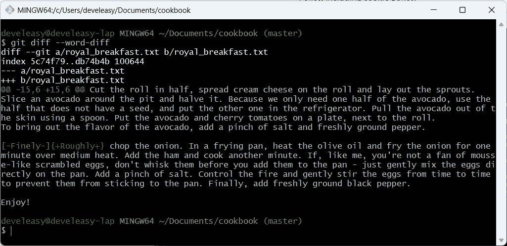

使用 git diff 和“word-diff”标志，以便在一行中只突出显示修改过的单词。

## 将提交哪些更改？

如果您为下一次提交准备了更改，git status 应该产生如下所示的输出。

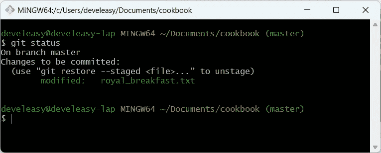

暂存文件用绿色标记

有意思的是，`git diff`没有显示任何变化。是因为`git diff`对比的是没有登台的工作目录。`royal_breakfast.txt`已经登台，所以使用`git diff --cached`代替。

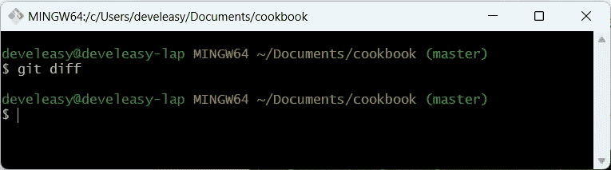

git diff 不会显示分阶段进行的更改

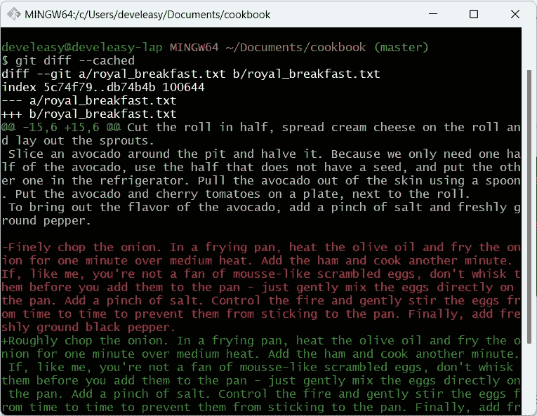

使用 git diff 和“cached”标志来显示暂存的更改

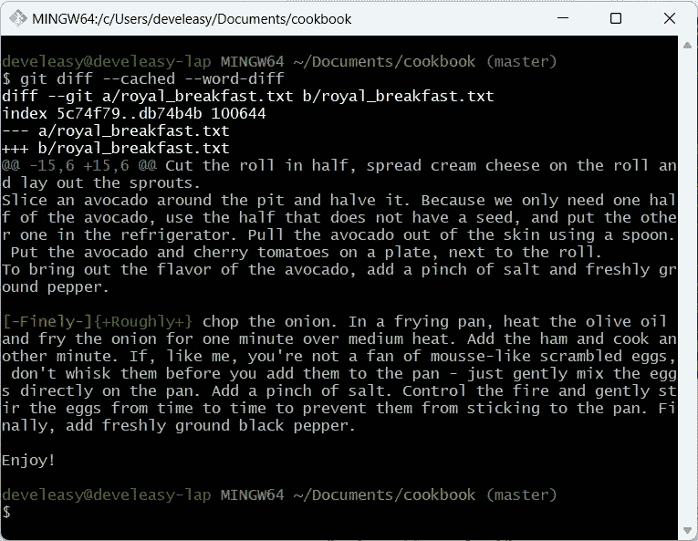

使用“word-diff”标志仅显示已更改的单词

在某些情况下，Git 显示的信息可能看起来更加混乱。也就是说，如果您键入`git status`，Git 可以告诉您相同的文件是

*   已修改但未暂存(用红色标记)
*   已修改和暂存(用绿色标记)

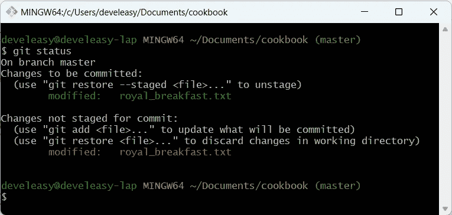

文件可以转移，也可以不转移

这仅仅意味着，您已经修改了一个文件并对其进行了暂存。后来，您决定在同一个文件中引入另一个更改，而不再次将该文件添加到临时区域。

如果我输入`git diff --word-diff`，输出显示我在文本中添加了*“chop chop”*，这种变化不是阶段性的，因为我使用了不带“cached”标志的命令。

另一方面，如果我键入`git diff --cached --word-diff`，生成的输出显示单词*“精细”*已被替换为*“粗略”*。

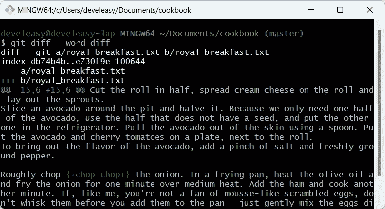

尚未上演的变革

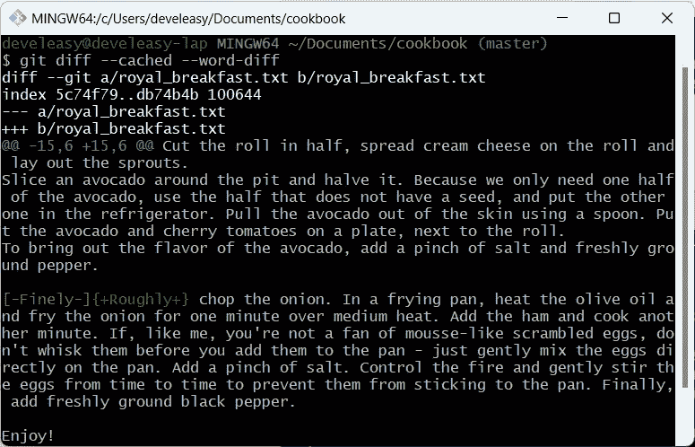

一场已经上演的变革

如果我提交文件，我的新提交将只包含从*【精细】*到*【粗略】*的变化。那么，让我们看看我的假设是否正确。

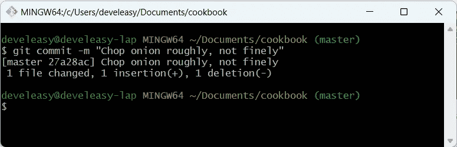

已创建一个包含部分更改的新提交

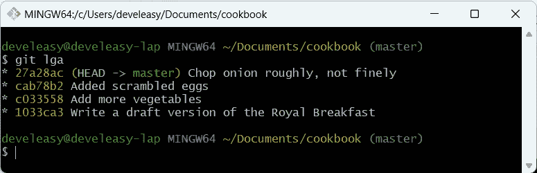

新提交出现在 git 历史中

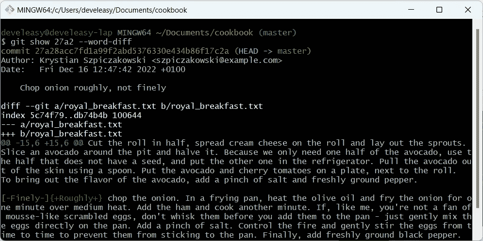

“git show”命令表示新提交仅包含部分更改

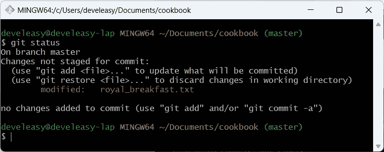

未暂存的变更仍可在工作目录中使用

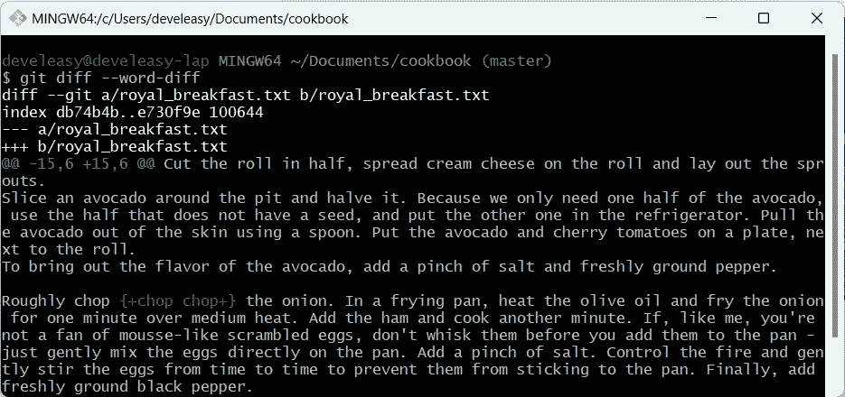

“git diff”命令确认更改已经就绪

# 后续步骤

我真的想粗略地切洋葱吗？不，我没有。那么，如何让早餐再次成为皇家美食呢？

在下一篇文章中，我将向您展示如何根据上下文以几种方式恢复不需要的更改。

敬请期待！

# 参考

[1]王南钧·什皮查科夫斯基，*皇家早餐的历史(满足 Git # 6)*[https://medium . com/codex/The-History-of-The-The-Royal-Breakfast-Meet-6-B1 A8 a2 b 521 ba](/codex/the-history-of-the-royal-breakfast-meet-git-6-b1a8a2b521ba)