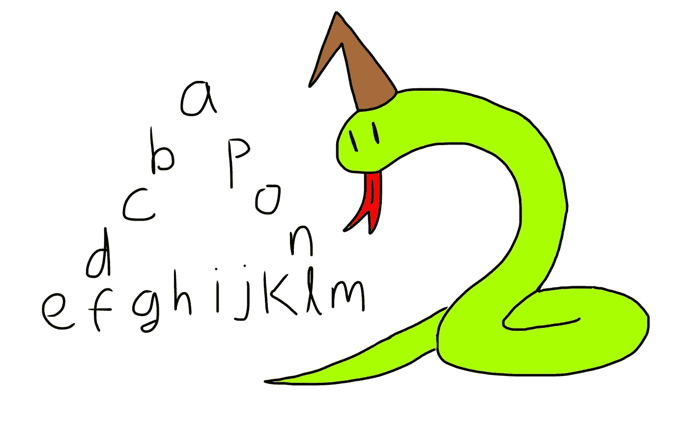

# 困难的 Python 问题 3 —字母的空心三角形

> 原文：<https://medium.com/codex/difficult-python-question-3-hollow-triangle-of-letters-68fe88ee866c?source=collection_archive---------5----------------------->

编写一个接受字符串的函数，并打印以下空心三角形图案。如果没有足够的字符来组成一个完美的三角形，只需使用`*`字符来代替它们。

## string = "abcdefghijkl "(长度=12)

在这里，这根弦可以自己形成一个完美的三角形