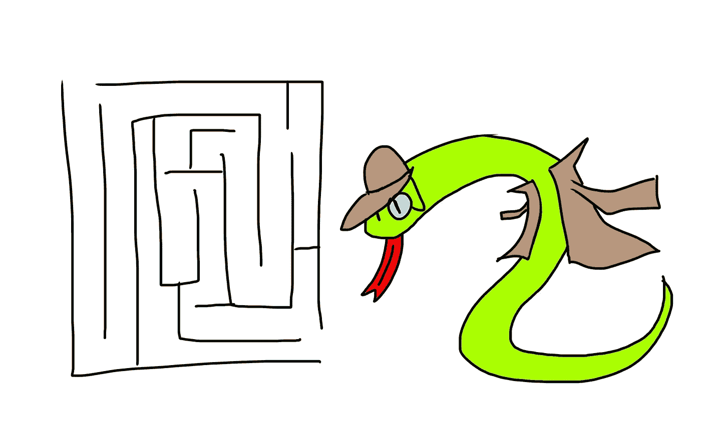

# Python 难题 4-检查迷宫是否可解

> 原文：<https://medium.com/codex/difficult-python-question-4-checking-if-maze-is-solvable-129be109bd84?source=collection_archive---------10----------------------->



给你一个代表迷宫的二维列表:

```
maze = [
    ["S", "#", "-", "-", "-"],
    ["-", "#", "-", "#", "-"],
    ["-", "#", "-", "#", "-"],
    ["-", "#", "-", "#", "-"],
    ["-", "-", "-", "#", "-"],
    ["#", "-", "-", "#", "X"]
]
```

一些规则:

*   `S`代表玩家的起点