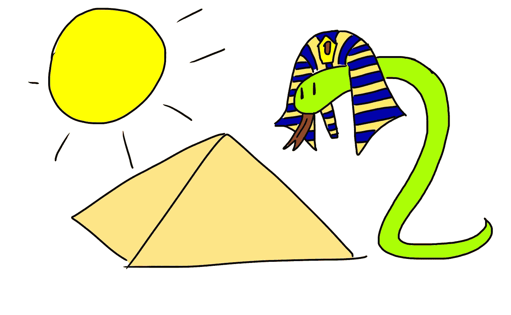

# 一个花了我几天时间解决的 Python 问题 1 —字母金字塔

> 原文：<https://medium.com/codex/difficult-python-test-question-1-pyramid-of-letters-cbf296bf8a5f?source=collection_archive---------9----------------------->

我之前写了一篇文章，里面有 7 个很难的测试问题，然后又写了一篇文章，里面有答案，我意识到这个结构是多么的混乱。所以我在这里，重组并保留了一篇文章中的一个问题，这样我就有足够的空间来恰当地解释这个问题和解决方案。