# 使用神经网络的数字分类器

> 原文：<https://medium.com/codex/digit-classifier-using-neural-networks-ad17749a8f00?source=collection_archive---------7----------------------->


来源:https://www.behance.net/gallery/81929059/Neural-Network

嘿，在这篇文章中，我将向你展示如何用 Python 构建一个初学者友好的神经网络框架。这段代码的主要目的是帮助新手学习神经网络的基础知识。我们将使用神经网络来识别手写数字。神经网络将能够表示形成非线性假设的复杂模型。如果这对你没有意义，不要担心，这篇文章会帮助你理解。如果你对神经网络不熟悉，请阅读我之前的帖子，了解神经网络的基本思想。( [***点击这里***](/codex/what-are-neural-networks-3a0965e2ebfb) 导航到我之前的帖子。)

## 模型表示

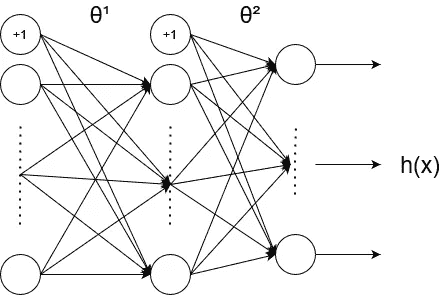

来源:作者

我们的神经网络如上图所示。它有 3 层→输入层、隐藏层和输出层。由于我们正在处理图片，我们的神经网络无法接受图像作为输入；相反，我们必须提供来自图像的像素作为输入(**注意:**图像是由像素组成的)。为了确保所有图片的大小相同，我们将把它们缩放到 20x20 像素。通过将它们展开成 1D 阵列，它给了我们 400D 向量，该向量将作为我们的神经网络的输入层单元(不包括总是输出+1 的额外偏置单元)。

让我们导入所需的模块并加载数据集，

```
import numpy as np
import pandas as pd
import matplotlib.pyplot as plt
from scipy.io import loadmat
import matplotlib.image as img
```

```
mat = loadmat('ex4data1.mat')
X = mat['X']
y = mat['y']
X.shape, y.shape
```

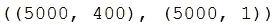

x 形，y 形

让我们通过下面的命令来可视化我们的数据集，

```
fig, axis = plt.subplots(10, 10, figsize=(8, 8))
for i in range(10):
    for j in range(10):
        axis[i, j].imshow(
            X[np.random.randint(0, 5001), :].reshape(20, 20, order='F'), cmap='gray')
        axis[i, j].axis('off')
```

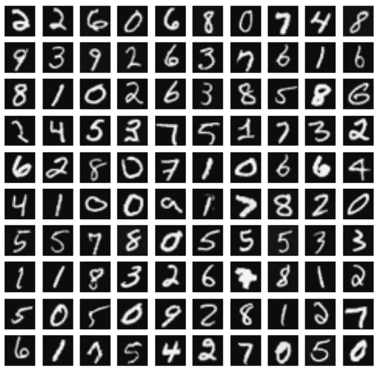

来自数据集的示例

## 乙状结肠的

我们在之前的帖子中已经对此进行了更多的讨论。所以，我就不解释了。基本上，sigmoid 是一个激活函数，它接受一个实值输入，并将其压缩到 0 到 1 之间。

```
def sigmoid(z):
    return 1/(1+np.exp(-z))
```

## 正向传播和成本函数

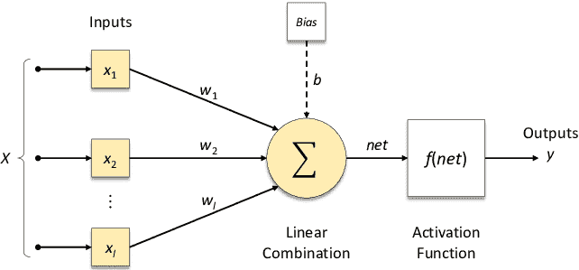

来源:[来自 Researchgate 的安东尼奥·拉斐尔·萨比努·帕梅赞](https://www.researchgate.net/profile/Antonio-Parmezan)

上图是神经网络中一层的前向传播。正向传播的公式如下:

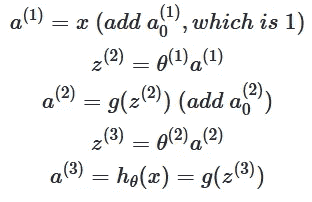

三层神经网络的前向传播

我们将 x(输入)设为 a，然后将 a 乘以θ(即上图中所示的权重 w)并添加偏差(即 b 或θ₀),最后我们将 a 和θ的点积发送到激活函数(在我们的情况下为 sigmoid 函数)。对输入层中的所有 400 个值和隐藏层中的所有值重复这一过程。为了找到好的参数，使用下面的成本函数:

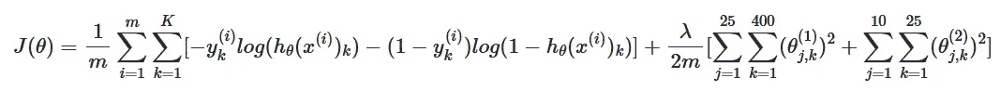

价值函数

这里，成本函数看起来类似于逻辑回归的成本函数，但具有额外的正则化项，这有助于提高我们算法的准确性。这个成本函数帮助我们学习好的参数。

## 反向传播

反向传播是用于改变*权重*和*偏差*的技术，以便神经网络的输出变得更加准确。在前向传播中，我们从左向右移动，但在反向传播中，我们从右向左移动。让我们考虑简单的神经网络:

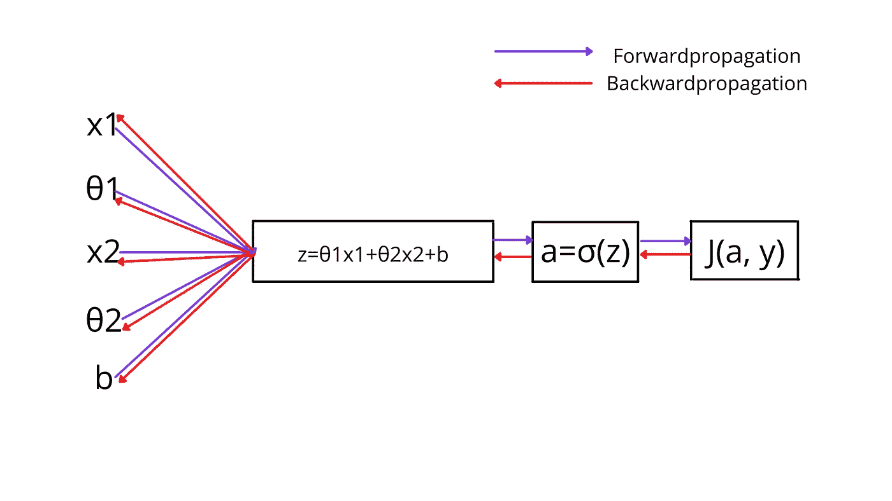

来源:作者

反向传播就是对正向函数从右求导。如果下面的推导对你来说没有意义，不要担心，它肯定是好的，下面的推导是为那些熟悉微积分的人准备的。

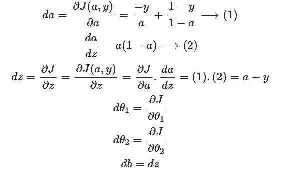

来源:作者

**Sigmoid gradient** 对于计算 a(1-a)的 Sigmoid 的梯度是一个有用的函数。我们的神经网络的反向传播公式是:

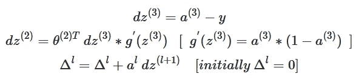

来源:作者

```
def costFunction(nn_params, X, y, input_layer_size, hidden_layer_size, num_labels, Lambda):

    Theta1 = nn_params[:((input_layer_size+1) * hidden_layer_size)].reshape(hidden_layer_size, input_layer_size+1)
    Theta2 = nn_params[((input_layer_size+1) * hidden_layer_size):].reshape(num_labels, hidden_layer_size+1)

    #Feedforward and Cost Function
    m = X.shape[0]
    X = np.column_stack((np.ones((m ,1)), X)) #5000 x 401
    a2 = sigmoid(X@Theta1.T) #5000 x 25
    a2 = np.hstack((np.ones((m, 1)), a2)) #5000 x 26
    a3 = sigmoid(a2@Theta2.T) #5000 x 10

    y_matrix = np.zeros((m, num_labels)) #5000 x 10
    for i in range(1, num_labels+1):
        y_matrix[:, i-1][:, np.newaxis] = np.where(y==i, 1, 0)

    J = np.sum(np.sum( -y_matrix * np.log(a3) - (1 - y_matrix) * np.log(1 - a3) ))  
    reg = Lambda/(2*m) * (np.sum(Theta1[:, 1:]**2) + np.sum(Theta2[:, 1:]**2))

    J = (1/m) * J
    reg_J = J + reg

    grad1 = np.zeros((Theta1.shape))
    grad2 = np.zeros((Theta2.shape))

    for i in range(m):
        xi = X[i, :] #1 x 401
        a2i = a2[i, :] #1 x 26
        a3i = a3[i, :] #1 x 10

        d3 = a3i - y_matrix[i, :]
        d2 = (Theta2.T @ d3.T) * sigmoidGradient(np.hstack((1, xi @ Theta1.T)))

        grad1 = grad1 + d2[1:][:, np.newaxis] @ xi[:, np.newaxis].T
        grad2 = grad2 + d3.T[:, np.newaxis] @ a2i[:, np.newaxis].T

    grad1 = 1/m * grad1
    grad2 = 1/m * grad2     
    grad1_reg = grad1 + Lambda/m * np.hstack((np.zeros((Theta1.shape[0], 1)), Theta1[:, 1:]))
    grad2_reg = grad2 + Lambda/m * np.hstack((np.zeros((Theta2.shape[0], 1)), Theta2[:, 1:]))

    return J, grad1, grad2, reg_J, grad1_reg, grad2_reginput_layer_size = 400
hidden_layer_size = 25
num_labels = 10

nn_params = np.append(Theta1.flatten(), Theta2.flatten())
J, reg_J = costFunction(nn_params, X, y, input_layer_size, hidden_layer_size, num_labels, 1)[0:4:3]

print(f"Cost at parameters(non-regularized): {J}\nCost at parameters(Regularized): {reg_J}")
```

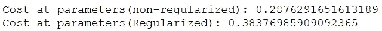

## 随机初始化

在神经网络中，我们不应该将θ初始化为零，这使得我们的神经网络对称(即，每个单元检测相同的特征)，当我们将输入乘以θ(为零)时，我们将总是得到零作为输出。因此，为了打破对称性(即，每个单元应该检测不同的特征，如边缘、水平线等。，)我们随机初始化θ。随机初始化的一个有效策略是在 range[-ϵᵢₙᵢₜ,ϵᵢₙᵢₜ](where ϵᵢₙᵢₜ=0.12).中均匀地随机选择θ值

```
def randomInitailization(L_in, L_out):
    epi = np.sqrt(6)/np.sqrt(L_in+L_out)
    W = np.random.rand(L_out, L_in+1) * 2*epi - epi
    return W initial_Theta1 = randomInitailization(input_layer_size, hidden_layer_size)
initial_Theta2 = randomInitailization(hidden_layer_size, num_labels)
initial_nn_params = np.append(initial_Theta1.flatten(), initial_Theta2.flatten())
```

## 梯度下降

由于我们要学习θ₁和θ₂，梯度下降算法将与之前的略有不同。

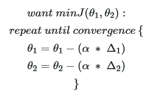

来源:作者

```
def gradientDescent(initial_nn_params, X, y, input_layer_size, hidden_layer_size, num_labels, alpha, num_iters, Lambda):

    Theta1 = initial_nn_params[:((input_layer_size+1) * hidden_layer_size)].reshape(hidden_layer_size, input_layer_size+1)
    Theta2 = initial_nn_params[((input_layer_size+1) * hidden_layer_size):].reshape(num_labels, hidden_layer_size+1)

    m = len(y)
    J_history = []

    for i in range(num_iters):
        nn_params = np.append(Theta1.flatten(), Theta2.flatten())
        cost, grad1, grad2 = costFunction(nn_params, X, y, input_layer_size, hidden_layer_size, num_labels, Lambda)[3:]
        Theta1 = Theta1 - (alpha * grad1)
        Theta2 = Theta2 - (alpha * grad2)
        J_history.append(cost)
    nn_params_final = np.append(Theta1.flatten(), Theta2.flatten())

    return nn_params_final, J_historynn_params, J_history = gradientDescent(initial_nn_params, X, y, input_layer_size, hidden_layer_size, num_labels, 0.8, 800, 1)
Theta1 = nn_params[:((input_layer_size+1) * hidden_layer_size)].reshape(hidden_layer_size, input_layer_size+1)
Theta2 = nn_params[((input_layer_size+1) * hidden_layer_size):].reshape(num_labels, hidden_layer_size+1)
```

## 预言

我们可以通过一次正向传播得到预测。

```
def predict(Theta1, Theta2, X):
    m = X.shape[0]
    X = np.hstack((np.ones((m, 1)), X))
    a2 = sigmoid(X @ Theta1.T)
    a2 = np.hstack((np.ones((m, 1)), a2))
    a3 = sigmoid(a2 @ Theta2.T)
    return np.argmax(a3, axis=1)+1pred = predict(Theta1, Theta2, X)
print(f"Accuracy = {np.mean(pred[:, np.newaxis]==y) * 100}%")
```

它会显示 95%左右的准确率。对手写数字进行分类是有好处的。

# 结论

今天，我们看到了神经网络的内幕以及它实际上是如何工作的。然后用 python 的 numpy，pandas 和 matplotlib 从头开始创建。数据集和最终代码上传到 github。

点击这里查看[神经网络。](https://github.com/jagajith23/Andrew-Ng-s-Machine-Learning-in-Python/tree/gh-pages/Neural%20Networks)

# 如果你喜欢这篇文章，那么看看我在这个系列中的其他文章

## 1.[什么是机器学习？](/@jagajith23/what-is-machine-learning-daeac9a2ceca)

## 2.[机器学习有哪些类型？](/codex/what-are-the-types-of-machine-learning-53360b7db8b4)

## 3.[一元线性回归](/codex/linear-regression-on-single-variable-f35e6a73dab6)

## 4.[多元线性回归](/codex/linear-regression-on-multiple-variables-1893e4d940b1)

## 5.[逻辑回归](/codex/logistic-regression-eee2fd028ffd)

## 6.[什么是神经网络？](/@jagajith23/what-are-neural-networks-3a0965e2ebfb)

## 7.[利用 K 均值聚类进行图像压缩](/@jagajith23/image-compression-with-k-means-clustering-48e989055729)

## 8.[使用 PCA 对人脸进行降维](/@jagajith23/dimensionality-reduction-on-face-using-pca-e3fec3bb4cee)

## 9.[使用异常检测来检测网络上的故障服务器](https://jagajith23.medium.com/detect-failing-servers-on-a-network-using-anomaly-detection-1c447bc8a46a)

# 最后做的事

*如果你喜欢我的文章，鼓掌👏接下来是⚡neuralistic⚡和*媒体宣传这篇文章是有帮助的，这样其他人也可以阅读。*我是 Jagajith，我会在下一集里抓住你。*