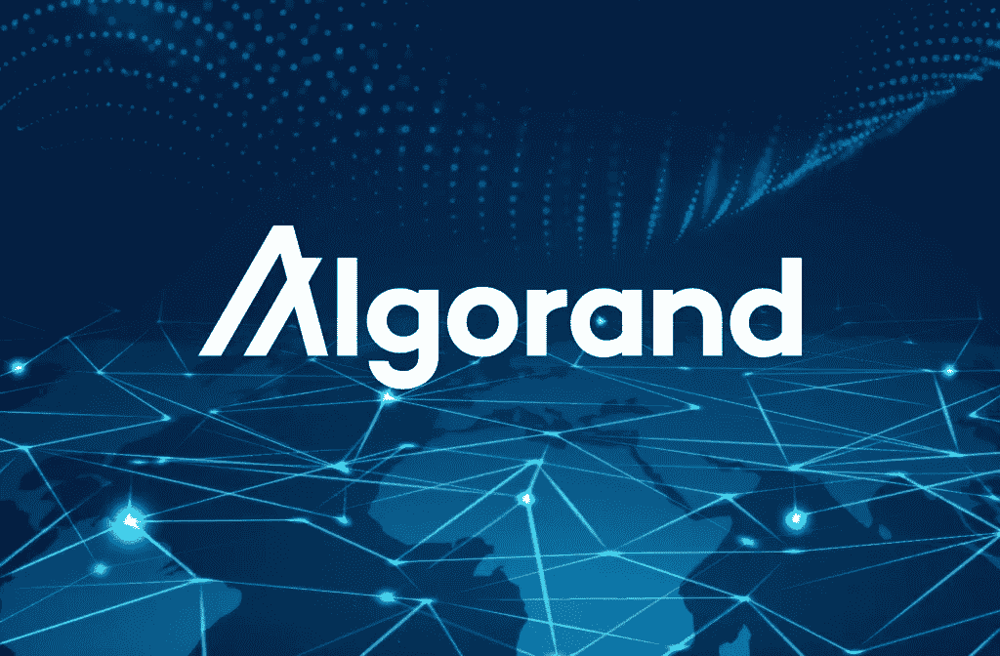
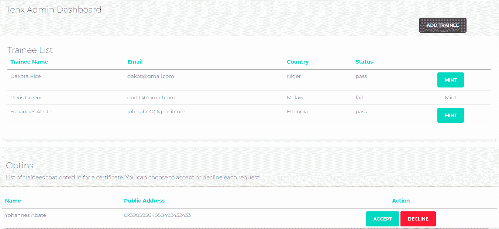
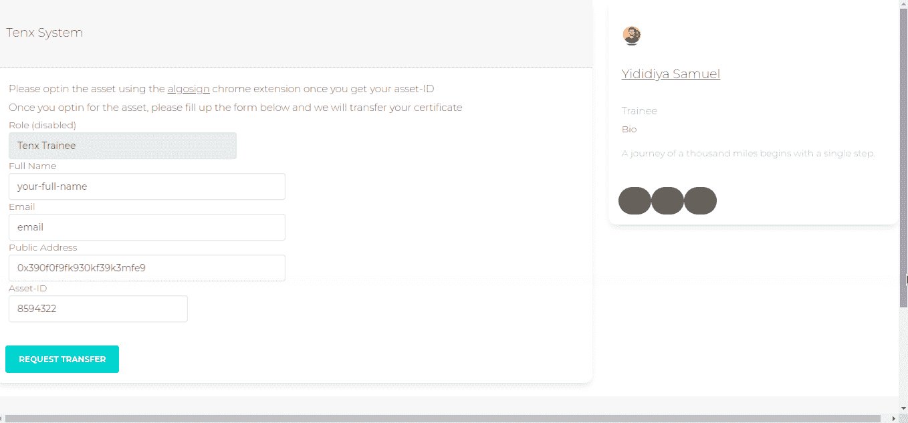

# 使用与钱包集成的 Alogrand 区块链分发数字证书

> 原文：<https://medium.com/codex/digital-certificate-distribution-using-alogrand-blockchain-93d185430869?source=collection_archive---------30----------------------->

# 介绍

第三代网络技术被称为 Web 3.0。这是一个去中心化的网络，这意味着用户不是通过谷歌、苹果或脸书等大型科技公司中介的服务来访问互联网，而是个人自己拥有和管理互联网的各个领域。

在块链中，块之间有一个共识，这是一种算法，使分散的记录保持更类似于集中式数据库。这是一个自动化的过程，以确保所有节点共享的记录只有一个有效副本。在区块链系统中存在不同类型的共识，这里我将介绍区块链系统中两种主要的共识。简而言之，共识协议确保了添加到区块链中的每个新区块都是区块链中所有节点一致同意的唯一版本的真理。

1.  工作验证共识(POW):在这种共识中运行分布式系统的算法奖励解决数学难题的矿工。新的网络事务从执行它们的软件钱包发送到网络的所有挖掘客户端。例如，比特币的每个采矿客户端都有一个内存池，用于收集传入的未确认交易。挖掘软件会验证新的交易，并以给定的时间间隔(从区块链到区块链可能会有所不同)将它们分组到块中。每个采矿客户都有经济动机成为第一个创建新交易块的人，其他机器都将接受这些交易块作为新的网络真实状态，并将其添加到他们在对等节点上保存的区块链的分散副本中。POW consensus 的主要缺点是它使用非常高的计算能力来产生加密安全性，这对于现在和将来当世界上大多数人开始使用区块链系统时的环境是浪费和危险的。
2.  利害关系证明(POS):相反，这种共识机制是基于网络所有权的。POS 系统中新块的发起者以确定的方式选择，基于其在网络中的股份或承诺程度(财富)。另一方面，POS 系统的投票层可能过于复杂，并且在所谓的不必要的处理方面并不总是比 POW 更有效。因此，PoS 通过激励机制鼓励验证者达成协议。

NFT 市场不断增加的碳足迹是另一个需要解决的问题，因为每笔交易都需要大量的处理。根据《纽约时报》的报道，“制造一辆普通的 NFT 汽车会产生超过 200 千克的温室气体，相当于一辆普通的美国汽油动力汽车行驶 500 英里。”NFT 债券发行的巨大碳足迹来自领先的区块链为非金融交易市场部署的共识机制。不幸的是，大多数 NFT 的开采和交易都是在工作证明(PoW)链上进行的，每次创建或交易一个 NFT 都需要能源密集型的加密开采。不用说，这是不可持续的。

# 目标

该项目试图使客户能够解决这些挑战，确保证书以安全的方式提供给所有学员，并且(如果可能的话)证书持有人可以从现在和未来的智能合同行动中受益。目前，证书以简单的 PDF 文件分发，无法验证其真实性，培训师也无法对学员/他们的合同采取明智的行动。为了解决这个问题，在开始使用数字证书后，培训机构将公开宣布其加密钱包地址。因此，如果有人可以证明他们已经收到了 NFT 令牌直接从地址给定，他们已经完成了计划。

# 我们将使用的链条

10 Academy(培训机构)已与阿尔格兰德合作，将阿尔格兰德区块链用作 NFT 的基础元素，现在必须实施。我将在 Algorand 区块链上构建一个端到端的 Web3 dapps，它将帮助 10 个学院生成和分发不可替换的令牌(NFT)作为证书，这些证书将代表成功完成对学员的每周挑战，并允许拥有 NFT 的学员与智能合同进行交互，以执行预定义的操作。

阿尔格兰德是新一代的区块链，它将分散化和集中化的金融世界连接起来。它的原生密码是 ALGO。阿尔格兰德标准资产运行在区块链的“第 1 层”,包括可替代、不可替代、受限可替代和受限不可替代资产。Algorand 使用 POS 共识算法来获得区块链协议，这是生态友好的，并且消除了高通勤电力浪费。Algorand 的系统在每个周期随机地、秘密地挑选块验证器。通过这种方式，Algorand 实现了完全去中心化，因为它给予所有用户被系统选择的平等机会。这也确保了最高程度的安全性，因为没有人知道下一个块验证者是谁。不需要采矿，这使得 Algorand 能够实现碳中和，这是 NFT 成为主流的一个重要卖点。与不同的区块链技术在过去所面临的问题相比，这是向前迈出的重要一步。Algorand 链还具有更低的交易成本，这使得它非常适合我们将要使用的应用程序。

# 使用的技术堆栈

**前端**:项目的前端开发，我用的是 React.js 和 CSS 的 bootstrap 框架。前端代码用于处理所有学员逻辑以及行政管理。

我使用 AlgoSigner chrome 扩展进行钱包集成，这将使管理员和学员能够签署不同的交易。

管理部分

该计划的管理员将有一个选项:

1.  将受训者添加到计划中
2.  为通过培训的学员制作证书
3.  查看受训人员列表
4.  查看学员的选择列表
5.  接受或拒绝受训者的选择加入请求

实习生区

该系统的受训者具有使受训者能够:

1.  一旦他完成培训，就选择加入证书(交易使用 AlgoSigner 作为钱包集成进行签名)。
2.  当资产从管理员处转移时，查看他的证书

**后端:**对于后端，我用的是 Node。JS 以 express 为框架，MongoDB 为数据库。后端的主要功能有:

1.  查看学员列表的途径(管理端)。
2.  将受训者添加到计划的途径(管理端)。
3.  一个电子邮件系统，通过电子邮件发送由管理员创建的资产 id。学员完成培训计划后，系统会通过电子邮件向学员或学员发送资产 id，管理员会向区块链(管理员端)发送证书。
4.  选择加入证书(学员方)
5.  查看他的资产(学员方面)
6.  使用 Algo SDK 的资产创建、资产转移和资产冻结功能。

阿尔格兰德区块链的实现方式是，一项资产只能转移给选择加入的人。这是因为任何人都可以转移非价值资产，并向接收方收取费用。为了避免这种情况，Alogrand 更新了实施方案，要求任何形式的资产转移都必须由接收方请求/选择加入。因此，在我们的场景中，学员将使用管理员通过电子邮件发送给学员的资产 id 选择加入某项资产，然后系统管理员可以将该资产转移给学员。

# **未来计划**

当前应用程序的未来计划是使用智能合约(Reach)实现所有功能。

[直播链接](https://tenx-dapp.netlify.app/)

[Github](https://github.com/jedisam/certificate-distribution-smart-contract)

参考资料:

[https://developer.algorand.org/docs/get-started/dapps/](https://developer.algorand.org/docs/get-started/dapps/)

[https://developer . algrand . org/tutorials/creating-JavaScript-transaction-pure stake-API/](https://developer.algorand.org/tutorials/creating-javascript-transaction-purestake-api/)

[https://d.mba/blog/school-certificates-for-the-digital-age](https://d.mba/blog/school-certificates-for-the-digital-age)