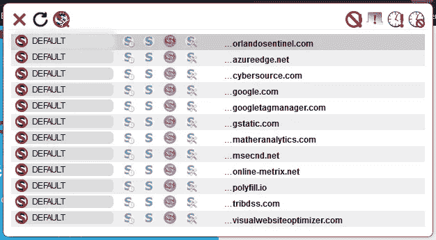

# 数字身份的 Pogo 问题

> 原文：<https://medium.com/codex/digital-identitys-pogo-problem-1fd73baa90f9?source=collection_archive---------13----------------------->

Pogo 有句名言"[我们遇到了敌人，他就是我们。](https://humorinamerica.wordpress.com/2014/05/19/the-morphology-of-a-humorous-phrase/)“今天看余炳贤的帖子我想起了那个[#的身份。我们(这个行业)是问题所在吗？](https://www.mydigitalfootprint.com/2021/08/identity-are-we-industry-problem.html)也许吧。

作者图片

托尼问道:“作为一个 32 亿人拥有数字身份的行业，我们为什么会如此分散、不协调和令人不快？”在我的经验中，身份本身往往是支离破碎的、不协调的和不愉快的，所以我并不感到惊讶，在对它进行数字化建模时，我们达到了同样的状况。

# 数字身份的奇异问题

如果我们从数字认证需求开始，并继续向前，目标是将凭证解析为单个、唯一的、特定的人。“身份”这个词本身是一个单数名词，复数形式是“身份”所以，当我们谈论数字身份的时候，这个奇点的概念就已经存在了，从我们对这个概念的命名开始。为什么不呢？同一性作为一个概念的基础难道不是源于“我思故我在”吗？如果这句话是“我们思故我在”，听起来更像博格人的集体。

在行业中，术语“主体”是指请求访问资源的实体。当我敲你的门时，我是委托人，我要求的是门后的权利——也许是进入你家的权利，或者是在门口与你说话的权利。当我登录到一个网站时，我是委托人，网站提供的服务是我想要访问的资源。如果该网站是我的银行，则只有当我提供的凭据无法解析给多人时，该服务才有效。

本金是单数。委托人对个人是 1:1。

如果我们从一个人开始，回溯到这个人需要访问的所有资源，不管是像门这样的物理事物还是像网站这样的虚拟事物，事情会变得更加混乱。从内往外看，我们每个人都有多重身份。我们对身份的概念是单一的，但我们对它的实践是多元的。

身份是复数。人对身份是 1:多。

虽然这看起来违反直觉，但事实上这是普遍的做法。例如，任何使用互联网超过一分钟的人都被告知不要在网站间重复使用密码。从任何一个网站的角度来看，你的身份就是你的 ID 和密码。从用户的角度来看，身份是一个 ID/密码组合*，在一个特定网站的上下文中，这些组合对其有效*。您是否遵循对不同网站使用不同密码的最佳实践？恭喜你！你更安全，因为你有许多身份来代表你，每一个都适用于一个狭窄的环境。直观上，我们认为标识符就是身份，跨系统使用相同的标识符(即电子邮件地址)就相当于拥有单一身份。从系统的角度来看，并不是。标识符*和凭证*的组合是身份的代理。

用户实践的身份总是复数。为身份验证而实现的身份始终是单一的。身份作为一个讨论的话题很少能成功地将两者结合起来，这是一个独特的问题。

# 数字身份的验证阈值问题

当我申请 TSA Precheck 时，我被要求提前提交各种政府颁发的身份文件，然后带着原始文件亲自出席并参加面试。在面谈之前，进行了背景和犯罪记录调查。美国运输安全管理局根据风险强制实施该级别的验证，旅客接受初始验证负担，因为他们获得了利益。但是当地的公共图书馆不会要求这种级别的验证，因为他们的风险要小得多，如果他们实行这样的制度，他们也不会有任何注册会员。初始身份验证和持续登录身份验证的严格性必须与受保护资源的风险和收益成比例。

这种分层认证早在数字时代之前就已经开始实施了。系统设计的目标从来不是设计一个完全安全的凭证，而是伪造一个特定凭证的成本超过了可能获得的任何收益。这就是为什么政府颁发的大学身份证、驾照和护照采用了越来越复杂的防伪措施。

这种分层模型随着数字身份转移到了网上，因为每个网站决定了其特定的风险和威胁模型需要多少身份验证。有些网站只需要注册。通常，在这些网站中，真实世界的身份没有随着时间的推移而建立起来的声誉重要，例如社区论坛。其他网站要求根据提交的各种高价值凭证(如驾照或护照)来验证唯一的物理身份。

互联网并没有改变这种模式，而是扩展了它。许多网站让你登录谷歌、脸书、贝宝、亚马逊或其他顶级供应商。用户首先向这些供应商之一验证他们的真实身份，通常使用一些政府颁发的 ID，然后供应商充当真实身份的可信代理。因为这些供应商以接近零的成本提供了与流行的内容管理和商业软件包的集成，所以基本身份验证的基础大大提高了。一个不接受付款的随机论坛可以接受为商业目的验证的数字身份，因为它比本地管理的账户更便宜，风险更小。

验证阈值问题是我们无法逃避认证系统设计的成本/收益/风险计算。我们实现成本最低的东西，满足我们的风险模型的最低要求阈值。一直都是。只要用户(正确！)认为他们的银行或电子邮件帐户比他们的博客读者帐户更有价值/风险，验证阈值将保持分级。“使用[此处的供应商名称]登录”的能力可以将最低层向上滚动一两层，但不能完全消除这些层。

根据该分析，分层验证阈值是一个特征。当我们将它们视为需要消除的缺陷，而不是需要增强的特性时，数字身份就会受到损害。

# 数字身份的隧道视觉问题

Tony 在他的文章中哀叹道，大部分的分裂、不协调和不一致是由于以用户为中心和以系统为中心的身份模型之间的紧张关系。回想一下，身份验证解析为单个主体，而用户根据上下文具有多方面的身份。如果我们将碎片化和不协调定义为数字身份的问题，那么我们需要以不侵犯用户所依赖的方面的方式来解决这些问题。

选择“登录”选项的用户增加了使用单一身份的上下文的数量。从另一个角度来看，他们向世界展示的潜在身份的数量正在减少，并且正在进行的激励是将该数量减少到接近 1 的值。如果我的身份是我观察数字世界的蝇眼，那么“登录”就意味着一种渐进的隧道视野。

因为我是锡纸帽类型的，所以体验有点不一样。像大多数用户一样，我有许多身份，我经常在网上向不同的供应商和网站展示。然而，与大多数人不同的是，我使用的电子邮件地址对每个供应商或网站都是独一无二的。因此，当我选择“使用[此处的供应商名称]登录”时，我通常选择选项#2，并建立一个本地站点帐户。不利的一面是，我原本会使用的大部分互联网变得无法访问。

例如，如果我有一个智能开关、一个传感器和一个智能家庭集线器，而这些设备来自不同的供应商，那么我就不能编写涉及这些硬件设备的编排，因为这些供应商中的每一个都有不同的电子邮件地址给我。

隧道视野问题最令人反感的方面是，它迫使人们根据数字身份提供商的字段格式的约束来调整他们的现实世界身份。一个流行的笑话是，年轻家庭需要为他们的第一只宠物选择一个 8 个或更多字符的名字，混合了大小写字母和数字，有特殊字符，并且不是字典中的单词。显然这是一个笑话，但在现实世界中，我的真名(T.Rob)中的点通常是姓名字段中的非法字符，多年来，无数同事告诉我，他们修改了自己的姓名以消除重音字符，缩短了他们的姓名以适应，省略了一个或多个姓名，因为系统不允许他们，或者给了一个 X 作为中间名的首字母，因为系统坚持他们必须在该字段中有一些内容。出于职业目的，由系统记录的身份然后被强加于人，迫使他们以从微妙到粗俗的各种方式来符合。

身份的自然体验是我们每个人都有许多身份。解析为单一身份的系统要求和整合身份提供者的行业目标给用户带来了不自然的体验，以及整合越来越少的身份的持续动机。数字身份系统的强制性质进一步确保了当我们整合身份时，该系统会将我们导向其认可的版本。这不是一个公认的问题。

# 数字身份的相对性问题

我在这里谈论的是相对论的 E=MC2 版本，而不是一代人前让家族蒙羞的怪异大叔。当我们谈论数字身份时，我们省略了“随着时间的推移”这几个字，但它们是隐含的。在线身份验证的目的不是在登录时知道你是谁，而是验证你是注册该帐户的同一个人，并保证你是唯一使用该帐户的人。这没有说明的是，我们是谁，我们每个人的个性都会随着时间而改变。

以我自己为例，三十年后，我年轻时的样子可能无法胜任我今天的工作。有时候变化比较突然。脑瘤切除后，我妈完全变了一个人。有时人们的行为与性格不符，因为他们是被胁迫的。例如，银行账户被劫持的员工可能会被迫放弃登录公司系统的凭据。

更常见的情况是用户改变角色或离开公司。作为一名顾问，我经常更换公司。我的许多客户授权我代表他们处理 IBM 问题单。有这样的情况，我在某个特定公司的 IBM 支持权利超过了我在他们公司的雇佣时间，有一次超过了十年。

我们谈论数字身份，好像它是信任的持久代理，而事实上一个人的身份自然是短暂的。当系统因为一个人过去的性格而拒绝他进入时，就创造了一个机会来对此提出异议并可能做出让步。这令人不快，但基本上行得通。但是，当一个受信任的人随着时间的推移变得不可信，而系统继续允许访问时，这种失败就会悄悄地发生，只有在信任被破坏时才会被发现。

我并不是说我们所有的身份系统都需要频繁地重新验证用户(尽管一些高价值系统应该这样)。但是我的意思是，把一个短暂的属性建模成一个持久的属性并不是一个很好的模型。然而这是普遍的做法。

# 数字身份的糟糕保管人问题

我们在数字身份方面最大的问题之一是，如此多的数据保管人是完全不可信的，只要我们得到了我们想要的功能，我们就会故意忽略这一点。

身份验证基于秘密——您知道的东西(即密码或短语)、您是什么(生物特征识别)或您拥有的东西(即 RSA 密钥卡)。如果其他人知道这个秘密，那么这个认证就是不可靠的。

那么，为什么在互联网上，网站所有者泄露我们的密码等凭证机密，以及帐户恢复答案和信用卡号码等其他信息是标准的呢？更重要的是，为什么我们选择忽略他们这样做？

需要澄清的是，我说的不是收集你的数据然后出售的网站。我也不是指那些因违规而丢失数据的人。我说的是那些在你输入的时候就可以实时大量免费分发的网站。这些危害了大多数网站，但你可能从未听说过。

不过，不要相信我的话。在你的浏览器中安装 [NoScript](https://noscript.net/) ，进入任何网站的账户创建页面。在大多数银行和顶级网站，如谷歌，亚马逊和雅虎，你可能会发现，在帐户创建页面运行脚本的唯一域名是你正在访问的供应商。例如，你可以在大多数 Google 站点上找到 GStatic 脚本。

现在去几乎任何一家报纸网站，你都可能在账户登录页面找到五到二十五个运行脚本的第三方域名。(新闻和媒体网站是最差的。)例如，在 Orlando Sentinel 的帐户创建页面中有 10 个第三方域运行脚本。visualwebsiteoptimizer.com 需要知道你的奥兰多哨兵的密码有什么特殊原因吗？为什么？

虽然我说过顶级网站通常会这样做，但这往往取决于网站的性质。PornHub 目前在全球流量排名第十，他们让 hotjar.com、trafficjunky.com 和其他一些第三方窥探你的会话，当你创建你的帐户，并输入你的密码恢复信息。我没有创建一个帐户，所以我不知道他们是否让第三方窥探支付页面，但我知道许多网站以这种方式暴露信用卡信息。

快速浏览安装了 NoScript 的最喜欢的网站应该会让大多数人感到恐惧。除了少数例外，您信任的网站和供应商会在您登录、创建帐户、恢复帐户或输入支付数据时，让随机的第三方窥探您的 web 会话。如果你使用 NoScript 这样的工具来防止这些第三方窥探你的会话，网站通常会崩溃。因此，这种暴露身份的做法不仅无处不在，而且这种依赖性意味着除非你允许，否则你不能使用很多网络。

信不信由你，当我谈论“数字身份的糟糕保管人问题”时，这种第三方窥探并不是我所指的。在我看来，问题在于存在如此大的漏洞，而我们却对此漠不关心。普林斯顿大学的研究人员早在 2017 年就在他们的 [No Boundaries](https://freedom-to-tinker.com/2017/11/15/no-boundaries-exfiltration-of-personal-data-by-session-replay-scripts/) 系列中发表了这一点，但它在#ITSecurity trades 中几乎没有引起注意，更不用说主流新闻了。我最初的研究是在 2018 年，尽管接触了几十名记者，但我无法引起任何兴趣。当我向同事和朋友展示这个问题时，他们的反应通常是这个问题太难解决了。没有人愿意听到互联网在数字身份方面有这样一个基本的、无处不在的缺陷。这条新闻应该是 2017 年刚发布的时候就火了。对于这么大的事情，我们在试图控制误报方面应该会有问题，而不是在一开始就让它被报道。

什么样的数字身份问题可能会掩盖糟糕的保管人问题？或者从另一个侧面来说，如果不良托管人问题不能被重视，为什么*任何*数字身份问题都要被重视？

# 改进我们的数字身份模型

我们创造的数字身份越有价值，具有窥探权限的第三方就越有动力利用它们。只要第三方窥探我们凭据的庞大生态系统继续存在，我们在数字身份领域做的任何其他事情都没有意义。显然，首要任务应该是消除对凭证页面的这种窥探，这样身份验证所基于的秘密才真正保持秘密。经过认证的身份只有在稀缺时才有价值。

假设我们可以做到这一点，这将有助于在自然身份的基础上更紧密地模拟数字身份。也就是说，身份的多面性、多层次性和短暂性将是一个特性，而不是一个缺陷。

有用的数字身份系统将

*   根据用户的喜好进行细化，包括作为该用户在系统中的唯一标识符，或者允许重用由可信提供商建立的身份。
*   在成本与风险相称的情况下，提供多层验证。通过将较高层的成本降低到接近零来整合各层，但要认识到用户自然会期望基于不同风险的分层认证。
*   使数字身份系统符合自然身份，而不是将自然身份强制为更少、更符合的数字标识符值。
*   数字身份持久性是验证层的一个因素。更高的风险等级需要更频繁的重新验证，以便系统可以处理自然身份的短暂性质。
*   除非用户同意整合他们的身份，否则他们不应该被切断与互联网的联系。
*   除非用户同意不加区别地与数十个第三方共享他们的登录凭证，否则他们不应该被切断与大范围互联网的联系。

虽然托尼的博客文章沉淀了这一点，但我的文章并不打算直接证实或反驳他的观点。和他一样，这篇文章总结了我对这个问题的最新想法。他的分析倾向于功能性，而我的倾向于结构性，但有很多重叠。也有很多我已经离开了，以保持在托尼提出的护栏。幸运的话，其中一些会引起其他人的共鸣，但我还没有摘掉锡纸帽。