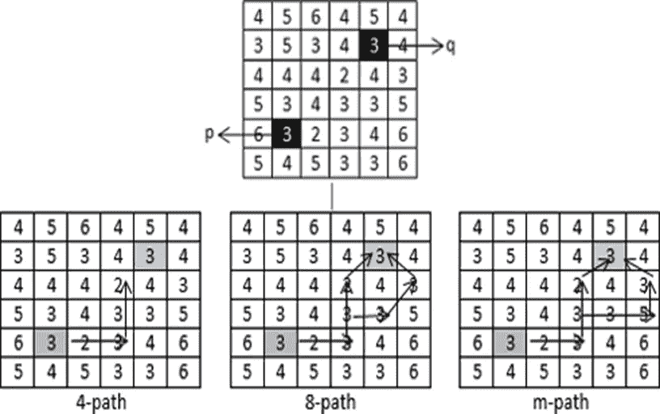

# 数字图像处理第二部分

> 原文：<https://medium.com/codex/digital-image-processing-part-2-8a6319c97f7e?source=collection_archive---------19----------------------->

## [法典](http://medium.com/codex)

*注:这是《数字图像处理》一书的摘要，第四版 Rafael C. Gonzalez，田纳西大学 Richard E. Woods，MedData Interactive*

在深入挖掘 DIP 的深层概念之前，我们应该知道图像是如何被人类感知的。

**人眼的结构**

**图 1:** 人眼结构**来源:**[https://www . news-medical . net/health/Anatomy-of-the-Human-Eye . aspx](https://www.news-medical.net/health/Anatomy-of-the-Human-Eye.aspx)

图 1 显示了眼睛的解剖结构，我们在第 10 节课已经学过了，现在我们来看看人眼形成的图像。正如我们所知，镜头和视网膜(成像区域)之间的距离是固定的，需要调整焦距才能实现正确的聚焦。在数字图像中，我们将图像显示为离散的强度，眼睛应该能够区分不同的强度水平。

**图像传感、采集和形成**

图像是由照明源和能量的反射或吸收的组合形成的。我们知道图像用 f(x，y)表示。

坐标 x，y 处的 f 值是一个正的标量，其物理意义由图像源决定。在图像中，强度值与物理源辐射的能量成比例。

所以 f(x，y)一定非零且有限所以，

0

The function f(x,y) is characterized by two-component :

1.  the amount of source illumination incident on the scene being viewed.
2.  the amount of illumination reflected by the object in the scene.

*照度*和 R *反射率*分别用 i(x，y)和 r(x，y)表示。

这两个函数组合成乘积，形成 f(x，y):

**f(x，y)=i(x，y) r(x，y)**

其中， **0 < i(x，y) <无穷大**

和 **0 < r(x，y) < 1** 其中 0 是总吸收，1 是总反射

I (x，y)的性质由照明源决定，r(x，y)由图像对象的特性决定。

**图像采样和量化**

为了创建数字图像，我们需要将连续的感测数据转换成数字形式。这涉及到两个过程:*采样*和*量化*。

为了将模拟图像转换成数字形式，我们必须对坐标和振幅中的函数进行采样。

1.  坐标值的数字化称为*采样。*
2.  振幅值的数字化称为*量化。*

**空间和强度分辨率**

*   *空间分辨率:*可以用每单位距离的点数或像素来表示
*   *强度分辨率:*指强度水平上最小的可辨别的变化。

**像素之间的一些基本关系**

*   **一个像素的邻居**

坐标(x，y)处的像素 p 具有 4 个水平邻居和 4 个垂直邻居。像素的邻域是围绕它的像素的集合。

图 2:x，y 的邻域

*   ***N4(p)即 x，y 的 4 个邻域:***

(x，y)处的像素 p 在(x+1，y)、(x-1，y)、(x，y+1)和(x，y-1)处具有邻居。这些被称为 p 的**4-邻居:N4(p)**

*   ***ND(p)即 x，y:*** 的四个对角线

*(x，y)处的像素 p 在(x+1，y+1)、(x+1，y-1)、(x-1，y+1)和(x-1，y-1)处具有邻居。这些被称为 p : ND(p) 的**四对角线邻居***

*   ****N8(p)即 8**x 的邻域，y:****

*(x，y)处的像素 p 在(x+1，y+1)、(x+1，y-1)、(x-1，y+1)、(x-1，y-1)、(x+1，y)、(x-1，y)、(x-1，y)、(x，y+1)和(x，y-1)处具有邻居。这些被称为 p 的 8 个邻居:N8(p)*

**

*图 3:显示了 4 邻居和 8 邻居*

***邻接、连接、区域和边界***

*像素之间的连通性很重要，因为它用于确定图像中的区域、跟踪轮廓和建立对象的边界。*

***Let *V* :用来定义邻接的一组强度值。***

*   *在二进制图像中， *V* = {1}，如果我们指的是值为 1 的像素的相邻性。*
*   *在灰度图像中，想法是相同的，但是 *V* 通常包含更多元素，例如， *V* = {180，181，182，…，200}*

****两个像素相连如果:****

*–它们是“邻居”，即 N4(p)、N8(p)*

*–它们的灰度级满足指定的相似性标准*

***4-邻接:**如果 *q* 在集合 *N4* ( *p* )中，则具有来自 *V* 的值的两个像素*p*q*是 4-邻接的。**

***8-邻接:**如果 *q* 在集合 *N8* ( *p* )中，则具有来自 *V* 的值的两个像素 *p* 和 *q* 是 8-邻接的。*

***m-邻接(混合):**具有来自 *V* 的值的两个像素 *p* 和 *q* 是 m-邻接的，如果:*

*   **q* 在 *N4* ( *p* )或*
*   **q* 在 *ND* ( *p* )并且集合*N4*(*p*)∩*N4*(*q*)没有像素的值来自 V*

*混合邻接是 8-邻接的一种变形。引入它是为了消除使用 8-邻接时出现的歧义。*

**

****数字路径:*** 从坐标为( *x* ， *y* )的像素 *p* 到坐标为( *s* ， *t* )的像素 *q* 的数字路径(或曲线)是一系列不同的像素:( *x* 0， *y* 0) *y* n)，其中( *x* 0， *y* 0) = ( *x* ， *y* )和( *x* n， *y* n) = ( *s* ， *t* )和( *xi* ，*伊*)*

**

***地区***

*设 *R* 是像素的子集，如果 *R* 是连通集，我们称 *R* 为图像的一个区域。*

***边界***

*区域 *R* 的*边界*(也称为*边界*或*轮廓*)是该区域中具有一个或多个不在 *R* 中的邻居的像素集合。*

*这是 Rafael C. Gonzalez 所著的《数字图像处理》一书第二章的摘要。想进一步了解这本书的内容，请阅读我的博客。谢谢大家，并喜欢，分享和评论你的建议…*