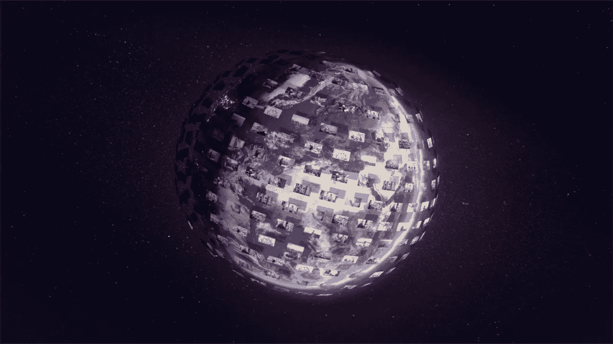
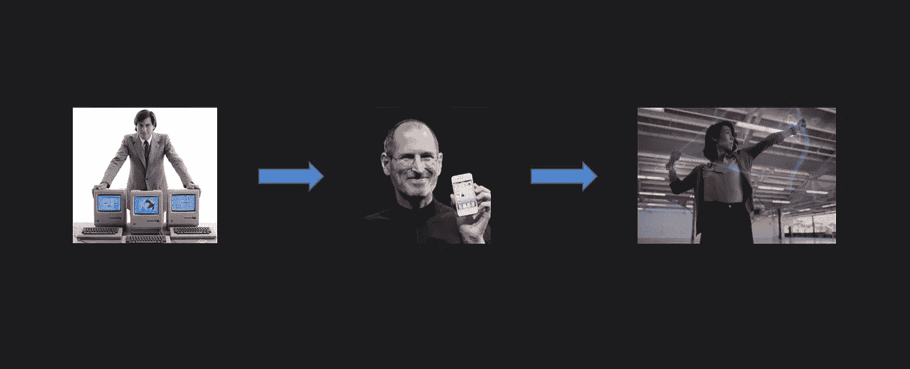
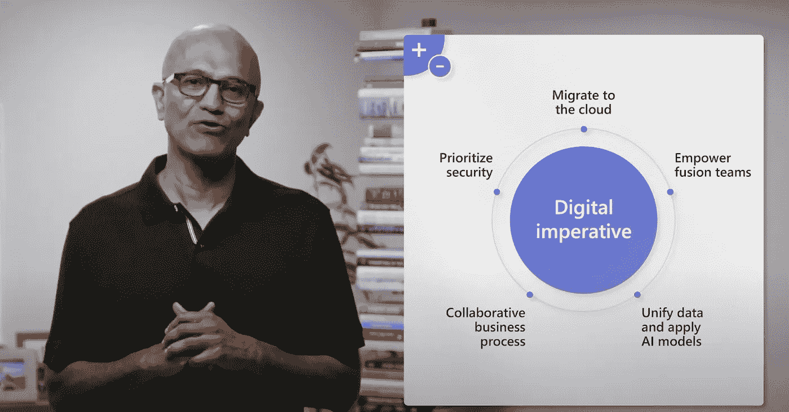
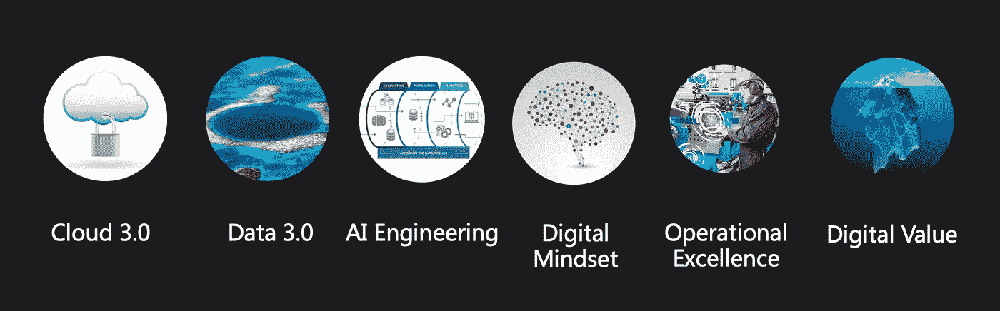
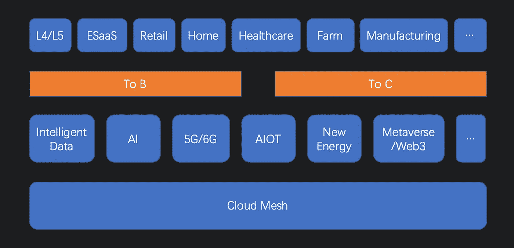

# 数字化转型 2.0

> 原文：<https://medium.com/codex/digital-transformation-2-0-bbc97cc8b285?source=collection_archive---------10----------------------->

## 注入现代数字技术，实现变革和创新

鸣谢[微软 Inspire 2022](https://youtu.be/Iv4ba02ypZk)

现在每个公司都是数据驱动的数字化公司。当务之急是通过[数字化转型](https://en.wikipedia.org/wiki/Digital_transformation)将技术注入每个企业和组织。但数字化转型并不新鲜。第三次工业革命，也被称为[数字革命](https://en.m.wikipedia.org/wiki/Digital_Revolution)，已经过去了几十年。现在是基于现代技术和第四次工业革命的数字转型 2.0。

D 数字化强度衡量数字化转型的成功与否，是数字化的程度。数字化是技术研发的核心价值。回想起来，技术几乎每十年都会发生一次革命。微软视窗系统于 1985 年首次亮相，推动了个人电脑时代的繁荣。大约在 1995 年，互联网开始改变我们的生活，让我们可以远程联系和互动。云和移动(例如 iPhone)在 2005 年左右出现。AI/ML 在 2015 年前后开始改变商业和生活。然后元宇宙和 web3 最近抬起头来。

我们广泛讨论企业和组织的数字化转型。数字化如何影响我们的生活？

数字化改变我们的生活(作者)

毫无疑问，在过去的几十年里，从 PC 到移动，我们的日常生活发生了巨大的变化。但这并不是结束。在不久的将来，手机可能会逐渐消失，被元宇宙取代，这将再次改变我们的生活。因此，数字化不仅是企业和业务的转型，它还直接改变了我们的生活。从经济学的角度来说，就是 To B(即 to business)和 To C(即 to customer)的转化。

## 微软的数字化转型之路

微软是数字化转型领域的领先公司。微软首席执行官塞特亚·纳德拉在去年的 [Inspire 主题演讲(2021)](https://youtu.be/t1PAGcP9lhc) 中强调了数字化转型以及微软如何帮助他人转型。他在本次 [Inspire 主题演讲(2022)](https://youtu.be/Iv4ba02ypZk) 中提出了以下五项数字要务:

[微软数字指令](https://youtu.be/Iv4ba02ypZk?t=200)

这是以 Azure 安全云为基础的 ToB 数字化转型 2.0。微软推出智能数据平台，将数据战略和模型现代化，作为加速人工智能工程的平台。它使企业能够使用微软基于云的平台和解决方案来增强员工的能力并优化他们的流程: [GitHub](https://github.com/enterprise) 、[微软 365](https://www.microsoft.com/en-us/microsoft-365) 、 [Dynamics 365](https://dynamics.microsoft.com/en-us/) 等。

## 什么是数字化转型 2.0？

数字转型 2.0 不仅仅是使用一些数字技术来转变组织的过程。需要 3 个 **R** s:右**工艺**，右**工艺**，右**范围**。技术是数字化转型的关键。是时候利用现代技术了，包括基础设施、平台、框架和数字解决方案。从数字化到团队数字化思维，一个适当的流程可以为效率和效果带来很大的改变。范围可以定义数字化转型的阶段和类型，以区分和加速数字化转型。

数字化转型 2.0 可以用六个原则来定义:云 3.0、数据 3.0、人工智能工程、数字化思维、卓越运营和数字化价值。

数字化转型 2.0(作者)

云是数字化转型 2.0 的基础，加速了数字化的浪潮。现在每个公司都是数据驱动的，数据变得比以往任何时候都更加重要。人工智能正在重塑商业和生活的效率和可扩展性。但如果人工智能不能被工程化，它就不能被民主化。

**数字思维**是将数字技术融入商业和个人场景。它可以使组织文化现代化。我们可以更深入更广泛地应用数字技术，并以这种心态不断迭代。**卓越运营**是数字化转型的基本目标。它可以从根本上帮助组织提高业务效率，降低运营成本。最后，**数字价值**是指通过数字化转型带来的商业价值和客户体验。它衡量数字化转型的改进程度和商业价值，可以通过反馈循环进行有效迭代。数字化转型本质上是数据驱动的。

## 云网格

云正在从基于[虚拟机](https://en.wikipedia.org/wiki/Virtual_machine)的云 1.0 和云原生云 2.0 发展到云 3.0。**云 3.0** 是一个多云、多边缘、支持混合的云网格。它既安全又合规。但除此之外，它还联合了来自不同云提供商的孤岛式云，如 AWS、Azure 和 GCP。 [Starburst](https://www.starburst.io) 和 [Dremio](https://www.dremio.com) 是两家领先的云联合数据平台初创公司。由于分布式联合安全云的性质，云网也是未来 Web3 的基础设施。

## 数据 3.0

数据 1.0 是具有基本数据处理的原始大数据范式。数据 2.0 是使用 [Spark](https://spark.apache.org) 或 [Flink](https://flink.apache.org) 的实时大数据。 **Data 3.0** 是一个智能数据云，有两个方面:将智能和云能力集成到现代数据堆栈中，以及利用从 analytics 到 [ML](https://en.wikipedia.org/wiki/Machine_learning) 的数据提升商业价值。

我们知道，从数据到商业价值的旅程通常涉及不同的人:数据工程师、数据分析师、数据科学家、ML 工程师等。统一数据不仅是为了消除数据孤岛，也是为了简化数据平台。因此，Data 3.0 有两个具有挑战性但意义重大的变化:数据流端到端闭环，实现商业价值最大化，数据栈的流程和操作简单智能。

## 人工智能工程

AI/ML 很棒，但是很复杂，很难使用，而且很耗时。而且往往需要 AI/ML 专家来建模、测试、部署。AI 工程简化了流程，降低了成本，是实现 AI 民主化的途径。人工智能工程超越了 ML 操作自动化的 MLOps。它可以用工程方法系统地处理数据质量、模型优化以及数据和模型治理。

## 数字转型 2.0 架构

如何理解数字化转型 2.0 的架构？可以举例如下:

数字转型 2.0 架构(作者)

数字转型 2.0 基于云网，集成了最新的数字技术，但不限于智能数据、AI/ML、5G/6G、AIoT(人工智能物联网)、新能源、元宇宙、Web3。

它支持 ToB 和 ToC 用例。可广泛应用于 [L4/L5](https://en.wikipedia.org/wiki/Self-driving_car) 、ESaaS(企业 SaaS)、零售商业、智能家居、医疗保健、数字农场、智能制造等。

## 简单地

数字化转型 2.0 以多云和边缘计算为基础，以数据为核心，可同时应用于 To B 和 To C 的业务场景。数字转型 2.0 需要 3r(正确的技术、流程和范围)来有效地注入数字技术，可以用六个原则来描述:云 3.0、数据 3.0、人工智能工程、数字思维、卓越运营和数字价值。

## 参考

1.  数字化转型 2.0:概念、架构和商业模式。https://www.sohu.com/a/458780266_114877
2.  塞特亚·纳德拉微软 Inspire 2022 主题演讲首席执行官兼主席。【https://youtu.be/Iv4ba02ypZk 
3.  第四次工业革命。[https://en . m . Wikipedia . org/wiki/Fourth _ Industrial _ Revolution](https://en.m.wikipedia.org/wiki/Fourth_Industrial_Revolution)
4.  民主和我们生活的数字化转变。[https://hai . Stanford . edu/news/democracy-and-digital-transformation-our-lifes](https://hai.stanford.edu/news/democracy-and-digital-transformation-our-lives)