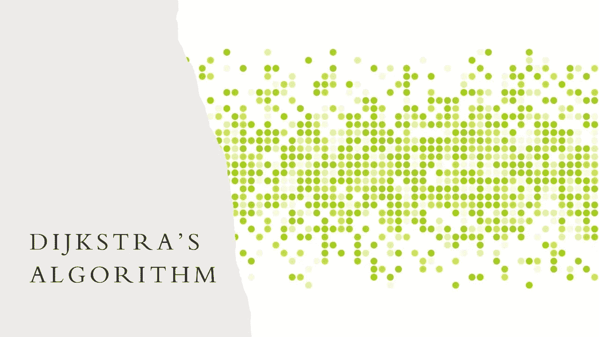
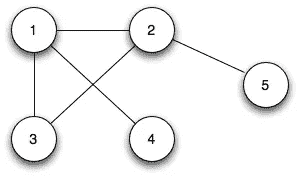
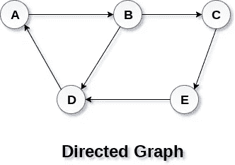
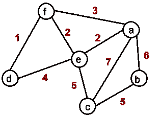
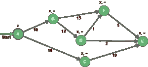
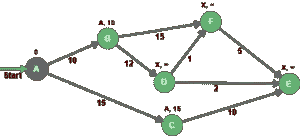
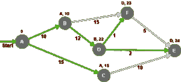
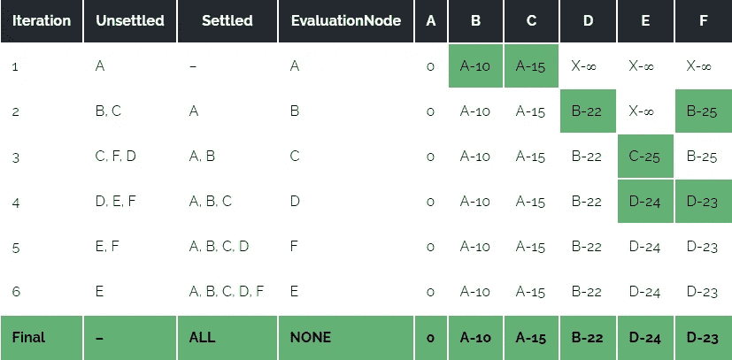

# Dijkstra 最短路径查找算法

> 原文：<https://medium.com/codex/dijkstras-shortest-path-finding-algorithm-d8b85248c911?source=collection_archive---------12----------------------->

Dijkstra 算法用于使用贪婪方法找到图中任意两个节点之间的最短路径。



## 图表

我们先说图。图形是一种用于表示连接元素的数据结构。这些元素被称为**节点**，代表一个对象或一个人。这些节点之间的连接被称为**边**。如果两个节点之间存在边，则认为它们是连通的。

图形可以有各种类型。

**无向图** —对于两个相连的节点，你可以从一个节点向两个方向连接到另一个节点。



无向图

**有向图**——对于两个相连的节点，只能往边上指定的方向走。方向用边上的箭头表示。



**加权图** -这些图有加权边。边的“权重”或“成本”可以表示像距离、时间或任何建模边之间的连接的属性。



加权无向图

## 基本概念

Dijkstra 算法用于加权图，以找到图中任意两个节点之间的最短路径。它以最短路径树的形式给出了从源节点到图中所有其他节点的最短路径。

*   Dijkstra 的算法基本上从您选择的节点(源节点)开始，它分析图形以找到该节点和图形中所有其他节点之间的最短路径。
*   该算法跟踪从每个节点到源节点的当前已知最短距离，并且如果它发现更短的路径，它更新这些值。
*   一旦算法找到了源节点和另一个节点之间的最短路径，该节点就被标记为“已访问”并被添加到路径中。
*   该过程继续，直到图中的所有节点都被添加到路径中。这样，我们就有了一条连接源节点和所有其他节点的路径，这条路径可能是到达每个节点的最短路径。

## 要求

Dijkstra 的只能应用于权重为正的图，因为边的权重必须相加才能找到最短路径。负权重会导致算法出现故障。一旦节点被标记为“已访问”，则到该节点的当前路径被标记为到该节点的最短路径。如果在这一步之后总重量可以进一步减少，负重量可以改变这一点。

## **初始化**

在我们开始探索一个图中的所有路径之前，我们首先需要初始化所有具有无限距离和未知前任的节点，除了源节点。

作为初始化过程的一部分，我们需要将值 0 赋给节点 A，因为它是我们的源节点。

因此，图的其余部分中的每个节点将用一个前任和一个距离来表征:



为了完成初始化过程，我们需要将节点 A 添加到未访问的节点中，并在评估步骤中将它设置为首先被选取。请记住，已访问的节点集仍然是空的。

## 估价

现在我们已经初始化了我们的图，我们从未访问过的集合中挑选距离最小的节点，然后我们评估所有不在已访问过的集合中的相邻节点:



想法是将边权重添加到评估节点距离，然后将其与目的地的距离进行比较。例如，对于节点 B，0+10 小于无穷大，因此节点 B 的新距离是 10，新的前任是 A，这同样适用于节点 c

然后，节点 A 从未访问节点集移动到已访问节点集。

节点 B 和 C 被添加到未访问的节点中，因为它们可以被访问，但是需要被评估。

既然我们在未访问的集合中有两个节点，我们选择具有最低距离的一个(节点 B)，然后我们重复直到我们解决了图中的所有节点:



此表总结了评估步骤中执行的迭代:



例如，符号 D-24 表示节点 D 是直接的前趋节点，与节点 a 的总距离为 24。

从源节点 A 开始的最短路径可以计算如下:

*   节点 B : A 到 B(总距离= 10)
*   节点 C : A 到 C(总距离= 15)
*   节点 D:从 A 到 B 到 D(总距离= 22)
*   节点 E : A 到 B 到 D 到 E(总距离= 24)
*   节点 F : A 到 B 到 D 到 F(总距离= 23)

## 伪代码

我们需要保持每个顶点的路径距离。我们可以将它存储在一个大小为 v 的数组中，其中 v 是顶点的数量。

我们还希望能够得到最短路径，而不仅仅是知道最短路径的长度。为此，我们将每个顶点映射到最后更新其路径长度的顶点。

一旦算法结束，我们可以从目的顶点回溯到源顶点来找到路径。

可以使用最小优先级队列来有效地接收具有最小路径距离的顶点。

```
function dijkstra(G, S)
    for each vertex V in G
        distance[V] <- infinite
        previous[V] <- NULL
        If V != S, add V to Priority Queue Q
    distance[S] <- 0

    while Q IS NOT EMPTY
        U <- Extract MIN from Q
        for each unvisited neighbour V of U
            tempDistance <- distance[U] + edge_weight(U, V)
            if tempDistance < distance[V]
                distance[V] <- tempDistance
                previous[V] <- U
    return distance[], previous[]
```

## Dijkstra 算法的复杂性

时间复杂度:O(ElogV)

空间复杂度:O(V)

其中 E 表示图中边的数量，V 表示图中顶点/节点的数量。

## 应用程序

*   寻找最短的路径
*   在社交网络应用中
*   在电话网络中
*   在网络路由中