# 基于主成分分析的人脸降维

> 原文：<https://medium.com/codex/dimensionality-reduction-on-face-using-pca-e3fec3bb4cee?source=collection_archive---------1----------------------->


机器学习有各种各样的降维技术。它是数据科学领域中最重要的方面之一。因此，在本文中，我将介绍当今使用的最重要的降维技术之一，即主成分分析(PCA)。

但首先，我们需要了解什么是降维，为什么它如此重要。

## 降维

降维，也称为降维，是将数据从高维空间转换到低维空间，使得低维表示保留原始数据的一些有意义的属性，最好接近其底层维度。

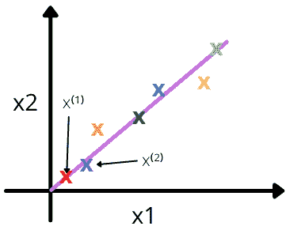

还原前

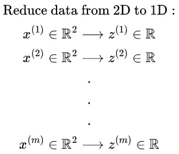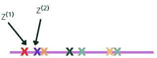

还原后

## 为什么有用？

由于各种原因，使用高维空间可能不方便，包括原始数据由于维数灾难而经常是模糊的，并且处理数据通常在计算上是昂贵的。降维在诸如信号处理、语音识别、神经信息学和生物信息学等处理大量观察值和/或变量的领域中很流行。

## 主成分分析

二维、三维或更高维度中的“最佳拟合”线可以定义为最小化从点到该线的平均垂直距离平方的线。第二条最佳拟合线可以用同样的方法从垂直于第一条线的方向选取。如果这对你来说似乎是胡言乱语，不要担心，我们将在这篇文章中看到这些事情的细节。

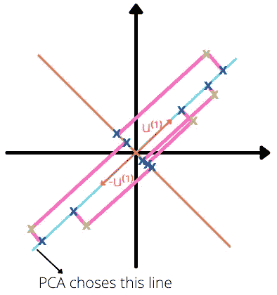

PCA 示例

绿点是实际点，而蓝点是投影点。
首先，PCA 确定投影数据的方向(矢量 u⁽ ⁾ ∈ ℝⁿ),以最小化投影误差。在上图中，距离用粉色线条表示。PCA 在最小平方误差的方向上选择一条线，该方向由所选择的线和一个点之间的距离决定。从上图我们还可以得出结论，橙色线是最差的线，因为点和线之间的距离很大。这里，负方向也可以选择，但是这里正负方向都在同一条线上。

一般来说，从 n 维减少到 k 维:找到 k 个向量 u⁽ ⁾，u⁽ ⁾,….将数据投影到其上的,u⁽ᵐ⁾，以便最小化投影误差。

为了帮助您理解，我们将首先使用一个示例 2D 数据集进行实验，以直观地了解 PCA 是如何工作的，然后在更大的数据集上使用它。

让我们加载我们的样本数据集，并以超快的速度将其可视化:

```
mat3 = loadmat('ex7data1.mat')
X3 = mat3['X']plt.scatter(X3[:, 0], X3[:, 1], alpha=0.5)
```

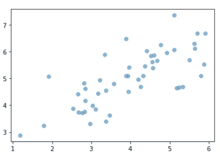

数据可视化

在使用我们的数据之前，我们需要将其标准化。在这篇文章中，我不会深入探讨正常化。了解更多关于正常化 [***点击这里***](/codex/linear-regression-on-multiple-variables-1893e4d940b1) 。

```
def featureNormalize(X):

    mu = np.mean(X, axis=0)
    sigma = np.std(X, axis=0)
    X_norm = (X - mu)/sigma

    return X_norm, mu, sigma
```

## 主成分分析算法

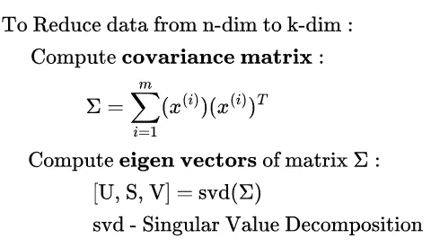

主成分分析算法

## 1.计算协方差矩阵

两个变量之间关系的度量是协方差。它量化了两个变量与其平均值的差异程度。它可以帮助我们理解这两个变量之间的关系。

协方差矩阵在上式中用希腊字母(sigma)表示，与求和不同。通过乘以 x⁽ⁱ⁾和 x⁽ⁱ⁾转置，我们可以获得协方差矩阵。

## 2.计算特征向量

解释更多的特征值和特征向量会使这篇文章太长，我将只使用 numpy 的 svd()方法。然而，为了方便起见，我将把计算特征值和特征向量的过程留在文章的最后。简单来说，特征值和特征向量将帮助我们找到 PCA 线的投影方向。 [***点击这里***](https://en.wikipedia.org/wiki/Eigenvalues_and_eigenvectors) 了解更多特征值和特征向量。这里 u 是 u⁽⁾,….u⁽⁾的向量集合要将数据投影到的,u⁽ᵐ⁾。


使用 svd()后，我们得到 U 作为上面的矩阵。返回的 U 矩阵包含 n 维的方向，我们需要选择 k 将 n 维矩阵减少到 k 维。k 维矩阵称为 U_reduce。

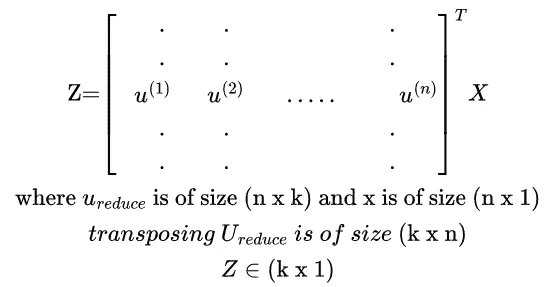

我们可以通过将 U_reduce 转置与 x 相乘得到降维的 z，这将大小为(n×1)的 x⁽ⁱ⁾减少到(k×1)。

通过将 U_reduce 乘以 z，我们可以近似地得到原始数据(X≈Xₐₚₚᵣₒₓ = U_reduce ⋅ Z)。原始数据和近似数据如下图所示:

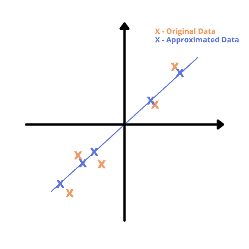

原始与近似

```
def PCA(X):
    m, n = X.shape
    cov_matrix = 1/m * X.T @ X
    U, S, V = np.linalg.svd(cov_matrix)
    return U, S, VX_norm, mu, sigma = featureNormalize(X3)
U, S, V = PCA(X_norm)

plt.scatter(X3[:, 0], X3[:, 1], alpha=0.5)
plt.plot([mu[0], (mu + 1.5 * S[0] * U[:, 0].T)[0]], [mu[1], (mu + 1.5 * S[0] * U[:, 0].T)[1]], color="black", linewidth=3)
plt.plot([mu[0], (mu + 1.5 * S[1] * U[:, 1].T)[0]], [mu[1], (mu + 1.5 * S[1] * U[:, 1].T)[1]], color="black", linewidth=3)
plt.xlim(-1,7)
plt.ylim(2,8)
```

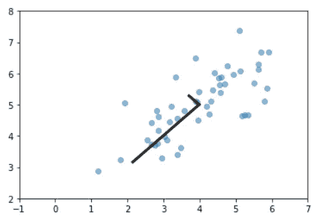

PCA 方向

```
def projectData(X, U, K):

    m = X.shape[0]
    Z = np.zeros((m, K))
    for i in range(m):
        for j in range(K):
            projection_k = X[i, :] @ U[:, j] #x @ U_reduce
            Z[i, j] = projection_k
    return ZK=1
Z = projectData(X_norm, U, K)def recoverData(Z, U, K):
    z = Z.shape[0]
    u = U.shape[0]
    X_rec = np.zeros((z, u))

    for i in range(z):
        for j in range(u):
            X_rec[i, j] = Z[i, :] @ U[j, :K]
    return X_recX_rec  = recoverData(Z, U, K)plt.scatter(X_norm[:,0],X_norm[:,1],marker="o",label="Original",facecolors="none",edgecolors="b",s=15)
plt.scatter(X_rec[:,0],X_rec[:,1],marker="o",label="Approximation",facecolors="none",edgecolors="r",s=15)
plt.title("The Normalized and Projected Data after PCA")
plt.legend()
```

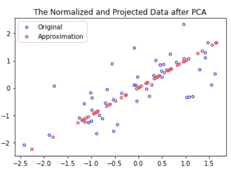

原始值与近似值

## 选择 k(主成分数)

我们可以通过下式选择 k:

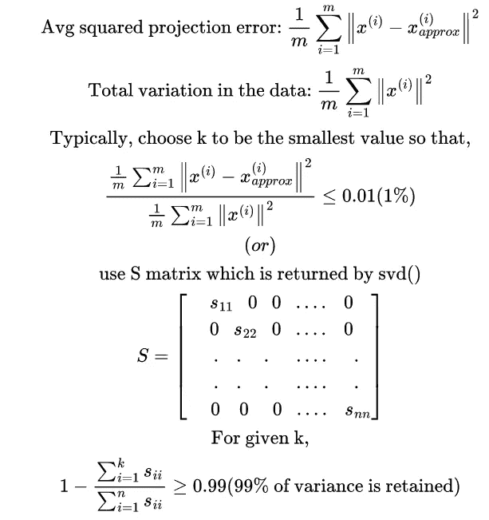

保留 95%到 99 %的差异是好的和可接受的。

## 应用 PCA

1.  x⁽ⁱ⁾ →z⁽ⁱ⁾的映射应该通过仅在训练集上运行 PCA ***来定义。***
2.  不要使用 PCA 将特征的数量减少到 k。这可能行得通，但不是解决过度拟合的好方法。
3.  在实现 PCA 之前，首先尝试运行您想对原始数据做的任何事情。只有当它不做你想要的，然后实施 PCA。

这需要大量的代数和数学运算，让我们深入到使用主成分分析的人脸降维中。

让我们快速加载和可视化数据集:

```
mat4 = loadmat('ex7faces.mat')
X4 = mat4['X']fig, ax = plt.subplots(nrows=10,ncols=10,figsize=(8,8))
for i in range(0,100,10):
    for j in range(10):
        ax[int(i/10),j].imshow(X4[i+j,:].reshape(32,32,order="F"),cmap="gray")
        ax[int(i/10),j].axis("off")
```

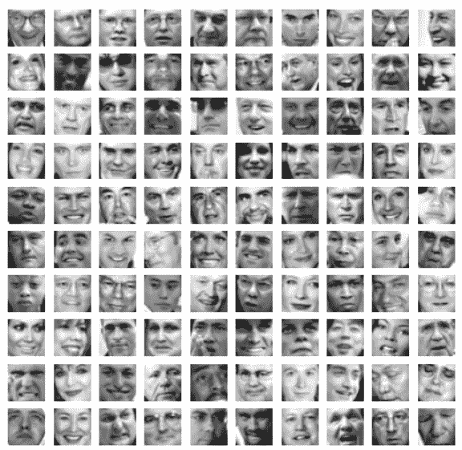

让我们对该数据集应用主成分分析并将其可视化:

```
X_norm2, mu2, sigma2 = featureNormalize(X4)
U2, S2, V2 = PCA(X_norm2)
U_reduced = U2[:,:36].T
fig2, ax2 = plt.subplots(6,6,figsize=(8,8))
for i in range(0,36,6):
    for j in range(6):
        ax2[int(i/6),j].imshow(U_reduced[i+j,:].reshape(32,32,order="F"),cmap="gray")
        ax2[int(i/6),j].axis("off")
```

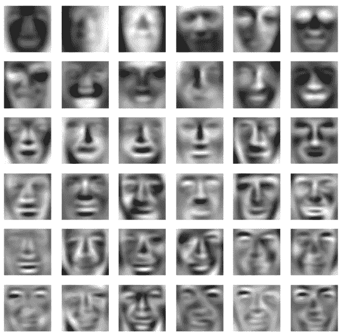

让我们将面的尺寸从 1024 减少到 100:

```
K2 = 100
Z2 = projectData(X_norm2, U2, K2)
print("The projected data Z has a size of:",Z2.shape)
X_rec2  = recoverData(Z2, U2, K2)
fig3, ax3 = plt.subplots(10,10,figsize=(8,8))
for i in range(0,100,10):
    for j in range(10):
        ax3[int(i/10),j].imshow(X_rec2[i+j,:].reshape(32,32,order="F"),cmap="gray")
        ax3[int(i/10),j].axis("off")
```

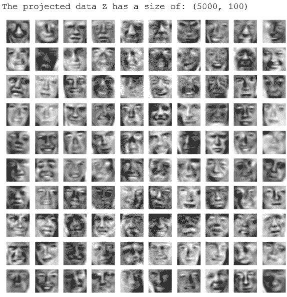

预计数据

## 关于特征值和特征向量的补充说明

求特征值和特征向量的程序:
1。求特征方程。
2。求解特征方程得到特征根。它们也被称为特征值或潜在根。
3。为了找到特征向量，对于不同的λ值求解(A-λI)X= 0。

# 结论

今天，我们看到了 PCA 的内幕以及它实际上是如何工作的。然后用 python 的 numpy，pandas 和 matplotlib 从头开始创建。它在许多应用中更有用，有助于以非常低的数据损失来降低数据的维度。数据集和最终代码上传到 Github。

点击这里查看 [PCA](https://github.com/jagajith23/Andrew-Ng-s-Machine-Learning-in-Python/tree/gh-pages/Unsupervised%20Machine%20Learning) 。

# 如果你喜欢这篇文章，那么看看我以前在这个系列中关于

## 1.[什么是机器学习？](/@jagajith23/what-is-machine-learning-daeac9a2ceca)

## 2.[机器学习有哪些类型？](/codex/what-are-the-types-of-machine-learning-53360b7db8b4)

## 3.[一元线性回归](/codex/linear-regression-on-single-variable-f35e6a73dab6)

## 4.[多元线性回归](/codex/linear-regression-on-multiple-variables-1893e4d940b1)

## 5.[逻辑回归](/codex/logistic-regression-eee2fd028ffd)

## 6.[什么是神经网络？](/@jagajith23/what-are-neural-networks-3a0965e2ebfb)

## 7.[使用神经网络的数字分类器](/codex/digit-classifier-using-neural-networks-ad17749a8f00)

## 8.[利用 K 均值聚类的图像压缩](/codex/image-compression-with-k-means-clustering-48e989055729)

## 9.[使用异常检测来检测网络上的故障服务器](https://jagajith23.medium.com/detect-failing-servers-on-a-network-using-anomaly-detection-1c447bc8a46a)

# 最后做的事

如果你喜欢我的文章，请鼓掌👏一个追随者会是🤘统一🤘而且有助于媒体推广这篇文章，让其他人也能阅读。*我是 Jagajith，下一集再来抓你。*