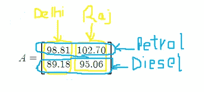
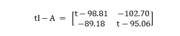
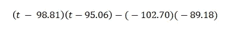
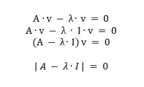
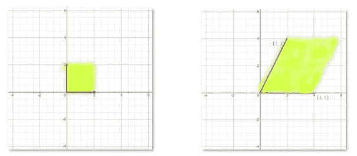
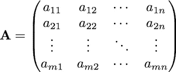
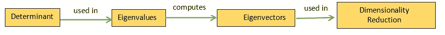

# 用特征值和特征向量 101 进行降维

> 原文：<https://medium.com/codex/dimensionality-reduction-with-eigen-value-eigen-vectors-101-89f36e90e58?source=collection_archive---------6----------------------->

首先不是 E，是眼甘！像特征向量或者特征值这样的词，看起来很难理解，然而，它无处不在，但是要认识到它们可能有用，你需要依靠直觉。看，人类每天都在创造爆炸性数量的所谓“数据”。关键是，到最后，这些数据不过是一个矩阵！这可以用来获得洞察力。

最简单的例子首先，两个州两个城市的生活成本不同。德里目前的汽油价格几乎达到了 100 卢比。98.81 卢比，而拉贾斯坦邦的 Sri Ganganagar 区是全国油价最高的地区。每升 102.70。在德里，柴油价格为卢比。每升 89.18 卢比，而在 Sri Ganganagar，每升 89.18 卢比。每升 95.06。

当数据以矩阵形式编码时。

我们现在计算的行列式

其中，I 是单位矩阵。

也就是说，

因此，上述等式表示 *A 的特征多项式，t 的值是其根*。

现在让我们把上面的工作与本文的核心思想联系起来，那就是——特征值就是矩阵的一个特征多项式的根，其中行列式等于零。明白了吗？如果你没有也没关系，我们以后肯定会讨论这个问题。

让我们来认识一些术语:

~所有数据集都有一个*响应变量*，这将是你试图预测的一个*量。*假设我们想知道在一场板球比赛中六个回合后的比分是多少。

~接下来，您用来预测响应的*变量称为特征。在这里，以往比赛中得分的得分，击球手选择的得分都是特征。*

要么提出有意义的特征，要么在特征太多的情况下减少特征的数量，这似乎已经成为机器学习过程中无处不在的一部分。以便有利于计算并避免过拟合。

现在主要的事情来了，一种非常流行的减少特征空间的技术被称为**主成分分析** (PCA)。想法是这样的:我有一个很大的特性集(即许多列)，比如说，n。我想减少特性的数量，比如说，d(其中 d < n)。该过程是为了找到一组最能描述我的数据集中的变化的“d”特征。 ***记住，主成分分析只适用于特征似乎相关的情况。*** 要真正理解 PCA，你需要理解线性代数的概念，尤其是特征值！

为了获得直观的理解，我想让你进入想象的世界，你在一个神奇的地方&有一个洞穴。你可以看到几个房间，你可以走进你选择的任何一个房间，然后出来。在这里，每个房间都有能力改变你的某些东西。现在，如果任何一个房间让你变大或变小，那么你，这个房间和你变高或变矮的程度将会有一些特殊的名字。

Giphy 的 GIF

*你是矢量！* *让房间成为操作员。*当你穿过一个房间时(*当算子作用于向量*时)，如果它使你变高或变矮(缩放向量)，那么*向量被称为算子的特征向量*。规模有多大？你增加或减少的*值称为特征值*。记住你是一样的，只是高度变了！

> 也就是说，变换前后的特征向量指向相同的方向。

作用于矢量的算符与数字(特征值)乘以矢量相同。

**想要一个极客的解释来解决特征值问题？**

*首先，计算 A-λI 的行列式*

注意:行列式基本上是导致变换矩阵拉伸一个区域的因子的度量。

考虑坐标平面上的一个标准正方形，面积为四个正方形单位。当空间被变换矩阵拉伸时，新的区域是 16 个平方单位。矩阵的行列式是 4，因为面积是 4 倍。

*第二，求这个多项式的根，通过求解 det(A-λI) = 0。这 n 个根就是 a 的 n 个特征值*

通过要求行列式等于 0，变换后正方形的面积被压缩为零，这意味着定义轴位置的两个向量在同一条线上。特征值是它被拉伸的因子(即行列式)。

*第三，对于每个特征值λ，求解(A-λI)x = 0 求一个特征向量 x*

红色药丸的时间到了，让我们在讨论教育和贫困如何影响犯罪率时这么说吧。如果，我不想同时处理这两个特性。啊！我可以使用 PCA 将我的数据集减少到一个特征(顺便说一下，在现实生活的数据集上，两个特征算不了什么，但是这里是为了简单起见)。也许低教育水平似乎与贫困相关，所以两个变量都不需要，我可以使用两个变量的单一组合。

您可能会想，我们是否可以使用存储在这些变量中的信息，并提取一组较小的变量(特征或列)来训练模型并进行预测，同时确保原始变量中包含的大部分信息得到保留。

答案是，绝对可以！此外，这将导致一个更简单和计算有效的模型，这就是特征值和特征向量进入图片。

另一个相关的例子是，当处理许多列和行的数据时，一个典型的数据分析师可能会想，第一个特征与第二个特征有任何关联吗？还是第一个的价格值会增加还是第二个的？此时，他/她会希望通过使用线性代数中的奇异值分解将数据简化为更现实的东西。通过这样做，人们将从不同的角度看待新数据，并且可以消除无用的数据。奇异值分解完全基于特征值和矩阵。

从数学的角度来看，在进行降维工作时，如果你将数据放入一个矩阵中，结果会是

每一行都是一些观察的特征。

最好的新特征，即捕获原始数据集最大变化的旧特征的组合，将成为 atA 的特征向量(我们用 AT 表示矩阵 A 的转置)，事实上，具有最大特征值的特征向量携带最大变化(所谓的主分量)。在我们的方案中，特征值给出了损失，因为降低维度会导致信息损失。因此，最大特征值的特征向量是最重要的，应该保留，如果你想最小化“损失”。

这种证明是相当优雅的，绝对要看得更清楚。

## 使用 Python 实现的初级步骤:

立正！这里我使用了 eig，它适用于使用较慢算法的一般矩阵。然而，有 eigh 保证使用更快的算法对特征值进行排序，利用了矩阵是对称的这一事实，尽管它不检查矩阵是否确实对称。

**思维导图:**

**事实核查:**

另一个众所周知的例子是谷歌的专利页面排名算法。图的最大特征向量就是页面的排名！所以，是的，这些概念在现实生活中有很多例子。

# 总结…

这篇文章旨在让从事数据工作或对 Eigen 的基本概念感兴趣的人。我希望我能够回答“寻找特征向量背后的本质是什么？”。

**主要参考文献:**

[Python 编程和数值方法——工程师和科学家指南](https://pythonnumericalmethods.berkeley.edu/notebooks/chapter15.01-Eigenvalues-and-Eigenvectors-Problem-Statement.html)

[矩阵的瑰宝:深入探究特征值&特征向量](https://towardsdatascience.com/the-jewel-of-the-matrix-a-deep-dive-into-eigenvalues-eigenvectors-22f1c8da11fd)

万岁。