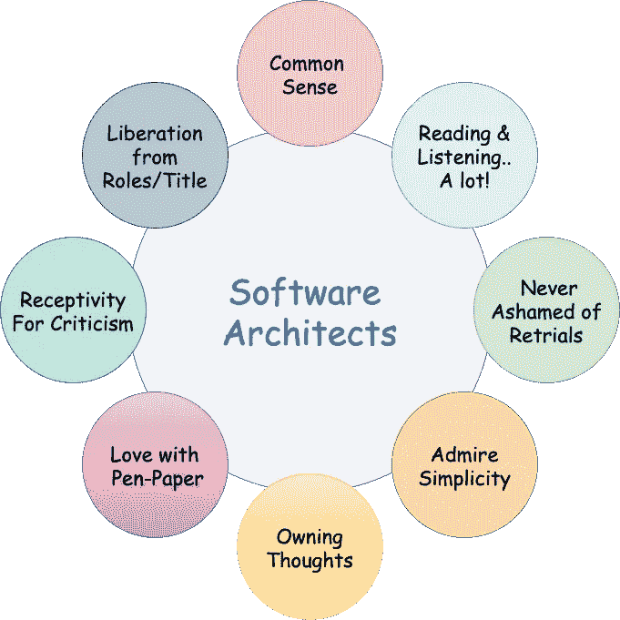

# 软件架构师的维度

> 原文：<https://medium.com/codex/dimensions-of-a-software-architect-4ea97b8f0d3f?source=collection_archive---------18----------------------->

***软件架构师的基本特质是什么？***

虽然这个主题的范围很广，但是我认为有一些基本的特征可以帮助我们成为一个有效和合理的软件架构师。

> 架构师——作为一种职责，作为一种服务，伴随着许多未知:已知的未知和未知的未知。如其所说…这都是关于**【权衡】**

你能否成为一名建筑师的早期迹象，始于思想的内在表现&当你开始相信你所看到/经历的一切都在帮助你获得你下一步想做的一切的心理反馈循环。这种精神上的重用在有可能成为建筑师的思考者身上非常明显。

让我们看看这些基本特征，以及它们如何影响。

> 常识:这是一种保持事物简单的艺术，在我们去掉所有无关紧要的东西后，保持事物的原样。运用街头智慧。

例子:我们中的许多人努力在生产中进行正确的监控，同时花费大量的时间和精力来纠正由于缺乏监控而产生的问题。将 excel 上传用于有限的业务用途，而不是尝试会逆转成本效益比的花哨新功能。另一个例子是使用简单的通知来避免滥用工作流。

> **阅读&倾听:**这一切都是为了保持我们的思想开放。海绵真的很方便拿起东西，有时阅读别人的情况，并能够联系或预见自己的问题。

到目前为止，所有的模式都被接受，因为它们是在其他学习者阅读和讨论的基础上实现的。因此，与人们横向和纵向交谈，以了解你可能遇到的各种想法，并筛选出想要解决问题或想要讨论的人。

通常，你并没有解决一个独特的问题。在每个相当成熟的企业中，编排或规则引擎通常都是可用的，但是我们花费时间和精力来开发一些东西，而没有首先花费 30%的精力来进行社交，这可能会给我们一个构建良好的联合解决方案。

> **永远不要以试验为耻****:**POC 是一种很好的联系方式，不会给任何承诺交付的关键路径带来风险。永远留意那些愿意花时间和精力去探索不同维度的人。变化是每一次尝试的副产品，准备好去做或者成为一个代理人，把它引入你的团队或组织。

崇尚简单:建筑是一个选择的问题，而选择是我们对形势理解的结果。从最少的奢侈品和花费开始，在你走上斜坡时，通过花哨的模板和行话给每个人留下深刻印象，在魅力链中向上移动。

**拥有想法:**作为建筑师，我们需要能够在设计中融入自我，并心甘情愿地让这些想法经受住公众的审视。旅程或沉思的过程应该让你满足，而不仅仅是结果。人们会因为你的想法而了解你，尊重你的心态，尊重你的观点。尊重是对建筑师最非物质化的促进之一。

**对纸笔的热爱:**我亲身经历过在会议室摆弄马克笔画画的经历，即使没有设计讨论的计划。绘画能力是将事物形象化的基本原料，以及它们如何与现实相似或不同。不知不觉地，它经常让你的神经元接触并产生新的想法，这些想法不是很线性但很强大，因为它们利用了我们前面谈到的精神反馈回路。

接受批评:作为建筑师，我们的工作从定义上来说是面向公众的，这可能会吸引各个层面不必要的关注。从长远来看，这种关注被打扮成经验。一旦我们能够将评论或批评作为分母，无法前进的机会就会减少。即使你有你的自我参与，情绪仍然会退居其次。

批评/接受=失败的机会。

**从角色中解放&标题:** *像没有人在看你一样跳舞* —当我们在白板上自由表达自己时，就会出现这种情况。如果你处于变得成熟、精通技术或拥有 FOMO 的压力之下，那么你仍然在抑制真实的自我。尽管这些拉力和压力实际上是不可避免的，但有时你必须跨越界限才能做出有效的推销。暂时的烦恼是一个好设计的巨大投入。

总的来说，我强烈地感觉到，有了所有这些基本原则，你一定可以在成为一个有意义的和多产的软件架构师的道路上发展。

请鼓掌或分享你的想法！