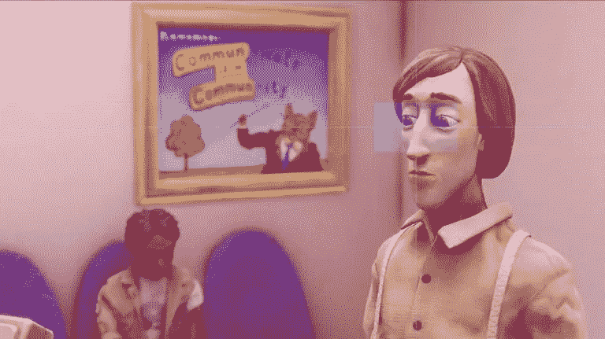

# 🎥发现 Unity cinema Chine 插件的魔力！

> 原文：<https://medium.com/codex/discover-the-magic-of-unitys-cinemachine-plugin-c758ae11ab8e?source=collection_archive---------7----------------------->

## 你知道如何轻松地为你的游戏制作漂亮的相机吗？:)

*哈罗德比目鱼 by Slow Bros(图片来自:*[https://unity . com/fr/unity/features/editor/art-and-design/cinemachine](https://unity.com/fr/unity/features/editor/art-and-design/cinemachine)*)*

在[我做的另一个关于行为树的教程](/geekculture/how-to-create-a-simple-behaviour-tree-in-unity-c-3964c84c060e)中，我展示了一个小场景的例子，其中有一个警卫在走动，一个飞行摄像机持续跟踪角色: