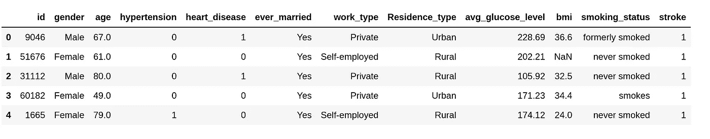
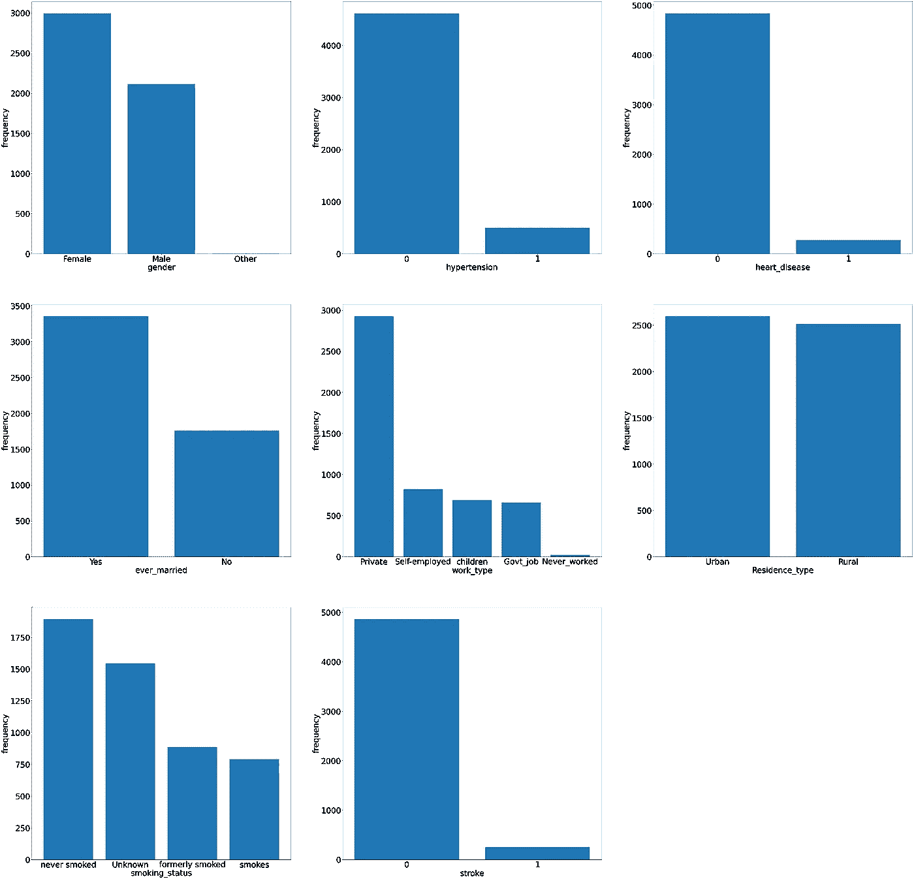
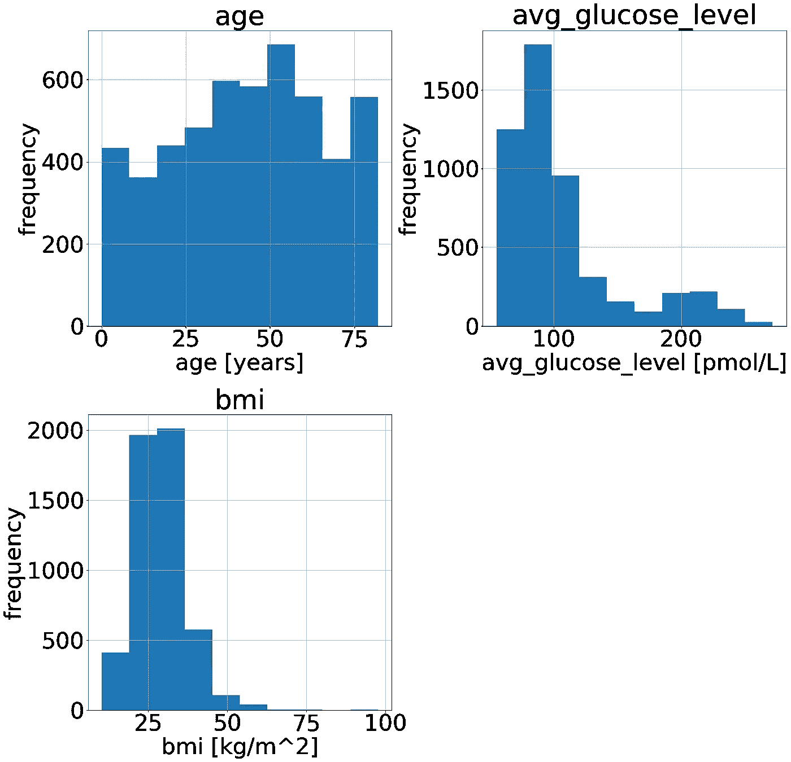
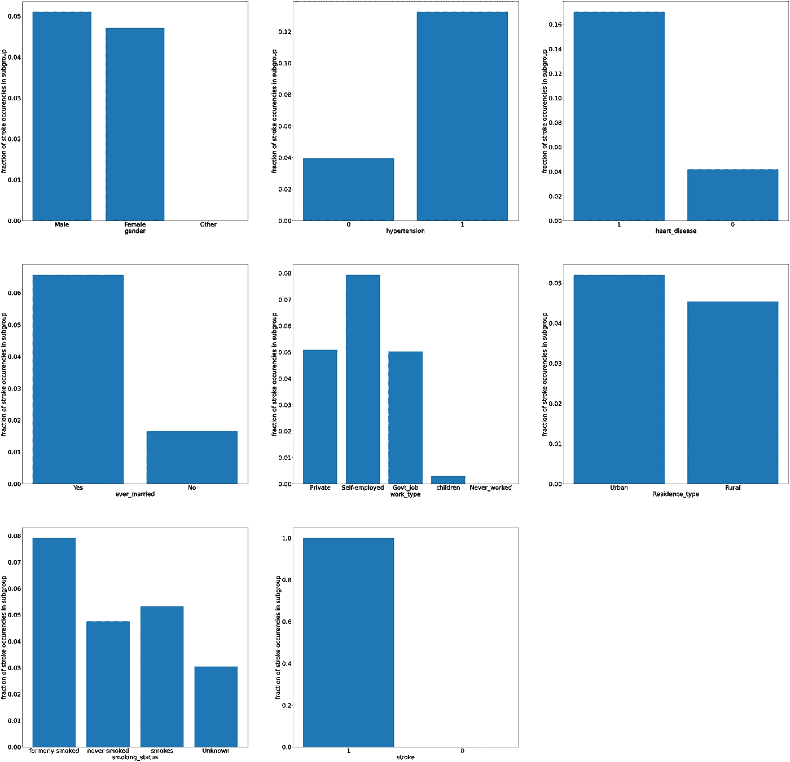
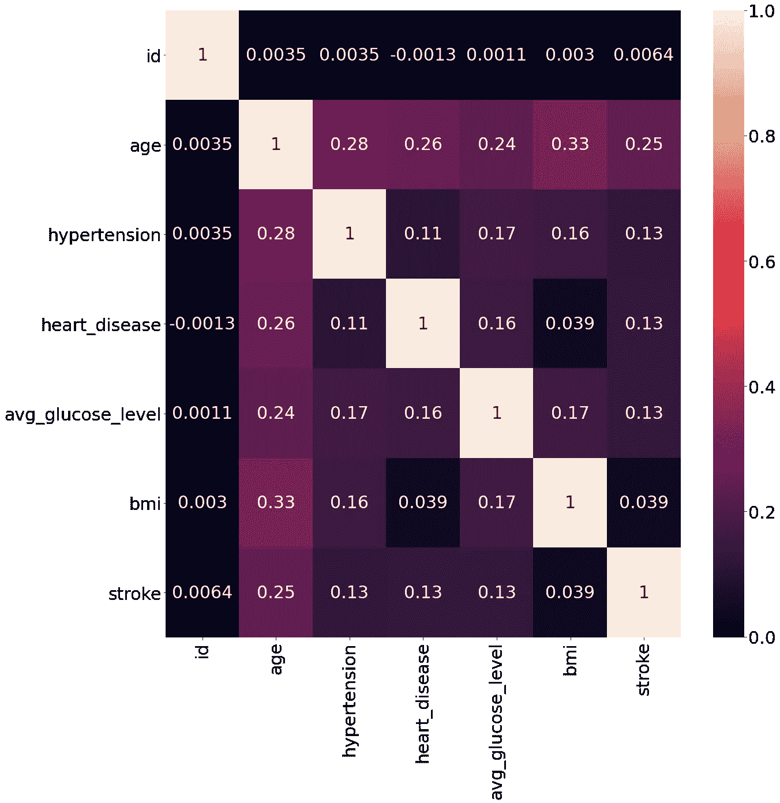
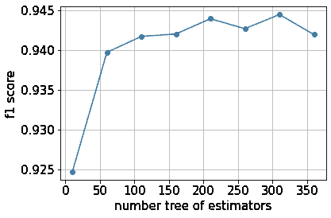
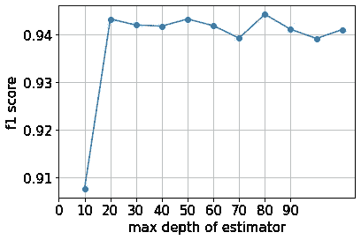
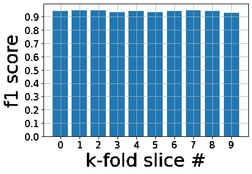
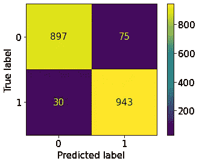
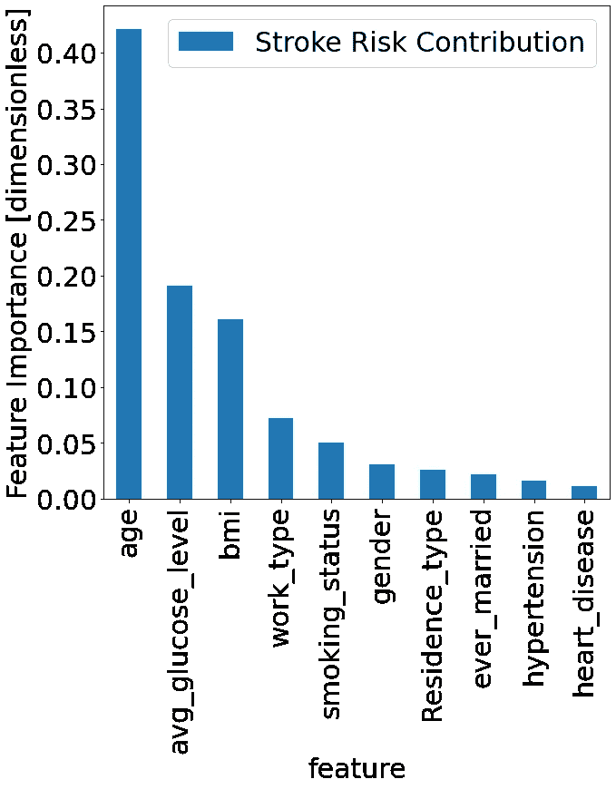

# 从不平衡的数据集中发现中风的危险因素

> 原文：<https://medium.com/codex/discovering-stroke-risk-factors-from-an-unbalanced-data-set-a53be32b073c?source=collection_archive---------4----------------------->

## [法典](http://medium.com/codex)


**目标**

任何数据科学家都会在学习过程中的某个时候遇到班级失衡问题。这是指在二元分类问题的情况下，数据集包括一个类别标签的许多实例和另一个类别标签的少数实例。在这篇文章中，我讨论了如何克服这个问题，并建立一个高度预测中风事件的统计 ML 模型，给定匿名的患者历史数据。目的是找出哪些生活方式和医疗条件会增加中风事件的风险，我使用公开的、匿名的[数据](https://www.kaggle.com/fedesoriano/stroke-prediction-dataset)来回答这个问题，这些数据是从 5000 个人身上收集的。我解决了技术挑战和从这项任务中学到的医学见解。

**数据预处理**

面临的挑战是预测受试者是否会发生中风事件，给定他们的临床特征。这是一个二元分类问题，其中分类器将输出中风或无中风事件，或者中风发生的概率。第一步是探索可用的数据。

```
data = pd.read_csv(“/kaggle/input/stroke-prediction-dataset/healthcare-dataset-stroke-data.csv”)data.head()
```



表 1。显示数据集的列条目的表。作者使用 Pandas Python 库生成的图像。

该数据集包含分类变量(高血压、心脏病、婚姻状况、工作类型、居住类型和吸烟状况)和数字变量(年龄、平均血糖水平和体重指数)的混合。中风发作记录为存在(1)或不存在(0)。第一步是检查缺失值(nan)的数据，这些数据在统计分析中没有用。处理 NaN 的常见方法是移除具有 NaN 的行，或者用平均特征值替换 NaN，因为统计模型不太可能认为该特征值具有高度预测性。

```
#Data preprocessingneed_clean = []
for x in list(data.columns):
    if True in list(data[x].isna()):
        need_clean.append(x)   #only have missing values in bmidata["bmi"]=data["bmi"].fillna(np.mean(data["bmi"]))need_clean = []
for x in list(data.columns):
    if True in list(data[x].isna()):
        need_clean.append(x)   #we have now gotten rid of Nans, checking that the need clean array now remains empty 
```

**数据探索**

一旦数据集干净了，就可以开始研究数据了。首先，可视化特征空间中的分布是有趣的。使用条形图绘制分类特征。

```
##### explore the training data
import matplotlib.pyplot as plt
import matplotlib
cat_list =['gender','hypertension','heart_disease','ever_married','work_type', 'Residence_type','smoking_status','stroke']# grouped bar chart
plt.figure(figsize = (70,70))
for i in range(0, len(cat_list)):

    primary_cat = cat_list[i]
    plt.subplot (3,3,i+1)
    chart = plt.bar(x = np.arange(0,len(data[primary_cat].unique())),
    height = data[primary_cat].value_counts())
    plt.xlabel(primary_cat)
    plt.ylabel("frequency")
    plt.xticks(ticks = np.arange(0,len(data[primary_cat].unique())), labels=data[primary_cat].value_counts().index.to_list())

matplotlib.rcParams.update({'font.size': 45})
```



图一。数据集的分类特征以条形图的形式呈现。图由作者制作。

分析稍微偏向于在私营部门工作的女性人口，因为数据集条目中大约三分之二是妇女，类似比例的条目涉及私营部门的工人。

数字特征绘制在图 2 的直方图上。有趣的是，我们看到了葡萄糖水平的两个峰值，并且所有年龄组都有很好的代表性。

```
cat_list =['age','avg_glucose_level','bmi']
xlabels = ['age [years]','avg_glucose_level [pmol/L]','bmi [kg/m^2]']hist= data[cat_list].hist(figsize= (25,25))
i=0
for ax in hist.flatten():
    ax.set_xlabel(xlabels[i])
    ax.set_ylabel('frequency')
    i+=1
```



请注意，与非中风病例相比，数据集中的中风病例非常少，如图 1 最后一项(特征值=1)所示。在这个数据集中，中风病例仅占所有数据点的 4.87%。当预测两个具有如此大的类别标签差异的类别时，分类器通常在大多数时间学习预测过度表示的类别，因为这给出了 90%范围内的准确度。幸运的是，有一些方法可以让我们的分类器性能更好，我将在本文后面提到。

探索在每个特征类别中有多少中风病例也是有趣的，以便查看哪些特征在分类器中可能具有预测价值。

```
import matplotlib
import matplotlib.pyplot as plt
#compare relative contributions of stroke risk by incorporating percentage of people within each category that have had stroke (eg percentage of government workers that have had stroke to percentage of self employed who had stroke)#explore relationship between categorical variables and stroke events counting how many occurrences of stroke amongst different categories presentedcat_list =['gender','hypertension','heart_disease','ever_married','work_type', 'Residence_type','smoking_status','stroke']
# grouped bar chart
plt.figure(figsize = (70,70))
matplotlib.rcParams.update({'font.size': 30})
for i in range(0, len(cat_list)):
    combined = []
    normalisation =[]
    primary_cat = cat_list[i]
    for j in range(0, len(data[primary_cat].unique())):
        secondary_cat = 'stroke'
        primary_sub_cat = data[primary_cat].unique()
        combined.append(sum((data[primary_cat]==primary_sub_cat[j]) & (data[secondary_cat] == 1)) )
        normalisation.append(sum(sum([data[primary_cat].values==primary_sub_cat[j]])))
    plt.subplot (3,3,i+1)
    chart = plt.bar(x = np.arange(0,len(data[primary_cat].unique())),
    height = np.divide(combined, normalisation))
    plt.xlabel(primary_cat)
    plt.ylabel("fraction of stroke occurencies in subgroup")
    plt.xticks(ticks = np.arange(0,len(data[primary_cat].unique())), labels=data[primary_cat].unique()) 
```



图 3。呈现了在分类特征的每个子类中出现的中风病例总数的分数。作者创作的人物。

毫不奇怪，中风病例可以在高血压患者或心脏病患者中发现。高中风存在的其他类别似乎是某人是否曾经结过婚(在你想推迟你的婚姻之前，认为这一特征可能与年龄相关，因此会混淆结果)，自雇和曾经吸烟的状态似乎也很突出。另一种推断特征重要性的方法是查看特征和我们试图预测的实体之间的 Pearson 相关系数。这种分析只能应用于数字特征，如图 4 所示。

```
#check correlations between variables and what features the stroke variable correlates with
import matplotlib.pyplot as plt
import seaborn as sns
import matplotlibcorrs = data.corr()
plt.figure(figsize=(20,20))
sns.heatmap(corrs,annot=True)
```



图 4。数值变量间的皮尔逊相关系数。作者创作的人物。

中风特征似乎与年龄相关，与高血压、心脏病和平均血糖水平的相关性更小。线性相关性可以指示预测属性，但是要小心，因为这假设了线性关系，并且一些特征到特征的关系可以是非线性的。这些发现将通过构建统计分类模型进行测试，并查看哪些特征对成功分类最有用。

**特色工程**

选择特征或选择将哪些特征添加到模型中的一个重要部分是选择它们之间没有强相关性的特征。两个高度相关的特征使得其中一个特征冗余，并且不增加额外的预测信息。虽然年龄似乎与所有其他特征相关，但是在一对特征之间观察到的相关性仍然是适度的(<0.4). A feature ought to be dropped if a strong correlation (> 0.6)。用于分类的其他特征之间的线性相关性仍然很低。

接下来，使用 sklearn 的简单 LabelEncoder 方法将分类特征转换为数值，该方法使用下面的代码将不同的特征值标记为整数。

```
#Convert categorical vars to numbers by using a Label Encoderfrom sklearn.preprocessing import LabelEncoder
cat_list_names =['gender','ever_married','work_type', 'Residence_type','smoking_status','stroke']
ids_categorical_columns = []
i=0
for x in data.columns:
    if type(data[x][1]) == str:
        ids_categorical_columns.append(i)

        encoderLabel= LabelEncoder()
        encoderLabel.fit(data.iloc[:,i].values.reshape(-1,1))
        data[x]=encoderLabel.transform(data.iloc[:,i].values.reshape(-1,1))
    i+=1
```

接下来，解决阶级不平衡的问题。有两种可能的解决方案。对模型中未充分呈现的类别标签(中风正类别)的权重进行上采样将导致模型更加努力地正确分类该类别标签，代价是将一些非中风结果误分类为中风可能结果。这在理论上是可行的，因为在代价函数中，当错误分类一个笔画时，模型比非笔画标签受到更多的惩罚。发现该方法在该数据集上评估的 RandomForest 分类器上不产生正面结果。一种替代方法是生成属于由笔画正标签跨越的特征空间的合成数据。这被称为少数类的上采样。一种方法是合成少数过采样技术或简称 SMOTE，它在具有相同类别标签的相邻点之间绘制线性拟合，并选择特征值位于特征空间中这两点之间的点。把这个过程想象成特征空间中的一种插值。下面是作为 imblearn 库的一部分的 SMOTE 的工作实现的代码。

```
#upsample the under-represented class
from imblearn.over_sampling import SMOTEupsampler = SMOTE()X, y = upsampler.fit_resample(data[['gender','age','hypertension','heart_disease','work_type','avg_glucose_level','bmi','ever_married','Residence_type','smoking_status']], data['stroke'])
upsampled_df = X.assign(stroke = y)upsampled_df["stroke"].value_counts()
```

这实现了每个类标签中 4861 个条目的类平衡。接下来，要选择和训练一个统计模型。训练随机森林分类器，因为它是一种通用算法，可以处理分类和数字输入的混合，并允许提取与预测相关的特征，并可以帮助识别中风的风险因素。

**模特培训**

训练集被进一步分成训练集和验证集，比率为 0.8 比 0.2。选择的模型是随机树集成分类器，因为它可以很好地处理分类和数字数据的混合，具有少量的特征。该结果还与正则化的线性分类器进行了比较，后者显示出较差的性能。对最大树深度和最大树数量的超参数研究表明，分类器在该数据集的大树数量(> 20)和最大树分裂数量(> 160)时开始过度拟合，如图 5 所示。

```
#optimize a RandomForestClassifier

from sklearn.ensemble import RandomForestClassifier
from sklearn.metrics import f1_score
from sklearn.model_selection import train_test_split accuracy=[]
train_accuracy = []
f1=[]
num_est =[]
max_depth=[]
for n_est in np.arange(10,300,50):
    i=0
    data_train_val, data_test_val=train_test_split(data_train,test_size=0.2,random_state=42)
    RFC=  RandomForestClassifier(max_depth=60,n_estimators = n_est,class_weight = {0:1,1:1})

    X_train = data_train_val.iloc[:,:-1]
    y_train = data_train_val.iloc[:,-1]
    X_val = data_test_val.iloc[:,:-1]
    y_val = data_test_val.iloc[:,-1] RFC.fit(X_train.values,y_train.values)
    yhat_RFC = RFC.predict(X_val.values) accuracy.append(sum(abs(yhat_RFC- y_val)))
    train_accuracy.append(sum(abs(y_train.values-          RFC.predict(X_train.values))))
    f1.append_(f1_score(y_val,yhat_RFC))
    num_est.append(n_est)
    max_depth.append(max_d)
    i+=1accuracy=[]
train_accuracy = []
f1_max_depth=[]
num_est =[]
max_depth=[]
for max_dep in np.arange(10,300,50):
    i=0
    data_train_val, data_test_val=train_test_split(data_train,test_size=0.2,random_state=42)
    RFC=  RandomForestClassifier(max_depth=max_dep,n_estimators = 160,class_weight = {0:1,1:1})

    X_train = data_train_val.iloc[:,:-1]
    y_train = data_train_val.iloc[:,-1]
    X_val = data_test_val.iloc[:,:-1]
    y_val = data_test_val.iloc[:,-1]RFC.fit(X_train.values,y_train.values)
yhat_RFC = RFC.predict(X_val.values) accuracy.append(sum(abs(yhat_RFC- y_val)))
train_accuracy.append(sum(abs(y_train.values- RFC.predict(X_train.values))))
    f1_max_depth.append(f1_score(y_val,yhat_RFC))
    num_est.append(n_est)
    max_depth.append(max_d)
    i+=1#similar code for the max tree depth can be found in the github repo
```



f1 分数是一个准确性指标，同样优先考虑精度和召回指标。精度指标查看的是真阳性的数量除以真阳性和假阴性的总和(或阳性的总数)。这是对所有阳性中有多少部分被正确分类的度量。召回是真阳性除以真阳性和假阳性的总和。当作出肯定的预测时，回忆评估模型识别真正肯定的能力。

模型参数确定后，进行 10 倍交叉验证，以测试模型的预测能力，同时减少偏差和过度拟合。这将评估模型在数据集切片上执行的能力。

```
#k-fold cross validation for model
from sklearn.linear_model import RidgeClassifier
from sklearn.ensemble import RandomForestClassifier
from sklearn.model_selection import KFold
from sklearn.metrics import f1_score
from sklearn.model_selection import train_test_split
# perform K-fold cross validationcross_val = KFold(n_splits = 10,shuffle=False)accuracy=[]
train_accuracy = []
crossval_f1=[]
for train,test in cross_val.split(data_train):
    RFC=  RandomForestClassifier(max_depth=60,n_estimators = 160,class_weight = {0:1,1:1})
    X_train = data_train.iloc[train,:-1]
    y_train = data_train.iloc[train,-1]
    X_val = data_train.iloc[test,:-1]
    y_val = data_train.iloc[test,-1]RFC.fit(X_train.values,y_train.values)
    yhat_RFC = RFC.predict(X_val.values)accuracy.append(sum(abs(yhat_RFC- y_val)))
    train_accuracy.append(sum(abs(y_train.values- RFC.predict(X_train.values))))
    crossval_f1.append(f1_score(y_val,yhat_RFC))
    i+=1
```



图 6。随机树分类器的 10 重交叉验证的结果。将中风训练数据分成 10 份，在 9 份上训练模型，在 1 份上评估模型。

对于训练集的不同折叠，F1 分数度量在模型预测中是稳定的。这表明一个良好的偏差-方差权衡，意味着模型不会过度拟合或欠拟合数据的任何部分。最后，在所有可用的训练和验证数据上重新训练该模型，并在测试集上评估该模型，该测试集最初被忽略并且是该模型完全看不到的数据。测试集上的 F1 分数是 0.94。

```
# retrain model on all of the training data and output final test set f1 scoreaccuracy=[]
f1_test=[]
RFC=  RandomForestClassifier(max_depth=60,n_estimators = 160,class_weight = {0:1,1:1})
X_train = data_train.iloc[:,:-1]
y_train = data_train.iloc[:,-1]
X_test = data_test.iloc[:,:-1]
y_test = data_test.iloc[:,-1]RFC.fit(X_train.values,y_train.values)
yhat_RFC = RFC.predict(X_test.values)accuracy.append(sum(abs(yhat_RFC- y_test)))
f1_test.append(f1_score(y_test,yhat_RFC))
print("Test set F1 score:"+str(f1_test[0]) )

confusion_mat=confusion_matrix(y_test,yhat_RFC)
plot_confusion_matrix(RFC,X_test,y_test)
```

探索 F1 分数编码了什么的一个方法是为这个分类器绘制一个混淆矩阵。一个混淆矩阵显示了每个班级有多少科目被正确分类。这可以从图 7 的矩阵图中看出。在笔画预测的情况下，分类器的目标是最小化被错误分类为笔画否定的真实笔画标签的数量。这些患者相当于没有得到预防性中风治疗的患者，最终将发展为中风。降低该列的值是可能的，但代价是将更多真正的卒中阴性患者归类为卒中阳性(增加假阳性率)。实现这一点的策略包括在 RandomForest 分类器的超参数上执行网格搜索，并选择具有最少数量的假阴性的模型，或者基于接收算子曲线(ROC)调整分类器的决策边界。决策边界定义了将标签分类为给定类别的阈值条件。在随机森林的情况下，它是从模型集合中预测真实类标签分类的最小估计数。ROC 曲线显示了作为假阳性率的函数的真阳性率，用于增加决策边界的值，并且因此对于从中选择分类器决策边界阈值是有用的。关于如何微调分类器以提高两个类别标签之一的准确性的更多细节可以在其他博客[帖子](https://towardsdatascience.com/fine-tuning-a-classifier-in-scikit-learn-66e048c21e65)中找到。



最后，回到哪个因素增加中风的机会的问题，由分类器分配的特征重要性被分析。模型输出如图 8 所示。



图 8。中风风险预测模型的重要性。

分类任务中的前三名是年龄、平均葡萄糖水平和身体质量指数(bmi)。这些是纯粹的生理测量，收集了数字数据。有趣的是，年龄与中风参数值相关，平均血糖水平与中风轻度相关。另一方面，体重指数与中风没有线性相关性，这加强了线性相关性不是评估给定特征预测能力的可靠指标的观点。接下来的三个最有用的特征很有趣，它们是工作类型、吸烟状况和性别。如图 3 中的初步分析所示，工作类型和相关中风阳性病例之间存在显著差异，尤其是在个体经营者和儿童之间。令人惊讶的是，高血压和心脏病没有出现在顶级预测类别中。心脏病在数据集中相对不常见，这可能是它不用于预测的原因，但高血压似乎对中风病例几乎没有预测价值。性别、居住地类型和婚姻状况也导致中风预测的低风险。

**结论和讨论**

在这个广泛的患者人口统计学临床数据集中，中风风险的最大贡献者产生了年龄、平均葡萄糖水平和体重指数是预测中风发生的最显著特征。虽然随机森林不输出预测值的阈值，但是可以通过对原始数据进行简单的统计分析来得出这些阈值。为了获得高精度的分类，必须对原始数据进行过滤以找出缺失值，并且必须用数字表示法对分类值进行编码。接下来，使用合成少数过采样技术对欠表示的类别标签进行上采样。该步骤成功地恢复了数据集中中风阳性和中风阴性病例之间的类别平衡，并提高了分类器性能。然而，该技术假设笔画正分类的特征空间是连续的，并且从假设的分布中采样。因此，属于笔画正标签的一些特征空间可能还没有被探索，属于笔画负标签的一些特征空间可能已经被合成笔画正标签数据填充。不管怎样，在缺乏更多真实数据的情况下，对少数民族标签进行上采样是一种合理的方法。

**代码可用性**

完整的代码可以在我的 GitHub 存储库中获得，用于再现和教学目的。