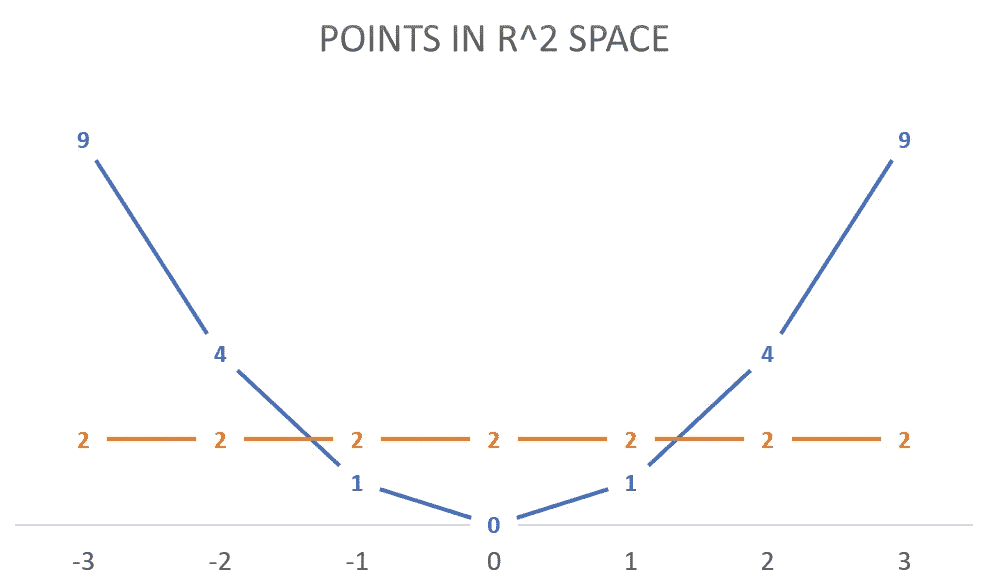

# 剖析我的困惑:支持向量机

> 原文：<https://medium.com/codex/dissecting-my-confusion-svm-6a793cc378c0?source=collection_archive---------19----------------------->

我不知道你怎么想，但我个人发现，在科学中，包含口语的术语并不能真正让事情变得更清楚，反而会引起混乱。

想想生物学中的例子，比如敲除，敲除，敲入，垃圾 DNA 等术语。如果你有足够的耐心，你可以找到许许多多类似的例子。

同样，这种情况在计算机科学和相关领域更为常见，我在本文中想要关注的是 SVM 的概念，玩玩它，检查它给我造成的困惑，并希望用它来澄清这个概念。

首先，SVM 是一个绝对令人困惑的术语。我真的很难相信用“机器”这个词来形容这个算法。听到这个词，我想到的是:

机器

为什么他们不选择“支持向量辅助分类”，支持向量是一个连字符的单词？只是为什么？？？会让世界变得不同…

这篇文章很好地解释了 SVM 背后的数学原理:[https://medium . com/@ sathvikchiramana/SVM-dual-formulation-7535 CAA 84 f 17](/@sathvikchiramana/svm-dual-formulation-7535caa84f17)

SVM 是一个约束优化问题。这是目标的定义。

SVM 目标

SVM 拉格朗日函数

这相当于对偶形式。

对偶形式的 SVM 拉格朗日函数

从目标上看可能不是很明显，但是这个优化问题的底线是找到最优的拉格朗日乘数(a)。

这实际上是通过*梯度下降、*完成的，就像深度学习一样。你可以在这里了解更多:【https://www.youtube.com/watch?v=UX0f9BNBcsY】T4

好的，到目前为止还不错。即使它需要非常严肃的数学知识，我仍然认为与术语的选择相比，它是非常简单的。

现在，我们来谈谈内核函数。抱歉抱怨了这么多，但我不明白为什么它们被称为“内核”函数。内核函数的另一个术语可以是 [*转换核心*](https://en.wikipedia.org/wiki/Integral_transform) *函数*或*转换核心函数*，这更有意义，因为“转换”这个词是这里的关键词。

因此，现在的问题实际上是通过应用一些转换来优化函数，使得用一条线分隔数据成为可能，尽管是在更多的维度上。顺便提一句，我觉得把 1D 空间中的一条线的等价物看作一个点真的很酷，在 3d 空间——一个平面，在 4D——一个 3D 空间，在 5D——4D 空间，等等。

然而，我发现很难想象一个空间中的点如何在一个多维空间中被线性分离，我发现下面的例子在这方面很有帮助。

假设 x 的[-3，-2，2，3]的值对应于 1 的标签，[-1，1]对应于-1 的标签。你马上就会明白我的意思了。现在让我们根据这个规则把它们转换成二维:

现在这些点变成了(-3，9)，(-2，4)，(2，4)，(3，9)，(1，1)和(-1，1)

显然，空间中第二个维度等于 2 的线将能够正确地分离这些点。

现在，让我们试着根据相反的规则，把这条线转换到原来的 1D 空间。

它会给我们-√2 和√2。

本质上，这将只是线上的两个点，可以如下所示:

这里的两个点对应于 2D 空间中的线，这真的很有趣，几乎令人震惊。

所以，回到内核函数和我真的不喜欢的术语“内核诡计”。正如我在开始时所说的，每次在科学术语中使用口语时，通常会失去清晰度。

“内核诡计”在这篇文章里解释得真好:[https://medium . com/@ zxr . nju/what-the-Kernel-trick-why-it-important-98 a 98 db 0961d](/@zxr.nju/what-is-the-kernel-trick-why-is-it-important-98a98db0961d)

然而，我想退一步说，核技巧是另一种说法，即不是使用映射函数将数据转换到更高维度，然后找到点积，我们可以只计算转换核函数，这可以大大简化计算。在我看来，“内核简化”是一个更好的术语选择。

差不多就是这样，最后，我想说的是，尽管 SVM 背后的数学非常先进，但并不是数学，而是某些术语的选择引起了我很大的困惑。

我觉得分析我的困惑有助于我更好地理解这个概念，我希望你也觉得有用。如果是这样的话，那么请留下几个掌声，并订阅。谢谢