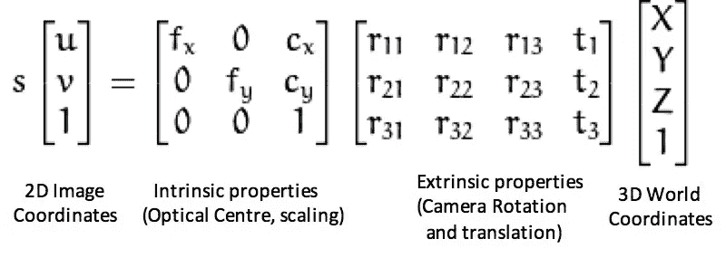
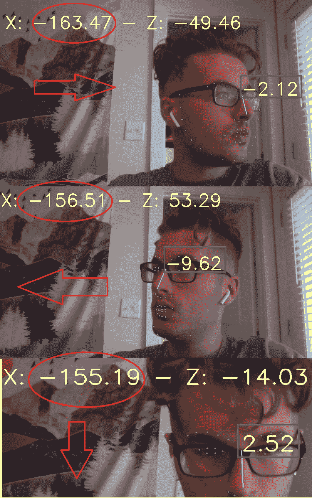
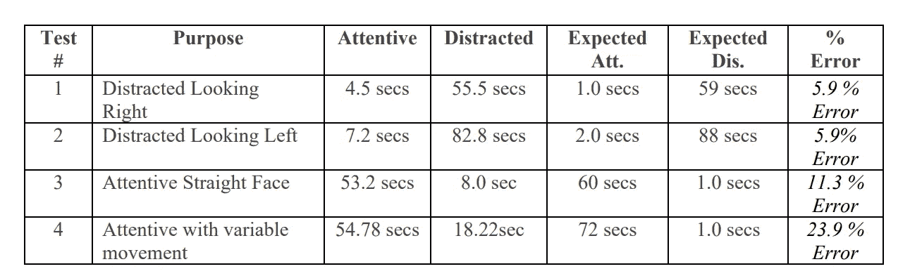
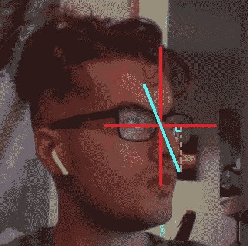
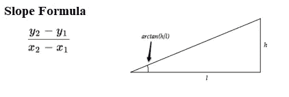
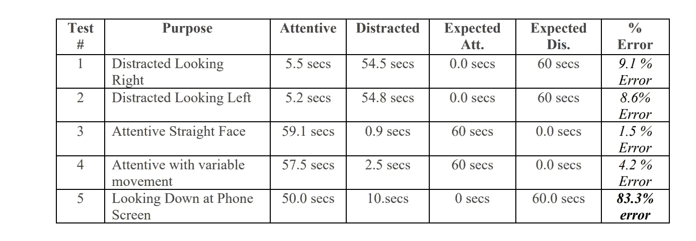

# 基于 OpenCV 和 TensorFlow 的姿态估计的注意力分散检测

> 原文：<https://medium.com/codex/distraction-detection-using-pose-estimation-with-opencv-and-tensorflow-16f28e733da4?source=collection_archive---------5----------------------->

**图一。**库依赖关系

# **摘要**

最近，由于新冠肺炎·疫情，我们的社会被推入了以在家工作为中心的劳动力大军。社会已经从在工作场所工作、在教室学习、在图书馆苦干项目转变为在家的中央工作站上计算所有这些任务。它打破了工作与生活的平衡，我猜想大多数人在远程工作时都会受到各种干扰。这个假设启发我创建了一个应用程序，可以量化地测量一个人在远程工作时的专注与疏忽行为。通过使用 Python 的张量流库进行面部检测，并使用 OpenCV 进行面部旋转，开发了一个应用程序来测试某人是否正在使用他们的工作站。

# **TensorFlow 面部检测**

TensorFlow 是一个面向机器学习的端到端开源 python 库。也就是说，它包含创建和训练健壮的机器学习模型所必需的工具。这款软件从 2015 年末开始上市，负责开发数千个机器学习模型。我决定利用一个预先训练好的模型进行面部检测，而不是重新发明轮子和训练我自己的面部检测算法。尹在 GitHub 上发布了这个模型，它可以检测 68 个面部标志，这些标志可以用来定义面部对象[2]。

**图二**。基于 CNN 分类器的人脸检测实现

# **OpenCV 姿态估计**

这就是项目从提供的代码偏离到实验代码的地方。姿态估计问题归结为计算检测到的面部对象的相对旋转/方向。这是计算机视觉中一个臭名昭著的数学问题，被称为 n 点透视问题(PnP)。[1]“n”代表图像平面中已知和已识别点的数量。PnP 问题很特殊，因为它为我们提供了一种在给定**预定义的 2D 坐标**、**实时 3D 坐标**和来自当前摄像机的**内在摄像机参数**的情况下求解外部摄像机属性的方法。

**图 3** 。透视 n 点问题方程

因此，当将当前图像帧与先前定义的面部检测模型进行比较时，**数学函数将能够求解矩阵 *R* 和*T*中定义的外部相机属性。对于这个项目，我将只关心旋转矩阵 *R* ，它可以用 openCV 的 solvePNP(…)函数来计算**

# **实施初期的不足之处**

找到旋转矩阵后，我以为我的项目完成了，嘣，简单。我只是将 solvePnP 函数返回的弧度值转换成度数，并显示信息。然而，虽然旋转矩阵被解决了，并且似乎当前说明了我的脸的当前旋转。实际的滚转、俯仰和偏航值与摄像机非常不一致。

**图 4** 。展示摄像机矩阵和偏斜度的最小变化(红色表示 X，绿色表示 Y)

例如，简单地直视相机会产生-155 度的 X 旋转，而实际上应该是 0 或 180 度。有点不方便，但是我可以通过给旋转轴值增加权重来解决。添加权重后，我添加了计时器，并通过检查面部是否在 Y 轴(-15，15)度(头部倾斜)和 X 轴(-10，10)度(头部转动)的范围内旋转，来计算用户是否在关注摄像头。

**图 5** 。用旋转矩阵测试分心与注意力

# **更简单的方法**

简单地说，从旋转矩阵看 23.9%的误差并不令人印象深刻。这是一个受计算机视觉启发的项目，所以我想用计算机视觉的概念来解决这个问题。然而，我不禁注意到，在尹的鼻子上有三个面部标志的面部探测器标记。因此，我们可以利用这些点中的两个来做一条线！利用一些代数和几何知识，我们可以解出鼻线的斜率，然后通过反正切函数计算角度:

**图 6。**显示给定鼻子坐标的面部理论三角形。

**图 7。**用于求解 arctan 的数学

这意味着当用户面对相机时，角度将会很小(或者 90 度，如果完全笔直的话),当用户从相机移开时，角度将会增加！让我们比较结果:

**图 8。**用正切角测试

# **结论**

总而言之，通过姿势估计算法来预测分心是一个有趣的实验项目。它带我进入了张量流的兔子洞，面部标志，PnP 问题(并真正理解它！)，以及一些几何函数。它也扩展了我解决问题的技能，因为我最初是与旋转矩阵脱轨的。。。不太准确。几何示例显然是两个函数中更准确的一个，但是如果用户向下看手机屏幕，这个示例就失败了。如果有更多的时间和耐心，或许可以开发出更好的姿态估计算法来检测用户何时分心。当我制造这个问题时，我意识到姿势估计通常不能确定用户是否正在分心。大部分时间会管用吗？是的，然而，这个问题可以很容易地用眼睛跟踪算法而不是姿势估计算法来解决。

**源代码:**[**【https://github.com/Jacob-Mellichamp/DistractionDector】**](https://github.com/Jacob-Mellichamp/DistractionDector)

# **关于性能的快速说明**

我还试验了 fps 时间，以便在算法运行时最小化 CPU 的使用。通过利用 0.2 FPS(或每五秒一帧)的速度，2.25 Ghz i5 英特尔处理器能够成功跟踪分心的事物，在整个跟踪过程中仅使用 5%的 CPU，而无需外部显卡！

# 参考

> [1]萨蒂亚·马利克。2016.基于 OpenCV 和 Dlib 的头部姿态估计。2021 年 4 月 15 日检索自[https://learnopencv . com/head-pose estimation-using-opencv-and-dlib/](https://learnopencv.com/head-poseestimation-using-opencv-and-dlib/)
> 
> [2]英·威茨曼。[未注明]。头部姿态估计。从 https://github.com/yinguobing/head-pose-estimation[检索到 2021 年 4 月 10 日](https://github.com/yinguobing/head-pose-estimation)