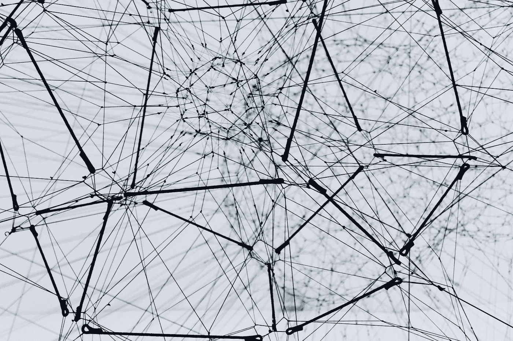

# 分布式计算概念

> 原文：<https://medium.com/codex/distributed-computing-concepts-f6275078a81?source=collection_archive---------1----------------------->

## 简介

# 前言

如果计算机永远不会出故障，网络是可靠的，所有的操作总是干净优雅地执行，不会让系统处于不明确的状态，那就太好了。不幸的是，这是不可能的；我们不得不面对严酷的现实，尤其是在处理分布式的 …