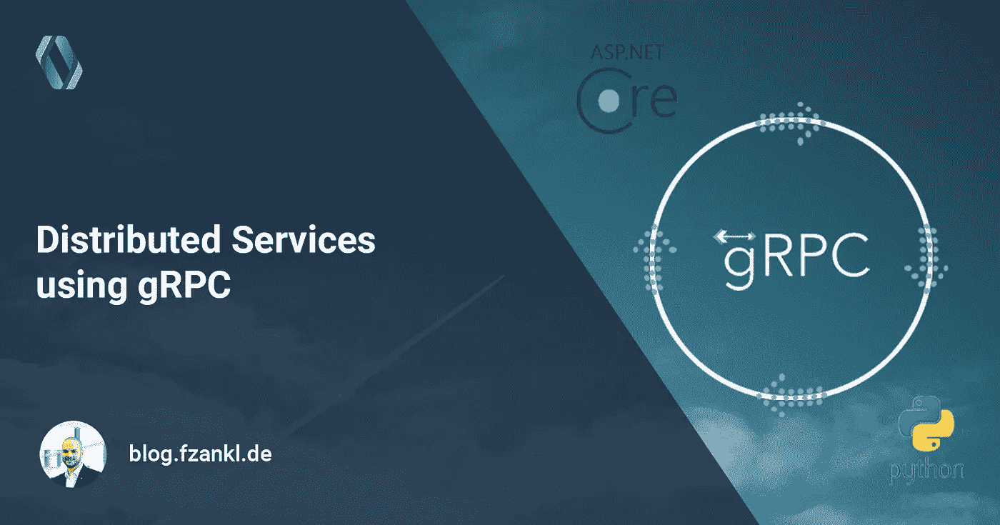
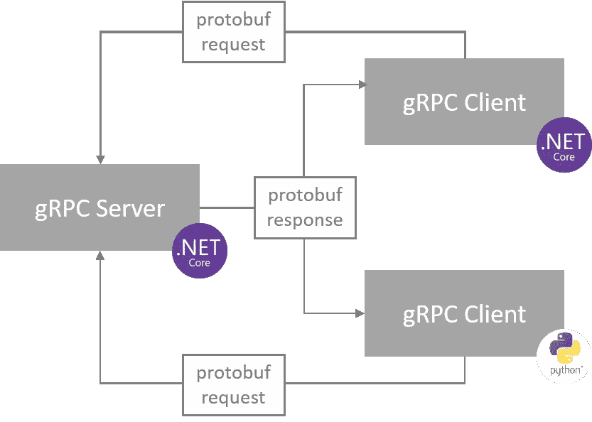
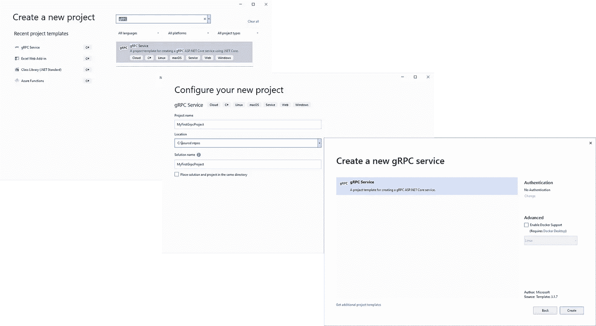

# 使用 gRPC 的分布式服务

> 原文：<https://medium.com/codex/distributed-services-using-grpc-100743363c6b?source=collection_archive---------0----------------------->

## [抄本](http://medium.com/codex)

## gRPC 实用指南及其使用方法。NET 和 Python



高效的通信通常是现代软件系统的主要驱动力之一，即使在微服务驱动的世界中也是如此。gRPC 可以满足这些要求。在本文中，我们将研究 gRPC 的一些基础知识，并使用. NET 实现第一个客户机和服务器应用程序。此外，一个基于 Python 的客户机演示了不同服务之间的高效通信是多么容易。

# gRPC 是什么？

gRPC 是在分布式系统的不同端点之间进行通信的协议。它使用 HTTP/2 和协议缓冲区(protobuf)。像任何其他 RPC 系统一样，gRPC 由一个服务器组成，它定义了客户机可以调用的方法和响应。然后，客户端实现特定的服务器存根，并可以使用提供的方法，如下图所示。NET 和 Python。



gRPC 通信模式

gRPC 可以使用 protobuf 作为接口定义语言和传输消息的交换格式。它支持许多编程语言，如 Android Java、C#、C++、Dart、Go、Java、Kotlin、Node.js、Objective-C、PHP、Python 和 Ruby。软件开发工具包(SDK)通常支持特定语言的实现。因此，基于 gRPC，你可以快速实现用不同语言编写的分布式系统或微服务，这取决于开发人员偏好的编程语言。

# 协议缓冲区

> 协议缓冲区是 Google 的语言中立、平台中立、可扩展的机制，用于序列化结构化数据。(【https://developers.google.com/protocol-buffers】T4)

默认情况下，gRPC 使用协议缓冲区(protobuf)进行数据交换和接口定义语言。Protocol buffers 是一种用于序列化结构化数据的开源机制，由 Google 开发。在这一节中，我们将看看 protobuf 如何被用作数据交换格式和接口定义语言。让我们从一个简单的文件`foo.proto`开始，它定义了要序列化的数据的结构。

在前面的例子中，您可以看到 protobuf 使用消息来结构化数据。它们中的每一个都包含一组名值对，称为字段。因此，您可以将 protobuf 中的消息看作是面向对象编程语言中的一种类或结构。

现在是时候用您喜欢和支持的编程语言将 protobuf 消息定义编译成相应的类型了。因此，protobuf 编译器`protoc`可以在 [GitHub 发布页面](https://github.com/protocolbuffers/protobuf/releases/)下载。

对于 C#来说，下面的命令将生成可以通过协议缓冲 API 用来发送和接收消息的类。

在我们的示例中，生成的 C#代码包括:

*   包含关于 protobuf 消息的元数据的类`FooReflection`
*   实现`IMessage<Foo>`并提供属性`Id`和`Description`的类`Foo`。

此外，类`Foo`提供了序列化和反序列化相关的方法。若要在 C#中发送和接收消息，请使用以下示例中所示的方法。我们在这里使用内存流，但它也可以是任何其他流。请注意 NuGet 包[谷歌。读写流需要 Protobuf](https://www.nuget.org/packages/Google.Protobuf/) 。

关于`protoc`如何生成 C#代码的更多信息可以在这里找到:[https://developers . Google . com/protocol-buffers/docs/reference/cs harp-generated](https://developers.google.com/protocol-buffers/docs/reference/csharp-generated)

根据 gRPC，protobuf 也支持接口定义。`protoc`附带了一个额外的插件来生成客户端和服务器端代码。以下示例显示了 gRPC 接口定义的一个小样本。

在前面的例子中，定义了 gRPC 服务`FooService`。这个服务提供了一元方法`GetFoo`。如您所见，请求和响应对象被定义为 protobuf 消息。同样`protoc`可用于以首选编程语言生成代码。

对于 C#来说，使用 [Grpc 是最好的方法。工具](https://www.nuget.org/packages/Grpc.Tools/) NuGet 包。在本文的后面，我们将研究 C#工具集成。在 gRPC 接口定义和 C#作为编程语言的情况下，产生的代码现在包括:

总的来说:

*   保存关于 protobuf 请求和响应消息的元数据的类“FooReflection”。
*   实现`IMessage<FooRequest>`并为方法`GetFoo`的 gRPC 请求提供属性的类`FooRequest`。
*   实现`IMessage<FooResponse>`并为方法`GetFoo`的 gRPC 响应提供字段的类`FooResponse`。

在服务器端代码生成的情况下:

*   充当特定服务实现的基类的类`FooServiceBase`。

在客户端代码生成的情况下:

*   包含通过 gRPC 通道与服务器端部分交互的存根的类`FooServiceClient`。

# 沟通模式

在前面的服务定义中，一元方法用于客户端和服务器之间的交互。但是 gRPC 客户机和服务器可以有更多的交互方式。

**一元 RPC
一个客户端向服务器发送一个请求，得到一个响应**

```
rpc GetFoo (FooRequest) returns (FooResponse);
```

**服务器流 RPCs** 客户端向服务器发送请求，获取流以读取消息序列。在接口定义中，它是通过在响应前使用附加的 stream 关键字来声明的。

```
rpc GetFoos(FooRequest) returns (stream FooResponse);
```

**客户端流 RPC** 客户端编写一个消息序列，并发送给服务器。写完之后，客户端等待，直到服务器读取它们并返回响应。在接口定义中，它是通过在请求前使用附加的 stream 关键字来声明的。

```
rpc SendFoos(stream FooRequest) returns (FooResponse);
```

**双向流 RPC** 双方使用读和写流发送一系列消息。两个流都是独立的。在接口定义中，它是通过在请求和响应之前使用附加的 stream 关键字来声明的。

```
rpc SendAndGetFoos(stream FooRequest) returns (stream FooResponse);
```

gRPC 中的连接可以由服务器、客户端终止，也可以由超时触发。客户端和服务器对呼叫状态进行独立的本地确定。因此，流调用可能在服务器上成功，但在客户端上由于超时而失败。如果取消，客户端或服务器所做的任何更改都不会自动回滚。连接立即终止。具体来说，关于连接和元数据处理的行为通常是特定于语言的。

# C#中的第一个服务器和客户端应用程序

让我们从. NET 中第一个完整的 gRPC 客户端和服务器开始。使用 Visual Studio，很容易创建这两个应用程序。使用项目向导，你要搜索`gRPC`，按照助手的步骤操作，如下图所示。您可以选择启用 Docker 支持，但这不是本文的重点。



使用 Visual Studio 2019 创建新的 gRPC 项目

然后，Visual Studio 创建一个 gRPC 服务器项目，我们就可以开始了。通过修改基于 protobuf 的接口定义并在生成的文件中实现定制的业务逻辑，我们可以完成 gRPC 服务器。但是幕后发生了什么呢？

但是，Visual Studio 创建了 protobuf 文件以及一个用于服务器实现的类。但是还有更多的事情发生。*。csproj-file 使用标签显式引用我们的 protobuf。

该项告诉 Visual Studio 将该文件视为 gRPC 客户端和服务器生成的输入。属性`GrpcServices`指定 Visual Studio 应该生成哪些部分。

*csproj 文件中第二个重要的引用是 NuGet 包 [Grpc。AspNetCore](https://www.nuget.org/packages/Grpc.AspNetCore) 。

通过这个包 [Grpc。工具](https://www.nuget.org/packages/Grpc.Tools/)也将在我们的解决方案中提供。`Grpc.Tools`提供使用 protoc 编译器处理 protobuf 文件的支持。有了这个基本设置，链接的 protobuf 文件会在每次构建时编译，或者在由 Run Custom Tool 上下文菜单项触发时编译。

因为 gRPC 服务器应用程序是基于 ASP.NET 核心的，所以我们的项目包含一个`Startup.cs`。在这个文件中，可以使用`AddGrpc`和`MapGrpcService<T>`轻松激活 gRPC 支持，其中 T 是我们的 gRPC 服务实现。

gRPC 使用 HTTP/2 作为其传输协议。因此，Kestrel(ASP.NET 核心中使用的 web 服务器)需要通过`appsettings.json`或`Program.cs`进行配置。以下示例建议所有端点使用 HTTP/2 作为传输协议。

或者，您可以指定多个端点，每个端点都使用特定的配置。例如，当在一个项目中托管 REST API 和 gRPC API，并且您希望 REST API 使用 HTTP/1 作为传输协议时，可以使用这种设置。

此外，gRPC 端点应采用传输层安全性(TLS)来保护。在开发过程中，会自动生成受 TLS 保护的端点。通常，系统会提示您信任相应的证书，但是您可以使用命令`dotnet dev-certs https --trust`来触发该过程。在生产中，必须通过`appsettings.json`或`Program.cs`用您的特定证书参数配置 TLS。通过属性`Certificate`可以将所有需要的参数提供给 Kestrel。

现在是时候构建我们的第一个客户端应用程序了。创建一个新的。NET 核心控制台应用并安装 NuGet 包 [Google。Protobuf](https://www.nuget.org/packages/Google.Protobuf/) ， [Grpc。Net 客户端](https://www.nuget.org/packages/Grpc.Net.Client/)和 [Grpc。工具](https://www.nuget.org/packages/Grpc.Tools/)。之后，只需添加一个链接到您已经用来创建服务器应用程序的 protobuf 文件。产生的*。csproj-file 可以看起来像这个示例文件。

请注意，`<Protobuf/>`标签的属性`GrpcServices`被设置为值`Client`。这建议协议编译器创建客户端存根而不是服务器相关部分。

所以让我们开始创建我们的客户端。首先，我们必须使用 gRPC 服务器应用程序的 URI 创建一个`GrpcChannel`。第二步，我们可以使用这个通道来设置我们的 gRPC 服务客户端。使用这个客户端，我们可以调用所有已定义的方法。以下示例显示了一元 RPC 调用。在中使用不支持 TLS 的 gRPC 客户端。NET Core 3.x，还需要一个额外的步骤。我们的应用上下文的开关`System.Net.Http.SocketsHttpHandler.Http2UnencryptedSupport`必须是`true`。应用程序使用。NET 5 框架不需要额外的配置，但是要调用不安全的 gRPC 服务，他们必须使用 2.32.0 或更高版本。

当使用 ASP.NET 核心应用程序时，gRPC 客户端实现使用`HttpClientFactory`集成更加容易。因此，安装 [Grpc 即可。Net.ClientFactory](https://www.nuget.org/packages/Grpc.Net.ClientFactory) 启动时打包并注册 gRPC 服务:

gRPC 客户端类型在 ASP.NET 核心依赖注入机制中注册为临时。因此，客户端可以很容易地在依赖注入创建的类型中被注入和消费，例如控制器。

当您开始使用 C#构建第一个 gRPC 服务器和客户机时，您只需要知道这些。请参阅文章末尾的代码参考，以获得完整的工作示例。

# Python 遇上了。网

由于 gRPC 可以在许多编程语言中使用，所以它支持它们之间的通信。我们来考虑多个微服务。一个用 C#开发，一个用 Node.js，还有一个用 Python。当然，它们都可以整合。在本节中，我们将重点讨论。NET 和 Python。(请注意，以下示例要求在各自的系统上安装 Python 和 pip)

在开始编写 Python 客户端之前，我们必须安装 gRPC 相关的依赖项，并为 protobuf 文件生成 Python 存根。以下命令演示了所需的步骤:

这些步骤的结果包含两个文件:

*   包含生成的请求和响应类
*   `foo_pb2_grpc.py`包含生成的客户端和服务器类。

我们的 gRPC 服务器基于 ASP.NET 核心运行，并使用 TLS 进行安全通信，因此我们必须导出。NET 开发证书优先。因此，您必须使用命令`certmgr`打开 Windows 证书管理器。在证书管理器中，导航到`Current user > Personal > Certificates`并导出将`ASP.NET Core HTTPS development certificate`设置为友好名称的证书。请使用以下导出选项`Without key, DER-coded X.509 (.cer)`。默认情况下，Python 支持使用 PEM 格式的证书。所以最简单的方法就是把我们的证书转换成这种格式。这可以使用命令`openssl x509 -inform der -in localhost.cer -out localhost.pem`来完成。

最后，我们来看看使用 Python 实现 gRPC 客户机的例子。我们使用生成的 gRPC 存根和我们的证书来设置简单的测试客户端，如下面的代码片段所示:

现在您可以使用`python client.py`运行 Python 应用程序。该脚本使用安全的通信通道调用我们基于 ASP.NET 核心的 gRPC 服务器，并将服务器响应打印到控制台。

# 包扎

在本文中，我向您介绍了 gRPC 的基础知识，以及如何使用各种编程语言来使用它。基于此，您现在可以构建自己的服务，以非常高效的方式进行通信。英寸 NET 5 的 gRPC 堆栈有进一步的性能改进。因此，如果不使用 gRPC，就没有理由构建服务间调用。

在 GitHub 上，有一个完整的工作示例应用程序。它涵盖了客户机和服务器应用程序，以及用不同编程语言编写的不同服务之间的通信。([示例如何使用 gRPC。NET Core/ASP.NET Core 和 Python](https://github.com/fzankl/grpc-sample)

本文最初发表于:[https://www . fzankl . de/en/blog/distributed-services-using-grpc-in-dot net-and-python](https://www.fzankl.de/en/blog/distributed-services-using-grpc-in-dotnet-and-python)

# 参考

[](https://grpc.io/docs/) [## 证明文件

### 了解 gRPC 的主要概念，尝试快速入门，查找所有受支持语言的教程和参考资料，以及…

grpc.io](https://grpc.io/docs/) [](https://developers.google.com/protocol-buffers/docs/overview) [## 语言指南|协议缓冲区| Google 开发者

### 本指南描述了如何使用协议缓冲区语言来构建您的协议缓冲区数据，包括。原型…

developers.google.com](https://developers.google.com/protocol-buffers/docs/overview) [](https://developers.google.com/protocol-buffers/docs/reference/csharp-generated) [## C#生成的代码|协议缓冲区| Google 开发者

### 本页准确描述了协议缓冲编译器使用 proto3 为协议定义生成的 C#代码

developers.google.com](https://developers.google.com/protocol-buffers/docs/reference/csharp-generated) [](https://docs.microsoft.com/de-de/aspnet/core/grpc/) [## gRPC 中的一个。网络核心

### gRPC 的主要好处是:gRPC 是一个很好的发展中国家。

docs.microsoft.com](https://docs.microsoft.com/de-de/aspnet/core/grpc/) [](https://devblogs.microsoft.com/aspnet/grpc-performance-improvements-in-net-5/) [## 中 gRPC 性能的改进。NET 5 | ASP.NET 博客

### James gRPC 是一个现代的开源远程过程调用框架。gRPC 中有许多令人兴奋的特性:实时…

devblogs.microsoft.com](https://devblogs.microsoft.com/aspnet/grpc-performance-improvements-in-net-5/)