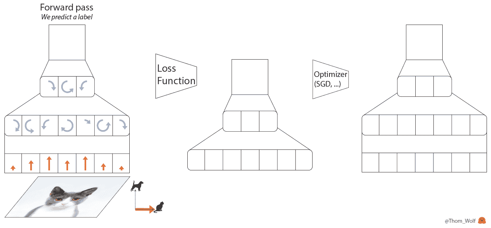
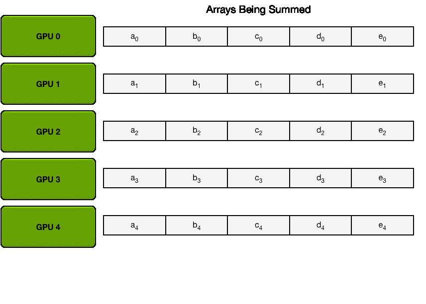
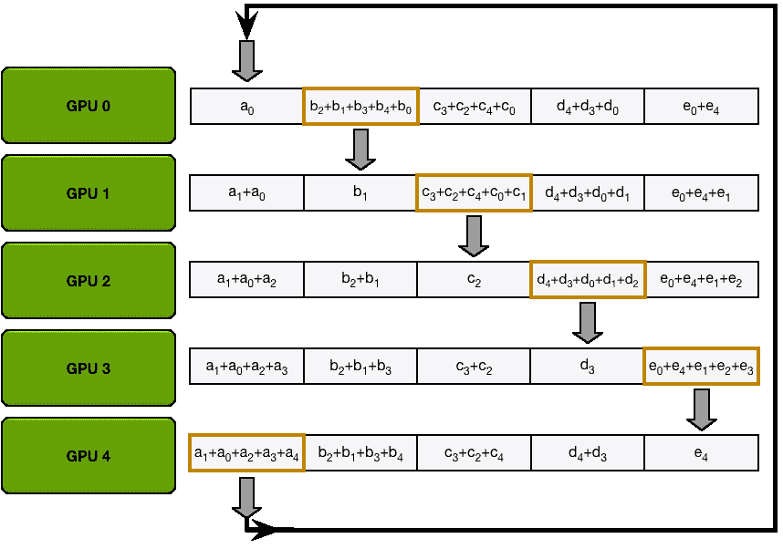

# 多个 GPU 上的分布式培训

> 原文：<https://medium.com/codex/distributed-training-on-multiple-gpus-e0ee9c3d0126?source=collection_archive---------6----------------------->

随着数据规模和模型规模的不断增大，训练会花费大量的时间，尤其是对于单个 GPU。因此，有必要使用多个 GPU 来加速训练处理。

在这篇博文中，我将首先介绍分布式训练的理论基础，然后分`nn.DataParallel`和`nn.DistributedDataParalllel`两种方式用 PyTorch 在多个 GPU 上实现分布式训练。

# 理论基础

## 训练循环

首先，让我们回顾一下训练神经网络通常是如何工作的。训练神经网络时，每个循环都有四个主要步骤:



梯度下降优化算法的 5 个步骤。由 [HuggingFace](https://huggingface.co/) 创建的图像

1.  正向传递，其中输入由神经网络处理；
2.  计算损失函数，将预测标签与地面实况标签进行比较；
3.  完成反向传递，基于损耗计算每个参数的梯度(使用反向传播)；`loss.backward()`
4.  使用梯度更新参数。`optimizer.step()`

## 模型并行和数据并行

*   **模型并行**:不同的 GPU 输入相同的数据，运行模型的不同部分，比如一个多层网络的不同层；
*   **数据并行**:不同的 GPU 输入不同的数据，运行相同的完整模型。

当模型非常大，一个 GPU 已经无法存储时，可以使用模型并行将模型的不同部分分配到不同的机器上，但是这样会带来很大的通信开销。而且模型的并行部分有一定的依赖性，可扩展性差。所以当一个模型可以放在一个模型上时，通常采用数据并行，各部分独立，扩展性好。

## 同步更新和异步更新

对于数据并行，由于每个 GPU 负责一部分数据，所以涉及到更新参数的问题，可以分为同步更新和异步更新两种方法。

*   **同步更新**:每批所有 GPU 计算完成后，统一计算新的权重，然后所有 GPU 同步新值，再进行下一轮计算。
*   **异步更新**:每个 GPU 计算完梯度后，无需等待其他更新，整体权重立即更新同步。

同步更新有等待时间，速度取决于最慢的 GPU 异步更新没有等待时间，但是当遇到更复杂的梯度时，就会出现丢包和抖动大的问题。因此，在实践中，一般采用同步更新的方法。

## 参数服务器和环 AllReduce

假设我们有 N 个 GPU:

*   **参数服务器** : GPU 0(作为 Reducer)将数据分成五份，分配给各个 GPU。每个 GPU 负责自己的小批量训练。 ***得到渐变后，返回 GPU 0 进行累加，得到更新后的权重参数。*** 然后分发到各个 GPU。
*   **Ring AllReduce** : N 个 GPU 连接成一个环。每个 GPU 都有一个左侧通道和一个右侧通道。一个负责接收，一个负责发送。 ***循环(N-1)次(分散减少)完成梯度累加，循环(N-1)次(全部聚集)再次同步更新参数。***

> ***参数服务器有两个缺点***

1.  每一轮训练迭代都需要所有 GPU 同步数据，并在结束前进行缩减。当并行 GPU 较多时，木桶效应会非常严重，计算效率较低。
2.  所有 GPU 都需要与 Reducer 进行数据、梯度和参数通信。当模型很大或者数据很大时，通信开销很高。

假设有 N 个 GPU，通信一个完整参数所需的时间为 K，那么使用 PS 架构，花费的通信开销为 ***T = 2(N-1)K*** 。

T 参数服务最大的问题是通信开销与 GPU 的数量成线性关系。Ring AllReduce 的通信开销与 GPU 数量无关。环形全部减少分为两步: ***分散减少和全部聚集*** 。

*   **分散减少**:首先我们把参数分成 N 份，相邻的 GPU 传递不同的参数。通过 N-1 次后，就可以得到各部分参数的累加(在不同的 GPU 上)。



**分散减少**

*   **全部聚集**:得到每个参数的累积后，再做一遍，同步到所有 GPU。



**全体集合**

根据这两个过程，我们可以计算出环 AllReduce 的通信代价为 ***T = 2(N-1)K/N*** 。

# PyTorch 示例

*   **DataParallel (DP)** :参数服务器模式，一个 GPU 就是一个 reducer，实现也超级简单，一行代码。
*   **DistributedDataParallel(DDP)**:All-Reduce 模式，原本是为了分布式训练，但也可以用于单机多 GPU。

## 数据并行

```
if torch.cuda.device_count() > 1:
    print("Let's use", torch.cuda.device_count(), "GPUs!")
    # only one line of code
    model = nn.DataParallel(model)
```

***运行命令:***

```
python train.py
```

## 分布式数据并行

```
'''Only five steps'''*# 1) Initialize the backend of computation*torch.distributed.init_process_group(backend="nccl")*# 2）* Configure the gpu of each processlocal_rank = torch.distributed.get_rank()
torch.cuda.set_device(local_rank)
device = torch.device("cuda", local_rank)*# 3）Use DistributedSampler to distribute data to each gpu* from torch.utils.data.distributed import DistributedSampler
sampler = DistributedSampler(dataset)
data_loader = DataLoader(dataset=dataset,
                         batch_size=batch_size,
                         sampler=sampler)# 4*）*Move the model to each gpumodel.to(device)# 5*）*Wrap up modelif torch.cuda.device_count() > 1:
    print("Let's use", torch.cuda.device_count(), "GPUs!")
    model = torch.nn.parallel.DistributedDataParallel(model,device_ids=[local_rank],output_device=local_rank)
```

***运行命令:***

```
CUDA_VISIBLE_DEVICES=0,1 python -m torch.distributed.launch --nproc_per_node=2 train.py
```

***完整的 DDP 示例代码:***

# 参考

【分布式训练】单机多卡的正确打开方式（一）：理论基础 — Nicolas 的文章 — 知乎 [https://zhuanlan.zhihu.com/p/72939003](https://zhuanlan.zhihu.com/p/72939003)

【分布式训练】单机多卡的正确打开方式（三）：PyTorch [https://fyubang.com/2019/07/23/distributed-training3/](https://fyubang.com/2019/07/23/distributed-training3/)

[https://towards data science . com/how-to-scale-training-on-multi-GPU-da e1041 f 49d 2](https://towardsdatascience.com/how-to-scale-training-on-multiple-gpus-dae1041f49d2)

[https://medium . com/hugging face/training-large-batches-practical-tips-on-1-GPU-multi-GPU-distributed-settings-EC 88 C3 e 51255](/huggingface/training-larger-batches-practical-tips-on-1-gpu-multi-gpu-distributed-setups-ec88c3e51255)

[https://py torch . org/docs/master/generated/torch . nn . data parallel . html？highlight = data parallel # torch . nn . data parallel](https://pytorch.org/docs/master/generated/torch.nn.DataParallel.html?highlight=dataparallel#torch.nn.DataParallel)

 [## 分布式数据并行- PyTorch 1.9.0 文档

### class torch . nn . parallel . distributed data parallel(module，device_ids=None，output_device=None，dim=0…

pytorch.org](https://pytorch.org/docs/master/generated/torch.nn.parallel.DistributedDataParallel.html#distributeddataparallel)