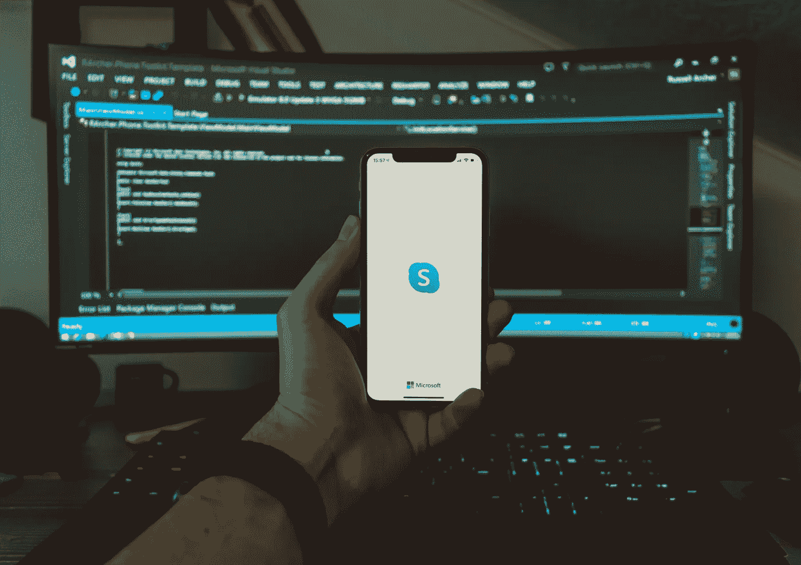

# 被管理层电话打扰？

> 原文：<https://medium.com/codex/disturbed-by-management-calls-45db7a06cbac?source=collection_archive---------9----------------------->

最理想的是先发一条礼貌的信息。别再乱给我们打电话了！

照片由[马体·flo](https://unsplash.com/@matzby?utm_source=unsplash&utm_medium=referral&utm_content=creditCopyText)在 [Unsplash](https://unsplash.com/s/photos/virtual-call?utm_source=unsplash&utm_medium=referral&utm_content=creditCopyText) 上拍摄

现在，大多数参与软件工程大游戏的公司终于意识到，进步的工程师在远程工作时更快乐、更有效率，这个世界已经变得(至少在为生活而工作方面)稍微好了一点。