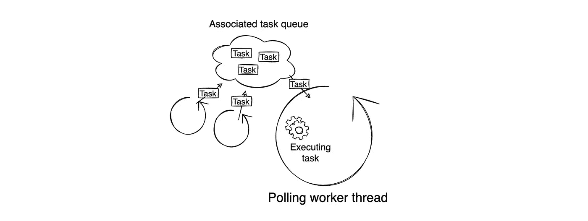
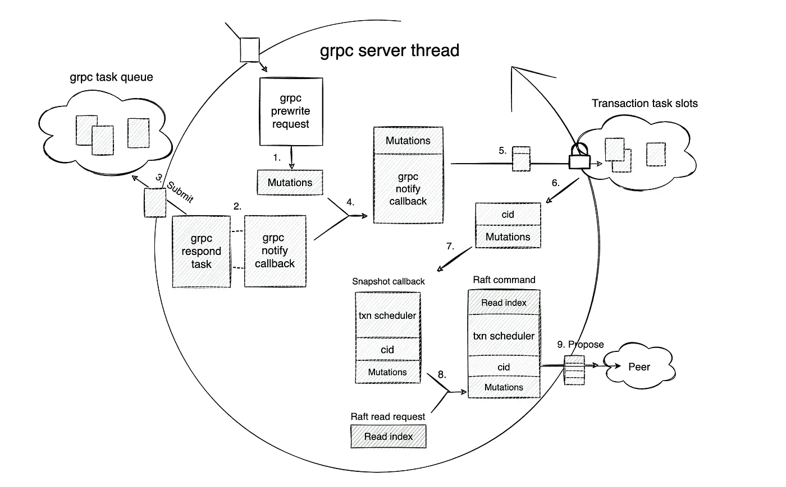
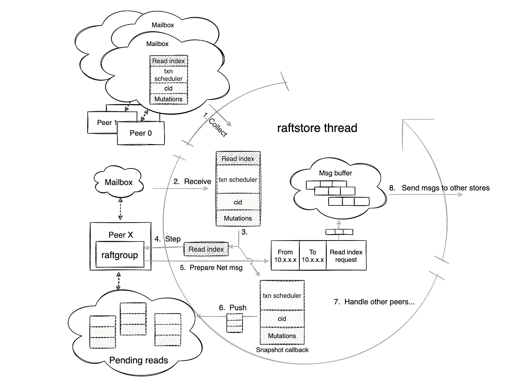
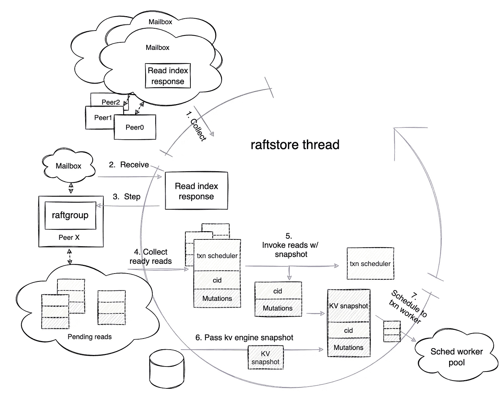
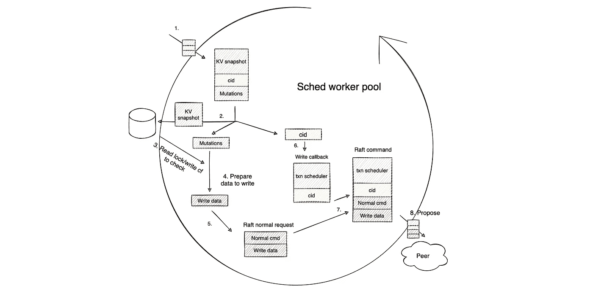
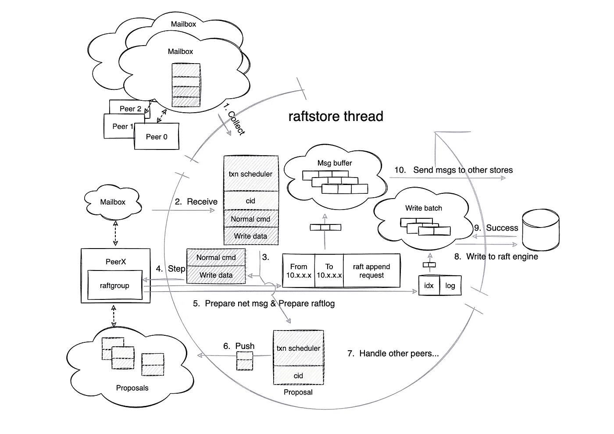
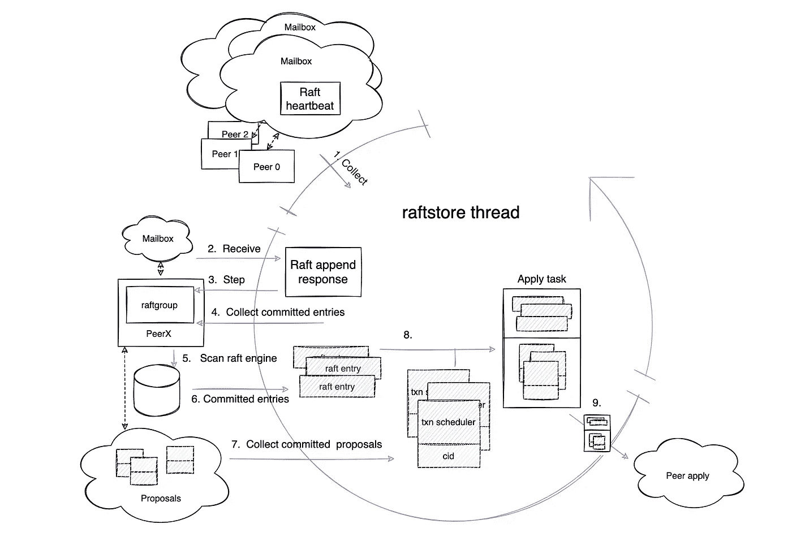
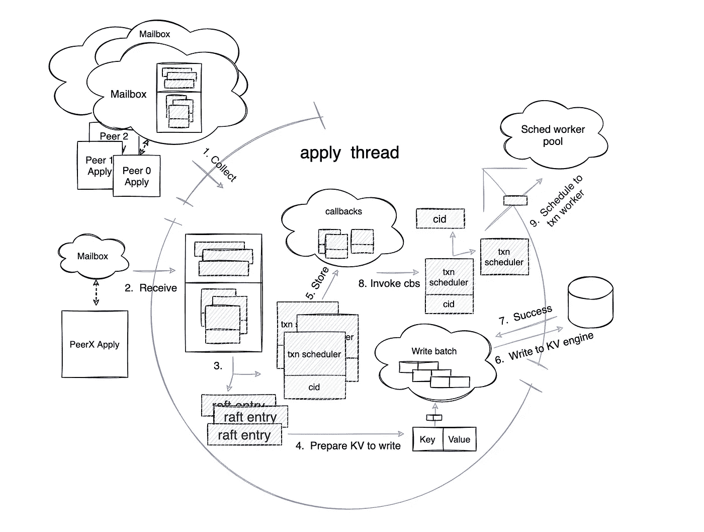
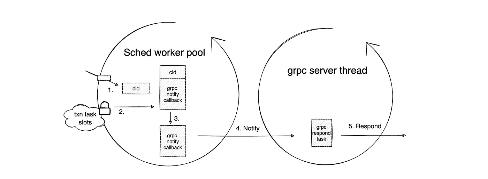

# 深入探究 TiKV 事务:TiKV 预写请求的生活故事

> 原文：<https://medium.com/codex/dive-deep-into-tikv-transactions-the-life-story-of-a-tikv-prewrite-request-242a764719cb?source=collection_archive---------24----------------------->

**作者:** [钟振池](https://github.com/zhongzc)(软件工程师实习生)

**Transcreator:** [夏洛特刘](https://github.com/CharLotteiu)；编辑:汤姆·万德

[TiKV](https://tikv.org/) 是一个分布式键值存储引擎，基于 Google Spanner、F1 和 HBase 的设计。然而，TiKV 管理起来要简单得多，因为它不依赖于分布式文件系统。

正如在[深入探究 TiKV](https://pingcap.com/blog/2016-11-09-Deep-Dive-into-TiKV#transaction) 和[TiKV 如何读写](https://pingcap.com/blog/how-tikv-reads-and-writes#percolator)中所介绍的，TiKV 应用了受 [Google Percolator](http://static.googleusercontent.com/media/research.google.com/zh-CN//pubs/archive/36726.pdf) 启发的两阶段提交(2PC)算法来支持分布式事务。这两个阶段是`Prewrite`和`Commit`。

在本文中，我将探索预写阶段 TiKV 请求的执行工作流，并给出一个自顶向下的描述，说明如何在[区域](https://docs.pingcap.com/tidb/stable/glossary#regionpeerraft-group)领导者的多个模块中执行[乐观事务](https://docs.pingcap.com/tidb/stable/optimistic-transaction)的预写请求。这些信息将帮助您澄清 TiKV 请求的资源使用情况，并了解 TiKV 中相关的源代码。

# 工作模型

当 TiKV 初始化时，它会根据自己的配置创建不同类型的工作线程。一旦创建了这些工作线程，它们就在一个循环中不断地获取和执行任务。这些工作线程通常与关联的任务队列成对出现。因此，通过向不同的任务队列提交不同的任务，可以异步执行一些流程。下图简单说明了这种工作模式:

TiKV 工作线程的工作模型

# gRPC 请求阶段

TiKV 预写请求以出现在 gRPC 服务器线程上的来自网络的 gRPC 预写请求开始。下图显示了此阶段的工作流。

gRPC 服务器线程工作流

光看图可能不太容易理解，所以下面我将一步一步地具体描述 gRPC 线程是做什么的。每个步骤链接到相应源代码的编号:

*   步骤 [1](https://github.com/tikv/tikv/blob/6708ce171792df02e1e90e1fe1e67e424d1586c8/src/server/service/kv.rs#L1791) :将预写的 protobuf 消息转换成事务层可以理解的[突变](https://github.com/tikv/tikv/blob/5024ad08fc7101ba25f17c46b0264cd27d733bb1/src/storage/mod.rs#L70)。突变表示一个键的写操作。
*   步骤 [2](https://github.com/tikv/tikv/blob/6708ce171792df02e1e90e1fe1e67e424d1586c8/src/server/service/kv.rs#L1790) :创建一个通道，并使用通道发送者构造一个 gRPC 通知回调。
*   第 [3](https://github.com/tikv/tikv/blob/6708ce171792df02e1e90e1fe1e67e424d1586c8/src/server/service/kv.rs#L150) 步:将通道接收方构造为 gRPC 响应任务，并提交给 gRPC 任务队列等待通知。
*   步骤 [4](https://github.com/tikv/tikv/blob/6708ce171792df02e1e90e1fe1e67e424d1586c8/src/storage/txn/scheduler.rs#L329) :将 gRPC 通知回调和突变合并为一个事务任务。
*   步骤 [5](https://github.com/tikv/tikv/blob/6708ce171792df02e1e90e1fe1e67e424d1586c8/src/storage/txn/scheduler.rs#L330) :获取事务层的闩锁，并将 gRPC 通知回调存储在事务任务槽中。
*   步骤 [6](https://github.com/tikv/tikv/blob/6708ce171792df02e1e90e1fe1e67e424d1586c8/src/storage/txn/scheduler.rs#L333-L335) :一旦事务层成功获得锁存，gRPC 服务器线程继续执行带有唯一`cid`的任务，该任务可用于索引 gRPC 通知回调。在预写请求的整个执行过程中，`cid`是全局唯一的。
*   步骤 [7](https://github.com/tikv/tikv/blob/6708ce171792df02e1e90e1fe1e67e424d1586c8/src/storage/txn/scheduler.rs#L366-L404) :为 Raft 层构造快照回调。这个回调由`cid`、突变和事务调度器组成。
*   步骤 8: [创建](https://github.com/tikv/tikv/blob/6708ce171792df02e1e90e1fe1e67e424d1586c8/src/server/raftkv.rs#L421-L427)Raft 读索引请求，并且[将](https://github.com/tikv/tikv/blob/6708ce171792df02e1e90e1fe1e67e424d1586c8/components/raftstore/src/store/worker/read.rs#L538)该请求与快照回调相结合以形成 Raft 命令。
*   步骤 [9](https://github.com/tikv/tikv/blob/6708ce171792df02e1e90e1fe1e67e424d1586c8/components/raftstore/src/store/worker/read.rs#L377) :发送 Raft 命令给它所属的对等体。

gRPC 线程已经完成了它的任务。故事的其余部分将在 raftstore 线程中继续。

# 读取建议阶段

在介绍这个阶段之前，我想先说一下[批处理系统](https://github.com/tikv/tikv/blob/6708ce1717/components/batch-system/Cargo.toml)。它是 TiKV 多筏实现的基石。

在 TiKV 中，raftstore 线程和 apply 线程是批处理系统的实例。这两个工作线程也以固定的循环模式运行，这符合上面提到的工作模型。

raftstore 线程和 apply 线程在一个循环中经历三个阶段:收集消息阶段、处理消息阶段和处理 I/O 阶段。以下部分详细描述了这些阶段。

批处理系统工作模式

现在，让我们回到故事上来。

当 Raft 命令被发送到它所属的对等体时，该命令被存储在对等体的邮箱中。在收集消息阶段(上面圆圈的绿色部分)，raftstore 线程收集邮箱中有消息的几个对等体，并在处理消息阶段(圆圈的紫色部分)一起处理它们。

阅读建议阶段工作流程

在这个预写请求示例中，带有 Raft 读索引请求的 Raft 命令存储在对等方的邮箱中。在 raftstore 线程在步骤 [1](https://github.com/tikv/tikv/blob/6708ce171792df02e1e90e1fe1e67e424d1586c8/components/batch-system/src/batch.rs#L278) 收集对等体之后，raftstore 线程进入处理消息阶段。

以下是 raftstore 线程在处理消息阶段执行的相应步骤:

*   步骤 [2](https://github.com/tikv/tikv/blob/6708ce171792df02e1e90e1fe1e67e424d1586c8/components/raftstore/src/store/fsm/store.rs#L802-L827) :从对方邮箱中读取 Raft 命令。
*   步骤 [3](https://github.com/tikv/tikv/blob/6708ce171792df02e1e90e1fe1e67e424d1586c8/components/raftstore/src/store/fsm/peer.rs#L508) :将 Raft 命令分成 Raft 读索引请求和快照回调。
*   步骤 [4](https://github.com/tikv/tikv/blob/6708ce171792df02e1e90e1fe1e67e424d1586c8/components/raftstore/src/store/peer.rs#L2716-L2721) :将 Raft 读索引请求交给 raft-rs 库，由`step`函数处理。
*   步骤[5](https://github.com/tikv/raft-rs/blob/91a60ce417d55d4ca4d96b29963e3e3fa7f7d8d7/src/raft.rs#L1907-L1942):raft-RS 库准备好要发送的网络消息，并保存在消息缓冲区中。
*   步骤 [6](https://github.com/tikv/tikv/blob/6708ce171792df02e1e90e1fe1e67e424d1586c8/components/raftstore/src/store/peer.rs#L2737) :将快照回调存储在对等体的挂起读取队列中。
*   第 [7](https://github.com/tikv/tikv/blob/6708ce171792df02e1e90e1fe1e67e424d1586c8/components/batch-system/src/batch.rs#L295-L314) 步:返回到该阶段的开始，处理其他具有相同工作流的对等体。

在 raftstore 线程处理完所有对等体的消息后，它进入了单个循环的最后一个阶段:处理 I/O 阶段(圆圈的蓝色部分)。在这个阶段，在步骤 [8](https://github.com/tikv/tikv/blob/6708ce171792df02e1e90e1fe1e67e424d1586c8/src/server/raft_client.rs#L910-L932) 中，raftstore 线程通过网络接口将存储在消息缓冲器中的网络消息发送到集群的其他 TiKV 节点。

“读取建议”阶段到此结束。在预写请求取得进展之前，它必须等待其他 TiKV 节点做出响应。

# 读取应用阶段

经过“长时间”的等待(对于计算机来说，几毫秒实际上是很长的时间)，发送网络消息的 TiKV 节点最终接收到来自其他追随者节点的响应，并将回复消息保存在对等方的邮箱中。现在，预写请求进入读取应用阶段。下图显示了此阶段的工作流程:

阅读应用阶段工作流

努力工作的 raftstore 线程注意到在这个对等体的邮箱中有一个消息等待处理，因此线程在这个阶段的行为如下:

*   步骤 [1](https://github.com/tikv/tikv/blob/6708ce171792df02e1e90e1fe1e67e424d1586c8/components/batch-system/src/batch.rs#L278) :当循环回到收集消息阶段时，再次收集对等体。
*   步骤 [2](https://github.com/tikv/tikv/blob/6708ce171792df02e1e90e1fe1e67e424d1586c8/components/raftstore/src/store/fsm/store.rs#L802-L827) :与上一阶段相同，线程从对方邮箱中读取回复消息。
*   步骤 [3](https://github.com/tikv/tikv/blob/6708ce171792df02e1e90e1fe1e67e424d1586c8/components/raftstore/src/store/fsm/peer.rs#L1230) :将消息传递给 raft-rs，由`step`函数处理。
*   步骤 [4](https://github.com/tikv/tikv/blob/6708ce171792df02e1e90e1fe1e67e424d1586c8/components/raftstore/src/store/peer.rs#L2078-L2080) :识别消息处理后可以应用哪些读操作，并收集操作。
*   步骤 [5](https://github.com/tikv/tikv/blob/6708ce171792df02e1e90e1fe1e67e424d1586c8/components/raftstore/src/store/peer.rs#L1975) :调用快照回调，这些快照回调临时存储在对等体的挂起读取队列中。
*   步骤 [6](https://github.com/tikv/tikv/blob/6708ce171792df02e1e90e1fe1e67e424d1586c8/components/raftstore/src/store/worker/read.rs#L105-L110) :构造 KV 引擎的快照并发送给快照回调。
*   步骤 [7](https://github.com/tikv/tikv/blob/6708ce171792df02e1e90e1fe1e67e424d1586c8/src/storage/txn/scheduler.rs#L559-L594) :将快照回调拆分成由快照、`cid`和突变组成的事务调度器和任务。然后，raftstore 线程根据事务调度器记录的信息将任务发送给事务工作线程。

读取应用阶段到此结束。接下来，轮到事务工作者了。

# 写准备阶段

在这个阶段，当调度工作器池中的事务工作器在步骤 [1](https://github.com/tikv/yatp/blob/6bbea16a485583d7a6e32de335f6c6ec448df44a/src/pool/worker.rs#L44) 接收到由 raftstore 线程发送的任务时，该工作器在步骤 [2](https://github.com/tikv/yatp/blob/6bbea16a485583d7a6e32de335f6c6ec448df44a/src/task/future.rs#L261) 通过将任务分割成 KV 快照、突变和`cid`开始处理该任务。

编写准备阶段工作流

现在，事务层的主要逻辑开始发挥作用。它包括由事务工作线程执行的以下步骤:

*   步骤 [3](https://github.com/tikv/tikv/blob/6708ce171792df02e1e90e1fe1e67e424d1586c8/src/storage/txn/actions/prewrite.rs#L45-L86) :通过快照读取 KV 引擎，并检查事务约束是否成立。
*   步骤 [4](https://github.com/tikv/tikv/blob/6708ce171792df02e1e90e1fe1e67e424d1586c8/src/storage/txn/actions/prewrite.rs#L88) :检查通过后，为预写请求准备要写入的数据。
*   步骤 [5](https://github.com/tikv/tikv/blob/6708ce171792df02e1e90e1fe1e67e424d1586c8/src/server/raftkv.rs#L261-L263) :将数据封装成一个普通的 Raft 请求。
*   步骤 [6](https://github.com/tikv/tikv/blob/6708ce171792df02e1e90e1fe1e67e424d1586c8/src/storage/txn/scheduler.rs#L726-L745) :用`cid`准备一个新的写回调。
*   步骤 [7](https://github.com/tikv/tikv/blob/6708ce171792df02e1e90e1fe1e67e424d1586c8/components/raftstore/src/router.rs#L50-L55) :将带有普通 Raft 请求的回调组装成 Raft 命令。
*   步骤 [8](https://github.com/tikv/tikv/blob/6708ce171792df02e1e90e1fe1e67e424d1586c8/components/raftstore/src/router.rs#L53) :向所属的对等体提出命令。

事务层逻辑到此结束。这个 Raft 命令包含写操作。如果命令运行成功，则预写请求成功。

# 写建议阶段

现在是 raftstore 线程提出写操作的时候了。下图显示了 raftstore 线程在这个阶段如何处理 Raft 命令。

编写提议阶段工作流

这个阶段的前三个步骤与前面几节中的步骤相同。这里就不赘述了。让我们来完成剩下的步骤:

*   步骤 [4](https://github.com/tikv/raft-rs/blob/91a60ce417d55d4ca4d96b29963e3e3fa7f7d8d7/src/raw_node.rs#L324-L333) : raft-rs 将 net 报文保存到报文缓冲区。
*   步骤 [5](https://github.com/tikv/raft-rs/blob/91a60ce417d55d4ca4d96b29963e3e3fa7f7d8d7/src/raft.rs#L1895-L1904) : raft-rs 将 raft 日志附加到写批处理中。
*   步骤 [6](https://github.com/tikv/tikv/blob/6708ce171792df02e1e90e1fe1e67e424d1586c8/components/raftstore/src/store/peer.rs#L2307-L2320) :对等体将写回调转移到一个提议，并将其存储在对等体的内部提议队列中。
*   步骤[7](https://github.com/tikv/tikv/blob/6708ce171792df02e1e90e1fe1e67e424d1586c8/components/batch-system/src/batch.rs#L295-L314):raftstore 线程返回处理邮箱中有消息的其他对等体。
*   步骤[8](https://github.com/tikv/tikv/blob/6708ce171792df02e1e90e1fe1e67e424d1586c8/components/raftstore/src/store/fsm/store.rs#L648-L666):raftstore 线程进入流程 I/O 阶段(圆圈的蓝色部分)，将暂时存储在写入批处理中的消息写入 Raft 引擎。
*   步骤 Raft 引擎返回消息被成功写入。
*   步骤[10](https://github.com/tikv/tikv/blob/6708ce171792df02e1e90e1fe1e67e424d1586c8/src/server/raft_client.rs#L910-L932):raftstore 线程向其他存储节点发送网络消息。

写建议阶段已经结束。现在，随着 Read Propose 阶段的结束，leader 节点必须等待来自其他 TiKV 节点的响应，然后才能进入下一个阶段。

# 写提交阶段

在另一个“长时间”等待之后，从节点响应领导节点，并将预写请求带入写提交阶段。

写提交阶段工作流

*   步骤 [2](https://github.com/tikv/tikv/blob/6708ce171792df02e1e90e1fe1e67e424d1586c8/components/raftstore/src/store/fsm/store.rs#L802-L827) :对等体接收来自其他 TiKV 节点的 Raft 附加响应。
*   步骤 [3](https://github.com/tikv/raft-rs/blob/91a60ce417d55d4ca4d96b29963e3e3fa7f7d8d7/src/raft.rs#L1534-L1626) :步骤函数处理响应消息。
*   步骤 [4](https://github.com/tikv/tikv/blob/6708ce171792df02e1e90e1fe1e67e424d1586c8/components/raftstore/src/store/peer_storage.rs#L749-L799) 、 [5](https://github.com/tikv/tikv/blob/6708ce171792df02e1e90e1fe1e67e424d1586c8/components/raftstore/src/store/peer_storage.rs#L749-L799) 和[6](https://github.com/tikv/tikv/blob/6708ce171792df02e1e90e1fe1e67e424d1586c8/components/raftstore/src/store/peer_storage.rs#L749-L799):raftstore 线程从 Raft 引擎收集提交的 Raft 条目。
*   步骤[7](https://github.com/tikv/tikv/blob/6708ce171792df02e1e90e1fe1e67e424d1586c8/components/raftstore/src/store/peer.rs#L1858-L1879):raftstore 线程从内部提议队列中收集与提交的 Raft 条目相关的提议。
*   步骤[8](https://github.com/tikv/tikv/blob/6708ce171792df02e1e90e1fe1e67e424d1586c8/components/raftstore/src/store/peer.rs#L1880-L1886):raftstore 线程将 Raft 提交的条目和相关的提议组装到一个应用任务中。
*   步骤[9](https://github.com/tikv/tikv/blob/6708ce171792df02e1e90e1fe1e67e424d1586c8/components/raftstore/src/store/peer.rs#L1887-L1888):raftstore 线程将任务发送给 apply 线程。

随着写提交阶段的结束，raftstore 线程完成了它的所有任务。接下来，接力棒被交给应用线程。

# 写应用阶段

对于预写请求来说，这是最关键的阶段，在这个阶段，线程实际上向 KV 引擎写入数据。

编写应用阶段工作流

在步骤 1 和 2 中，应用线程接收到由 raftstore 线程发送的应用任务后，它在处理消息阶段(圆圈的紫色部分)继续执行以下步骤:

*   步骤 [3](https://github.com/tikv/tikv/blob/6708ce171792df02e1e90e1fe1e67e424d1586c8/components/raftstore/src/store/fsm/apply.rs#L3067) :从任务中读取提交的 Raft 条目。
*   步骤 [4](https://github.com/tikv/tikv/blob/6708ce171792df02e1e90e1fe1e67e424d1586c8/components/raftstore/src/store/fsm/apply.rs#L1310-L1344) :将条目转换成键值对，并将键值对存储到写批处理中。
*   步骤 [5](https://github.com/tikv/tikv/blob/6708ce171792df02e1e90e1fe1e67e424d1586c8/components/raftstore/src/store/fsm/apply.rs#L1086) :从任务中读取提议，并将它们存储为回调。

然后，在下一阶段(进程 I/O)，应用线程采取以下步骤:

*   步骤 [6](https://github.com/tikv/tikv/blob/6708ce171792df02e1e90e1fe1e67e424d1586c8/components/raftstore/src/store/fsm/apply.rs#L464-L483) :将写批处理中的键值对写入 KV 引擎。
*   步骤 7:接收 KV 引擎返回的关于写操作是否成功的结果。
*   步骤 [8](https://github.com/tikv/tikv/blob/6708ce171792df02e1e90e1fe1e67e424d1586c8/components/raftstore/src/store/fsm/apply.rs#L495-L497) :调用所有回调。

当调用回调时，事务调度器在步骤 [9](https://github.com/tikv/tikv/blob/6708ce171792df02e1e90e1fe1e67e424d1586c8/src/storage/txn/scheduler.rs#L727-L744) 将带有`cid`的任务发送给事务工作器，将我们带到故事的最后部分。

# 回归阶段

这是预写过程的最后阶段。TiKV 向客户端返回预写请求的执行结果。

退货阶段工作流程

此阶段的工作流主要由事务工作者执行:

*   步骤 [1](https://github.com/tikv/tikv/blob/6708ce171792df02e1e90e1fe1e67e424d1586c8/src/storage/txn/scheduler.rs#L731-L739) :事务工作器获取事务调度器发送的`cid`。
*   步骤 [2](https://github.com/tikv/tikv/blob/6708ce171792df02e1e90e1fe1e67e424d1586c8/src/storage/txn/scheduler.rs#L493) :事务工作者使用`cid`访问互斥的事务任务槽。
*   步骤 [3](https://github.com/tikv/tikv/blob/6708ce171792df02e1e90e1fe1e67e424d1586c8/src/storage/txn/scheduler.rs#L498) :在 gRPC 请求阶段，事务工作者获取存储在事务任务槽中的 gRPC 通知回调。
*   步骤 [4](https://github.com/tikv/tikv/blob/6708ce171792df02e1e90e1fe1e67e424d1586c8/src/storage/txn/scheduler.rs#L509) :事务工作者向 gRPC 任务队列中等待的 gRPC 响应任务发送通知。
*   步骤 gRPC 服务器线程用成功结果响应客户机。

# 结论

本文介绍了成功的预写请求的八个阶段，并重点介绍了每个阶段中的工作流程。希望这篇帖子可以帮助你理清 TiKV 请求的资源使用情况，让你对 TiKV 有更深入的了解。

有关 TiKV 实施的更多细节，请参见 [TiKV 文档](https://tikv.org/docs/3.0/concepts/overview/)和[深入探讨](https://tikv.org/deep-dive/introduction/)。如果您有任何问题或想法，欢迎加入 [TiKV 交易 SIG](https://tikv.github.io/sig-transaction/) 与我们分享！

*原载于 2021 年 6 月 24 日*[*www.pingcap.com*](https://en.pingcap.com/blog/tikv-prewrite-request-life-story)T22