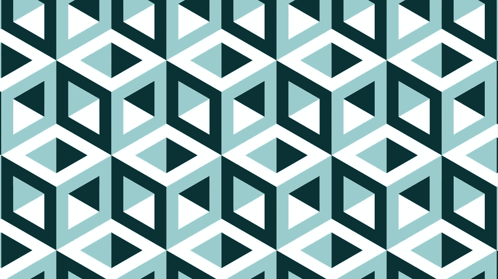

# 深入设计模式

> 原文：<https://medium.com/codex/dive-into-design-patterns-8d8c43636508?source=collection_archive---------1----------------------->

你问自己的第一个问题是…

# **什么是设计模式？**

设计模式是软件开发人员在软件开发过程中面临的一般问题的解决方案。这些解决方案是由许多软件开发人员在相当长的时间内通过反复试验获得的。

模式不是一段特定的代码，而是解决特定问题的一般概念，您可以遵循模式的细节并实现适合您自己程序实际情况的解决方案。

# **模式不是算法！**

模式经常与算法混淆，因为这两个概念都描述了一些已知问题的典型解决方案。虽然算法总是定义一组可以实现某个目标的清晰的动作，但是模式是解决方案的更高层次的描述。应用于两个不同程序的相同模式的代码可能是不同的。

算法类似于烹饪食谱:两者都有实现目标的清晰步骤。另一方面，模式更像一个蓝图:你可以看到结果和它的特性，但是实现的确切顺序取决于你。

**图案由什么组成？**

大多数模式都被非常正式地描述，所以你可以在很多接触中重现它们，设计模式只是解决问题的模式，你可以将两个或更多的设计模式合并在一起来解决你自己的问题。

**我为什么要学习模式？**

你不应该学习模式，你可以在不了解单亲父母的情况下做很多年的程序员，很多人就是这么做的。即使在这种情况下，您可能在不知道的情况下实现了一些模式，那么您为什么要花时间去学习它们呢？

*   设计模式定义了一种通用语言，您和您的团队成员可以使用这种语言更有效地交流。你可以说，“哦，就用单例吧，”这样每个人都会明白你的建议背后的想法。如果你知道模式和它的名字，不需要解释什么是单例。
*   设计模式是针对软件设计中常见问题的一套经过试验和测试的解决方案。即使您从未遇到过这些问题，了解模式仍然是有用的，因为它教会您如何使用面向对象设计的原则来解决各种问题。

记住这一点:当你想画圆的时候，你要用圆的图案，编程就像画画一样，你要用图案来解决你的问题，你可以不用图案来画圆，但是想象一下，如果你的手颤抖，那个形状就不是圆了。

# 他有多少设计图案？

我们有 23 种设计模式，命名为:

*   [工厂方法](https://mattsaedi.medium.com/factory-method-in-swift-18f8b2415cac)
*   抽象工厂
*   建设者
*   原型
*   一个
*   适配器
*   桥
*   复合材料
*   装饰者
*   外表
*   轻量级
*   代理人
*   迭代程序
*   调解人
*   纪念品
*   观察者
*   状态
*   战略
*   模板方法
*   访问者
*   责任链
*   命令
*   解释者

来源:深入研究设计模式书籍