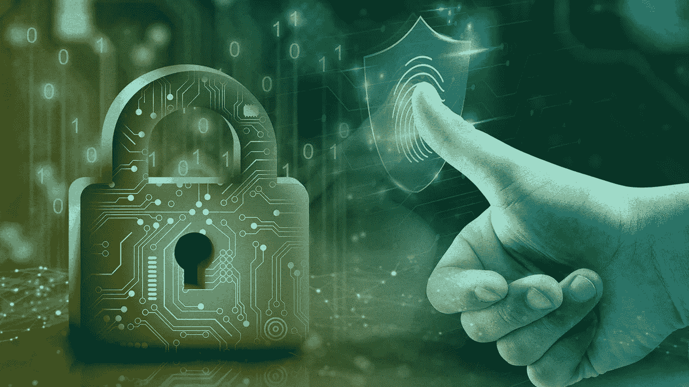

# 深入了解数字取证和事件响应(DFIR)

> 原文：<https://medium.com/codex/dive-into-digital-forensics-and-incident-response-dfir-cd1578e1ec67?source=collection_archive---------14----------------------->

由于数字技术的进步，组织被迫改变其规划、开发和实施网络安全的方式。现代技术为组织提供了新的机遇，也带来了新的问题和挑战。随着网络攻击的增加，许多组织正在采取主动措施来提高应对安全事件的能力，并建立一个**数字取证**就绪的环境。

**数字取证**

国家标准与技术研究所(NIST)将数字取证定义为侧重于数字设备和网络犯罪的法医学子领域，涉及检索、存储和分析有助于刑事调查的电子数据。这包括来自计算机、服务器、移动电话和其他电子设备的信息。

根据 Resendez 等人(2012 年)的说法，数字取证结合了法律和计算机科学的元素，以收集和分析来自计算机系统、网络、无线通信和存储设备的数据，这些数据在法庭上可作为证据。数字取证很强大。它有助于解决依赖电子设备证据的复杂案件。它恢复被删除的数据，获取不当行为的证据，并恢复被覆盖的数据。

**数字取证流程是怎样的？**

首先，调查人员在电子设备上搜索证据，并将数据保存到安全驱动器中。之后，他们分析并记录数据。当它准备好了，他们把数字证据交给警察来帮助犯罪调查，或者在法庭上展示它来帮助给罪犯定罪。

为了让您更清楚地了解数字取证过程，这里列出了数字取证过程的 9 个阶段。

**1。第一反应** —数字取证团队在安全事故发生并被报告后立即采取行动。

**2。搜查和扣押** —团队搜查与犯罪有关的设备上的数据和证据。

**3。证据收集** —专业人员随后利用法医技术收集数据以管理证据。

**4。证据的保护** —证据被安全地保护在一个可以验证数据的准确性和可访问性的地方。

**5。数据采集** —团队通过遵循适当的程序恢复电子存储的信息(ESI)以避免更改数据。

**6。数据分析** —团队对经过验证的 ESI 进行分类和审查，以找到并转换对法庭有益的数据。

**7。证据评估** —一旦 ESI 被确定为证据，调查人员就会对其进行评估。

**8。记录和报告** —在初步刑事调查之后，根据法院的要求对数据进行汇编和报告。

**9。专家证人证词** —专家证人确认数据适合在法庭上作为证据使用。

**数字取证的价值**

*   **快速反应**

由于数字取证本质上主要是技术性的，所以它是保护数据的强大工具。

*   **专家证据**

数字取证调查的结果可用于向股东、保险公司、法院等报告。

*   **防止未来的攻击**

与数字取证团队合作进行主动测量。

**数字取证与事件响应的关系**

如上所述，数字取证使组织能够快速识别您系统中发生的网络攻击。然而，为了管理现代网络安全事件的复杂性，将数字调查服务与事件响应专业知识相结合也非常重要。因此，数字取证和事件响应(DFIR)现在正成为现代组织的高需求。

数字取证和事件响应(DFIR)是一套多学科的任务和程序，旨在阻止活跃的网络安全事件。传统的事件响应(IR)通常包括一些调查组件，但 DFIR 通过更加强调数字取证提升了它。

使用 DFIR 时，组织可以受益于多种优势，例如:

1.  对事件做出反应时要迅速而准确
2.  最大限度地减少数据丢失或被盗以及声誉损失
3.  通过深入了解安全事件来加强安全协议和程序
4.  更快地从安全事件中恢复，中断更少

**数字取证和事件响应(DFIR)是如何工作的？**

**1。停止攻击(快速部署)**

事故响应人员将进行初步调查，以确定最有效的措施来遏制和消除威胁，同时收集证据。这需要了解事件的背景，确定调查方向，获取所需的资源和工具，进行初步调查，并收集证据。

**2。消灭入侵者(网络攻击遏制)**

这一阶段包括启动威胁遏制活动、锁定受影响的系统/帐户、使用计算机和网络取证技术重建犯罪现场、找到源头和入侵媒介，以及定位任何数据泄露实例。事故响应人员越早完成这一阶段，您的组织就越有可能安然无恙。

3.加强安全和提交报告(持续改进)

此阶段包括创建一个列表，列出所有受损资产以及暴露的数据或记录的类型。然后，该报告被提交给执行团队，该团队随后也被发送给执法机构。这有助于防止类似事件再次发生，因为防御措施是针对最初导致事件的漏洞量身定制的。

**结论**

91%的黑客需要 15 个小时来通过外围安全措施，54%的黑客需要这么长时间来完成攻击。来自网络攻击的数字数据应立即保存以供调查，这使得数字取证和事件响应(DFIR)的存在对于防止快速增长的网络攻击变得越来越重要。数字取证调查越快、越彻底，抓住黑客和修复任何损害的机会就越大。

**访问我们的** [***网页***](https://multimatics.co.id/Insight.aspx) **了解更多关于最新 it 安全和数字化转型的见解！**