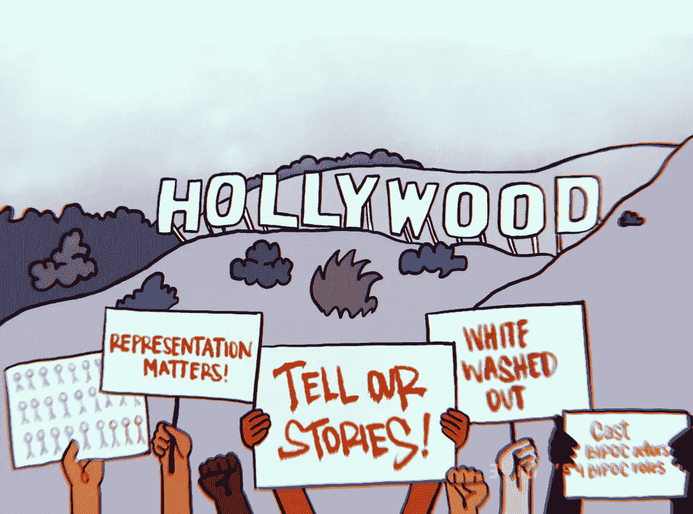
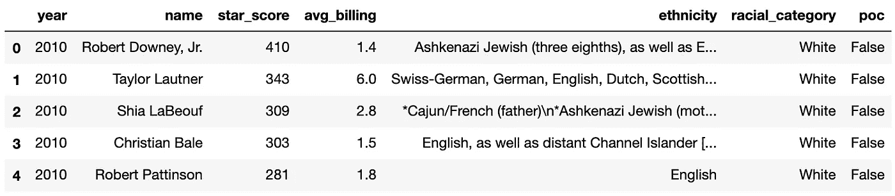
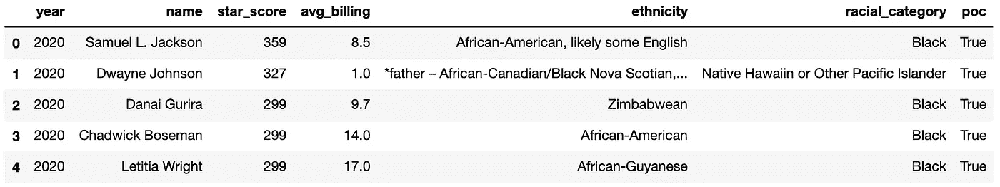
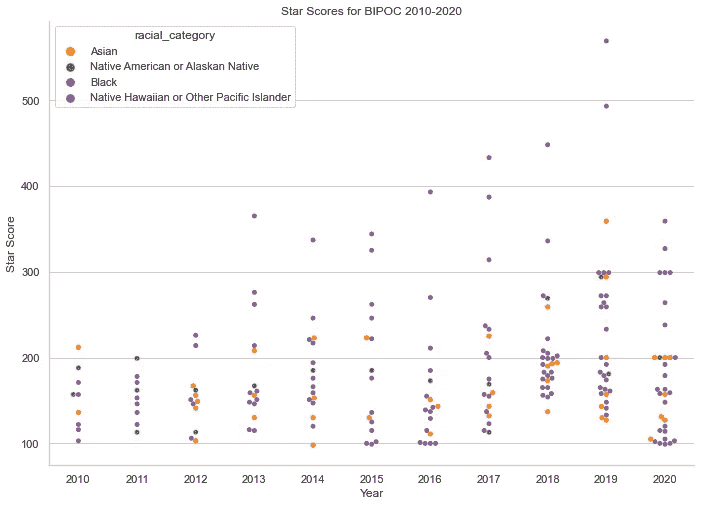
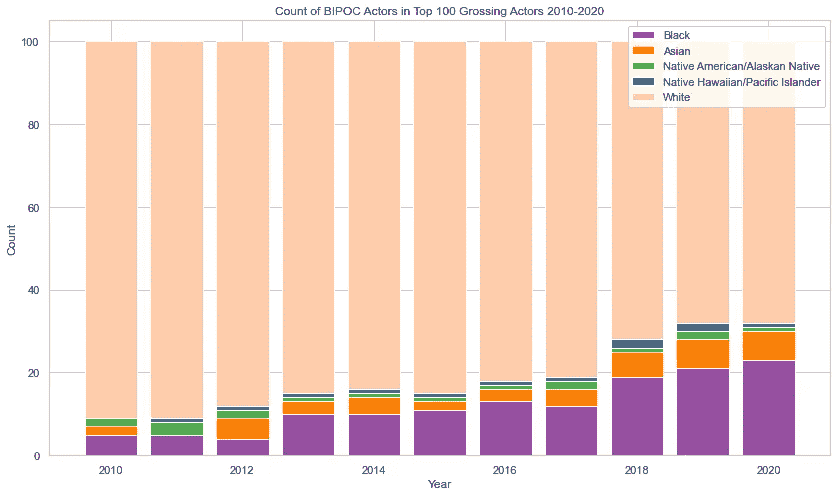
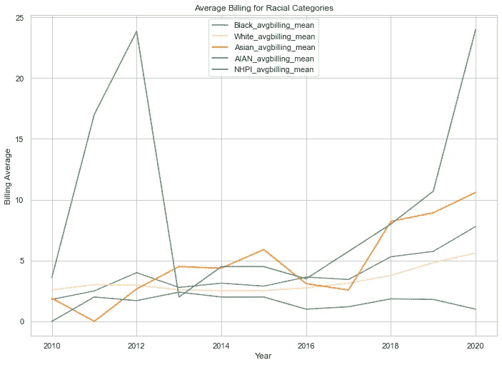

# 高票房电影的多样性…或者说缺乏多样性

> 原文：<https://medium.com/codex/diversity-in-top-grossing-films-or-the-lack-thereof-7031b399bc49?source=collection_archive---------7----------------------->

## [法典](http://medium.com/codex)

## 一个关于 2010-2020 年最卖座演员的数据科学项目

作者插图

前几年，电影公司因演员阵容缺乏多样性而受到批评。像 2015 年的**#奥斯卡索怀特**和 2016 年的**#粉饰太平**这样的运动要求好莱坞有更多的代表权。

因此，当我被分配一个项目，为微软提供商业建议(如果该公司要进入电影行业的话)时，多元化和包容性成为我分析的重点。我调查了票房最高的演员的种族构成，以测试票房是否符合这些要求，问了一个问题"*自 2010 年以来，票房最高的演员的人口统计有什么变化？*”

# 方法学

为了这个项目，我从[的数字](https://www.the-numbers.com/)和[的种族数据](https://ethnicelebs.com/)中收集了 2010-2020 年票房最高的演员的数据，然后使用 Seaborn 和 Matplotlib 创建了可视化效果来丰富分析。建议接踵而至。

# 数据

**2010-2020 年票房收入最高的演员**
数字提供了 2010-2020 年票房收入最高的 100 名演员的数据。该数据框展示了演员的 ***星级评分*** ，这是根据他们在过去三年中出演的票房最高的电影数量给演员的评分，以及*的平均账单，表明他们在电影中的重要性。*

***种族类别数据**
种族名人为数据帧中的每个演员提供了种族。[人口普查局](https://www.census.gov/topics/population/race/about.html)将种族限制在 5 个 ***种族类别*** :白人、黑人、亚洲人、夏威夷土著/太平洋岛民、美洲土著/阿拉斯加土著，其中美洲土著/阿拉斯加土著被定义为来自北美、中美和南美的人。西班牙裔和拉丁裔被认为是一个民族，而不是一个种族。出于这个原因，西班牙裔和拉丁裔不包括在种族类别中。如果给这个项目更多的时间，我也会研究拉美裔和拉丁裔在好莱坞的代表性。*

*亚洲的种族被归类为亚洲人。非洲的种族被归类为黑人。夏威夷或太平洋群岛的种族被划分为夏威夷土著/太平洋岛民。我知道这并不代表演员如何识别自己，所以这种方法有一些不准确和局限性。*

*演员通过在 ethnicelebs.com 上找到的“种族”字符串中包含的关键字进行分类。在某些情况下，特别是约翰尼·德普和杰瑞米·雷纳，演员有一盎司的非洲血统，这导致了演员的种族分类为黑人。因为这没有反映出好莱坞所需的代表性，并且明显扭曲了 BIPOC(黑人、土著、有色人种)的数据，所以我们用更准确的信息更新了数据库。*

*下面是 2010 年和 2020 年的完整数据图表。*

**

*2010 年票房收入最高的演员——作者照片*

**

*2020 年票房收入最高的演员——作者照片*

*快速浏览一下数据，我们发现从 2010 年到 2020 年有一个直接的转变，2010 年票房最高的 5 位演员是小罗伯特·唐尼、泰勒·洛特纳、希亚·拉博夫、克里斯蒂安·贝尔和罗伯特·帕丁森( ***全是白人*** )，2020 年票房最高的 5 位是塞缪尔·L·杰克逊、道恩·强森、丹娜·古瑞拉、查德维克·博斯曼和莱蒂西亚·赖特( ***【有色人种】*** 、 ***4 男 1 女*** 有了一个完整的数据框架，我们可以看到 11 年间票房收入前 100 名演员的全貌。*

*Giphy.com 的 GIF*

# *探索性数据分析和数据可视化*

*下图显示了 2010 年至 2020 年票房前 100 名演员中所有 BIPOC 演员的星级评分。到 2019 年，黑人演员的平均明星分数上升了 **72%** ，美洲原住民/阿拉斯加原住民演员的平均明星分数上升了 **36.7%** ，亚洲演员的平均明星分数上升了 **21.5%** ，夏威夷原住民/太平洋岛民演员的平均明星分数从零上升到了 377.5(道恩·强森摇滚！)，表明拥有多元化演员阵容的电影票房更好。*

**

*作者照片*

*我们的调查结果还显示了 BIPOC 演员在过去几年中稳步增长，特别是黑人演员。这是一个好消息，但是当我们对比一下 BIPOC 演员与白人演员的代表性时，BIPOC 演员仍然*代表不足，*占所有少数群体***的 32%*的总和，如下图所示。*****

**********

*****作者照片*****

*****此外，我们发现 BIPOC 参与者有更高的平均*。在表演艺术中，账单是一个数字，表明你在电影中的重要性。男主角的片酬为 1 英镑(想想《泰坦尼克号》中的莱昂纳多·迪卡普里奥)，而配角的片酬更高(比如《指环王》中的哈比人皮普和梅里)。我们的分析显示，三个种族群体的平均片酬*显著上升*:黑人演员为 **1.8 到 7.8** ，亚洲演员为 **1.9 到 10.6** ，美洲原住民/阿拉斯加原住民演员为 **3.6 到 24** ，这意味着 BIPOC 演员出演不太重要的角色。******

********

****作者照片****

# ****结论****

****Giphy.com 的 GIF****

****好莱坞在票房收入最高的电影中为 BIPOC 演员增加了更多的代表性，这方面做得还不错，但我们仍然发现 BIPOC 演员没有获得主角。他们的叙述消失了。反过来，当我们限制我们观看的内容类型时，我们也限制了自己。想象一下，当我们了解别人的观点时，我们的视角可以拓宽多少。微软理解“吸纳许多不同观点的变革力量。”展示有色人种的故事有能力做到这一点。****

****最重要的是，像美国这样多元化的观众寻求观看那些让我们感觉被看到和被代表的电影。不同的观众需要反映他们所持有的文化的电影。标签#OscarsSoWhite 和# whitewashedout 让我们走了这么远，但我们仍然可以继续争取更多。****

****以下是关于[代码](https://github.com/christianmoya/Phase1_Project)、[非技术演示](https://github.com/christianmoya/Phase1_Project/blob/main/Microsoft%20Film%20Analysis%20Deck.pdf)和 [me](https://www.linkedin.com/in/christian-moya/) 的更多内容。****

*****你还希望在好莱坞找到什么进步？下面评论。*****