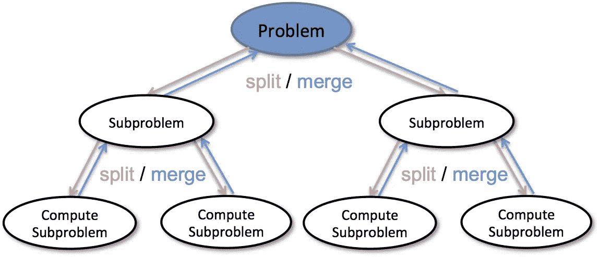

# 分治算法

> 原文：<https://medium.com/codex/divide-and-conquer-algorithm-f766640ef038?source=collection_archive---------5----------------------->

顾名思义，分而治之的方法是把给定的问题分成几个部分，然后每个问题独立解决。当我们继续将问题分成更小的部分时，当问题不能再分成更小的部分时，这些更小的部分被求解，所有这些更小的部分或子部分的解最终被合并以获得原始问题的解。



分治算法

这个算法非常有用，有非常有趣的应用，优点，缺点。我们将在这篇博客中仔细观察它们，这将使你理解为什么这个算法在这个世界上非常有用。

你还在等什么？我们开始吧！

# 分治算法包含以下步骤:

1.  划分:这包括将问题划分成更小的子问题。
2.  **征服:**递归地解决更小的子问题。
3.  **组合:**将递归过程中的子问题的解组合起来，以解决实际问题。

# 何时何地使用分治算法:

如果我们有一个与分治算法密切相关的问题，这个算法将是有用的。我们可以在问题可以被分成子问题的情况下使用这种算法，但是要确保同一个子问题不会被解决多次。如果同一个子问题被解决了几次，那么你应该明白，这个问题将通过动态方法而不是分治算法来解决。

# **分而治之的优势:**

1.  这种算法使给定的问题变得更容易，因为它将给定的问题分成更容易解决的子问题，然后单独解决它们中的每一个，并将所有子问题的所有解决方案组合成一个来解决原始问题。
2.  该算法提高了快速排序、合并排序等其他算法的效率。这些算法都是分治算法的应用。
3.  大多数处理器都支持这种算法，尤其是在共享存储器系统中，处理器之间的数据通信不需要预先编程。
4.  该算法以高效的方式使用内存缓存。

# 分而治之的缺点:

1.  这种算法的主要问题是递归速度慢，增加了时间复杂度。
2.  这种算法的另一个问题是，当通过这种方法解决问题时，有时会变得复杂，而基本的迭代方法似乎更容易。
3.  当通过这种方法解决问题时，有时会有相同的子问题。所以最好保存重复的子问题的解。
4.  当使用这个算法时，确保有足够的内存分配给返回堆栈；否则，处理可能会因堆栈溢出而失败。

# **分而治之应用:**

1.  **二分搜索法:**这是一种基于分治算法原理的快速搜索算法。为了使该算法正常工作，数据应该是排序后的形式。该算法通过比较集合中最中间的项来查找特定的项。如果出现匹配，则返回该项的索引。如果中间项大于项，则在中间项左侧的子数组中搜索该项。否则，将在中间项目右侧的子数组中搜索该项目。这个过程也在子阵列上继续，直到子阵列的大小减小到零。
2.  **合并排序:**这种排序技术也基于分治算法的原理。该算法首先将数组分成相等的两半，然后以排序的方式组合它们。
3.  快速排序:这种排序技术也是基于同样的原理。该算法选取一个 pivot 元素，以这样一种方式重新排列数组元素，即小于所选取的 pivot 元素的所有元素都移动到 pivot 的左侧，而所有较大的元素都移动到右侧。最后，该算法对 pivot 元素左右的子数组进行递归排序。
4.  **斯特拉森矩阵乘法:**这种技术也是基于同样的原理。这种技术是两个矩阵相乘的有效算法。

# 时间复杂度

分而治之算法的复杂度使用如下的主定理来计算。

```
T(n) = aT(n/b) + f(n),
where,
n = size of input
a = number of subproblems in the recursion
n/b = size of each subproblem. All subproblems are assumed to have the same size.
f(n) = cost of the work done outside the recursive call, which includes the cost of dividing the problem and cost of merging the solutions
```

现在让我们举一个例子，找出一个递归问题的时间复杂度

```
T(n) = aT(n/b) + f(n)
     = 2T(n/2) + O(n)
Where, 
a = 2 (each time, a problem is divided into 2 subproblems)
n/b = n/2 (size of each sub problem is half of the input)
f(n) = time taken to divide the problem and merging the subproblems
T(n/2) = O(n log n) (To understand this, please refer to the master theorem.)

Now, T(n) = 2T(n log n) + O(n)
          ≈ O(n log n)
```

此外，该算法允许我们在很大程度上降低时间复杂度。

例如，冒泡排序使用 O(n ^ 2)的复杂度，而快速排序(分而治之的应用)将时间复杂度降低到 O(nlog(n))。线性搜索的时间复杂度为 O(n)，而二分搜索法(分而治之的一种应用)将时间复杂度降低到 O(log(n))。

# **总结**

你要做的第一件事是确定给定的问题是否能被分治算法解决。一旦你知道这个问题可以用 D&C 算法来解决，那么你的任务就变得简单了，因为现在你只需要遵循三个步骤:使用递归调用将给定的问题分成子问题，解决子问题，然后将它们组合在一起找到原问题的答案。该算法的时间复杂度也大大降低。

这个博客到此为止。我希望你们都明白这个话题。如果您对此有任何疑问，可以在 [LinkedIn](https://www.linkedin.com/in/harsh-8711a81a0/) 上发表评论或联系我。