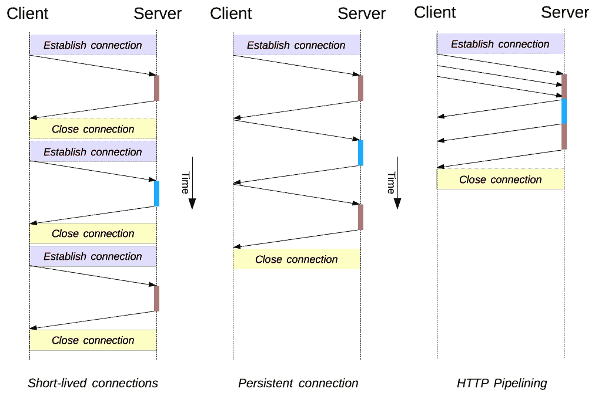

# HTTP 及其演变:深入网络和通信

> 原文：<https://medium.com/codex/diving-deep-into-communication-layer-7-protocols-3e05d969eff7?source=collection_archive---------6----------------------->

这是致力于探索两台机器如何通过互联网相互通信的系列文章的第一篇。作为一名软件工程出身的人，我一直觉得对我们日常编写的业务代码之外发生的事情缺乏了解。这是我试图理解通信的底层细节，以及每条消息是如何通过不同的路线到达目的地的。

# **简介**

开放系统互连(OSI)模型定义了计算机系统用来通过网络进行通信的七个层。OSI 模型的最顶层是应用层。

应用层由最终用户软件使用，如 web 浏览器和电子邮件客户端。它提供协议，允许软件发送和接收[信息，并向用户呈现有意义的数据](https://www.imperva.com/learn/data-security/information-security-infosec/)。应用层协议的几个例子是[超文本传输协议](https://www.imperva.com/learn/performance/http2/) (HTTP)、文件传输协议(FTP)、邮局协议(POP)、简单邮件传输协议(SMTP)等。

一个过于简单的解释是，任何第 7 层协议都只是一组规则，这些规则定义了从客户端发送到服务器的数据在转换为字节流之前的整体结构。在客户端，各种类型的元数据在被转换成 TCP/UDP 流之前被添加到有效载荷中，并且在服务器端，这些流根据定义的规则被解析以获得所需的有效载荷。我会在后续文章中讨论 TCP/UDP 以及第 7 层和第 4 层之间的交互。

在本文中，我将讨论在第 7 层的 web 应用程序中广泛使用的协议，即 HTTP 和 web 套接字。

# 超文本传送协议

超文本传输协议(HTTP)是万维网的基础，用于通过超文本链接加载网页。该协议被设计为在 TCP 上运行。
当您向 web 服务器发出请求时，您和服务器之间会建立 TCP 连接(客户端 IP +客户端端口—服务器 IP +服务器端口)。
所有这些连接的创建和持久化通常由一个 HTTP 客户端从我们这里抽象出来，例如 Axios。浏览器也是 HTTP 客户端，因为它向 HTTP 服务器(Web 服务器)发送请求，然后服务器向客户端发回响应。然而，这些 HTTP 客户端和服务器在发出请求或响应请求时遵循 HTTP 定义的所有规则。[这个](https://github.com/ZeroGazer/http-client-socket-java/blob/master/src/main/java/hk/ust/comp4621/project/HTTPClient.java)是 JAVA 中 HTTP 客户端的一个非常简单的例子。

**HTTP/0.9 —单行协议**

HTTP 的初始版本没有版本号；后来被称为 0.9，以区别于后来的版本。HTTP/0.9 非常简单:请求由一行组成，以唯一可能的方法`[GET](https://developer.mozilla.org/en-US/docs/Web/HTTP/Methods/GET)`开始，后跟资源的路径。将为每个 HTTP 请求打开一个 TCP 连接，然后在收到响应时关闭。
由于每个 TCP 连接上只有一个请求，客户端和服务器很容易理解请求或响应何时结束。

```
GET /mypage.html<html>
A very simple HTML page
</html>
```

**解析请求和响应**

对于请求，一旦 TCP 流结束，服务器就知道请求字符串是完整的，它现在可以解析它以理解请求是什么..
响应也非常简单:它只包含文件本身。当 HTTP 客户端获得结束 HTML 标记时，它将知道响应已送达，并将关闭 TCP 连接。

**问题**

不像后来的发展，没有 HTTP 头。正因为如此，HTTP/0.9 出现了许多问题。其中一些是:

*   无法发送除 HTML 文件之外的任何内容。
*   错误响应和成功响应之间没有区别。

**HTTP/1.0**

HTTP/1.0 被称为网络浏览器友好协议。随着万维网的普及，HTTP/0.9 的各种问题开始浮出水面。为了消除它的一些问题，1.0 中引入了标题和状态码(200，404)的概念。我们还开始在请求和响应中添加 HTTP/1.0，以区分请求和 0.9 请求。现在有了头的概念，服务器可以在响应中提到什么是内容类型，这样客户端就可以相应地解析它。作为响应的一部分，状态代码确保了客户端知道收到的是哪种响应。

此时，典型的请求和响应如下所示:

```
GET /mypage.html HTTP/1.0
User-Agent: NCSA_Mosaic/2.0 (Windows 3.1)HTTP/1.0 200 OK
Date: Tue, 15 Nov 1994 08:12:31 GMT
Server: CERN/3.0 libwww/2.17
Content-Type: text/html
<HTML>
A page with an image
  
</HTML>
```

**解析请求和响应**

既然请求和响应都有头和负载，HTTP 就定义了如何解析流以从中获取有意义的数据。基本规则是头中的 content-length 告诉您读取有效负载所需的字节数。为了识别标头结束和负载开始的时间，只需获取第一次出现的“\r\n\r\n”。在这之后，消息的主体将开始。标头中的每个键值对由“\r\n”分隔。上面标记的例子基于同样的原理工作。

**问题**

HTTP/1.0 仍然存在的一个问题是为每个 HTTP 请求打开一个 TCP 连接。当服务器准备响应时，TCP 流保持未使用状态。此外，每次建立新连接时，还应该进行 TCP 三次握手。为了获得更好的性能，减少往返次数并优化客户端和服务器之间的 TCP 隧道的使用是至关重要的。HTTP/1.1 用持久连接和管道解决了这个问题。

## **HTTP/1.1 —标准化协议**

这是目前大多数用例使用的版本。HTTP/1.0 和 1.1 有各种不同，比如支持`GET`、`HEAD`、`POST`、`PUT`、`DELETE`、`TRACE`、`OPTIONS`，而 1.0 只支持`GET`、`HEAD`、`POST`。HTTP/1.1 还支持`Upgrade`头，通过它可以使用常用的协议(如 HTTP/1.1)启动连接，然后请求连接切换到增强的协议类型(如 HTTP/2.0 或 WebSockets)。
但最显著的区别是 HTTP/1.1 如何引入各种性能优化，如下所述:

*   **持久连接**
    从下图中可以清楚地看到，我们不需要为每个 HTTP 请求创建一个新的 TCP 连接，这样可以节省多次往返，例如加载一个附加了多个图像的网站，或者使用客户端的相同端口重复调用网络服务器。此外，主机可以添加`timeout`和`max`参数，以便设置超时或限制每个连接的最大请求数，从而不会耗尽主机的资源。
*   HTTP 并行请求 HTTP 1.1 中的另一个优化是并行请求。客户机可以通过一个 TCP 连接发出多个并行请求，而不是发出请求然后等待响应。并行化的一个问题是接收者现在需要理解[哪个响应属于哪个请求](https://stackoverflow.com/a/65597570/5799085)。这就是为什么服务器仅在第一次响应后才发送第二次响应，如下图 HTTP 管道图所示。但是由于 TCP 提供的序列排序，请求和响应不会相互混淆。即，请求 1 将具有序列 1-m，请求 2 将具有序列 m+1-n 等等。一旦请求到达服务器，根据定义的规则，每个请求都将被解析(响应也是如此)。
    对于浏览器，每个浏览器都有不同的[每个服务器的默认同时持久连接数上限](http://Max Number of default simultaneous persistent connections per server)。



HTTP 连接持久化和管道化(图片来自[developer.mozilla.org](https://developer.mozilla.org/en-US/docs/Web/HTTP/Connection_management_in_HTTP_1.x)

该图清楚地展示了持久连接和管道对性能的影响。

一个典型的请求流，**都通过一个 TCP 连接**，看起来像这样:

```
GET /en-US/docs/Glossary/Simple_header HTTP/1.1
Host: developer.mozilla.org
User-Agent: Mozilla/5.0 (Macintosh; Intel Mac OS X 10.9; rv:50.0) Gecko/20100101 Firefox/50.0
Accept: text/html,application/xhtml+xml,application/xml;q=0.9,*/*;q=0.8
Accept-Language: en-US,en;q=0.5
Accept-Encoding: gzip, deflate, br
Referer: [https://developer.mozilla.org/en-US/docs/Glossary/Simple_header](https://developer.mozilla.org/en-US/docs/Glossary/Simple_header)200 OK
Connection: Keep-Alive
Content-Encoding: gzip
Content-Type: text/html; charset=utf-8
Date: Wed, 20 Jul 2016 10:55:30 GMT
Etag: "547fa7e369ef56031dd3bff2ace9fc0832eb251a"
Keep-Alive: timeout=5, max=1000
Last-Modified: Tue, 19 Jul 2016 00:59:33 GMT
Server: Apache
Transfer-Encoding: chunked
Vary: Cookie, Accept-Encoding(content)GET /static/img/header-background.png HTTP/1.1
Host: developer.mozilla.org
User-Agent: Mozilla/5.0 (Macintosh; Intel Mac OS X 10.9; rv:50.0) Gecko/20100101 Firefox/50.0
Accept: */*
Accept-Language: en-US,en;q=0.5
Accept-Encoding: gzip, deflate, br
Referer: [https://developer.mozilla.org/en-US/docs/Glossary/Simple_header](https://developer.mozilla.org/en-US/docs/Glossary/Simple_header)200 OK
Age: 9578461
Cache-Control: public, max-age=315360000
Connection: keep-alive
Content-Length: 3077
Content-Type: image/png
Date: Thu, 31 Mar 2016 13:34:46 GMT
Last-Modified: Wed, 21 Oct 2015 18:27:50 GMT
Server: Apache(image content of 3077 bytes)
```

**解析请求和响应**

HTTP 1.0 和 1.1 在语法上没有太大的区别。尽管它有更多的方法和其他添加到头中的内容，但基本思想是一样的。我们用“\r\n”分隔每个标题行，标题和正文用“\r\n\r\n”分隔。

但是，在 1.1 中，我们还需要处理流水线和持久性。
在流水线中，如上所述，服务器提供的响应必须按照请求到达的顺序。即，如果客户端发送了 3 个请求，服务器将返回请求 1 的响应，然后是请求 2，接着是请求 3。响应 2 和 3 是否在响应 1 之前计算无关紧要。(这也叫[线头堵塞](https://en.wikipedia.org/wiki/Head-of-line_blocking#:~:text=Head%2Dof%2Dline%20blocking%20(,multiple%20requests%20in%20HTTP%20pipelining.))。这是必需的，因为 HTTP 无法理解每个请求对应的响应是什么，所以它依赖于它们的顺序。由于需要服务器支持这一要求，目前大多数浏览器都不支持。

**问题**

尽管 HTTP 1.1 提供了相当大的性能升级和各种其他功能，但它仍然有一些限制，如下所述:

*   这里的[所指的流水线故障](https://www.ietf.org/archive/id/draft-nottingham-http-pipeline-01.html)。
*   每个请求的标题复制。
*   线路阻塞负责人。

在这一点上我们只完成了一半，这看起来已经像是一篇大文章了。我会写一篇续篇，讨论更多版本的 HTTP (2.0，3.0)并详细描述 web 套接字。敬请期待:)