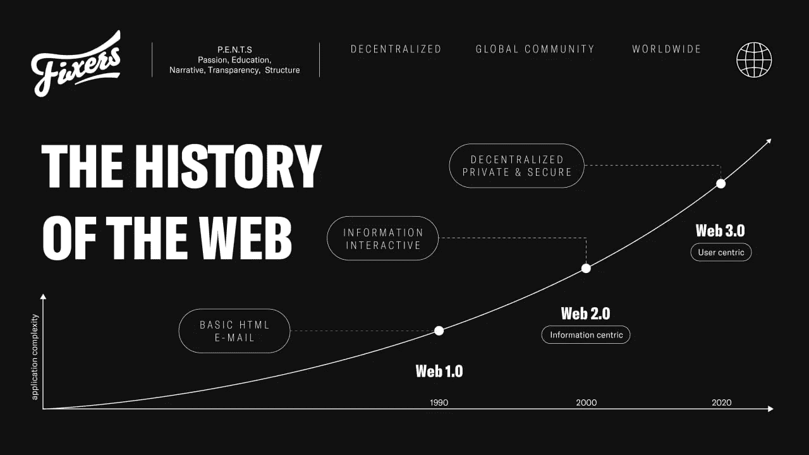
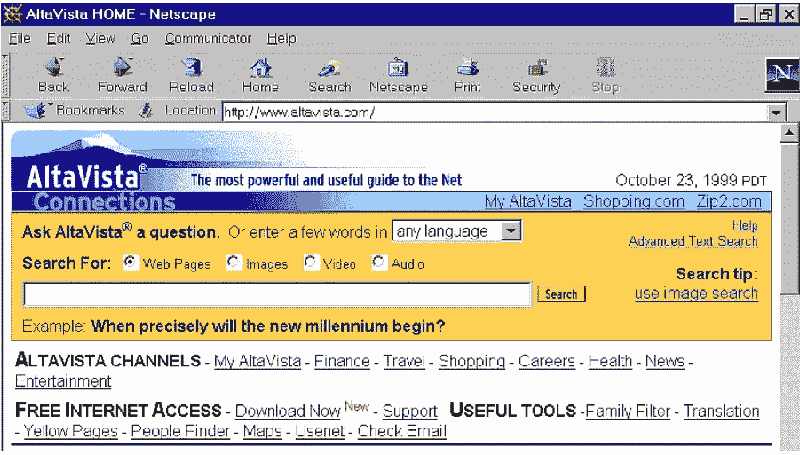
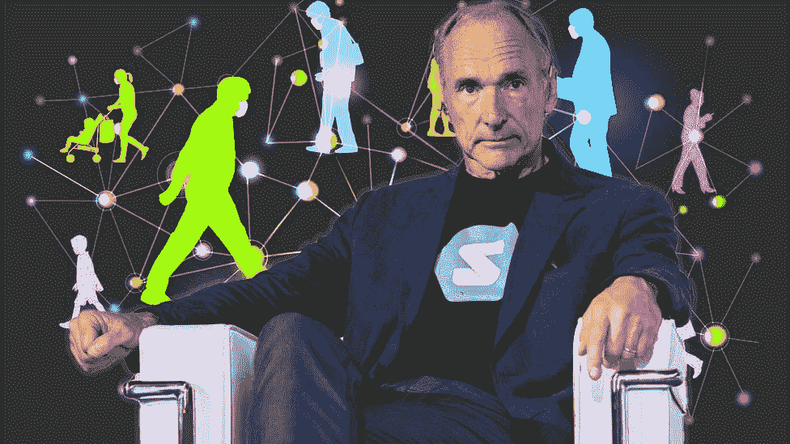
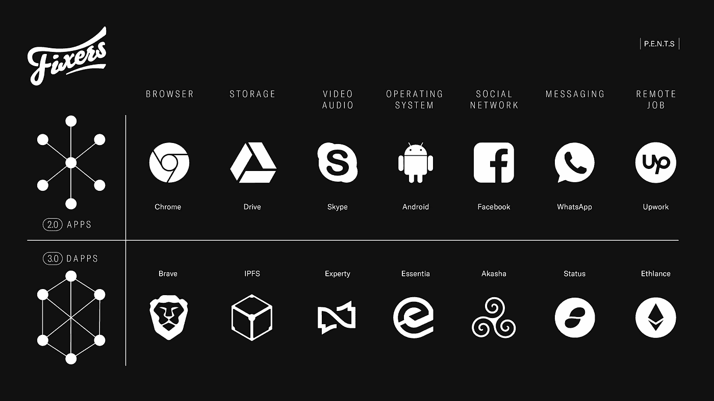

# 潜入 Web 3.0

> 原文：<https://medium.com/codex/diving-into-to-web-3-0-fa12fdf37cae?source=collection_archive---------22----------------------->

## **听说过 Web 3.0 但不知道它是什么？继续读下去，看看我学到了什么！**

我是 [Fixers](https://omuldoon.medium.com/) 的一员，这是一个由主要从事加密工作的社区管理者组成的社区。每天都有一个叫做 Web 3.0 的行业的项目与我们接触。

因此，为了帮助理解什么是 Web 3.0，它的优势、劣势、机会和威胁，我决定写这篇文章来帮助巩固我的理解。我们中的许多人也有类似的情况，所以我希望你会发现我对这个话题的探索也很有用！

那么，让我们开始吧，还有什么比开始更好的呢——重要的事情先做！

# 什么是 Web 3.0？

Web 3.0 是下一代互联网，由于去中心化和区块链技术，它应该比我们现在使用的更好。

不管你是否对技术及其发展感兴趣，你肯定听说过 Web 3.0 这个时髦词。

但是 Web 3.0 到底是什么？它意味着什么，它将如何影响我们所知的生活？

为了帮助理解，我们将从确定 4 个关键问题开始，这些问题对于我们熟悉新的互联网时代至关重要。

*   什么是 Web 3.0，应该如何实现？
*   Web 3.0 的主要好处是什么？
*   Web 3.0 的主要缺点是什么？？
*   区块链和加密货币是如何融入 Web 3.0 的？

您知道 Web 3.0 是目前技术专业人员、加密爱好者和投资者中最流行的术语之一吗？他们倾向于指任何未来的技术，如我们所知的 Web 3.0。

许多 Web 3.0 的支持者认为，去中心化、人工智能(AI)以及基于区块链技术和加密货币的经济将是互联网发展下一阶段的主要焦点。

但是为什么人们对互联网发展的这个新阶段如此感兴趣呢？嗯，许多人开始意识到他们对自己的数据几乎没有控制权，并且过度依赖第三方的限制。

正是这种观点促使人们需要一个“新版本”的互联网。

让我们回到互联网的起源来理解时间线，以及 Web 3.0 想要增强什么。

*数据来源:*[*https://appinventiv . com/blog/we b-3-0-区块链-对企业的影响/*](https://appinventiv.com/blog/web-3-0-blockchain-impact-on-businesses/)

从 20 世纪 90 年代到 21 世纪初，Web 1.0 是第一代互联网。当时，它被视为一种工具，以民主化获取信息。相对于现在，用户体验很差。这些网站主要是静态的，不允许创建我们今天喜欢的高质量内容。即便如此，这对人类来说也是革命性的一步。

# Web 1.0 页面布局

*图片来源:*[*https://www . techradar . com/news/internet/web/is-web-1-0-making-a-big-return-1291121*](https://www.techradar.com/news/internet/web/is-web-1-0-making-a-big-comeback-1291121)

现在，随着我们今天使用的 Web 2.0 的扩展，互联网发生了转变。交互式材料(用户可以自己生成)已经取代了静态网站。这让数百万人可以自由、轻松地进入一个世界，在那里他们可以进行前所未有的互动。由于谷歌、脸书、亚马逊等公司的创新和成功，Web 2.0 以惊人的速度发展。

# **Web 2.0 中集中化的挑战**

互联网提供了令人难以置信的技术，使 46 亿人的生活变得更加简单，并提供了无与伦比的信息获取途径。这就像你的口袋里有一台超级计算机，你能想到的每一个可能的问题都有某种答案。好处是惊人的。

然而，另一方面，Web 2.0 也有许多缺点。其中包括在谷歌、亚马逊、脸书、推特等大公司中盛行的集中化风气。互联网的“秩序”是由这些科技巨人创造的。但这是对的吗？民主吗？

批评家声称他们获得了太多的权威和权力——钟摆摆得太大了。由于集中化，一些初创企业、新的内容提供商和各种不同的用户都受到了影响。

但是怎么做呢？好吧，因为几乎每个社交媒体上的人都使用这些中央集权的公司，他们的行为，最终，他们的成功，都受到同样的中央集权公司的监管。举个例子，我们来谈谈对一个小企业主的财务影响。

当谷歌或脸书对[算法进行调整](https://digitalmarketinginstitute.com/blog/how-do-social-media-algorithms-work)影响到帖子的可见性时，小企业主必须做出回应。这种调整往往会缩小他们的信息传递范围。这对小工匠有直接的经济影响，如果他们想继续接触更多的观众，就必须在广告上花更多的钱。

主流媒体是新闻的集中来源。我们越来越不信任 T2。Web 2.0 使得分散的新闻来源得以出现，让任何拥有足够多追随者的人都可以与公众互动。多元化的观点和开放的话语，加上对“真相”的更好的看法，都无助于失去可信度的集中信息来源。

所有这些问题都将在未来几年持续存在，需要进行辩论和处理。由于这些缺陷，增强互联网的愿望越来越强烈。可以说 Web 3.0 可能是正确的解决方案。

# **Web 3.0 会是什么样子？**

由于我们仍处于发展的早期阶段，所以对于 Web 3.0 还没有一个具体和绝对的定义。关于 Web 3.0 到底有没有用，也有很多争论。

它的发展已经并将继续递增。因此，采用新技术并将其集成到新网络中的标准化方法尚未被发现。

Web 3.0 指的是依赖于点对点(P2P)技术的下一代互联网。这包括区块链、开源软件、元宇宙、物联网、人工智能和一系列其他新技术。

Web 3.0 将吸取 Web 1.0 和 Web 2.0 的精华，并将它们融合在一起。但是新的互联网将如何帮助用户呢？

作为 Web 3.0 的结果，互联网将变得更加自主和开放。用户仍然依赖网络服务提供商来跟踪流经他们网络的数据。随着 Web 3.0 的推出，人们将能够从一个帐户控制他们的数据并访问所有应用程序和服务，所有活动都将被记录在区块链上。

# Web 3.0 和语义网一样吗？

*图片来源:*[*https://www.bbc.com/news/technology-54871705*](https://www.bbc.com/news/technology-54871705)

蒂姆·伯纳斯·李提出了万维网的概念。被称为“互联网之父”的他还创造了“语义网”这个短语。

Berners-Lee 使用语义网这一术语为用户提供了一种新的、更有效的方法来访问可以很容易地与现实生活环境联系起来的数据。这不应该与 Web 3.0 混淆，Web 3.0 远远超出了伯纳斯-李的设想。

浏览器应该在语义网上充当用户的个人助理。那么，这在实践中是如何运作的呢？

在 Web 2.0 中，它会这样工作。让我们想象一下，你想买一部新手机，然后你想买一些素食食品。你应该做的第一件事是寻找能为你想要的手机提供最优惠价格的商店。然后你找一家有你喜欢的菜单的素食餐馆。对于这一切，你可能会去各种网站，阅读大量的评论。这是一个耗时的过程。

为了节省时间，语义网浏览器会根据你以前的购买和兴趣，以及你的地区和预算，努力编辑一个“最佳报价”。更加个性化—更好的体验，更好地反映您真正想要的。

这是一个简单的例子，展示了语义网的概念。尽管不尽相同，但这些品质中的许多与 Web 3.0 中应该包含的品质是相同的。

Web 3.0 是语义网的更高级版本。除了前面提到的对等技术、区块链和人工智能之外，Web 3.0 利用语义 Web 及其 Web 前身的功能来提供最复杂的体验。

*数据来源:*[*【https://defiprime.com/chainbeat】*](https://defiprime.com/chainbeat)

# **Web 3.0 有 4 个基本特性**

尽管还没有统一的定义，但我们可以将 Web 3.0 提炼为 4 个关键特征:

## 1.“无信任”和“无许可”

第一个是“无权限”和“无信任”。但是当人们说 Web 3.0 就是这些东西的时候，他们指的是什么呢？简而言之，一些“不可信”的东西意味着参与者之间的交互不需要第三方。

另一方面，无许可意味着没有人需要“许可”才能参与。不需要任何管理机构来授权你的参与。阿尔格兰德·区块链就是一个很好的例子，说明了什么是“未经许可”和“不可信”。多亏了分散式应用程序，所有 Web 3.0 应用程序和网站都能够以这种方式运行。

## 2.人工智能

[人工智能已经在渗透我们的日常生活](https://beebom.com/examples-of-artificial-intelligence/)。例如，当你写电子邮件时，你已经可以得到你希望如何完成句子的建议。

在日益强大和智能的计算机的帮助下，Web 3.0 有望像人类一样掌握信息。Web 3.0 还将利用机器学习，这是一种人工智能，它使用数据和算法，通过不断提高准确性来“模仿”人类的学习方式。

## 3.分散

大型科技和互联网公司现在决定如何对信息进行分类和审查，以及哪些内容可以推广和禁止。通过公开透明的流程，Web 3.0 应该将这类事务的决策权交给用户(社区)。

分散网络的一个关键特征是用户控制他们的数据如何被存储、管理和使用。不同于将信息存储在单个数据库中，例如亚马逊的中央数据库，所有数据都存储在不同的位置以确保分散化。

这也允许我们保留对我们数据的所有权，而不会自动和免费地放弃它。

## 4.设备互连性

所有内容都可以在任何连接互联网的设备或应用程序上获得和访问。能够访问互联网的设备数量将会增长。

“物联网”有望因 Web 3.0 的发展而获得牵引力。

一个很好的例子是 [IOTA](https://www.iota.org/) ，第一个为“万物互联”设计的分布式账本，这是一个允许人类和机器交换价值和数据的网络。

IOTA Tangle 是一种尖端的分布式账本技术(DLT ),专为物联网(IoT)打造。这是一个分布式分类帐，允许无摩擦的数据和价值移动。它是开源的，无感觉的，可扩展的。

# **Web 3.0 的四大好处**

## 1.没有中心位置

由于中介不再参与，他们失去了对用户数据的控制。这降低了政府或企业审查的危险。然而，这是一把双刃剑，因为有些东西可能确实需要审查。这将在本文后面讨论。

## 2.改进的信息流

随着未来更多的设备连接到互联网，可以分析更多的数据，从而获得更准确的信息，更好地满足个人消费者的特定需求。

## 3.提高互联网搜索效率

使用 web 浏览器查找最佳结果可能需要很长时间。由于元数据和对我们搜索内容的更好的了解，我们的搜索结果将变得更加符合我们对 Web 3.0 的需求。

## 4.更好的广告

现在很少有人喜欢每一步都被广告淹没。然而，我们都同意，如果广告能满足我们的需求，它也是值得的。人工智能系统将被用于 Web 3.0，以更好地定制广告，满足用户的需求。

# **Web 3.0 的风险**

然而，Web 3.0 的出现也带来了一些风险，需要解决这些风险以提供一个平衡的概述。这些措施如下:

## **犯罪嫌疑人落入骗局的风险增加**

有了 Web 3.0 平台，用户被期望为他们的行为承担更多的责任。特别是在 Telegram 或 Twitter 这样的平台上，用户经常会被假装来自“客户支持”的人要求提供他们的加密钱包种子短语、私钥或其他个人数据。

缺乏 Web 3.0 技术的经验会导致人们，尤其是新手，做出[非常糟糕的安全决策](https://www.techtarget.com/searchsecurity/news/252513781/New-tech-same-threats-for-Web-30)。由于没有采取正确的安全措施，经常有失去所有资金的风险。谢天谢地，网上有很多关于如何在 Web 3.0 世界中保持安全的信息。

## **更多图形/淫秽材料**

缺乏集中控制带来了更大的言论自由和自由。但这意味着审查我们都认为是不好的内容要困难得多。这包括暴力、其他图像、恐怖活动和其他应受谴责的内容。

## **数据质量和操作**

有了集中的信息源，就更容易保持更高的质量标准。然而，这是有争议的，因为我们从集中的主流媒体渠道获得的信息质量往往被证明是错误的。使用人工智能也不能保证有帮助。它取决于收到的信息的质量是否有效。我们已经看到微软使用的人工智能 Tay 出了什么问题，它被训练成了种族主义者。

## 这真的有用吗？

有些著名的 Web 3.0 怀疑论者，比如斯蒂芬·迪尔，走得更远。这些问题[有效，需要回答](https://www.stephendiehl.com/blog/web3-bullshit.html):

> “谁将为提供内容的全球数据中心买单？
> 
> 谁的律师会回应 DMCA 的请求？谁将禁止纳粹账户？
> 
> 谁将删除 CSAM 的内容？
> 
> 奶奶忘记密码谁来重置？"

Web 3.0 的支持者将不得不回答这些问题，让那些执着于 Web 2.0 的人满意，以便让这个新的现实真正扎根。

# **区块链和加密货币在 Web 3.0 中能扮演什么角色？**

当谈到区块链和加密货币在 Web 3.0 中如何交互时，我认为最好看一看密码学。对我来说，这里是最大的发展。一个引起我注意的概念叫做“零知识证明”,也称为 ZKPs。

为什么？这是一种区块链技术，可以在不泄露数据的情况下对数据进行验证。换句话说，这意味着我们现在可以在不透露任何其他数据的情况下验证一个陈述是真实的。

如果你像我一样对这种工作方式着迷，那就喝杯咖啡，听听密码学家 Cathie Yun 在 2019 年麻省理工学院比特币博览会上的精彩演讲。虽然现在有点过时，但它仍然是一个很好的起点。

那么，这为什么令人兴奋呢？嗯，有很多用例，集中在[隐私和缓解拥堵](https://research.aimultiple.com/zero-knowledge-proofs/#:~:text=Zero%2Dknowledge%20proofs%20can%20be,lead%20to%20deanonymization%20of%20users)。其中包括金融、在线投票、认证和机器学习。每一个的基础是维护你的隐私，但同时提供关键信息。

因此，对于金融业来说，你可以证明你的工资在银行贷款的要求范围之内，而不必透露你的确切收入。对于身份验证，不需要提供任何私人数据(如密码)来证明您有权访问它。

有了区块链，它可以用来帮助防止用户去匿名化，而且还可以在应对网络拥塞方面发挥作用。这是因为 ZKPs 功能允许所谓的 ZK 卷。

这些现在被用来解决区块链缩放问题。由于可以在不提供任何进一步信息的情况下验证一个陈述是否为真，所以 ZK 卷积需要少得多的资源用于块验证。这为[增加的扩展](https://coinmarketcap.com/alexandria/article/what-can-zero-knowledge-technology-do-for-scalability)释放了资源。

这只是区块链和加密在我们 Web 3.0 未来的许多潜在用例之一。其他的包括 DAOs、DeFi world、NFTs 和其他运行在更加分散的未来的概念。

虽然关于“未来互联网”的许多问题仍未解决，但有一点是肯定的:这是一项真正令人兴奋的新技术，它让我们重新评估现有的结构和做事方式。

我们长期以来认为不可改变的权力动态现在可能会向有利于人民的方向转变。

我等不及了，你呢？