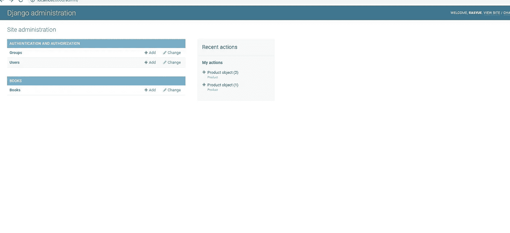

# 如何用 MySQL 在 Django 中构建 REST API 和 GraphQL

> 原文：<https://medium.com/codex/django-create-rest-api-and-graphql-with-mysql-e1b8a900daea?source=collection_archive---------0----------------------->

在本教程中，我们将使用 Django 作为我们的后端应用程序，并用 MySQL 为数据库创建 REST API 和 GraphQL。


django rest api graphql

# 介绍

Django 是一个 Python 框架，它是开源的，遵循模型-模板-视图架构模式。如果你以前使用过遵循模型-模板-视图的框架，学习 Django 会容易得多。

要遵循本教程，请确保您已经安装了这些软件:

1.  [Python](https://www.python.org/downloads/)
2.  MySQL (我用的是更容易安装的 XAMPP)

事不宜迟，我们开始吧。

# Django REST API

首先，让我们为我们的项目创建一个文件夹，然后让我们为我们的项目创建虚拟环境。打开命令提示符并运行。我将使用 Anaconda，但如果你安装了 Python 也没关系。

```
mkdir django
cd django
python -m venv venv
venv\Scripts\activate
```

至此，您已经激活了您的虚拟环境。现在，让我们安装 Django 并创建我们的 Django 应用程序。

```
pip install django // or you can use python -m pip install Django
django-admin startproject rasyue
cd rasyue
python manage.py runserver
```

你可以用任何你喜欢的名字替换`rasyue`。现在你应该可以去`localhost:8000`并看到你默认的 Django 应用。


django 默认登录页面

但是如果您阅读命令提示符，您应该会看到类似这样的内容。


命令提示符

Django 回复了一个通知，告诉我们关于未申请的迁移。现在来说说迁移。

# Django 的移民

首先，打开你在`your_project_name/settings.py`下的`settings.py`文件。我的将是`rasyue/settings.py`。

您应该会看到类似这样的内容。


查看数据库对象/字典。默认情况下，Django 将使用 Django 包附带的`sqlite`。

我们将改为使用 MySQL。现在启动你的 xampp mysql。

用下面的内容替换您的数据库对象/字典。

```
DATABASES = {
    'default': {
        'ENGINE': 'django.db.backends.mysql', 
        'NAME': 'rasyuedjango',
        'USER': 'root',
        'PASSWORD': '',
        'HOST': 'localhost',   # Or an IP Address that your DB is hosted on
        'PORT': '3306',
    }
}
```

记得在 MySQL 中为你的 Django 应用程序创建一个数据库。我的是`rasyuedjango`。

现在我们需要运行迁移。在命令提示符下运行以下代码。

```
python manage.py migrate

python manage.py runserver
```

查看一下您的数据库，您应该看到已经创建了几个表。

# Django API 应用程序

在这一点上，如果你是初学者，不知道什么是 REST API，REST API 是向另一方/应用程序提供数据的标准方式。

例如，假设您有一个需要显示用户数据的前端应用程序，您可以使用后端 REST API 来获取这些数据。

要在 Django 中创建 REST API，首先我们需要运行下面的代码。

```
pip install djangorestframework
```

这将安装 DRF(django rest 框架)，这将使我们的工作更容易。

# REST API 数据

典型的 REST API 应该提供某种数据，因为我们没有任何数据可以提供，所以让我们创建一些。

让我们假设我们想要提供关于**书籍**的数据。

我们需要做的步骤如下:

1.  为我们的 django 应用程序创建一个超级用户来访问管理页面
2.  其次，在我们的 django 应用程序中创建另一个应用程序来处理我们的 REST API。
3.  第三，创建应用模型。
4.  接下来，创建一个序列化程序。
5.  然后，创建视图和 URL。
6.  之后，为我们的 books 数据创建一些数据。
7.  最后，我们需要测试我们的 REST API。

列出所有步骤后，让我们开始工作。

# 创建超级用户

要创建一个超级用户，首先我们需要启动我们的应用程序并运行以下命令。

```
python manage.py createsuperuser
```

该命令将要求用户名，电子邮件和密码。输入后转到`localhost:8000/admin`。将出现一个登录框，使用您之前输入的用户名和密码登录。


django 管理员登录

成功登录后，您将看到此页面。


django 管理

现在我们可以登录到管理页面。我们需要在 Django 项目中创建另一个应用程序。

# 图书应用程序

首先运行以下命令。

```
python manage.py startapp books
```

该命令将在 Django 项目中创建另一个应用程序。


注意，在我们的项目目录中，已经创建了另一个名为`Books`的文件夹，它由几个类似`models.py, admin.py, views.py and so on`的文件组成。

# Django 中的应用

在我们继续之前，您需要了解几件事情:

1.  尽管命令`python manage.py startapp books`在我们的 Django 项目中创建了另一个应用程序，但它不是一个单独的 Django 应用程序。在 Django 中，你可以创建几个独立的应用程序，每个都有独特的功能。如果你以前用过 Angular 或者 React，你可以把 app 当成一个组件。
2.  默认情况下，你创建的每个应用程序都没有链接到核心项目，你必须告诉 Django 你创建的应用程序，我将在稍后展示。

# 注册创建的应用程序(书籍)

打开你的`settings.py`，粘贴以下内容。

```
INSTALLED_APPS = [
    'django.contrib.admin',
    'django.contrib.auth',
    'django.contrib.contenttypes',
    'django.contrib.sessions',
    'django.contrib.messages',
    'django.contrib.staticfiles',
    'books',
]
```

应该是这样的。


至此，我们已经成功注册了我们的`books`应用程序。

# 创建模型

在`books/models.py`中，粘贴以下内容。

```
class Book(models.Model):
    title       = models.TextField()
    description = models.TextField()
    price       = models.TextField()
     def __str__(self):
        return self.title

    class Meta:
        ordering = ('title',)
```

打开你的`books/admin.py`，粘贴以下内容。

```
from django.contrib import admin
from .models import Book

# Register your models here.

admin.site.register(Book)
```

现在运行命令。

```
python manage.py makemigrations
python manage.py migrate

start you server and go to admin page
python manage.py runserver
```

这样，当你进入管理页面。您应该会看到类似这样的内容。



如果您点击`Books`，您可以创建一个新的 book 记录，所以继续创建您喜欢的数量，因为这些数据稍后将在 REST API 中使用。

# 创建序列化程序

在 book 文件夹中创建一个新文件并命名为`serializers.py`。应该是`books/serializers.py`。在文件中，粘贴以下内容。

```
from rest_framework import serializers

from .models import Book

class BookSerializer(serializers.HyperlinkedModelSerializer):
    class Meta:
        model = Book
        fields = ('title', 'description')
```

接下来，创建另一个文件并将其命名为`urls.py`，粘贴以下内容。

```
from django.urls import path
from django.conf.urls import include
from rest_framework import routers
from . import views

router = routers.DefaultRouter()
router.register(r'books', views.BookView)

# Wire up our API using automatic URL routing.
# Additionally, we include login URLs for the browsable API.
urlpatterns = [
    path('', include(router.urls)),
    path('api-auth/', include('rest_framework.urls', namespace='rest_framework'))
]
```

打开你的`views.py`，粘贴以下内容。

```
from django.shortcuts import render

# Create your views here.
# views.py
from rest_framework import viewsets

from .serializers import BookSerializer
from .models import Book

class BookView(viewsets.ModelViewSet):
    queryset = Book.objects.all()
    serializer_class = Book
```

最后，打开你的项目根目录`urls.py`或`rasyue/urls.py`，粘贴以下内容。我们需要在我们的根 url 中注册`books/urls.py`。

```
"""mysite URL Configuration

The `urlpatterns` list routes URLs to views. For more information please see:
    https://docs.djangoproject.com/en/3.1/topics/http/urls/
Examples:
Function views
    1\. Add an import:  from my_app import views
    2\. Add a URL to urlpatterns:  path('', views.home, name='home')
Class-based views
    1\. Add an import:  from other_app.views import Home
    2\. Add a URL to urlpatterns:  path('', Home.as_view(), name='home')
Including another URLconf
    1\. Import the include() function: from django.urls import include, path
    2\. Add a URL to urlpatterns:  path('blog/', include('blog.urls'))
"""
from django.contrib import admin
from django.urls import path
from books import views
from django.conf.urls import include

urlpatterns = [    
    path('admin/', admin.site.urls),
    path('books-api', include('books.urls')),
]
```

还有，在你的`settings.py`里，包括`rest_framework.`

```
INSTALLED_APPS = [
    'django.contrib.admin',
    'django.contrib.auth',
    'django.contrib.contenttypes',
    'django.contrib.sessions',
    'django.contrib.messages',
    'django.contrib.staticfiles',
    'books',
    'rest_framework',
]
```

现在，启动你的应用程序，进入`localhost:8000/books-api`


摆弄一下 REST API，多理解一下。我们将继续创建 GraphQL。

# Django API GraphQL

现在，让我们通过首先运行下面的命令来创建我们的 GraphQL。

```
pip install django-graphene
```

现在，在上面的 REST API 中，我们需要创建序列化程序，但是对于 graphql，我们必须创建模式。

继续创建两个文件名`schema.py`，一个用于`books/`，另一个用于`rasyue/`。

应该是这样的。


打开`books/schema.py`并粘贴以下内容。

```
import graphene
from graphene_django.types import DjangoObjectType, ObjectType
from .models import Bookclass BookType(DjangoObjectType):
    class Meta:
        model = Bookclass Query(ObjectType):
    book = graphene.Field(BookType, id=graphene.Int())
    books = graphene.List(BookType)def resolve_book(self, info, **kwargs):
        id = kwargs.get('id')if id is not None:
            return Book.objects.get(pk=id)return Nonedef resolve_books(self, info, **kwargs):
        return Book.objects.all()class BookInput(graphene.InputObjectType):
    id = graphene.ID()
    title = graphene.String()
    description = graphene.String()
    price = graphene.String()class CreateBook(graphene.Mutation):
    class Arguments:
        input = BookInput(required=True)ok = graphene.Boolean()
    book = graphene.Field(BookType)[@staticmethod](http://twitter.com/staticmethod)
    def mutate(root, info, input=None):
        ok = True
        book_ins = Book(title=input.title)
        book_ins.save()
        return CreateBook(ok=ok, book=book_ins)class UpdateBook(graphene.Mutation):
    class Arguments:
        id = graphene.Int(required=True)
        input = BookInput(required=True)ok = graphene.Boolean()
    book = graphene.Field(BookType)[@staticmethod](http://twitter.com/staticmethod)
    def mutate(root, info, id, input=None):
        ok = False
        book_ins = Book.objects.get(pk=id)
        if book_ins:
            ok = True
            book_ins.title = input.title
            book_ins.save()
            return UpdateBook(ok=ok, book=book_ins)
        return UpdateBook(ok=ok, book=None)class Mutation(graphene.ObjectType):
    create_book = CreateBook.Field()
    update_book = UpdateBook.Field()schema = graphene.Schema(query=Query, mutation=Mutation)
```

为了解释上面的代码，在 GraphQL 中我们有两个基本操作，即查询和变异。查询用于获取数据，而变异用于更新或创建。

我们创建了用于查询操作的`BookType`,这很容易理解。

我们还创建了`BookInput`，它用来告诉 GraphQL 应该在`UpdateBook`和`CreateBook`中使用的数据类型。

现在打开你的`rasyue/schema.py`，粘贴以下内容。

```
import graphene
import books.schemaclass Query(books.schema.Query, graphene.ObjectType):
    passclass Mutation(books.schema.Mutation, graphene.ObjectType):
    passschema = graphene.Schema(query=Query, mutation=Mutation)
```

现在，打开你的`rasyue/urls.py`，粘贴以下内容。

```
"""mysite URL Configuration

The `urlpatterns` list routes URLs to views. For more information please see:
    https://docs.djangoproject.com/en/3.1/topics/http/urls/
Examples:
Function views
    1\. Add an import:  from my_app import views
    2\. Add a URL to urlpatterns:  path('', views.home, name='home')
Class-based views
    1\. Add an import:  from other_app.views import Home
    2\. Add a URL to urlpatterns:  path('', Home.as_view(), name='home')
Including another URLconf
    1\. Import the include() function: from django.urls import include, path
    2\. Add a URL to urlpatterns:  path('blog/', include('blog.urls'))
"""
from django.contrib import admin
from django.urls import path
from books import views
from django.conf.urls import include
from graphene_django.views import GraphQLView
from .schema import schema

urlpatterns = [    
    path('admin/', admin.site.urls),
    path('books-api/', include('books.urls')),
    path('graphql/', GraphQLView.as_view(graphiql=True)),
]
```

最后，打开你的`rasyue/settings.py`，修改成这样。

```
INSTALLED_APPS = [
    'graphene_django',
    'django.contrib.admin',
    'django.contrib.auth',
    'django.contrib.contenttypes',
    'django.contrib.sessions',
    'django.contrib.messages',
    'django.contrib.staticfiles',
    'books',
    'rest_framework',
]

GRAPHENE = {
    'SCHEMA': 'rasyue.schema.schema'
}
```

你的`settings.py`应该是这样的。


仅此而已。运行你的 **django** 项目，然后进入`localhost:8000/graphql`

# 结束了..

至此，本教程到此结束。希望对你有所帮助。谢谢大家，敬请期待。