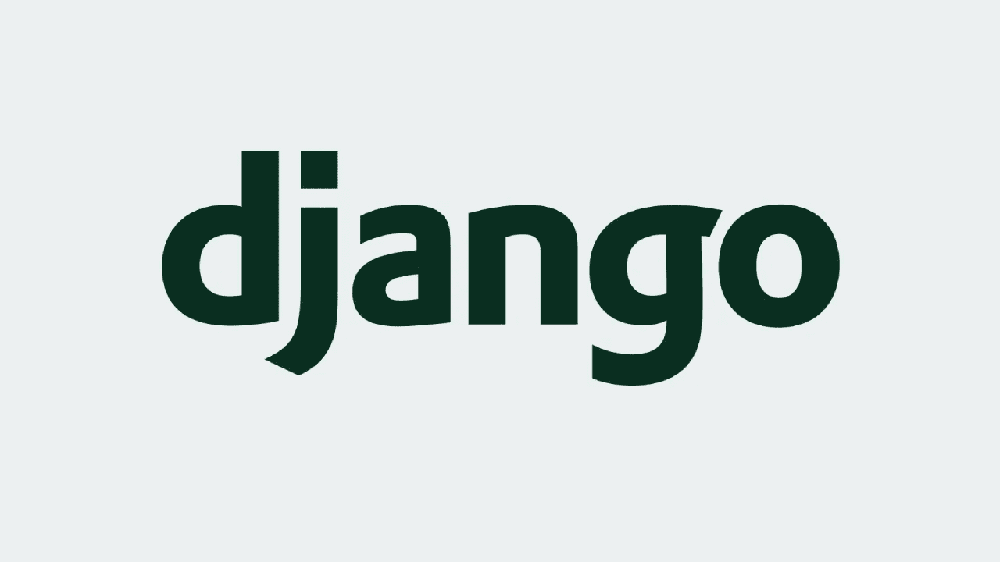

# Django 和 Node JS:哪个好？

> 原文：<https://medium.com/codex/django-or-node-js-which-is-better-ac73571b54dd?source=collection_archive---------8----------------------->

Node JS 和 Django 都是非常引人注目的创新，可以用出色的 UI 构建适应性强的 web 和便携式应用程序。每个人都可以使用，而且不需要花一分钱，也不需要许可证。它们被用于许多巨大的活动中，并且有一个巨大的网络社区。

# 姜戈是什么？

Django 是 Django programming 创建的；它于 2005 年得到支持，由阿德里安·霍洛瓦蒂和西蒙·威廉森策划。Django 的基本亮点是基于 python 的高级互联网系统，因为这种结构提供了安排应用程序的最理想的方法。

由于在 Django，工程师需要遵守执行任务的原则或方法，与低层结构相比，机会几乎更少；然而，所做的申请将是完美和干净的。

Django 基本上遵循了名为模型模板视图计划设计的计划设计。

除了格式之外，它类似于 MVC 系统。像 MVC 一样，MTV 在模型中也有信息访问层。基本上，这个模型处理连接和关联信息的方式，进一步批准信息。

布局层被称为显示层，它处理必须在 web 站点页面或应用程序上显示的内容。读取的是业务层，因为它到达了模型 foursquare 并显示了一个可接受的布局。视图就像模型和格式之间的脚手架。

# 什么是 Node JS？

Node JS 基于 JavaScript，在 web 应用程序的客户端使用。另一方面，Django 在截止时间的结构内使用 Python 能力，帮助 web 工程师渐进地、超快速地开发应用程序。

Node JS 由 Ryan Dahl 策划，Joyent 创建。这是 2009 年第一次交付。它绝对是用 C、C++和 JavaScript 编写的。总而言之，Node JS 是一个 JavaScript stage，它具有像 web worker 一样的能力，允许设计人员利用 JavaScript 编写完全的、适应性极强的 web 应用程序。NodeJS 支持 Google V8 JavaScript 马达。这里有一个超大范围的开源库来帮助 NodeJS。

它有很多亮点，比如事件驱动模型、同时性、简单和轻量级，以及无阻碍的信息产出。节点 JS 在场合驱动的模型中，在工作机器上产生一个且只有一个工作框架串，并保持少量的堆需求。

当你 [**雇佣 NodeJS 的开发人员，**](https://graffersid.com/hire-dedicated-node-js-developers/) 就能让他们创造出直观的交互式软件。

这个场合被暗示为一个协会正在成立，一个交流正在准备，从协会获得信息，和协会结论。他们回到与这些场合相关的工作中，以便工作随着任何场合的结束而终止。

**现在，我们的许多读者可能会想到一个问题**

# Django 比 node 好吗？

Node JS 在构建健壮、适应性强的应用程序和处理大量请求的能力方面很流行，而 Django 在处理大量请求和高流量应用程序方面也很出色。这两个阶段对于构建适应性强的应用程序来说是合理的。

Node JS 不像 Django 那样安全，需要在框架中进行手动操作来检查安全性缺陷。它提供了更好的执行，因为有一个固有的房屋布局框架，可以快速执行必要的任务。它是基于 Python 的开源软件。

这个系统是受限的。姜戈很复杂。就复杂性而言，Node JS 没有 Django 复杂，在这两种结构之间进行选择时，您需要考虑一些亮点，这篇关于“Django 与 Node JS”的博客。

Django 和 Node JS 之间的区别已经阐明了其中的一些。这样，如果您精通 JavaScript 或者有足够的机会学习和执行它，Node JS 是最好的方法。

在任何情况下，如果您有截稿时间，有使用 Python 的经验，并且担心理解要点，那么您应该选择 Django 来制作您的应用程序。

# 应该用 Node JS 还是 Django？

Node JS 依赖于 JavaScript，用于 web 应用程序的客户端。然后，Django 在一个截止时间的结构内与 Python 应用程序一起工作，帮助 web 设计人员连续地甚至更快地制作应用程序。

Node JS 在构建强大的、适应性强的应用程序和处理大量请求的能力方面很流行，而 Django 在处理许多请求和高流量应用程序方面也很出色。这两个阶段适用于构建适应性强的应用程序。

# 什么时候用 Django vs Node JS？

# 节点 JS

*   Node JS 在更多的站点类中具有更好的利用率包含性。计算计算机电子和技术，法律和政府，艺术和娱乐，生活方式和许多不同的类型。
*   这绝不是 JavaScript 进步的突破，给了 JS 主题专家新的自由。这种适度直接的编程语言通常出现在客户端程序中。Node.js 也可以用于后端，这意味着整个应用程序可以用 JavaScript 编写。对全栈开发人员的信息和能力的期望已经提高，有希望的开发人员可以更快地开始调度他们的应用程序，而无需学习额外的复杂创新。
*   Node.js 可以被有效地控制，如果你有 JavaScript 的基本信息的话。
*   大量的免费库和扩展使得 Node.js 具有很强的适应性。你可以根据自己的喜好和任务目标来改变发展氛围。
*   一个事件驱动的模型在一个计划和工人方面的事件之间建立关联，并标记各种周期的完成。程序中 HTML 代码的一部分可以作为主题填充，而任何 JS 容量都可以作为目击者。
*   Node.js 是轻量级的，易于调度。
*   它赋予进步多功能性和同时性。
*   网络工作者因此得到并回应要求。不需要信息或产量。

# 姜戈

*   姜戈在科学、教育、重工业和工程领域工作。
*   它绝不是基于 Python 的结构，主要是为了保证快速的网站开发。
*   它以不可否认的水平循环和低水平循环的修改作品为中心。
*   如果你有 Python 的基础知识，Django 可以毫不费力地成为学者。
*   网页设计师需要遵循严格的标准和正式的项目执行情况。虽然这在某种程度上限制了创造性，但它保证了精确的代码、直接的应用工程，以及产量上更少的错误和缺陷。
*   模型模板视图用作平面设计。除了格式段之外，它类似于模型视图控制器模型。该模型允许信息进入，集中和改变信息。该布局显示了如何向客户端显示信息。视图是模型和模板之间的连接，它跟踪不同的情况，并显示应该熟悉模型的变化。
*   每个 Django 企业可以有一个单独的或不同的内部应用程序。

# Django vs Node JS:主要区别

# 1.工程

Django 是一个系统，Node JS 是一个运行时环境。

Django 主要遵循称为模型模板视图的计划设计。模型处理信息交流、关联或批准的方式。

Node JS 有很多亮点，比如场合驱动的模型、同时性和无阻碍的信息产出。在事件驱动的模型中，Node js 在工作机器上只生成一个工作框架字符串，并且它不是一个小的堆栈需求。

# 2.适应性

姜戈是一个系统。它使客户能够利用与 MTV 设计相关的特定构造。客户将不得不更大程度地改变构造，以在 Django 中完成与 Node js 中类似的赋值。

Node JS 再次为适应性提供了更大的空间。制作各种类型的应用程序的能力要广泛得多，因为客户可以在没有任何准备的情况下制作他们想要的任何东西，而不会遇到程序的反对。

Django 有限的高级亮点使得工程师很难执行他们的标准，这样，与 Node.js 相比，它的适应性更差。

Node.js 非常适合为其设计者提供各种功能、设备和亮点，因为它与一个巨大的 JavaScript 库相关联。

# 3.安全性

Django 比 Node JS 安全得多。它有内置的帮助来防止安全缺陷，例如，跨站点预先安排。JavaScript 具有适当形式的所有安全性，但是您需要物理地改变预期高亮来执行它们。

# 4.布局和文档

Django 使用内部布局框架。这些助手迅速执行必要的任务，而不用花费过多的时间来选择策略。此外，它还有广泛的文档。

Node js 再次允许设计者有更多的机会选择他们特定的方式来执行有用性。尽管如此，这同样意味着客户将投入更多的精力来找出一种方法来完成必要的任务。

# 5.熟练

Django 很可能是工程师们为构建 web 应用程序而挑选的最有洞察力的结构。它非常精通，但由于底层布局的原因，不太需要理想的执行机会。

此外，与 Node.js 相比，Django 要快一些。因为在执行一个问题时，气候要求工作时间，所以与 Django 相比，它的效率较低。Node.js 并不难适应，但是实际理解就少了。

# 6.名声

与 Node.js 相比，Django 是一个非常适合构建 web 应用程序的系统

Node.js 正逐渐在本地获得显著地位，并需要在未来很长时间内蓬勃发展，以构建通用的 web 应用程序。

# 7.社区

Django 是一个开源系统，然而，该结构背后可行的本地区域却很少

此外，Node.js 背后的本地区域正在有效地扩展，并包括经验丰富的工程师，他们进一步帮助客户解决更新中发现的各种问题，而这只是冰山一角。

# 8.全栈开发

Django 不适合为全世界的设计师提供全栈式的发展自由。此外，工程师可以利用 Node.js 构建前端，就像构建后端一样，因此可以访问它来进行全栈改进。

# 节点 JS 的优势

# 1.在节点 JS 中执行多个任务

JavaScript 可以处理各种并发活动，因为它在正在进行的框架中占主导地位。Node.js 是一个场合驱动的系统，在这个系统中，招标被放在一个场合圈里，同样被准备和指定。

通过这种方式，应用程序和管理人员可以同时处理各种需求，这对于循环应用程序框架来说是一个巨大的好处。

# 2.JavaScript 支持

通过 JavaScript，开发人员可以用 JS 编写前端和后端应用程序代码。这有助于他们制作可重用的代码和模块，他们可以毫无问题地进行恢复。

# 3.简单的数据库设计

软件工程师不需要在创建数据集时宣布严格的计划，他们的目标是更有效地将信息库段落转换成 JavaScript 对象，以处理信息访问。

# 节点 JS 的限制

*   数据处理限制
*   Node.js 中的回调重载

# Django 的好处

# 1.简化数据建模

Django 打破了模型模板视图框架，将信息转换成特定的模型，并使其确认应用程序的基本原理。

最后，它将特定的模型发送到布局，这有助于组织信息。Django 正在推进一个隐含的诱人的语言框架，该框架创建 HTML，将基本原理从 see 中分离出来，支持代码重用，并在内容到达程序之前对其进行引导。

# 2.Django 的安全

Django 的工程师同样可以看到一系列安全亮点。例如，在该结构中有一些工具可以将秘密的、客户端显式的令牌嵌入到 post 请求中，这有助于防止跨站点预先安排和请求欺诈。该结构同样给出了不同的亮点，以明确防范 SQL 注入攻击。

# 3.使用图书馆

这种基于 Python 的结构允许设计人员设置不同数量的 Python 库。系统同样给出了一个结构化的库，以一种改进的方式呈现 HTML 设计。

因此，您可以获得更多的前端配置控制，因为设计人员可以保证应用程序的显式匹配之间的连接，以与可视化应用程序相协调。

# Django 的局限性

*   在 Django 捕捉风险
*   多重请求处理

# 结论

web 应用程序改进的成就很大程度上依赖于您的团队所使用的工具和技术。Node JS 和 Django 都是改革派的进步，可以让你的筹码受益。为了做出明智的决定，以项目的必要性为中心。

如果客户预期你应该立即传达一个基本的和容易运行的应用程序，Django 是你的理想选择。如果您需要调整您的发展环境来开发一个有趣的基于 JS 的应用程序，那么请选择 Node JS..

初学 web 设计的人经常会向有经验的同事寻求关于 Python 是否优于 JavaScript 的指导。每个设计师在收集工具箱时都有特殊的倾向。一些工程师可能会建议 Django，而其他人可能会倾向于 Node JS。

*原载于 2021 年 6 月 22 日*[*【https://graffersid.com】*](https://graffersid.com/django-vs-nodejs/)*。*