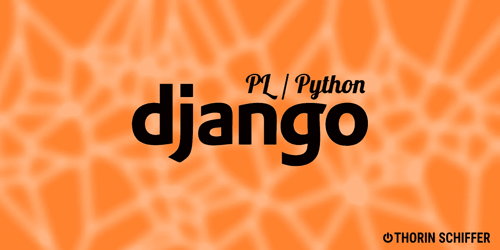

# 姜戈-皮比

> 原文：<https://medium.com/codex/django-plpy-717a5f4644dc?source=collection_archive---------2----------------------->



## Python & Django

## 用于 PostgreSQL 中 Python 存储过程的 Django 工具包

PostgreSQL 是最先进的老式 SQL 数据库之一，涵盖了大量的任务，表现出了出色的性能。PL/Python 插件允许用 Python 编写存储过程。

Django 通过其惊人的 contrib 模块与 PostgreSQL 集成，并支持许多现代特性，但不支持 PL/Python。我的最后一个图书馆 Django-plpy 填补了这个空白。

TL；博士:GITHUB

> 寻找一些 Python 或 JS 自由职业者，工资高达 50€/小时？请不要犹豫[在 Twitter](https://twitter.com/SchifferThorin) 或 [Linkedin](https://www.linkedin.com/in/thorin-schiffer/) 上联系我，告诉我你的简历、空闲时间和时薪。(CET +/- 3 小时)。

# 关于 PL/Python 及其特性

PL/Python 允许您使用 Python 而不是 PostgreSQL 的本地存储过程语言 PL/SQL 来创建全功能的存储过程。使用的 Python 版本在 PostgreSQL 构建中设置。

下面是一个 PL/Python 函数的简单示例:

和一个触发器:

用 Django 在原始 SQL 中维护 PL/Python 函数可能会变得相当烦人，因为尽管 Django ORM 与数据库深度集成，但 Django 从未真正喜欢过存储过程和触发器。可能的原因是数据库负责数据存储，web 应用负责逻辑。Django-plpy 使得在没有数据库的情况下测试存储过程成为可能，至少外表上的逻辑保留在数据库中。让我们开始吧。

# 使用 django-plpy

将 python 函数引入数据库的主要工作流程是用`@plpython`修饰它们，并调用 manage.py 命令`syncfunctions`来安装它们。映射到相应 Postgres 类型函数签名的正确参数需要完整的注释。然后，参数被自动映射到适当的数据库类型。

在执行了`manage.py syncfuntion`之后，Django-plpy 将把这个函数封装在一个存储过程中，并安装到数据库中。该函数仍然是 python 函数，可以在不涉及数据库的情况下轻松进行单元测试。下面是该功能安装后的使用方法。

## SQL 查询中的 Python 函数

## 标注中的 Python 函数

## 使用 python 函数进行自定义 ORM 查找

## python 触发器的安装

触发器是一种非常强大的机制，django-plpy 允许您轻松地将 python 函数标记为触发器，因此项目中的一些逻辑直接与数据库中的数据更改事件相关联。

下面是一个使用`@pltrigger`装饰器的 python 触发器的例子。

## 在触发器中使用 Django 模型

`@pltrigger` decorator 的参数声明触发器参数，如触发器将绑定到的事件和表名。您可以将`table_name`替换为型号名称，表格名称将被自动查找:

在 Postgres 官方文档中阅读更多关于 plpy 触发器的信息:[https://www.postgresql.org/docs/13/plpython-database.html](https://www.postgresql.org/docs/13/plpython-database.html)。

不过，在触发器中使用 Django ORM 是有代价的，所以如果您想使用它们，请查看下面的实现细节。

## 批量操作和触发器，迁移

Python 触发器是全功能的 Postgres 触发器，这意味着它们将为每一行创建，不像 Django 信号。因此，如果您用`event=”UPDATE”`定义了一个触发器，并在一个模型上调用批量更新，那么这个触发器将为所有受操作影响的对象调用:

Updated 为每一行调用触发器

与 Django 模型或信号的代码不同，在迁移时也会调用触发器。

## 将 Django 信号转换为 PL/Python 触发器

尽管 Django 信号既不是异步的，也不能在另一个线程或进程中执行，但许多开发人员错误地认为它们会这样。这通常会导致回调地狱和复杂的执行流程，因为 Django 信号实现了一个 dispatcher-receiver 模式，并且只给人一种异步执行的印象。

使用 django-plpy，您可以快速地将信号转换成触发器，并使它们真正异步。

# 在去那里的路上

## 代码的安装方式

Django-plpy 复制函数代码，包装在 PL/Python 存储过程或触发器中，然后用`manage.py syncfunctions`安装。如果您使用 Django 模型，数据库需要访问您的项目文件和 virtualenv(见下文)，或者如果您创建自己的数据库 docker 映像，则必须相应地提供它。这种情况看起来很奇怪，并且伴随着一定的风险。

## 在 PL 函数和触发器中使用 Django

使用`syncfunctions`安装时，函数的源代码将被复制到相应的存储过程中，并安装在 Postgres 中。这使得您的本地上下文对函数不可用，这意味着没有模型或库可以在被转移的函数中使用。

为了解决这个问题，您需要在 Postgres python 解释器中设置 python 项目和环境。Django-plpy 支持以下两种使用数据库的场景。

# 数据库设置和配置

## 数据库和应用程序在同一台主机上

现在很少使用，但仍然存在，这种场景对于环境共享来说是最简单的。Django-plpy 创建存储过程并将必要的配置传输到数据库:

*   机密和数据库访问凭据
*   python env 的路径(默认为`distutils.sysconfig.get_python_lib()`，更多配置见下文)
*   按照 manage.py 的方式加载 Django 应用程序

## 数据库在一个单独的 docker 容器中

一个更常见的生产场景是数据库在一个单独的 docker 容器上。

官方 Postgres 镜像不支持 plpython 插件，所以如果你想这样使用 plpython，你需要创建你的镜像或者使用我创建的一个。

所有映像都提供 python 3.7，因为 Postgres 使用映像所基于的操作系统中的默认 python 环境，而 3.7 是 Debian Buster 的标准。

## 使用 django-plpy 和 dockerized Postgres

为了让 Postgres python 解释器可以使用代码，它必须以某种方式出现在 docker 容器中。如果您决定编写 docker 映像 docker 文件，您可以在构建时使用它来提供映像，也可以使用 volumes 来共享代码。

一旦代码和环境存在于 Docker 容器中的某个地方，django-plpy 就可以被告知使用它们:因此，如果您的环境位于`/env`(将 site-packages 文件夹复制到该路径)下，而您的应用程序位于`/app`中，那么将以下设置添加到您的`settings.py`中

```
PLPY_ENV_PATHS = ["/env"]
PLPY_PROJECT_PATH = "/app"
```

## AWS RDS 和其他托管数据库

在 SaaS 时代，数据库很少在 docker 镜像中连接，但在 AWS RDS 之类的托管数据库中更为常见。在这种情况下，django-plpy 只能安装简单的函数和触发器，因为在这种设置中无法访问数据库的文件系统。

此外，一些托管数据库不会给你超级用户权限，这意味着在这种情况下安装扩展会很麻烦。

## 隐藏递归

在触发函数中意外调用`Model.save`会造成非常糟糕的情况:触发函数会使用 psycopg 通过网络连接到本地数据库，导致一个新的事务被创建，无限重复所有的循环很多次。这种隐藏的递归会淹没数据库和应用服务器。

由触发器引起的任何写操作都可以触发相同的效果。因此，您应该避免在触发器中使用任何 ORM 方法。

# 安装和文档

完整的文档和安装说明可在[这里](https://github.com/eviltnan/django-plpy#python-functions-in-annotations)找到。为你的项目检查一下，欢迎你来投稿。

=====================================

如果你喜欢这个，看看我最近的文章:

🇩🇪 [赴德就业:](/swlh/part-1-10-things-about-employment-in-germany-eacdac94818b)终极指南

🕒[为什么你的软件质量会随着时间退化](https://thorin-schiffer.medium.com/same-old-story-4d1ef4df0824):短篇小说

😃 [RapidAPI:使用 Python 的第一步](/analytics-vidhya/rapidapi-and-fastapi-d720789a5b7e)