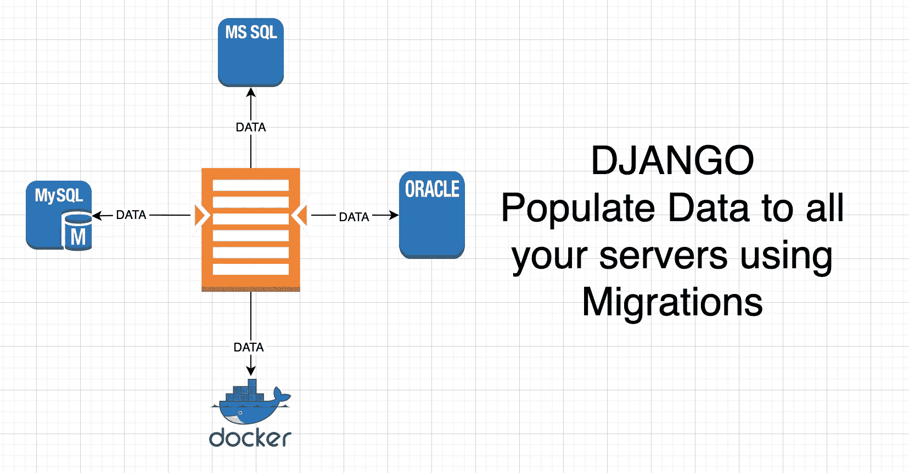

# Django:使用迁移将数据填充到服务器或 Docker

> 原文：<https://medium.com/codex/django-use-migrations-to-populate-data-to-the-server-or-docker-79d82bd6af3c?source=collection_archive---------4----------------------->

## 创建默认数据的简单方法

在几乎所有项目中，您都需要用一些默认数据填充数据库。您可能还有一个包含一些常量的表，这些常量应该是最新的，并且应该在您的所有服务器上完全相同，包括 localhost 和 docker。

为此，您可以创建迁移。惊讶吗？敬请期待！

